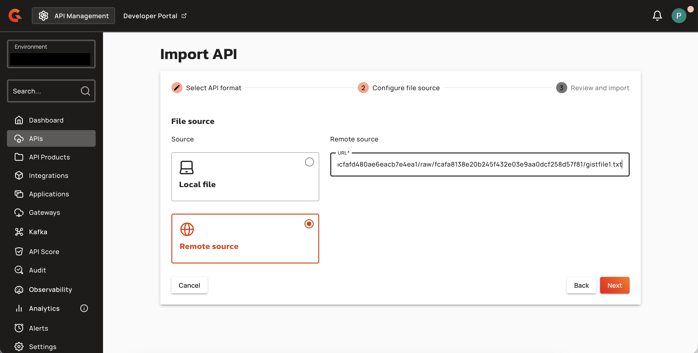

# Import APIs from Remote URLs (Console)

## Creating APIs from Remote URLs

### Gravitee Definition Import

1. Navigate to **APIs > + Add API** in the Console.
2. Select **Import an existing API**.
3. Choose **Gravitee** as the format.

    <figure><figcaption></figcaption></figure>

4. Select **Remote source** as the source type.
5. Enter the remote URL in the **Remote URL** field.

    <figure><figcaption></figcaption></figure>

6. Complete the import wizard and review the API configuration.

| Field | Description |
|:------|:------------|
| **Remote URL** | The HTTP(S) URL of the Gravitee API definition JSON file. |

### OpenAPI/Swagger Import

1. Navigate to **APIs > + Add API** in the Console.
2. Select **Import an existing API**.
3. Choose **OpenAPI** as the format.
4. Select **Remote source** as the source type.
5. Enter the remote URL in the **Remote URL** field.
6. Toggle **Import documentation** to include API documentation from the OpenAPI spec.
7. Toggle **Create a policy to validate requests according to the OpenAPI Specification** to add an OAS validation policy.
8. Complete the import wizard and review the API configuration.

| Field | Description |
|:------|:------------|
| **Remote URL** | The HTTP(S) URL of the OpenAPI or Swagger specification file. |
| **Import Documentation** | When enabled, imports API documentation from the OpenAPI specification. |
| **Create a Policy to Validate Requests According to the OpenAPI Specification** | When enabled, adds an OAS validation policy to the API. |

## Updating APIs from Remote URLs

### Gravitee Definition Update

To update an existing v4 API from a remote Gravitee definition URL:

1. Navigate to the API's **General** settings.
2. Select **Import**.
3. Choose **Gravitee** format and **Remote source**.
4. Enter the remote URL.

### OpenAPI/Swagger Update

To update an existing v4 API from a remote OpenAPI specification:

1. Navigate to the API's **General** settings.
2. Select **Import**.
3. Choose **OpenAPI** format and **Remote source**.
4. Enter the remote URL and configure documentation and validation options.
