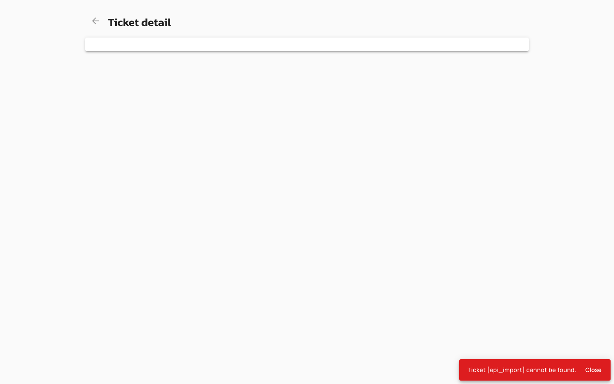

# WSDL Import for v4 APIs: Overview and Console Workflow

## Overview

WSDL Import enables API administrators to create or update v4 HTTP Proxy APIs by importing WSDL 1.1 documents. The feature converts WSDL definitions to OpenAPI 3.x specifications and optionally applies REST-to-SOAP transformation policies, allowing legacy SOAP services to be exposed as RESTful APIs. This feature is available for v4 HTTP Proxy APIs only.

## Key Concepts

### WSDL-to-OpenAPI Conversion

WSDL Import converts WSDL 1.1 documents to OpenAPI 3.x specifications internally. The conversion process generates API paths, operations, and request/response schemas based on the WSDL service definitions. SOAP-specific features such as WS-Security headers are not preserved in the resulting OpenAPI specification. The converted API can be deployed as a standard HTTP Proxy or enhanced with REST-to-SOAP transformation policies.

### REST-to-SOAP Transformation

When the REST-to-SOAP Transformer policy is applied during WSDL import, the API automatically converts incoming RESTful JSON requests to SOAP XML messages and transforms SOAP XML responses back to JSON. This transformation requires the `xml-json` policy as a dependency, which is automatically added when REST-to-SOAP is enabled. The transformation allows clients to interact with SOAP backends using standard REST conventions.

### Import Sources

WSDL Import supports two payload types: inline WSDL content uploaded as a file, and remote URLs that fetch WSDL documents from HTTP/HTTPS endpoints. Remote URLs are validated against SSRF protection rules and blocked from private IP ranges (localhost, 127.0.0.1, 192.168.x.x, 169.254.x.x) unless `allowImportFromPrivate` is enabled in the import configuration. File protocol and FTP URLs are always blocked.

## Prerequisites

Before you create APIs from WSDL, complete the following steps:

* Install Gravitee API Management v4 environment
* Obtain `ENVIRONMENT_API` permission with `CREATE` action (for new API creation)
* Obtain `API_DEFINITION` permission with `UPDATE` action (for updating existing APIs)
* (Optional) Install [REST to SOAP Transformer](../apply-policies/policy-reference/rest-to-soap.md#rest-to-soap) policy plugin (required for SOAP transformation features)
* (Optional) Install [OpenAPI Specification Validation](import-apis.md#openapi-v3) policy plugin (required for OpenAPI validation features)

## Creating APIs from WSDL

1. Navigate to the API import page and select the WSDL format card.

    <figure><figcaption></figcaption></figure>

2. Choose a payload source (file upload or remote URL) and provide the WSDL content.
3. If the `rest-to-soap` policy plugin is installed, toggle **Apply REST to SOAP Transformer policy** to enable SOAP-to-REST transformation (enabled by default when the policy is available).
4. When REST-to-SOAP is enabled, optionally toggle **Create documentation page from spec** to generate a Swagger documentation page from the converted OpenAPI specification (enabled by default when REST-to-SOAP is active).
5. When REST-to-SOAP is enabled, optionally toggle **Add OAS Validation policy** to add request and response validation flows (enabled by default when REST-to-SOAP is active and the `oas-validation` policy plugin is installed).
6. Review the configuration summary, which displays the REST-to-SOAP Transformer status as either Enabled or Disabled.
7. Submit the import to create the API.

| Field | Description | Default |
|:------|:------------|:--------|
| **Apply REST to SOAP Transformer policy** | Enables REST-to-SOAP transformation and automatically adds the `xml-json` policy dependency. Displays the warning "This will overwrite all the existing policy." | `true` (when `rest-to-soap` policy installed) |
| **Create documentation page from spec** | Generates a Swagger documentation page from the converted OpenAPI specification. Only enabled when REST-to-SOAP is active. | `true` (when REST-to-SOAP enabled) |
| **Add OAS Validation policy** | Adds OpenAPI validation policies to request and response flows. Only enabled when REST-to-SOAP is active and `oas-validation` policy is installed. | `true` (when REST-to-SOAP enabled and policy installed) |
