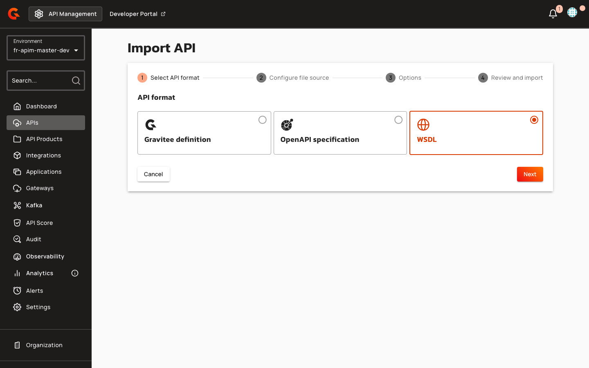

# WSDL Import for v4 APIs

## Overview

WSDL import for v4 APIs lets you create or update a v4 HTTP Proxy API from a WSDL 1.1 document. The Management API converts the WSDL into an OpenAPI 3 specification, then processes it through the same v4 OpenAPI import pipeline used for Swagger/OpenAPI imports. You can supply the WSDL inline (file upload) or as a remote HTTP(S) URL, subject to import whitelist and private-network settings.

## Key Concepts

### WSDL-to-OpenAPI Conversion

During conversion, each SOAP operation becomes an OpenAPI path, the backend SOAP address becomes the proxy endpoint URL, and XSD message parts become JSON request-body schemas. SOAP metadata is stored as OpenAPI extensions (`x-graviteeio-soap-envelope`, `x-graviteeio-soap-action`) for use by gateway policies. The API name is extracted from the WSDL `<service>` element, and the endpoint URL is extracted from the SOAP `<address>` location attribute.

| WSDL Element | Mapped To | Example |
|:-------------|:----------|:--------|
| `<service name="...">` | API name | `CalculatorService` |
| `<soap:address location="...">` | Endpoint URL | `http://localhost:8080/calculator` |
| SOAP operation | OpenAPI path | `/calculate` |
| XSD message part | JSON request-body schema | `{"operand1": 5, "operand2": 3}` |

### REST to SOAP Transformer

The REST to SOAP Transformer policy (`rest-to-soap`) adds per-operation flows that translate REST/JSON calls to SOAP/XML. When enabled, the `xml-json` policy is automatically added as a dependency. Without policies, no flows are generated—only API metadata and endpoints are updated.

### OpenAPI Specification Validation

The OpenAPI Specification Validation policy (`oas-validation`) validates requests and responses against the converted OpenAPI spec. When WSDL format is used with policies enabled, response validation is deferred to the last flow to allow REST-to-SOAP transformation to complete first. Request validation is placed in the first flow.

## Prerequisites

- WSDL document must be **WSDL 1.1** format (WSDL 2.0 is not supported)
- For remote WSDL URLs, the URL must pass SSRF protection rules (private IPs are blocked by default unless `allowImportFromPrivate = true`)
- For REST-to-SOAP transformation, the `rest-to-soap` policy must be installed
- For OpenAPI validation, the `oas-validation` policy must be installed

## Gateway Configuration

## Creating a v4 API from WSDL

Navigate to **Import API** in the Console and follow the wizard:

1.  Select the **WSDL** format card (supported file types: `.wsdl`, `.xml`).

    <figure><figcaption></figcaption></figure>
2. Upload a WSDL file or enter a remote HTTP(S) URL in the **Payload** field.
3.  Toggle **Apply REST to SOAP Transformer policy** to enable REST-to-JSON-to-SOAP transformation (visible only when the `rest-to-soap` policy is installed; defaults to enabled).
4. Toggle **Generate a Swagger documentation page** to publish a Swagger page from the converted OpenAPI spec (enabled automatically when REST to SOAP Transformer is on).
5. Toggle **Add an OAS Validation policy** to validate requests and responses against the converted OpenAPI spec (enabled automatically when REST to SOAP Transformer is on and the `oas-validation` policy is installed).
6.  Review the import settings and confirm.

| Field | Description | Default |
|:------|:------------|:--------|
| **Payload** | Inline WSDL content or remote URL | Required |
| **Apply REST to SOAP Transformer policy** | Adds per-operation flows for REST/JSON-to-SOAP/XML translation; automatically includes `xml-json` policy | `true` (when policy installed) |
| **Generate a Swagger documentation page** | Publishes a Swagger page from the converted OpenAPI spec (not the raw WSDL) | `true` (when REST to SOAP Transformer is on) |
| **Add an OAS Validation policy** | Validates requests/responses against the converted OpenAPI spec | `true` (when REST to SOAP Transformer is on and policy installed) |

When **Apply REST to SOAP Transformer policy** is disabled, the **Generate a Swagger documentation page** and **Add an OAS Validation policy** toggles are disabled and set to `false`.


## Management API

### Creating an API from WSDL

Call `POST /environments/{envId}/apis/_import/wsdl` with an `ImportWsdlDescriptor` payload:

```json
{
  "payload": "<definitions xmlns=\"http://schemas.xmlsoap.org/wsdl/\">...</definitions>",
  "type": "INLINE",
  "withDocumentation": true,
  "withOASValidationPolicy": true,
  "withPolicies": ["rest-to-soap"]
}
```

**Response:** `ApiV4` object (HTTP 201)

### Updating an API from WSDL

Call `PUT /environments/{envId}/apis/{apiId}/_import/wsdl` with the same payload structure.

**Response:** `ApiV4` object (HTTP 200)

### Request Parameters

| Property | Type | Description | Default |
|:---------|:-----|:------------|:--------|
| `payload` | string | Inline WSDL content (when `type` is `INLINE`) or a remote URL (when `type` is `URL`) | Required |
| `type` | enum | `INLINE` or `URL` | `INLINE` |
| `withDocumentation` | boolean | Generate a Swagger documentation page from the converted OpenAPI spec | `false` |
| `withOASValidationPolicy` | boolean | Add an OAS Validation policy to every flow | `false` |
| `withPolicies` | array | Policy visitor IDs to apply (e.g., `rest-to-soap`, `json-validation`, `mock`, `validate-request`, `xml-validation`) | `null` |

When `withPolicies` is `null`, standard OpenAPI flows are generated. When `withPolicies` is an empty list `[]`, no flows are generated. When `withPolicies` contains `["rest-to-soap"]`, standard OpenAPI flows are generated with the REST-to-SOAP policy applied, and the `xml-json` policy is automatically added as a dependency.

## Restrictions

- WSDL import requires **WSDL 1.1** format (WSDL 2.0 is not supported by the underlying parser)
- When `withPolicies` is an empty list `[]`, **no flows are generated** (user must manually configure policies)
- Documentation page content is the **converted OpenAPI YAML**, not the original WSDL XML
- Remote WSDL URLs are subject to SSRF protection rules: `http://localhost:*`, `http://127.0.0.1/*`, `http://169.254.*`, `http://192.168.*`, `file:///*`, and `ftp://*` are blocked by default unless `allowImportFromPrivate = true`
- The `rest-to-soap` policy automatically adds the `xml-json` policy as a dependency (cannot be disabled)
- OAS validation policy response validation is **deferred to the last flow** when WSDL format is used with policies (to allow REST-to-SOAP transformation to complete first)
- Path conflicts during import trigger an `InvalidPathsException` error
- Invalid WSDL content triggers a `SwaggerDescriptorException` error
- Invalid API definition after conversion triggers a `SwaggerDescriptorException` error
- SSRF protection violations trigger a `UrlForbiddenException` error

## Related Changes

The WSDL format card in the API Import wizard is now enabled and selectable (previously disabled with a "Coming soon" tooltip). When the `rest-to-soap` policy is installed, a new toggle **Apply REST to SOAP Transformer policy** appears in the Options step, with dependent controls for documentation generation and OAS validation. The Review step displays a **REST to SOAP Transformer** badge indicating whether the policy is enabled or disabled.
