# API Documentation

## Site-wide documentation

Administrators can use site-wide documentation to communicate best practices, configure pages, or customize the Developer Portal. Published documentation is accessible from the Developer Portal's **Documentation** page:


Site-wide documentation is separate from API documentation, which can be added to an API by an API publisher.


<figure><figcaption><p>Developer Portal documentation page</p></figcaption></figure>

## Create documentation

To create documentation:

1. Select **Settings** from the left sidebar of the Management Console
2.  Select **Documentation** from the inner left sidebar

    <figure>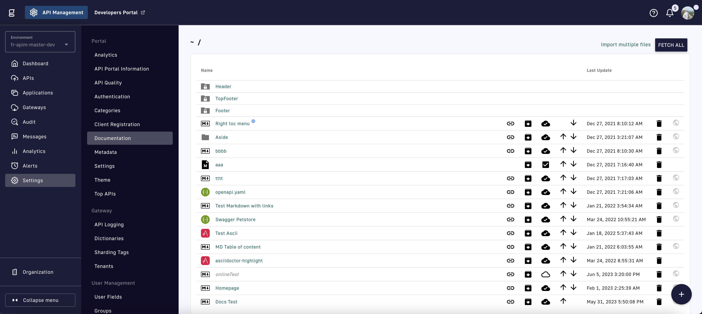<figcaption><p>Documentation settings page</p></figcaption></figure>
3.  Select the **+** icon on the bottom right to display the options below.

    <figure>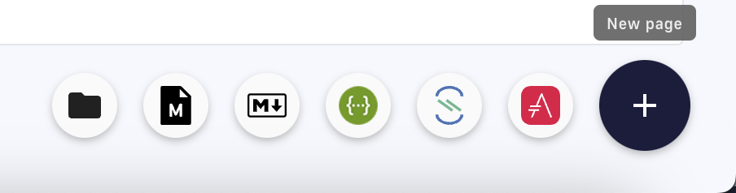<figcaption><p>Create new documentation options</p></figcaption></figure>

*   **Folder:** Generate a folder to organize your documentation. Optionally generate [translations](api-documentation.md#translations) of the folder by selecting **Translate Folder**.

    <figure>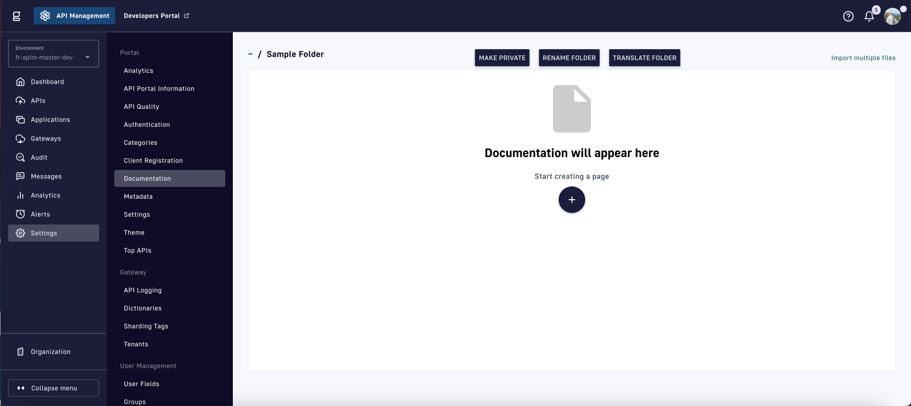<figcaption><p>Sample documentation folder</p></figcaption></figure>
* **Markdown Template:** Create templates reusable for site-wide and API Markdown documentation.
* **Markdown:** Use the Markdown syntax for the documentation page.
* **AsciiDoc:** Use the AsciiDoc syntax for the documentation page.
* **OpenAPI (Swagger):** Use the OpenAPI syntax for the documentation page.
* **AsyncAPI:** Use the AsyncAPI syntax for the documentation page.

Each documentation type provides similar configuration options and a compatible text editor.

<figure>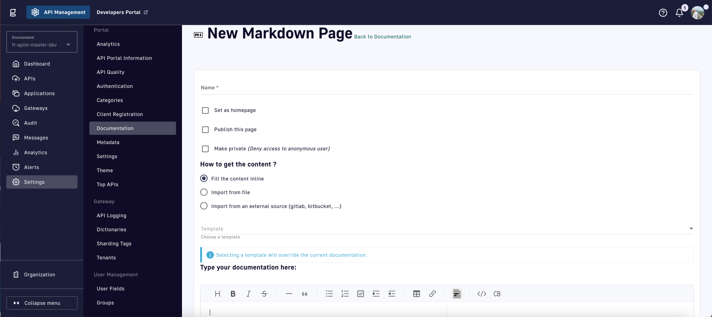<figcaption><p>Create a documentation page</p></figcaption></figure>

* **Name:** Provide a title for your documentation page.
*   **Set as homepage:** Use the documentation page as the homepage of the Developer Portal. If multiple documentation pages are set as the homepage, the page most recently set will be selected.

    <figure>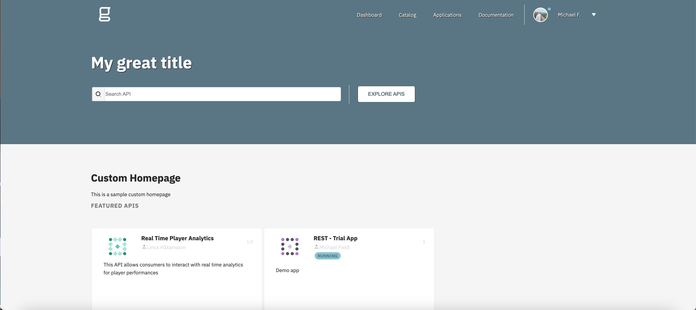<figcaption><p>Custom homepage example</p></figcaption></figure>
* **Publish this page:** Make the page available in the Developer Portal.
* **Make private:** Make the page private to you and the users you explicitly allow using [access control](api-documentation.md#access-control).

### Documentation page types

The portal navigation tree supports three documentation page types:

| Page Type | Content | Editor | Portal Display |
|:----------|:--------|:-------|:---------------|
| Gravitee Markdown | Markdown content | Markdown editor | Rendered markdown |
| OpenAPI | OpenAPI specification | Split editor with live preview | Swagger UI or Redoc (configurable) |
| AsyncAPI | AsyncAPI specification | Split YAML editor with live preview | Interactive AsyncAPI documentation viewer |

When creating an AsyncAPI page, the Console loads a starter AsyncAPI 3.0 template with a sample channel and operation. Edit the specification in the YAML editor on the left; the live preview on the right updates as you type. Before saving, the Console validates that the content is valid YAML and includes a properly formatted `asyncapi` version field (semantic version format like `3.0.0`). If validation fails, an error message appears and the page is not saved.

For OpenAPI pages, the editor displays a split layout with the specification on one side and a live preview on the other. The preview matches the selected viewer (Swagger UI or Redoc) and reflects configuration changes during the editing session without requiring a separate save.

## Generate content

APIM provides three methods for generating documentation content:

* [Fill the content inline (supports templating with API properties)](api-documentation.md#fill-content-inline)
* [Import from file](api-documentation.md#import-from-file)
* [External source (Gitlab, Bitbucket, etc.)](api-documentation.md#external-source)



This method uses the text editor to generate content based on your selected documentation type. In addition, APIM supports templating with API properties.

**Templating with API properties**

Use the following syntax to access the API data in your API documentation: `${api.name} or ${api.metadata['foo-bar']}`.

The sample script below creates a documentation template based on the Apache [FreeMarker template engine](https://freemarker.apache.org/):


```ftl
<#if api.picture??>

</#if>

The API is <span style="text-transform: lowercase;color: <#if api.state=='STARTED'>green<#else>red</#if>">${api.state}</span>.

This API has been created on ${api.createdAt?datetime} and updated on ${api.updatedAt?datetime}.

<#if api.deployedAt??>
This API has been deployed on ${api.deployedAt?datetime}.
<#else>
This API has not yet been deployed.
</#if>

<#if api.visibility=='PUBLIC'>
This API is publicly exposed.
<#else>
This API is not publicly exposed.
</#if>

<#if api.tags?has_content>
Sharding tags: ${api.tags?join(", ")}
</#if>

## Description

${api.description}

<#if api.proxy??>
## How to access

The API can be accessed through https://api.company.com${api.proxy.contextPath}:

curl https://api.company.com${api.proxy.contextPath}
</#if>

## Rating

You can rate and put a comment for this API <a href='/#!/apis/${api.id}/ratings'>here</a>.

## Contact

<#if api.metadata['email-support']??>
The support contact is <a href="mailto:${api.metadata['email-support']}">${api.metadata['email-support']}</a>.
</#if>

The API owner is <#if api.primaryOwner.email??><a href="mailto:${api.primaryOwner.email}">${api.primaryOwner.displayName}</a><#else>${api.primaryOwner.displayName}</#if>.
```


The above sample script creates the following in the Developer Portal:

<figure>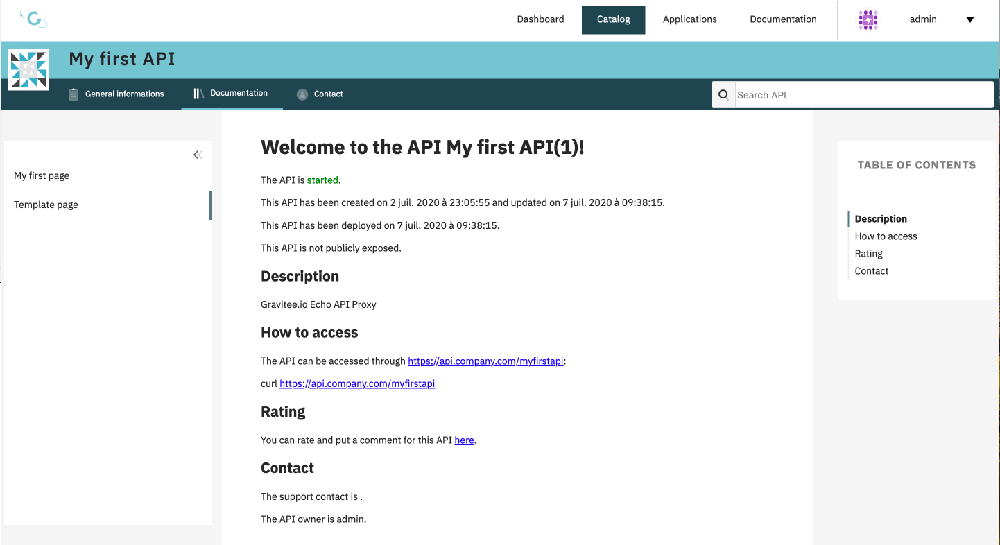<figcaption><p>Result of templating engine example</p></figcaption></figure>

**Additional templating examples**

The following examples demonstrate common FreeMarker patterns for portal pages:

**Basic API information header:**

```markdown

> ${api.description}

**Status:** ${api.lifecycleState}
**Visibility:** ${api.visibility}
**Owner:** ${api.primaryOwner.displayName} (${api.primaryOwner.email})
```

**Conditional support contact block:**

```markdown
## Support

<#if api.metadata['email-support']?has_content>
Contact us at [${api.metadata['email-support']}](mailto:${api.metadata['email-support']}).
<#else>
No support contact configured.
</#if>
```

**Listing categories and tags:**

```markdown
**Categories:** <#list api.categories as cat>${cat}<#sep>, </#list>

**Tags:** <#list api.tags as tag>`${tag}`<#sep>  </#list>
```

**Deployment timestamp with date formatting:**

```markdown
<#if api.deployedAt??>
Last deployed: ${api.deployedAt?string['yyyy-MM-dd HH:mm']}
<#else>
Not yet deployed.
</#if>
```

**Loop over V4 listeners:**

```markdown
## Endpoints

<#list api.listeners as listener>
- **${listener.type}**
</#list>
```

**Owner type check:**

```markdown
<#if api.primaryOwner.type == "GROUP">
Maintained by the **${api.primaryOwner.displayName}** team.
<#else>
Maintained by **${api.primaryOwner.displayName}**.
</#if>
```

**Environment metadata access (environment pages):**

```markdown

For assistance, reach out to [support](mailto:${metadata['support-email']}).
```

**API properties reference**

The following reference table shows all available API properties. Access these properties in the Freemarker template with `${api.<Field name>}` as in the above sample script.

<table data-full-width="false"><thead><tr><th width="155">Field name</th><th width="124">Field type</th><th>Example</th></tr></thead><tbody><tr><td>id</td><td>String</td><td>70e72a24-59ac-4bad-a72a-2459acbbad39</td></tr><tr><td>name</td><td>String</td><td>My first API</td></tr><tr><td>description</td><td>String</td><td>My first API</td></tr><tr><td>version</td><td>String</td><td>1</td></tr><tr><td>metadata</td><td>Map</td><td>{"email-support": "<a href="mailto:support.contact@company.com">support.contact@company.com</a>"}</td></tr><tr><td>createdAt</td><td>Date</td><td>12 juil. 2018 14:44:00</td></tr><tr><td>updatedAt</td><td>Date</td><td>12 juil. 2018 14:46:00</td></tr><tr><td>deployedAt</td><td>Date</td><td>12 juil. 2018 14:49:00</td></tr><tr><td>picture</td><td>String</td><td>data:image/png;base64,iVBO…​</td></tr><tr><td>state</td><td>String</td><td>STARTED/STOPPED</td></tr><tr><td>visibility</td><td>String</td><td>PUBLIC/PRIVATE</td></tr><tr><td>tags</td><td>Array</td><td>["internal", "sales"]</td></tr><tr><td>proxy.contextPath</td><td>String</td><td>/stores</td></tr><tr><td>primaryOwner.displayName</td><td>String</td><td>Firstname Lastname</td></tr><tr><td>primaryOwner.email</td><td>String</td><td><a href="mailto:firstname.lastname@company.com">firstname.lastname@company.com</a></td></tr><tr><td>mcp.mcpPath</td><td>String</td><td>/mcp</td></tr></tbody></table>

The `api.mcp` map is populated from the first listener's first entrypoint of type `mcp`. If no such entrypoint exists, the map is empty. Note: this applies to classic Developer Portal templates only; New Developer Portal templates additionally recognize entrypoints of type `mcp-proxy`.



This method allows you to generate content by importing a file that matches the documentation type.



This method allows you to import your documentation from external sources. APIM includes five types of fetchers:

* **GitHub:** Fetch your documentation from a GitHub repository
* **GitLab:** Fetch your documentation from a GitLab repository
* **Git:** Fetch your documentation from any Git repository
* **WWW:** Fetch your documentation from the web
* **Bitbucket:** Fetch your documentation from a Bitbucket repository

    <figure><figcaption><p>Documentation fetcher configuration</p></figcaption></figure>

The documentation is fetched and stored locally in APIM in the following three scenarios:

* Once, after you finish configuring your fetcher
*   Any time you select **Fetch All** on the **Documentation** page

    <figure><figcaption><p>Update all documentation from external sources</p></figcaption></figure>
* At regular intervals when auto-fetch is configured



## Import multiple pages

If you have existing documentation for your API in a GitHub or GitLab repository, you can:

* Configure the GitHub or GitLab fetcher to import the complete documentation structure on a one-off or regular basis
* Import the documentation into APIM in a structure different from that of the source repository by:
  * Creating a Gravitee descriptor file (`.gravitee.json`) at the repository root that describes both the source and destination structures
  * Configuring a fetcher in APIM to read the JSON file and import the documentation according to the structure defined in the file




The Gravitee descriptor file must be named `.gravitee.json` and must be placed at the root of the repository.


The following `.gravitee.json` describes a documentation set that includes:

* A homepage in Markdown format in a folder called `/newdoc`, to be placed at the root of the APIM documentation structure
* A JSON file containing a Swagger specification at the root of the repository, to be placed in a folder called `/technical` in the APIM documentation structure


```json
{
    "version": 1,
    "documentation": {
        "pages": [
            {
                "src": "/newdoc/readme.md",
                "dest": "/",
                "name": "Homepage",
                "homepage": true
            },
            {
                "src": "/test-import-swagger.json",
                "dest": "/technical",
                "name": "Swagger"
            }
        ]
    }
}
```




Follow the steps below to configure a fetcher to import multiple files:

1.  From the **Documentation** page, select **Import multiple files**

    <figure><figcaption><p>Import multiple documentation files</p></figcaption></figure>
2.  To publish the pages on import, select **Publish all imported pages**

    <figure>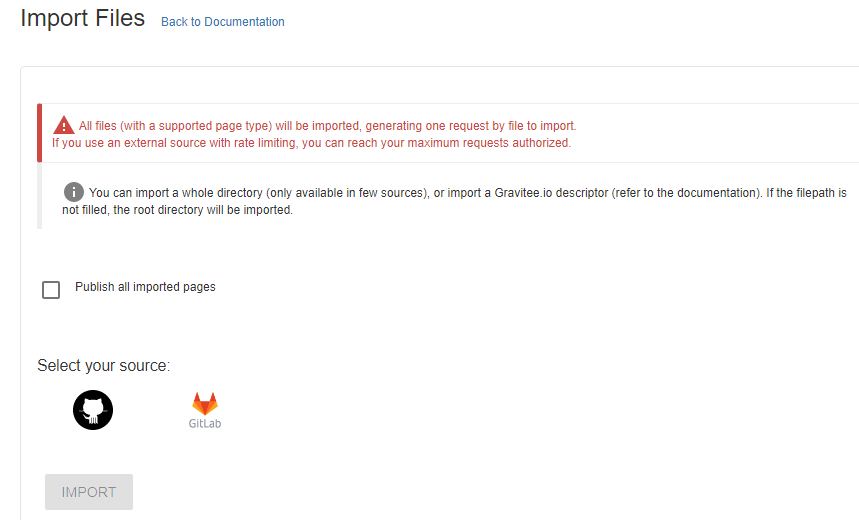<figcaption><p>Option to publish all imported files</p></figcaption></figure>
3. Select the **GitHub** or **GitLab** fetcher
4.  Specify the details of the external source, such as the URL of the external API, the name of the repository, and the branch. The fields vary slightly depending on the fetcher.

    <figure>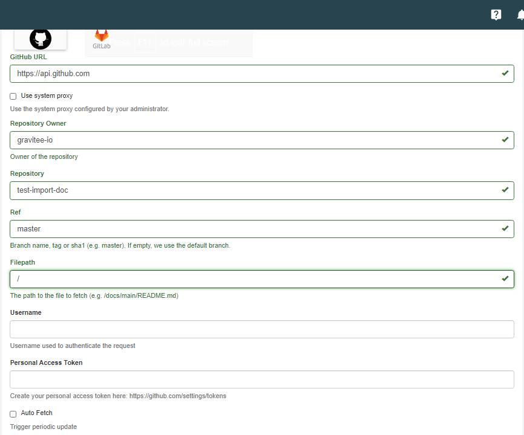<figcaption><p>Configure a fetcher</p></figcaption></figure>
5. In the **Filepath** field, enter the path to your JSON documentation specification file
6. Enter a **Username** to authenticate the request
7. Enter a **Personal Access Token**, which must be generated in your GitHub or GitLab user profile
8. To update the pages at regular intervals, select **Auto Fetch** and specify the `crontab` update frequency


**`cron` expressions**

A `cron` expression is a string consisting of six fields (representing seconds, minutes, hours, days, months, and weekdays) that describe the schedule. For example:

* Fetch every second: `* * */1 * * *`
* At 00:00 on Saturday : `0 0 0 * * SAT`

Documentation auto-fetch schedules are subject to [platform-wide frequency limits](../../configure-and-manage-the-platform/management-api/cron-schedule-frequency-limits.md) configured by administrators. If you attempt to configure a schedule more frequent than the configured limit, a validation error will occur. If the APIM administrator configured a maximum fetch frequency, the value configured by the APIM administrator will override the frequency you specify.


9.  Select **IMPORT** for APIM to add the files to your documentation set

    <figure>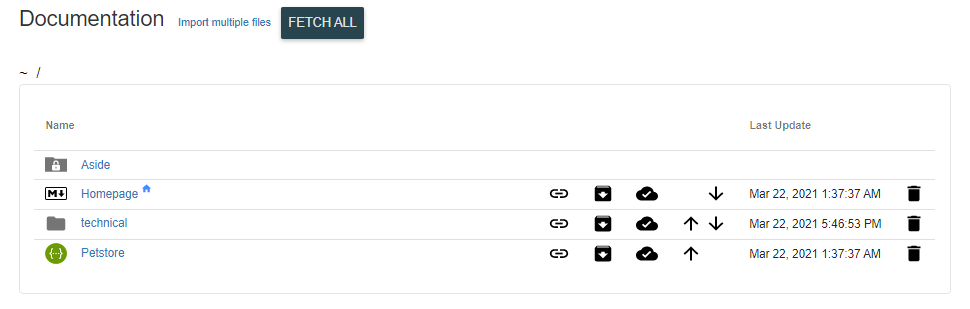<figcaption><p>Import technical folder documentation with fetcher</p></figcaption></figure>



## Page management

Select a page to configure the following via the header tabs:

* **Page:** Manage the content of the documentation page by via the inline editor or by importing files
* **Translations:** Add translations of your page
* **Configuration:** Toggle options to publish your page and use it as the homepage
* **External Source:** Configure a fetcher for the page
* **Access Control:** Fine-grained access control over your page
* **Attached Resources:** Add additional files to your documentation page.
  * This requires the administrator to configure **Allow Upload Images** and **Max size upload file (bytes)** in [settings](portal-settings.md).

      <figure><figcaption><p>Page management options</p></figcaption></figure>

**Page**, **Translations** and **Access Control** are described in greater detail below.



If incorrect templating is applied to the Markdown page of an API, errors are generated to alert the user that the page will not be formatted as intended when published to the Developer Portal.

<figure><figcaption><p>Example of incorrect templating</p></figcaption></figure>



You can add translations for your pages via the **Translations** tab:

1. Select **Add a translation**
2. Enter your 2-character language code (FR for French, CZ for Czech, IT for Italian, etc.)
3. Enter the translated title
4. (Optional) You can edit the content to add translated content by toggling on the switch
5. Click **Save Translation** at the bottom of the page

    <figure>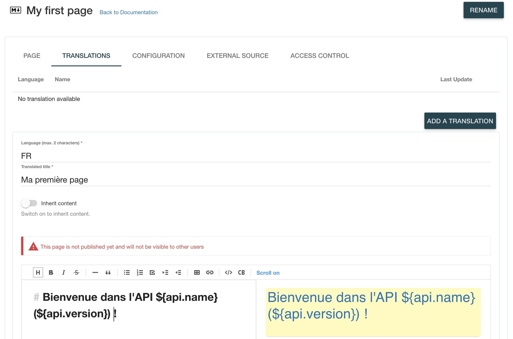<figcaption><p>Translate a page</p></figcaption></figure>



From the **Access Control** tab:

* You can mark a page as **Private** if you want to deny access to anonymous users.
* If a page is **Private**, you can configure access lists to either require or exclude certain [roles and groups](../../configure-and-manage-the-platform/manage-organizations-and-environments/authentication/roles-and-groups-mapping.md) by toggling the **Excluded** option.

    <figure>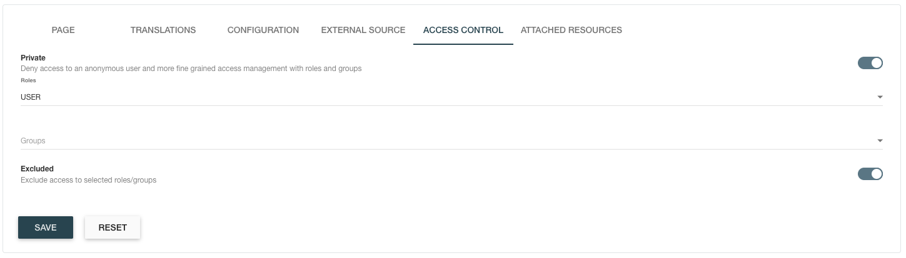<figcaption><p>Documentation access control</p></figcaption></figure>



## OpenAPI Viewer configuration

Portal administrators can configure how OpenAPI and AsyncAPI documentation pages are displayed in the developer portal. For OpenAPI pages, choose between Swagger UI (interactive with Try It Out) or Redoc (read-focused reference layout) and customize viewer behavior. AsyncAPI pages render with an interactive documentation viewer. All configuration is managed through the Portal Navigation settings in the Console, with live preview during editing.

### OpenAPI viewer options

Portal administrators choose how each OpenAPI page renders in both the Console preview and the published portal:

**Swagger UI**: Interactive documentation with Try It Out, OAuth support, and rich display options. Best for APIs where users need to test endpoints directly from the documentation.

**Redoc**: Read-focused API reference layout. Best for comprehensive API reference documentation with minimal interaction.

Swagger UI exposes the full configuration option set. Redoc supports viewer selection and an optional base URL override; Swagger-specific options are hidden when Redoc is selected.

### Configuring OpenAPI viewer settings

When editing an OpenAPI page in portal navigation, open **Configure OpenAPI Viewer** to set the viewer and applicable options. Settings are saved independently of the specification content.

#### Viewer selection and server URL

1. Select an **OpenAPI Documentation Viewer** from the dropdown (SwaggerUI or Redoc).
2. Enter a **Base URL** in the text field to use as the server URL when trying the API. If empty and entrypoints are not used, the server URL from the specification is used. This field is disabled when **Use API entrypoints as server URLs** is enabled.

#### Swagger UI options

The following options apply only when Swagger UI is selected as the viewer.

#### Server URL and Try It Out

| Option | Description |
|:-------|:------------|
| **Use API entrypoints as server URLs** | Replaces specification server URLs with the API's live gateway entrypoints. When enabled, the custom base URL field is not used. |
| **Use API context-path as server URL path** | Applies the API's context-path to the server URL path. Can be combined with entrypoints. |
| **Enable Try It Out mode** | Lets authenticated portal users execute API calls from the documentation page. May require CORS to be configured on the API entrypoint. |
| **Enable Try It Out mode for anonymous users** | Allows users who are not logged in to use Try It Out on public pages and public APIs. |
| **Use PKCE with OAuth** | Uses PKCE when authenticating with an OAuth authorization-code flow from the documentation page. |

#### Display and behavior

| Option | Description |
|:-------|:------------|
| **Expand content on the page** | Controls default expansion: Default (nothing), Only tags, or Tags and operations. |
| **Display the operationId in the operation list** | Shows the `operationId` in the operations list. |
| **Add top bar to filter content** | Adds a filter bar for tags and operations. |
| **Display vendor extensions** | Shows vendor extension (`x-`) fields on operations, parameters, and schemas. |
| **Display extension fields for Parameters** | Shows pattern, maxLength, minLength, maximum, and minimum extensions on parameters. |
| **Max number of tagged operations displayed** | Limits how many tagged operations are shown. Use `-1` to show all. |
| **Show URL to download content** | Loads the specification from its download URL instead of inline content. |
| **Disable response body styling for large JSON payloads** | Turns off syntax highlighting on responses to improve performance with large payloads. |

#### Redoc options

When Redoc is selected as the viewer, only the **Base URL** field is configurable. Swagger-specific options are hidden.

#### Saving configuration

Click **Save** to apply the configuration. The live preview in the OpenAPI editor updates to reflect the selected viewer and options. Click **Cancel** to close the dialog without saving changes.

### Existing OpenAPI pages

Viewer settings are stored with the page content and survive publish/unpublish and navigation changes. Existing OpenAPI pages that had no viewer configuration before this feature are treated as Redoc pages, preserving prior portal behavior. An automatic upgrader runs on platform startup to set `configuration = {"viewer":"REDOC"}` for all OpenAPI portal page contents where configuration is null or blank. Settings remain compatible with how OpenAPI page configuration worked in earlier releases.

### Management API

Administrators and integrators can update OpenAPI viewer configuration programmatically using the Management API v2.

#### PATCH `/portal-page-contents/{portalPageContentId}/configuration`

Updates OpenAPI viewer configuration without modifying page content. Requires `ENVIRONMENT_DOCUMENTATION[update]` permission.

**Request Body** (Swagger UI example):

```json
{
  "viewer": "SWAGGER",
  "displayOperationId": true,
  "docExpansion": "full",
  "enableFiltering": true,
  "maxDisplayedTags": 10,
  "showCommonExtensions": true,
  "showExtensions": true,
  "showURL": true,
  "tryIt": true,
  "disableSyntaxHighlight": true,
  "tryItAnonymous": true,
  "tryItURL": "https://example.com",
  "usePkce": true,
  "entrypointsAsServers": true,
  "entrypointAsBasePath": true
}
```

**Request Body** (Redoc example):

```json
{
  "viewer": "REDOC",
  "tryItURL": "https://example.com"
}
```

**Response**: `PortalPageContent` object with updated configuration.

**Configuration Properties**:

| Property | Type | Default | Description |
|:---------|:-----|:--------|:------------|
| `viewer` | enum | `SWAGGER` | `SWAGGER` or `REDOC` |
| `tryItURL` | string | `""` | Base URL used when trying the API (Swagger) or as OpenAPI server URL (Redoc) |
| `displayOperationId` | boolean | `false` | Display the operationId in the operations list (Swagger only) |
| `docExpansion` | enum | `none` | Default expansion: `list`, `full`, `none` (Swagger only) |
| `enableFiltering` | boolean | `false` | Add a top bar to filter content (Swagger only) |
| `maxDisplayedTags` | integer | `-1` | Max tagged operations displayed; `-1` shows all (Swagger only) |
| `showCommonExtensions` | boolean | `false` | Display common extension fields for parameters (Swagger only) |
| `showExtensions` | boolean | `false` | Display vendor extension (X-) fields (Swagger only) |
| `showURL` | boolean | `false` | Show the URL to download the content (Swagger only) |
| `tryIt` | boolean | `false` | Enable Try It mode in documentation page (Swagger only) |
| `disableSyntaxHighlight` | boolean | `false` | Disable response body styling for large JSON payloads (Swagger only) |
| `tryItAnonymous` | boolean | `false` | Enable Try It for anonymous users (Swagger only) |
| `usePkce` | boolean | `false` | Enable use of PKCE with authorization code flows (Swagger only) |
| `entrypointsAsServers` | boolean | `false` | Use API entrypoints as OpenAPI servers (Swagger only) |
| `entrypointAsBasePath` | boolean | `false` | Use API entrypoint as OpenAPI base path (Swagger only) |

**Behavior**:

- When `entrypointsAsServers` is `true`, `tryItURL` is disabled (set to empty string)
- When `viewer` is `REDOC`, only `tryItURL` is configurable; Swagger-specific settings are ignored
- Configuration updates preserve unsaved content changes in the editor
- Missing configuration defaults to Redoc with empty `tryItUrl`

### Portal API

The Portal API exposes page content and configuration using snake_case property names:

**Page Configuration Properties**:

| Property | Type | Default | Description |
|:---------|:-----|:--------|:------------|
| `viewer` | enum | `Swagger` | `Swagger` or `Redoc` |
| `try_it_url` | string | `""` | Base URL for Try It mode |
| `try_it` | boolean | `false` | Enable Try It mode |
| `disable_syntax_highlight` | boolean | `false` | Disable syntax highlighting |
| `try_it_anonymous` | boolean | `false` | Enable Try It for anonymous users |
| `show_url` | boolean | `false` | Show download URL |
| `display_operation_id` | boolean | `false` | Display operationId |
| `use_pkce` | boolean | `false` | Use PKCE with OAuth |
| `doc_expansion` | enum | `none` | `list`, `full`, `none` |
| `enable_filtering` | boolean | `false` | Enable filtering |
| `show_extensions` | boolean | `false` | Show vendor extensions |
| `show_common_extensions` | boolean | `false` | Show common extensions |
| `max_displayed_tags` | number | `-1` | Max displayed tags |

**Page Content Type** (enum): `GRAVITEE_MARKDOWN`, `OPENAPI`, `ASYNCAPI`

