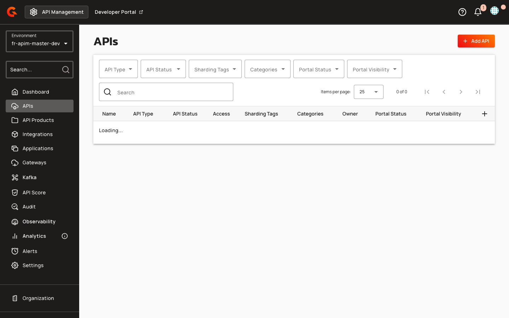

# API Overview Page Templates

## Overview

API Overview Page Templates provide pre-configured Gravitee Markdown content for API pages in the New Developer Portal. When you add an API to the portal navigation in the Console, Gravitee automatically creates an unpublished **Overview** child page (unless the API navigation item already has a child page). The page uses FreeMarker templating to render API metadata, subscription guidance, and integration instructions. Two templates are available: a standard template for general APIs and an MCP proxy template for Model Context Protocol servers.

For step-by-step instructions, see [Customize the Navigation](customize-the-navigation.md#api). For Gravitee Markdown component reference, see [Gravitee Markdown components](gravitee-markdown-components.md).

## Key Concepts

### Standard API Template

The standard template presents API information in a card-based layout with three primary sections: API metadata (version, visibility, owner, deployment date), a three-column **Get started** guide covering subscription, documentation exploration, and integration steps, and customization guidance for API publishers. The template uses styled cards with primary color theming and a 12px border radius for visual consistency.

### MCP Proxy Template

The MCP proxy template is tailored for Model Context Protocol servers published through the Gravitee gateway. It includes the same API metadata card as the standard template, an **Install in your AI client** section with a `<gmd-install-mcp>` component for one-click configuration in Cursor, VS Code, and Claude Desktop, and a **What you can do** section with action cards emphasizing MCP-specific workflows: discovering tools and resources, understanding secure gateway routing, and subscribing for credentials.

### Template Components

| Component | Purpose | Attributes |
|:----------|:--------|:-----------|
| `<gmd-card>` | Styled container for API information and guidance sections | `class="overview-info"` for metadata, `class="overview-card"` for action cards |
| `<gmd-grid>` | Three-column layout for action cards | `columns="3"` |
| `<gmd-install-mcp>` | One-click MCP server configuration generator (MCP template only) | `name`, `transport="http"`, `url` (gateway endpoint + MCP path) |

### MCP Install Component

The `<gmd-install-mcp>` component renders client-specific installation actions in portal documentation pages. It generates deep links for supported clients (Cursor, VS Code) and JSON configuration snippets for manual installation (Claude Desktop). The component adapts to both remote HTTP/SSE transports and local stdio-based MCP servers.

The component is implemented in `gravitee-apim-webui-libs/gravitee-markdown/.../install-mcp/` and preserved by the HTML sanitizer (`HtmlSanitizer.java`) when stored in Gravitee Markdown content.

#### Component Attributes

The following table describes the configuration attributes for the MCP component:

| Attribute | Description | Example |
|:----------|:------------|:--------|
| `name` | MCP server name used in generated client configurations | `"weather"` |
| `transport` | MCP transport protocol. Supported values: `http`, `sse`, or `stdio` (default: `http`) | `"http"` |
| `url` | Remote MCP endpoint URL for `http` and `sse` transports | `"https://api.example.com/mcp"` |
| `headers` | JSON object or string of headers for remote transports | `'{"Authorization":"Bearer token"}'` |
| `command` | Executable used to start a stdio MCP server | `"npx"` |
| `args` | JSON array or comma-separated string of stdio command arguments | `'["-y","@acme/weather-mcp"]'` |
| `env` | JSON object or string of environment variables for stdio transports | `'{"API_KEY":"secret"}'` |
| `clients` | Comma-separated list of installer IDs to display | `"cursor,vscode,claude-desktop"` |


**Component Requirements:**
- The `url` attribute is required for `http` and `sse` transports.
- The `command` attribute is required for `stdio` transport.
- If required inputs are missing, the component renders the placeholder message: "Provide a server name and URL, or use stdio inputs for a local MCP server."
- The copy button label changes from "Copy" to "Copied" for 2 seconds after clicking.


The component's behavior varies by client type and transport protocol.

#### Installer Behavior

The following table describes the installation mode, configuration file, and deep link support for each client:

| Client | Installation Mode | Configuration File | Deep Link Support |
|:-------|:------------------|:-------------------|:------------------|
| Cursor | Deep link | `~/.cursor/mcp.json` | Yes (`cursor://anysphere.cursor-deeplink/mcp/install`) |
| VS Code | Deep link | `mcp.json` | Yes (`vscode:mcp/install`) |
| Claude Desktop | Snippet only | `claude_desktop_config.json` | No |

If no installers match the requested `clients` input, the component renders the following message:

```
No supported installers are available for the selected clients.
```

#### Theming

Customize component appearance using the `@gmd.install-mcp-overrides()` SCSS mixin:

```scss
@use '@gravitee/gravitee-markdown' as gmd;

@include gmd.install-mcp-overrides((
  container-color: #1f2937,
  container-outline-color: #334155,
  headline-color: #f8fafc,
  subdued-text-color: #cbd5e1,
  tab-inactive-color: #0f172a,
  tab-inactive-text-color: #e2e8f0,
  code-background-color: #020617,
  code-text-color: #e2e8f0,
));
```

The following tokens are available for customization:

* `container-color`
* `container-outline-color`
* `headline-color`
* `subdued-text-color`
* `tab-active-color`
* `tab-active-text-color`
* `tab-inactive-color`
* `tab-inactive-text-color`
* `code-background-color`
* `code-text-color`

### FreeMarker Template Variables

Portal navigation page templates can reference two API model variables populated from V4 API entrypoint configuration with type `mcp` or `mcp-proxy`:

| Variable | Type | Description |
|:---------|:-----|:------------|
| `api.entrypoints` | `List<String>` | List of gateway entrypoint URLs (first element commonly used as install URL base) |
| `api.mcp` | `Map<String, Object>` | MCP configuration map extracted from the first listener's first entrypoint with type `mcp` or `mcp-proxy` (e.g., `mcpPath`) |

**Example FreeMarker expressions:**

```html
${api.entrypoints[0]} <!-- First entrypoint URL -->
${api.mcp.mcpPath}    <!-- MCP path appended to entrypoint URL -->
```

**Install URL pattern in templates:**

```html
<gmd-install-mcp 
  name="${api.name}" 
  url="${api.entrypoints[0]}${api.mcp.mcpPath!''}" 
  clients="cursor,vscode,claude-desktop" />
```

Use null checks and size guards in templates when accessing `api.entrypoints` or `api.mcp` to handle APIs with missing or incomplete entrypoint configuration. Correct entrypoint setup is required for proper variable population.

## Prerequisites

* Enable the New Developer Portal. For more information, see [Configure the New Portal](configure-the-new-portal.md).
* Add the API to the New Developer Portal navigation in the Console. For more information, see [Customize the Navigation](customize-the-navigation.md#api).
* For the MCP proxy template: the API type must be **MCP Proxy**, with a gateway entrypoint and `api.mcp.mcpPath` configured so the `<gmd-install-mcp>` component can build a valid URL.

Before using FreeMarker template variables in portal page templates, verify that your MCP Proxy API has at least one configured entrypoint:

1. Navigate to **APIs** in the left sidebar of the API Management console.
2. Select your MCP Proxy API from the list.
3. Click **Entrypoints** in the API navigation menu.
4. Verify that at least one entrypoint is configured with type `mcp` or `mcp-proxy`.
5. Note the exposed entrypoint URL displayed in the **Exposed Entrypoints** section (required for `api.entrypoints` template variable population).

    <figure><figcaption></figcaption></figure>

## Creating API Overview Pages

When you add an API to the portal navigation, the Console calls the Management API to seed a default **Overview** page under that API navigation item. Gravitee skips seeding if the API navigation item already has a child page, so existing pages are not overwritten.

The seeded page is created **unpublished**. Publish the Overview page—or publish the parent API navigation item, which cascades to child pages—to make it visible on the New Developer Portal.

The standard template is applied to general APIs; the MCP proxy template is used when the API type is **MCP Proxy**.

The page header displays the API name as the title and includes a descriptive subtitle explaining the API's purpose and access model. An API information card presents the version, visibility level, owner display name (if available), and last deployment date (formatted as `yyyy-MM-dd`, if available).

Below the metadata, a three-column grid of action cards guides consumers through subscription, documentation exploration, and integration workflows. For MCP proxy APIs, an **Install in your AI client** section embeds `<gmd-install-mcp>` to generate client configuration from the gateway endpoint and MCP path, followed by action cards focused on MCP-specific tasks.

A customization section at the bottom encourages API publishers to enhance the overview with quick start guides, use case descriptions, and links to changelogs.

### Default Page Seeding

When you create default portal pages, the system seeds an unpublished **Overview** page for each API navigation item that does not already have a child page. The seeding process applies the MCP-specific template for MCP Proxy APIs and the generic template for other API types:

1. Navigate to **APIs** in the left sidebar.
2. Send a `POST` request to `/portal-navigation-items/_default-pages` to trigger default page creation.
3. The system executes `SeedDefaultPagesForApiNavigationItemsUseCase`, which processes each API navigation item.
4. For items without an existing child page, the use case calls `apiCrudService.findById(apiId)`.
5. If the API type is `MCP_PROXY`, the system applies the `api-overview-mcp-proxy-page-content.md` template; otherwise, it applies the generic `api-overview-page-content.md` template.
6. The system creates Gravitee Markdown content and an unpublished **Overview** page.

    <figure><figcaption></figcaption></figure>

The MCP Proxy template includes API metadata and an embedded `<gmd-install-mcp>` component with HTTP transport and URL constructed from the first entrypoint plus `mcpPath`.

**MCP Proxy template content:**

```markdown


Welcome to the documentation for **${api.name}**.

<#if api.description?? && api.description?has_content>
${api.description}

</#if>
<gmd-install-mcp 
  name="${api.name}" 
  url="${api.entrypoints[0]}${api.mcp.mcpPath!''}" 
  clients="cursor,vscode,claude-desktop" />
```

7. Navigate to **Documentation** in the API navigation menu to view the seeded Overview page.

    <figure><figcaption></figcaption></figure>

## Customizing Templates

API publishers can edit the generated Overview page in the Console to add context-specific content. The standard template suggests adding a quick start section, highlighting key use cases, and linking to external guides or changelogs. The MCP proxy template recommends listing available MCP tools, documenting authentication requirements, and describing expected use cases.

Both templates include a link to Gravitee documentation: the standard template links to the [Developer Portal overview](https://documentation.gravitee.io/apim/developer-portal/new-developer-portal), while the MCP proxy template links to the [OAuth2 security guide for MCP proxies](https://documentation.gravitee.io/apim/ai-agent-management/secure-mcp-proxy-with-oauth2).

## Restrictions

* The **Type** and **Identifier** fields previously displayed in API information sections are no longer included in the new templates.
* The **Owner** field is displayed only if `api.primaryOwner.displayName` is present.
* The **Last deployed** field is displayed only if `api.deployedAt` is available.
* The `<gmd-install-mcp>` component is available only in the MCP proxy template and requires `api.entrypoints[0]` and `api.mcp.mcpPath` to be defined.

## Related Changes

The API overview page format has migrated from plain markdown lists to styled card components. Information cards now use an 8% primary color background with a 24% primary color border and 12px border radius, while action cards use a surface container background with a 12% primary color mixed border and 10px border radius. Card titles apply the `--gio-app-primary-main-color` CSS variable (default: `#32329f`).

The page subtitle text is now tailored to the API type, with standard APIs emphasizing subscription and secure gateway access, and MCP proxy APIs highlighting Model Context Protocol integration and AI client connectivity.
