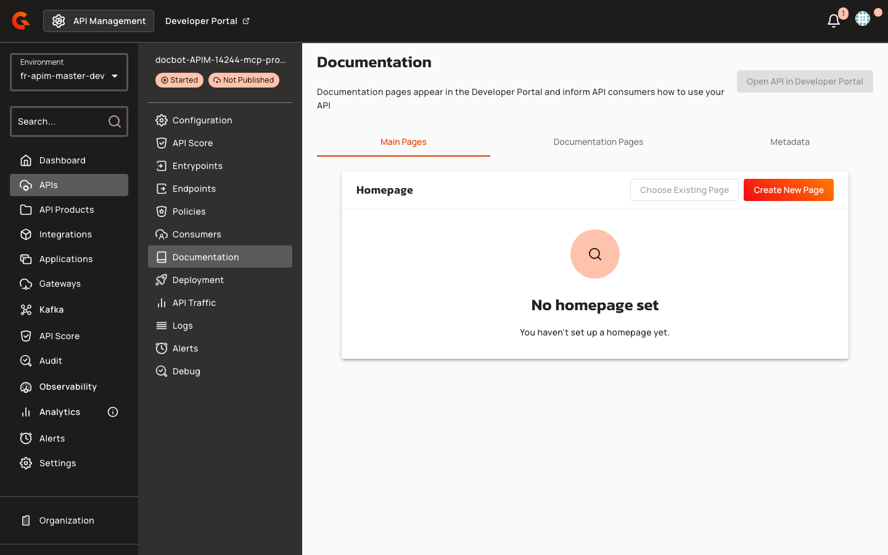
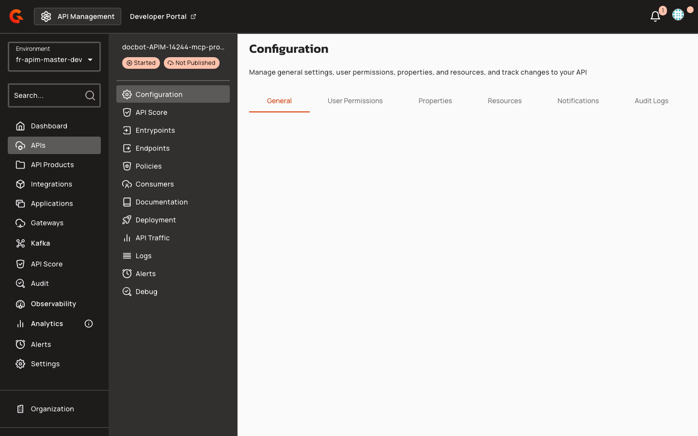
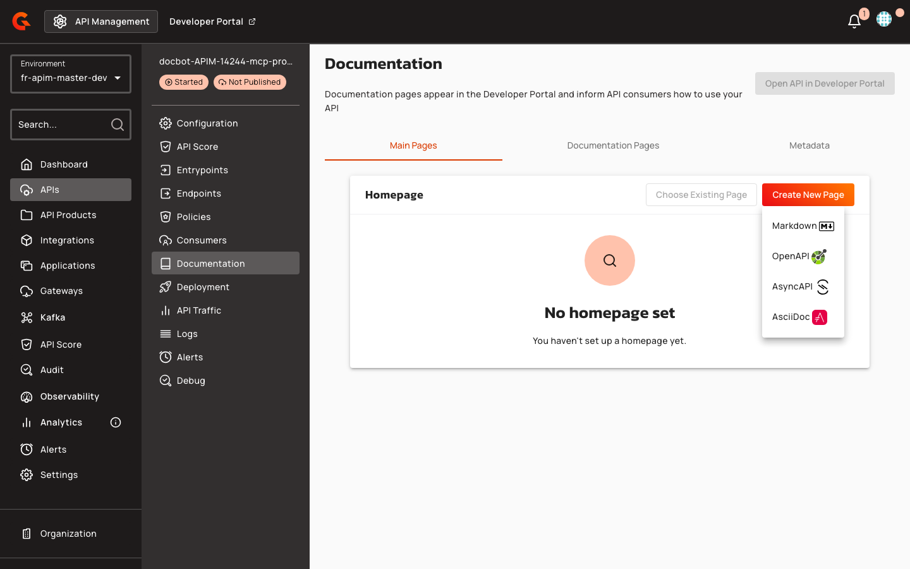

# API Overview Page Templates

## Overview

API Overview Page Templates provide pre-configured Gravitee Markdown content for API pages in the New Developer Portal. When you add an API to the portal navigation in the Console, Gravitee automatically creates an unpublished **Overview** child page (unless the API navigation item already has a child page). The page uses FreeMarker templating to render API metadata, subscription guidance, and integration instructions. Two templates are available: a standard template for general APIs and an MCP proxy template for Model Context Protocol servers.

For MCP Proxy APIs, the Overview page includes an interactive installation widget that provides one-click deep links and copyable configuration snippets for popular AI clients (Cursor, VS Code, Claude Desktop), enabling developers to quickly connect their AI tools to the MCP server.

For step-by-step instructions, see [Customize the Navigation](customize-the-navigation.md#api). For Gravitee Markdown component reference, see [Gravitee Markdown components](gravitee-markdown-components.md).

## Key Concepts

### Standard API Template

The standard template presents API information in a card-based layout with three primary sections: API metadata (version, visibility, owner, deployment date), a three-column **Get started** guide covering subscription, documentation exploration, and integration steps, and customization guidance for API publishers. The template uses styled cards with primary color theming and a 12px border radius for visual consistency.

### MCP Proxy Template

The MCP proxy template is tailored for Model Context Protocol servers published through the Gravitee gateway. It includes the same API metadata card as the standard template, an **Install in your AI client** section with a `<gmd-install-mcp>` component for one-click configuration in Cursor, VS Code, and Claude Desktop, and a **What you can do** section with action cards emphasizing MCP-specific workflows: discovering tools and resources, understanding secure gateway routing, and subscribing for credentials.

For additional context on securing MCP proxies, see the [Secure MCP Proxy with OAuth2](https://documentation.gravitee.io/apim/ai-agent-management/secure-mcp-proxy-with-oauth2) guide.

### MCP Installation Widget

The `<gmd-install-mcp>` component renders an interactive installation interface on portal pages. It generates client-specific configuration snippets and deep links based on the MCP server's transport protocol (HTTP, SSE, or stdio). The widget displays tabs for each supported AI client—Cursor, VS Code, and Claude Desktop—allowing developers to copy pre-configured connection details or launch one-click installers. When misconfigured or missing required attributes, the component renders a placeholder instead of installation actions.

Portal page authors can manually embed the `<gmd-install-mcp>` component in Gravitee Markdown content to provide MCP installation instructions. The component supports three transport protocols—HTTP, SSE, and stdio—and multiple configuration attributes:

| Attribute | Description | Example |
|:----------|:------------|:--------|
| `name` | MCP server name displayed in generated configurations | `"My MCP Server"` |
| `transport` | Connection protocol: `http`, `sse`, or `stdio` | `"http"` |
| `url` | Remote endpoint URL (required for `http` and `sse`) | `"https://api.example.com/mcp"` |
| `headers` | JSON object of HTTP headers (optional) | `{"Authorization": "Bearer token"}` |
| `command` | Stdio executable path (required for `stdio`) | `"npx"` |
| `args` | JSON array of stdio arguments (optional) | `["-y", "@modelcontextprotocol/server-everything"]` |
| `env` | JSON object of stdio environment variables (optional) | `{"API_KEY": "secret"}` |
| `clients` | Comma-separated client IDs to display as tabs (optional) | `"cursor,vscode,claude-desktop"` |

**Example — Remote HTTP transport:**

```html
<gmd-install-mcp
  name="Weather API"
  transport="http"
  url="https://api.weather.com/mcp"
  headers='{"X-API-Key": "abc123"}'
  clients="cursor,vscode">
</gmd-install-mcp>
```

**Example — Local stdio transport:**

```html
<gmd-install-mcp
  name="Local MCP Server"
  transport="stdio"
  command="npx"
  args='["-y", "@modelcontextprotocol/server-everything"]'
  env='{"DEBUG": "true"}'>
</gmd-install-mcp>
```

The HTML sanitizer (`HtmlSanitizer.java`) preserves the `<gmd-install-mcp>` tag and all listed attributes when storing portal pages, ensuring the widget remains functional after save operations.
Portal administrators can customize the widget's appearance using token-based theming. Component examples and detailed usage are documented in the internal Storybook reference (Markdown / Install MCP section).

### API Template Variables

Portal page templates use FreeMarker expressions to inject API metadata into Gravitee Markdown content. Two key variables enable MCP installation URLs:

| Variable | Description | Example Usage |
|:---------|:------------|:--------------|
| `api.entrypoints` | List of gateway entrypoint URLs | `${api.entrypoints[0]}` retrieves the first entrypoint |
| `api.mcp.mcpPath` | MCP-specific path from V4 entrypoint configuration | `${api.mcp.mcpPath}` appends the MCP endpoint path |

The installation URL is constructed by concatenating the first entrypoint with the MCP path: `${api.entrypoints[0]}${api.mcp.mcpPath}`. Values are populated from V4 API entrypoint configuration with `mcp` or `mcp-proxy` types. Templates must include null and size checks when accessing `api.entrypoints[0]` to avoid rendering errors.

### Template Components

| Component | Purpose | Attributes |
|:----------|:--------|:-----------|
| `<gmd-card>` | Styled container for API information and guidance sections | `class="overview-info"` for metadata, `class="overview-card"` for action cards |
| `<gmd-grid>` | Three-column layout for action cards | `columns="3"` |
| `<gmd-install-mcp>` | One-click MCP server configuration generator (MCP template only) | `name`, `transport="http"`, `url` (gateway endpoint + MCP path) |

### Supported API Types

The Developer Portal accepts six API types: `PROXY`, `MESSAGE`, `NATIVE`, `MCP_PROXY`, `LLM_PROXY`, and `A2A_PROXY`. Only `MCP_PROXY` APIs trigger MCP-specific Overview seeding; `LLM_PROXY` and `A2A_PROXY` types use the generic template.

## Prerequisites

Before you create or customize API Overview pages, ensure the following:

* Enable the New Developer Portal. For more information, see [Configure the New Portal](configure-the-new-portal.md).
* Add the API to the New Developer Portal navigation in the Console. For more information, see [Customize the Navigation](customize-the-navigation.md#api).

For MCP proxy template pages, additional requirements apply:

* Published API with type `MCP_PROXY`
* V4 API entrypoint configured with `mcp` or `mcp-proxy` type
* At least one entrypoint URL defined in the API configuration
* MCP path (`mcpPath`) configured in the API's MCP entrypoint settings

## Creating API Overview Pages

When you add an API to the portal navigation, the Console calls the Management API to seed a default **Overview** page under that API navigation item. Gravitee skips seeding if the API navigation item already has a child page, so existing pages are not overwritten.

<figure><figcaption></figcaption></figure>

<figure><figcaption></figcaption></figure>

The seeding process creates an unpublished child page specifically named "Overview". The system selects a template based on API type via `POST /portal-navigation-items/_default-pages`: MCP Proxy APIs receive a specialized template (`api-overview-mcp-proxy-page-content.md`) that includes the MCP installation widget pre-configured with the API's connection details, while all other API types use the generic overview template (`api-overview-page-content.md`).

When you create default portal pages for an MCP Proxy API, the system automatically seeds an unpublished "Overview" child page using the MCP-specific template. This page includes the API name, description (if present), and an `<gmd-install-mcp>` widget pre-populated with the HTTP transport and installation URL derived from the API's first entrypoint and MCP path. The seeding process evaluates the API type: if the type is `MCP_PROXY`, it loads `api-overview-mcp-proxy-page-content.md`; otherwise, it uses the default `api-overview-page-content.md` template.

Publish the Overview page—or publish the parent API navigation item, which cascades to child pages—to make it visible on the New Developer Portal.

The page header displays the API name as the title and includes a descriptive subtitle explaining the API's purpose and access model. The subtitle text is tailored to the API type, with standard APIs emphasizing subscription and secure gateway access, and MCP proxy APIs highlighting Model Context Protocol integration and AI client connectivity.

An API information card presents the version, visibility level, owner display name (if available), and last deployment date (formatted as `yyyy-MM-dd`, if available).

Below the metadata, a three-column grid of action cards guides consumers through subscription, documentation exploration, and integration workflows. For MCP proxy APIs, an **Install in your AI client** section embeds `<gmd-install-mcp>` to generate client configuration from the gateway endpoint and MCP path, followed by action cards focused on MCP-specific tasks.

A customization section at the bottom encourages API publishers to enhance the overview with quick start guides, use case descriptions, and links to changelogs.

## Customizing Templates

API publishers can edit the generated Overview page in the Console to add context-specific content. The standard template suggests adding a quick start section, highlighting key use cases, and linking to external guides or changelogs. The MCP proxy template recommends listing available MCP tools, documenting authentication requirements, and describing expected use cases.

Both templates include a link to Gravitee documentation: the standard template links to the [Developer Portal overview](https://documentation.gravitee.io/apim/developer-portal/new-developer-portal), while the MCP proxy template links to the [OAuth2 security guide for MCP proxies](https://documentation.gravitee.io/apim/ai-agent-management/secure-mcp-proxy-with-oauth2).

## Restrictions

* The **Type** and **Identifier** fields previously displayed in API information sections are no longer included in the new templates.
* The **Owner** field is displayed only if `api.primaryOwner.displayName` is present.
* The **Last deployed** field is displayed only if `api.deployedAt` is available.
* The `<gmd-install-mcp>` component is available only in the MCP proxy template and requires `api.entrypoints[0]` and `api.mcp.mcpPath` to be defined.

## Related Changes

The API overview page format has migrated from plain markdown lists to styled card components. Information cards now use an 8% primary color background with a 24% primary color border and 12px border radius, while action cards use a surface container background with a 12% primary color mixed border and 10px border radius. Card titles apply the `--gio-app-primary-main-color` CSS variable (default: `#32329f`).

<figure><figcaption></figcaption></figure>
