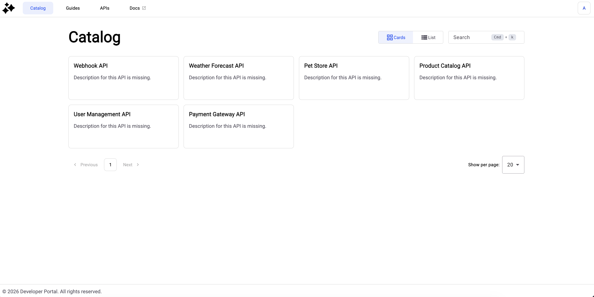
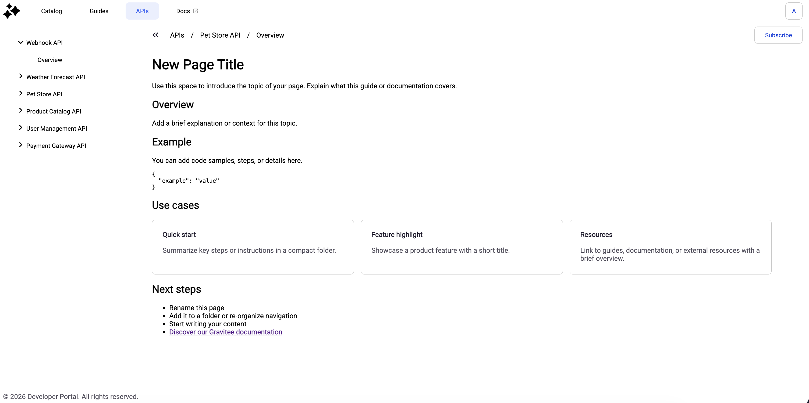
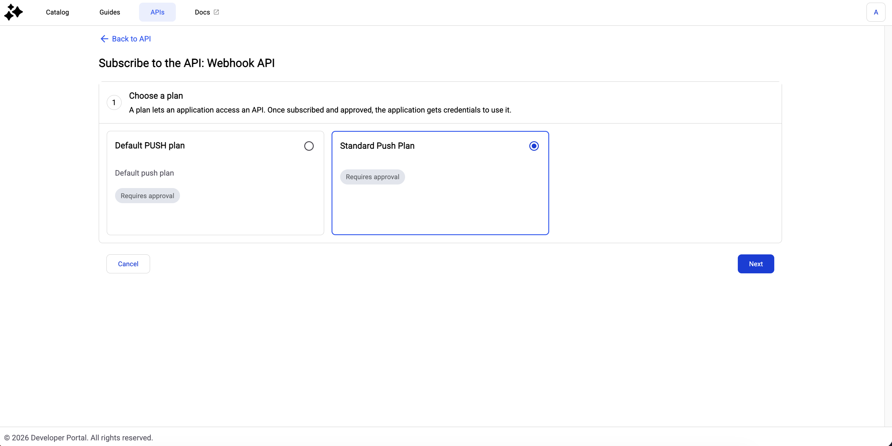
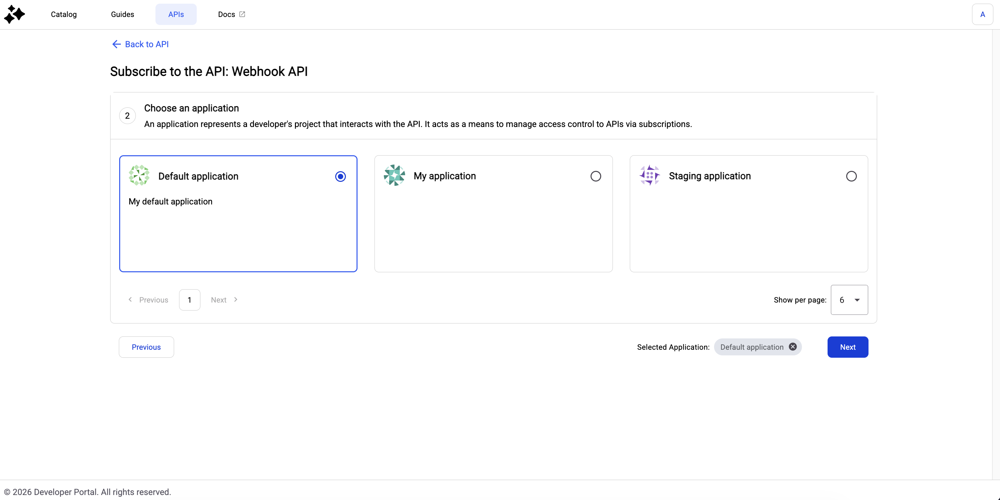
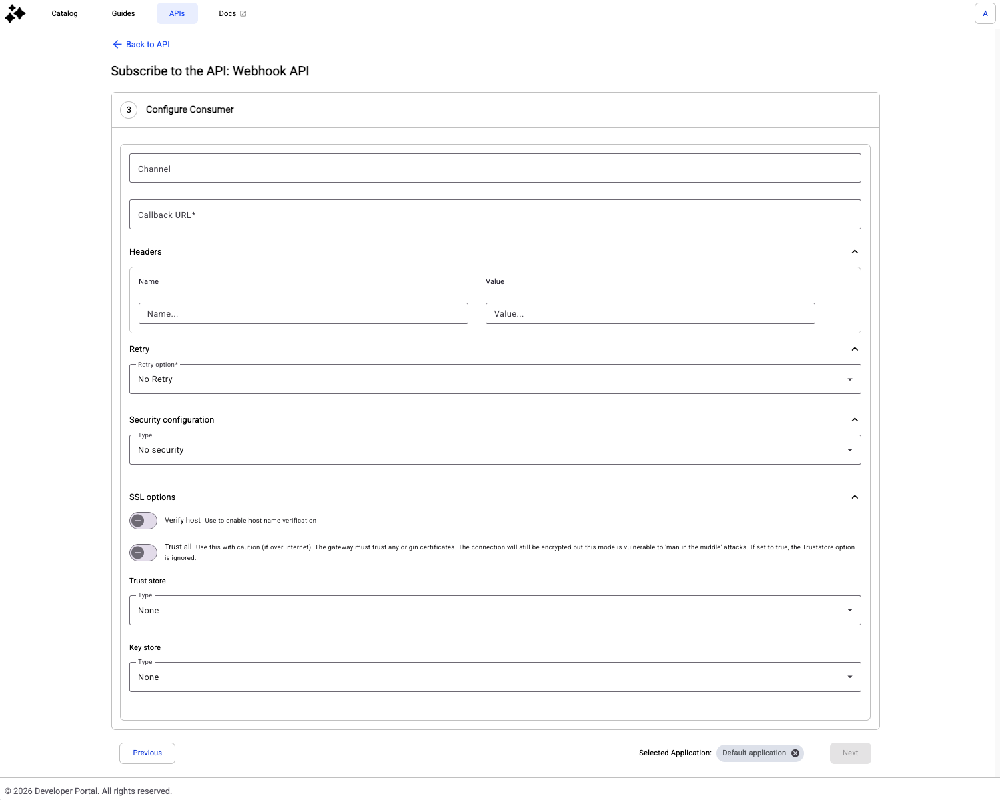
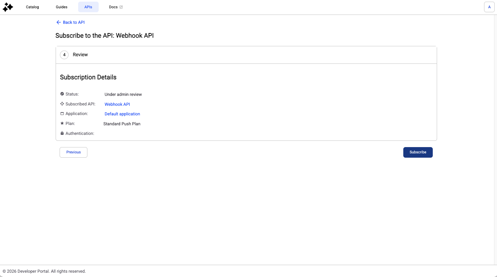
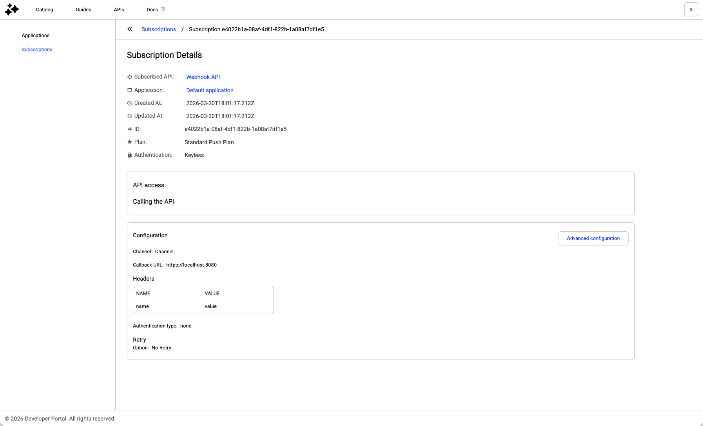

# Configure Webhook Subscriptions

## Prerequisites

* Enable the New Developer Portal. For more information about enabling the New Developer Portal, see [configure-the-new-portal.md](configure-the-new-portal.md "mention").

## Configure webhook subscriptions

1. From the Developer Portal's catalog, navigate to the webhook that you want to configure and click on its card.

<figure><figcaption></figcaption></figure>

2. Click **Subscribe**.

<figure><figcaption></figcaption></figure>

3. Click the plan that you want to subscribe to, and then click **Next**.

<figure><figcaption></figcaption></figure>

4. Select the application that you want to use to subscribe to the API, and then click **Next**.

<figure><figcaption></figcaption></figure>

5. In the **Configure Consumer** page, complete the following steps:
   1. (Optional) In the **Channel** field, select the channel that sends events to your callback URL.
   2. In the **Callback URL** field, enter the full URL of the publicly available HTTP(S) endpoint that receives the message payloads. For example, `https://api.myservice.com/webhooks/orders`.
   3. (Optional) In the **Headers** section, enter the custom HTTP headers to include in your calls.
   4. From the **Retry** drop-down menu, select when the API should retry sending the message when an error occurs with the target. For example, if the callback URL is unreachable.
   5. From the **Security configuration** drop-down menu, select the configuration to connect to the callback URL. The default is **No security**.
   6. (Optional) In the **SSL** section, enable **Verify host** and **Trust all**.

<figure><figcaption></figcaption></figure>


In previous versions, it was possible to add a comment to explain why you want to subscribe to the API

Starting from 4.11, you can use the **#Subscription metadata form** for a richer experience.


7. Click **Subscribe**.

<figure><figcaption></figcaption></figure>

## Verification

Once you subscribe to an API, the Developer Portal displays the description details. For example:

<figure><figcaption></figcaption></figure>
