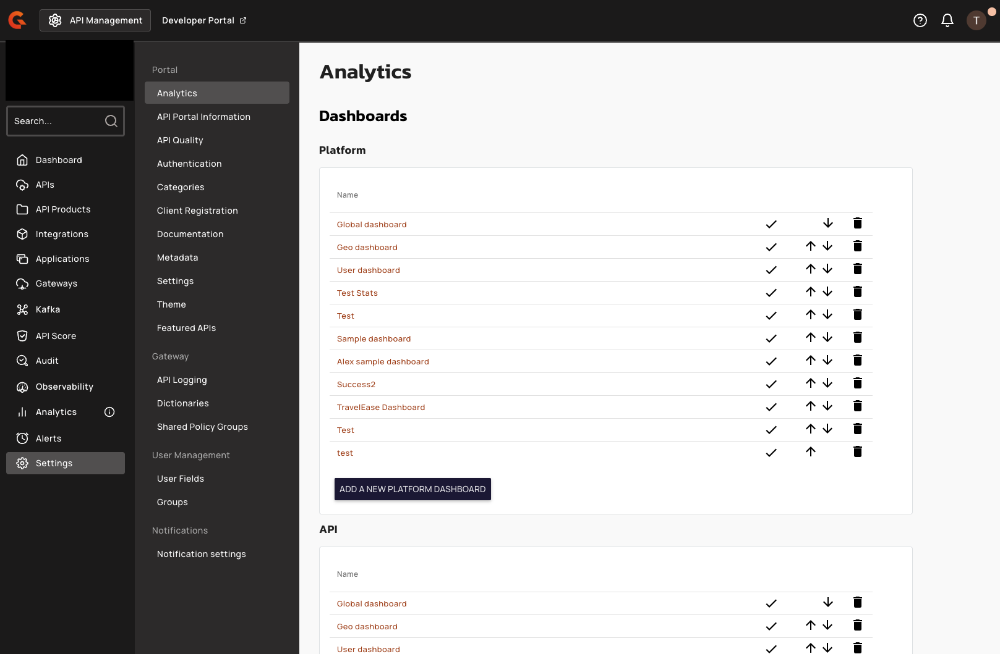
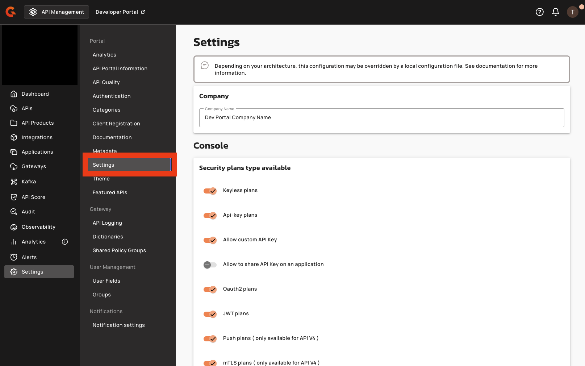
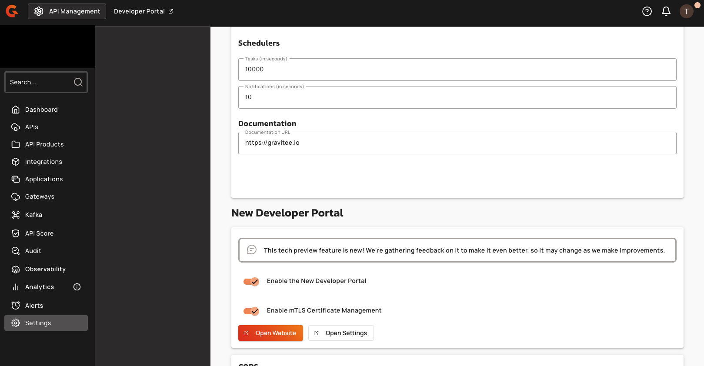
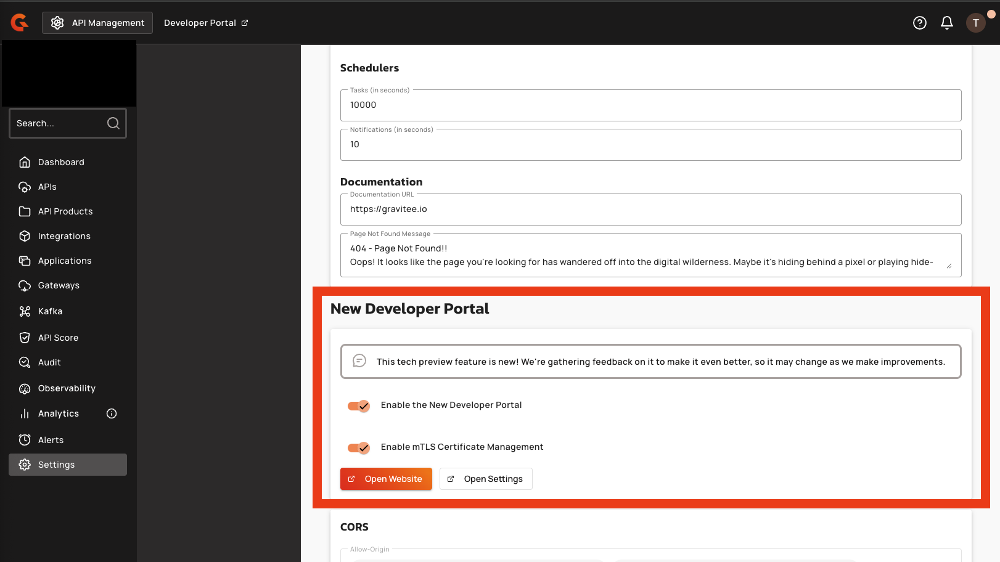

# Configure mTLS certificate management (administrator guide)

This guide shows administrators how to enable the self-service mTLS certificate management feature for application owners in the new Developer Portal.

## Prerequisites

- APIM 4.11 or later, running with an Enterprise Edition license. The **Enable mTLS Certificate Management** toggle is hidden from the Management Console when no Enterprise license is active.
- The new Developer Portal is enabled for the environment. This sets the `portal.next.access.enabled` parameter and is controlled by the **Enable the New Developer Portal** toggle in the **New Developer Portal** section of the portal settings page in the Management Console.
- You have permission to edit portal settings for the environment (`environment-settings-u`).

## Enable the feature

The feature is controlled by a single environment-scoped parameter, `portal.next.mtls.enabled`, which defaults to disabled. You toggle it from the Management Console.

1. In the Management Console, click **Settings** in the left sidebar.

    <figure><figcaption>
Settings entry in the Management Console left sidebar
</figcaption></figure>

2. In the inner sidebar, under the **Portal** group, click **Settings**.

    <figure><figcaption>
Settings item under the Portal group in the inner sidebar
</figcaption></figure>

3. Scroll to the **New Developer Portal** section.

    <figure><figcaption>
New Developer Portal section on the portal settings page
</figcaption></figure>

4. Turn on the **Enable mTLS Certificate Management** toggle.

    <figure><figcaption>
Enable mTLS Certificate Management toggle in the on position
</figcaption></figure>

5. Click **Save** to apply the change.

The toggle takes effect immediately for the current environment. Application owners with `APPLICATION_DEFINITION[UPDATE]` on an application now see a **Certificates** section inside the edit form on the application's **Settings & Security** tab in the new Developer Portal. Read-only users can't reach the section — the Certificates component is only rendered in the edit view.

## Disable the feature

Turn off the **Enable mTLS Certificate Management** toggle and click **Save**. Existing certificates aren't deleted — they remain in the database and continue to authenticate existing mTLS subscriptions — but application owners can no longer view or manage them from the new Developer Portal. Re-enable the toggle to restore access.

## Verification

To verify the toggle is working as expected, follow these steps:

1. Sign in to the new Developer Portal as a user with `APPLICATION_DEFINITION[UPDATE]` on an application.
2. Go to **Applications** and click the application.
3. On the **Settings & Security** tab, click **Edit**.
4. Scroll to the **Certificates** section at the bottom of the edit form. With the toggle enabled, the section is visible. With the toggle disabled, the section is hidden.
