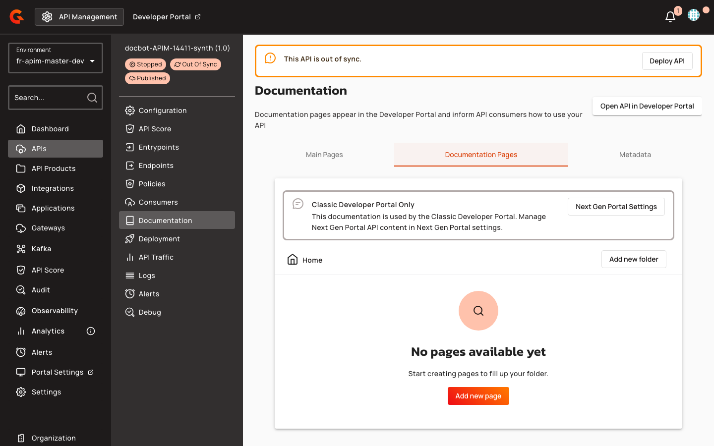

# Cascade Operations for Portal Navigation Folders

## Overview

Portal navigation folders and API sections support cascade operations for publishing and deletion. Administrators can publish or unpublish entire folder hierarchies in a single action and delete folders containing nested items without first removing their contents. Tree expansion state is preserved across all operations to maintain navigation context.

## Key Concepts

### Cascade Publishing

Publishing or unpublishing a folder or API section propagates the action to all nested items. When a folder is published, all documentation pages, sub-folders, and APIs within it are published automatically. Unpublishing a folder similarly unpublishes all descendants. Visibility changes from PUBLIC to PRIVATE cascade to nested items. Visibility changes from PRIVATE to PUBLIC do not propagate, preserving existing visibility settings.

### Cascade Deletion

Deleting a folder or API section removes the item and its entire subtree, including all nested folders, pages, and associated content. Page content records are cleaned up automatically. After deletion, sibling items at the same level are reordered to fill gaps in the sequence. Deleting a subtree under one root does not affect sibling subtrees.

### Tree Expansion State

The portal navigation tree preserves the user's collapsed and expanded folder state after publish, unpublish, delete, or move operations. The tree expands all folders only on initial page load. Expansion state is keyed by node ID to maintain consistency across data refreshes.

## Prerequisites

Before managing portal navigation folders and API sections, ensure the following:

* Portal navigation tree configured with folders, pages, or API sections
* Appropriate permissions to publish or delete navigation items

## Gateway Configuration

No gateway configuration is required for portal navigation folder management.

## Creating Portal Navigation Items

1. Navigate to **APIs** in the left sidebar.
2. Search for and select your API.
3. Click **Documentation** in the API menu.
4. Click the **Documentation Pages** tab.

    <figure><figcaption></figcaption></figure>

Portal navigation items are managed through the portal navigation tree interface. Folders and API sections can contain nested items, forming hierarchical structures. Items are ordered within their parent level and can be moved, published, or deleted as needed.

## Managing Folders and API Sections

### Publishing and Unpublishing

To publish or unpublish a folder or API section:

1. Select the item in the navigation tree.
2. Choose the publish or unpublish action.
3. Confirm the action in the dialog.

A confirmation dialog warns that the action will cascade to all nested documentation and APIs. Publishing a folder publishes all descendants. Unpublishing a folder unpublishes all descendants. Visibility changes from PUBLIC to PRIVATE cascade to nested items. Visibility changes from PRIVATE to PUBLIC do not propagate.

| Action | Propagation Behavior |
|:-------|:---------------------|
| **Publish folder (false → true)** | All nested documentation and APIs are published |
| **Unpublish folder (true → false)** | All nested documentation and APIs are unpublished |
| **Publish API (false → true)** | All nested documentation is published |
| **Unpublish API (true → false)** | All nested documentation is unpublished |
| **Visibility change (PUBLIC → PRIVATE)** | All nested items inherit PRIVATE visibility |
| **Visibility change (PRIVATE → PUBLIC)** | No propagation; nested items retain their current visibility |

### Deleting Folders and API Sections

To delete a folder or API section:

1. Select the item in the navigation tree.
2. Click the delete button.
3. Confirm the deletion in the dialog.

The delete button is enabled for all items, including those with children. A confirmation dialog warns that the item and all its nested items will be permanently deleted and cannot be undone. For leaf items without children, the dialog indicates that the item will no longer appear on the site. Deleting a folder or API section removes all nested folders, pages, and associated page content recursively. Sibling items at the same level are reordered after deletion.

**Confirmation dialog content for items with children**:

```yaml
Title: Delete "[folder/API name]" [folder/API]
Content: This [folder/API] and all its nested items will be permanently deleted. This cannot be undone.
```

**Confirmation dialog content for leaf items**:

```yaml
Title: Delete "[folder/API name]" [folder/API]
Content: This [folder/API] will no longer appear on your site.
```

### Legacy Item Handling

Items created before the root ID index was introduced may have a null root ID equivalent. When deleting such items, the system falls back to parent-child traversal instead of using the root ID index. This migration is transparent and requires no user action. Deleting legacy items with deep hierarchies may be slower than index-based deletion due to recursive parent-child queries.

