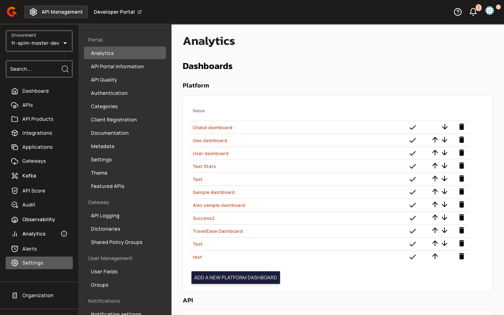

# Creating Templated Portal Navigation Pages

## Prerequisites

Before creating templated portal navigation pages, ensure the following:

* Portal navigation items are configured and linked to portal page content.
* For API-scoped templates: The navigation page must be nested under an API node in the navigation hierarchy.
* For environment-scoped templates: The navigation page must be at the root level or under a non-API node.

## Gateway Configuration

## Creating Portal Navigation Pages with Templates

1. Navigate to the portal navigation editor.
2. Create or edit a Gravitee Markdown page.
3. Embed FreeMarker expressions in the page content:
   * For pages under an API node, use `${api.property}` syntax to reference API properties.
   * For root-level pages, use `${metadata.key}` syntax to reference environment metadata.
4. Click **Save**.

    The system validates the template by dry-rendering it with the appropriate model. Validation behavior:

    * **Successful validation**: The page is saved and rendered dynamically when accessed through the portal.
    * **Validation failure**: The save operation fails and displays an error message identifying the problematic expression (e.g., "Invalid expression or value is missing for ${api.unknownProperty}").

<figure><figcaption></figcaption></figure>

