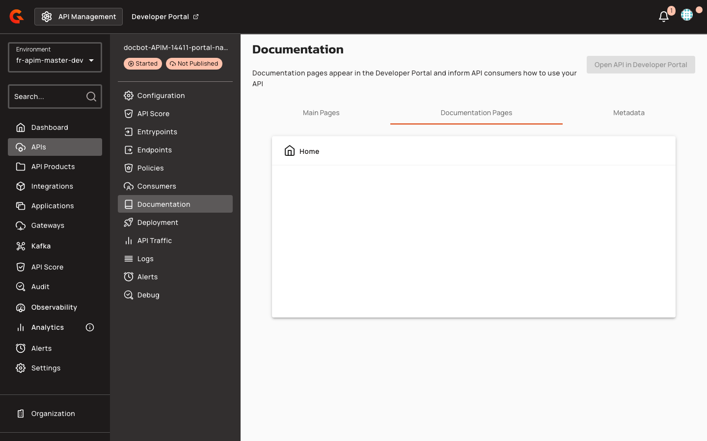
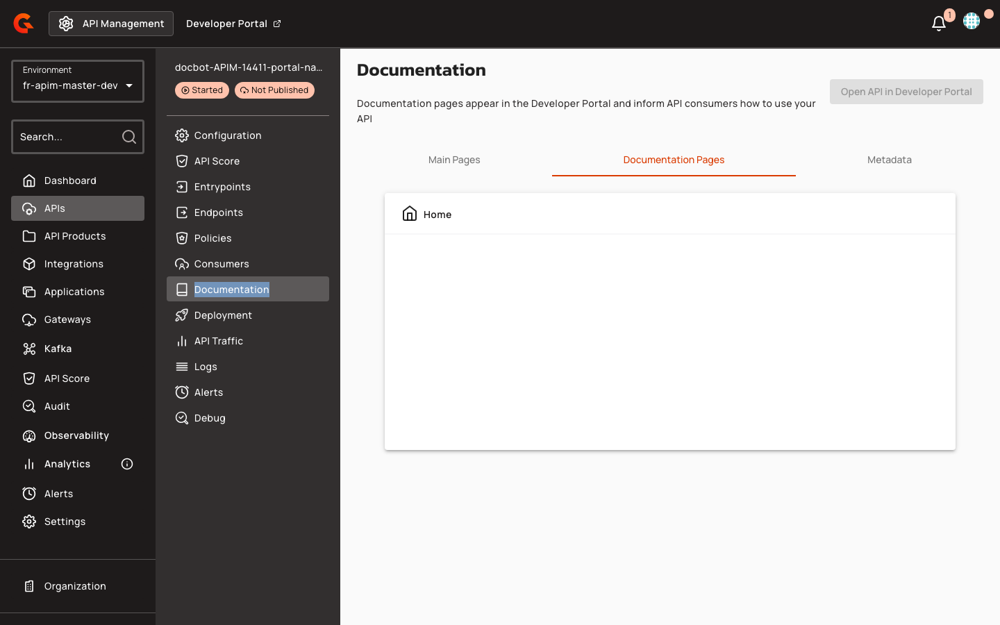

# Managing Portal Navigation Folders with Cascade Operations

## Overview

Portal navigation folders and API sections support cascade operations for publishing, unpublishing, and deletion. When you publish, unpublish, or delete a folder or API section, the action automatically applies to all nested items within it. The navigation tree preserves your expanded/collapsed folder state across these operations, maintaining your working context.

## Key Concepts

### Cascade Operations

Portal navigation supports three cascade operations that propagate changes through the folder hierarchy:

* **Cascade publish**: Publishing a folder or API section publishes all nested documentation pages, sub-folders, and APIs within it
* **Cascade unpublish**: Unpublishing a folder or API section unpublishes all nested items
* **Cascade delete**: Deleting a folder or API section permanently removes the container and all nested folders, pages, and their content

Each cascade operation displays a confirmation dialog warning you of the scope before applying changes. Publishing a page (leaf item) has no propagation effect.

### Tree Expansion State

The portal navigation tree preserves your collapsed/expanded folder state after publish, unpublish, delete, or move actions. The initial page load expands all folders by default, then preserves your expansion choices across subsequent operations.

### Visibility Propagation

Visibility changes propagate differently depending on the action:

| Action | Propagation Rule |
|:-------|:-----------------|
| Set folder/API to PRIVATE | Sets all nested documentation and APIs to PRIVATE |
| Set folder/API to PUBLIC | No propagation (children remain at their current visibility) |

## Prerequisites

Before managing portal navigation items, ensure you have:

* [Portal navigation tree configured with folders, pages, or API sections](#deleting-folders-and-api-sections)
* Appropriate permissions to publish, unpublish, or delete portal content

## Managing Portal Navigation Items

1. In the left navigation menu, click **APIs**.
2. Select your API from the list.
3. In the API menu, click **Documentation**.
4. Click the **Documentation Pages** tab.

    <figure><figcaption></figcaption></figure>

### Publishing and Unpublishing Folders

1. Right-click the folder or API section you want to publish or unpublish.
2. Select **Publish** or **Unpublish** from the context menu.

    <figure><figcaption></figcaption></figure>

3. Review the confirmation dialog:
   * **Unpublish confirmation**: "Unpublishing this folder will also unpublish all nested documentation and APIs. This action cannot be undone automatically. Do you want to proceed?"
   * **Publish confirmation**: "Publishing this folder will also publish all nested documentation and APIs. Do you want to proceed?"
4. Click **Confirm** to apply the operation to the selected folder and all descendants.

After confirmation, the operation applies to the selected folder and all descendants. The tree expansion state is preserved — folders you had expanded remain expanded after the operation completes.

### Deleting Folders and API Sections

1. Right-click the folder or API section you want to delete.
2. Select **Delete** from the context menu. The delete option is always enabled, regardless of whether the folder contains children.
3. Review the confirmation dialog:
   * **Non-empty container**: "This folder and all its nested items will be permanently deleted. This cannot be undone."
   * **Leaf item**: "This folder will no longer appear on your site."
4. Click **Confirm** to permanently remove the folder and all nested items (folders, pages, APIs).

After confirmation, the folder and all nested items are permanently removed. When a page is deleted (directly or via cascade), its associated content is also deleted. After deletion, siblings at the same level are automatically reordered to fill gaps in the order sequence. The tree expansion state is preserved after deletion.


**Breaking change**: Previously, folders and API sections with children could not be deleted — the delete button was disabled with the tooltip "Only empty folders can be deleted." Now deletion always succeeds and cascades to all descendants.


### Legacy Item Handling

Items created before the `rootId` index was introduced are deleted using parent-child traversal instead of the optimized rootId-based bulk query. No manual migration is required; the system handles both cases transparently. For very large hierarchies (>500 items), deletion may take longer for legacy items than for items with indexed `rootId` values.
