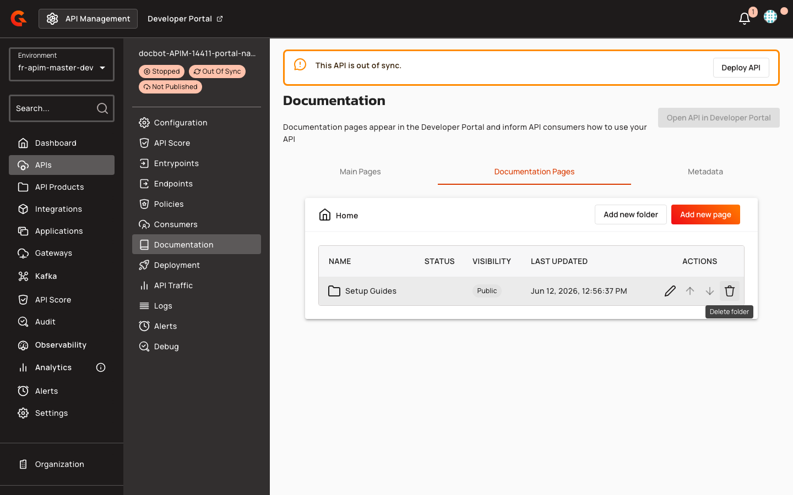
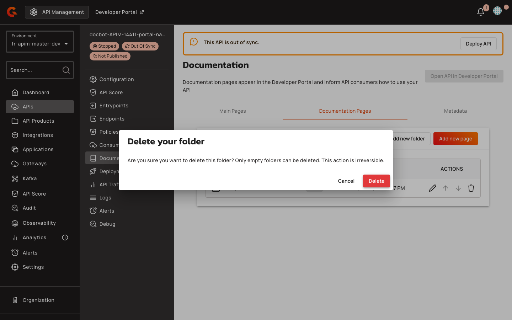

# Managing Portal Navigation Items

1. In the API Management console, select **APIs** from the left navigation menu.
2. Select your API from the list.
3. In the API submenu, click **Documentation**.
4. Click the **Documentation Pages** tab.

    <figure><figcaption></figcaption></figure>


This guide covers managing documentation pages within a specific API. To customize the overall portal navigation structure, see [Customize the Navigation](../customize-the-navigation.md#customize-the-navigation).


### Deleting Folders and API Sections


Deleting a folder recursively deletes the folder and its entire subtree, including all nested folders, pages, and their content. This action is irreversible.


1. Locate the folder or section you want to delete in the documentation pages list.
2. Click the trash icon in the **ACTIONS** column for that folder.

    <figure><figcaption></figcaption></figure>

3. In the **Delete your folder** confirmation dialog, review the warning about the cascade effect.
4. Click **Delete** to confirm the deletion, or click **Cancel** to abort.

    
    <figure><figcaption></figcaption></figure>

## Related Topics

* [Edit Documentation Pages](../../../create-and-configure-apis/configure-v4-apis/documentation.md#documentation)
* [Customize the Navigation](../customize-the-navigation.md#customize-the-navigation)
