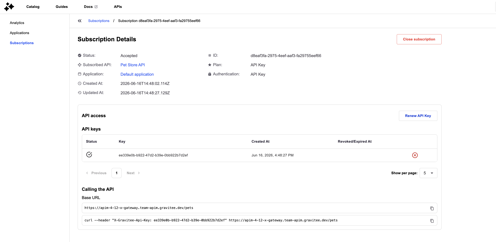
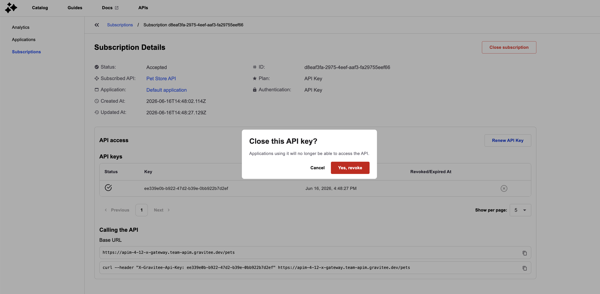
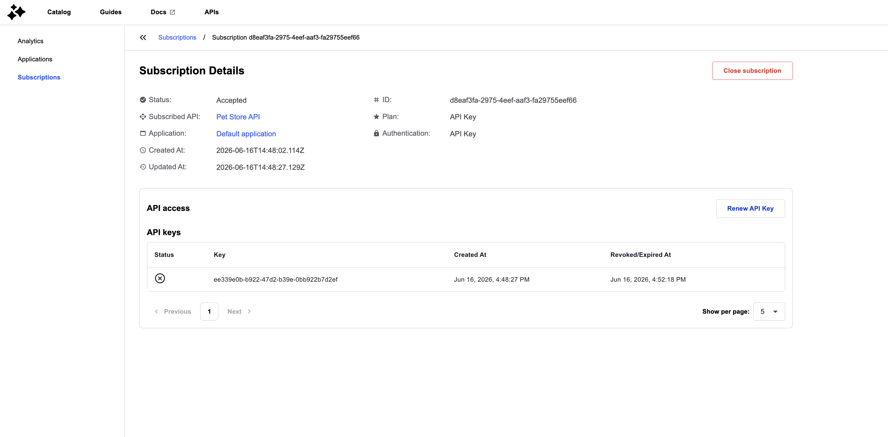
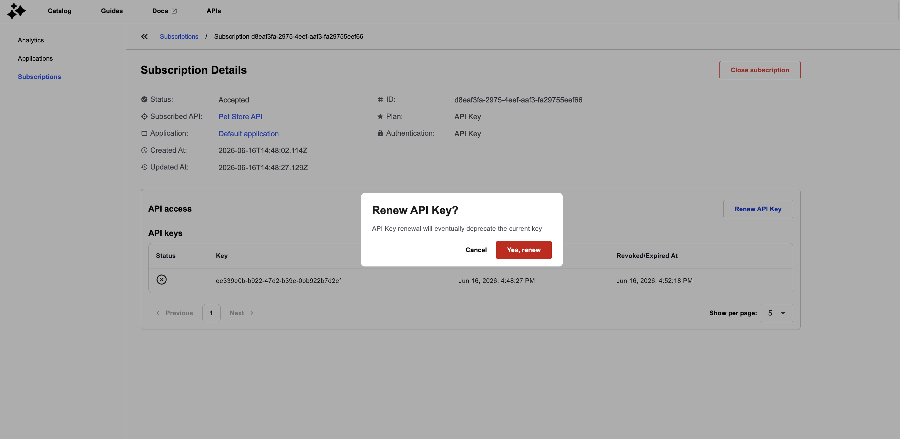
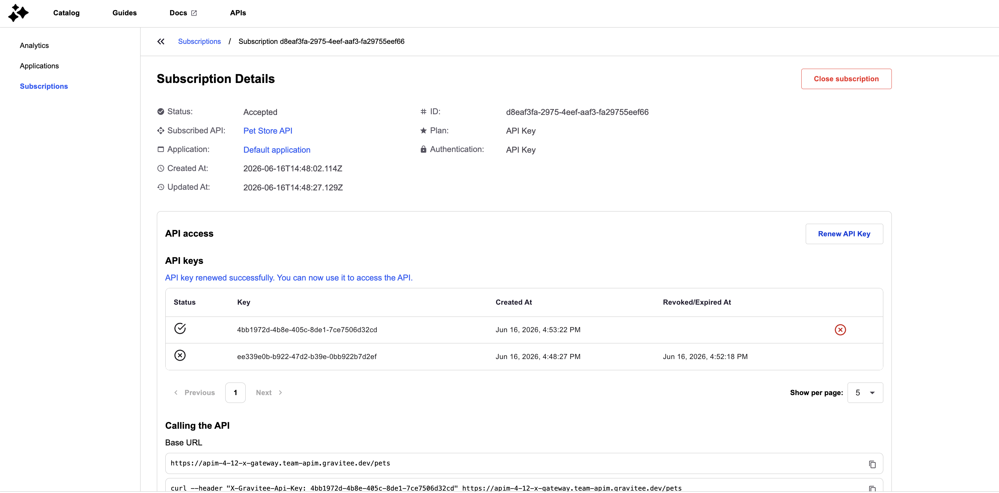

# Manage API Keys in the Developer Portal

## Overview

API platform administrators and application developers can view, revoke, and renew API keys directly from the subscription details page in the Developer Portal. All API keys associated with a subscription—active, revoked, and expired—are displayed in a paginated table with lifecycle timestamps. This capability is available for subscriptions to API-Key-secured plans when the user holds update permissions on either the API or the application.

## Key Concepts

### API Key Status

Each API key is classified as either active or inactive based on its revocation and expiration state. Active keys display a check-circle icon and the label "Active API key." Inactive keys—those that have been revoked or have passed their expiration date—display an X-circle icon and the label "Inactive API key." The status determines whether the key can be used for API access and whether revocation actions are available.

| Condition | Status | Icon | Label |
|:----------|:-------|:-----|:------|
| Revoked date is set | Inactive | `gio:x-circle` | Inactive API key |
| Expiration date is set and in the past | Inactive | `gio:x-circle` | Inactive API key |
| Expiration date is set and in the future | Active | `gio:check-circled-outline` | Active API key |
| No revocation or expiration date | Active | `gio:check-circled-outline` | Active API key |

### API Key Management Permissions

Revoke and renew operations require update permissions on the subscription. A user can manage API keys when they hold Subscription Update (`U`) permission on either the API or the application associated with the subscription. The portal evaluates both API-level and application-level permissions to determine access.

### API Access Visibility

The "Calling the API" section—which displays the base URL and a cURL command example—is shown when at least one active API key exists for API-Key-secured plans. When all keys are inactive (revoked or expired), this section is hidden. For non-API-Key plans (e.g., OAuth2, JWT) or subscriptions that are not in the accepted state, the section follows different visibility rules.

## Prerequisites

Before managing API keys, ensure the following conditions are met:

* The subscription must be in the **Accepted** state.
* You must hold **Subscription Update** (`U`) permission on either the API or the application.
* The plan security type must be **API Key**.

## Creating API Keys

API keys are generated automatically when a subscription to an API-Key-secured plan is accepted. The subscription details page displays all keys in a table under the "API keys" section. Each row shows the key's status icon, the key value, the creation timestamp, and—for inactive keys—the revocation or expiration timestamp. Active keys include a **Revoke** action button in the rightmost column.

When creating subscriptions with custom API keys, inactive keys (revoked or expired) from previous subscriptions can be reused if the reuse feature is enabled and the key belongs to the same application. For more information, see [Reusing Custom API Keys](../../secure-and-expose-apis/subscriptions/reuse-custom-api-keys.md).

The table supports pagination with a default page size of 5 and options for 10 or 25 rows per page.
 When no API keys are available, the table displays the message "No API keys available."

| Field | Description | Example |
|:------|:------------|:--------|
| **Status** | Icon indicating active or inactive state | `gio:check-circled-outline` (active), `gio:x-circle` (inactive) |
| **Key** | The API key value | `c983b9cf-f4d3-4737-83b5` |
| **Created At** | Timestamp when the key was generated | `Jun 12, 2026, 10:23:12 PM` |
| **Revoked/Expired At** | Timestamp when the key was revoked or expired | `Jun 12, 2026, 10:23:54 PM` |
| **Revoke** | Action button to revoke an active key | Button with `gio:x-circle` icon |

<figure><figcaption></figcaption></figure>

## Managing API Keys

### Revoking an API Key

1. Locate the active API key in the **API keys** table on the subscription details page.
2. Click the **X-circle** icon in the rightmost column of the key row you want to revoke.

    <figure><figcaption></figcaption></figure>

3. In the confirmation dialog titled "Revoke your API Key", review the warning message "Revoke your subscription's API Key".
4. Click **Revoke** to confirm, or **Cancel** to abort.

After confirmation, the key is revoked via `POST /subscriptions/{subscriptionId}/keys/{apiKey}/_revoke`. The table refreshes to reflect the updated status, and the key's **Revoked/Expired At** column displays the revocation timestamp in `MMM d, y, h:mm:ss a` format.

<figure><figcaption></figcaption></figure>

When all keys are inactive, the "Calling the API" section is hidden.

Revocation is blocked if the key is already inactive, if another revocation request is in flight, or if the user lacks update permissions.

### Renewing an API Key

1. Click the **Renew** button below the API keys table on the subscription details page.

    <figure><figcaption></figcaption></figure>

2. In the confirmation dialog titled "Renew API Key?", click **Yes, renew** to confirm, or **Cancel** to abort.

After confirmation, a new key is generated via `POST /subscriptions/{subscriptionId}/keys/_renew`. The table and the "Calling the API" cURL example refresh to reflect the new key.

<figure><figcaption></figcaption></figure>

Renewal is blocked if another renewal request is in flight or if the user lacks update permissions. The renewal operation uses server-side defaults and does not accept custom expiration parameters.

| Action | Description |
|:-------|:------------|
| **Renew API Key** | Generates a new API key and adds it to the subscription; the previous key remains active until revoked or expired |

### API Access Display

The "Calling the API" section displays the base URL and a cURL command that includes the most recent active API key in the HTTP header specified by `portal.apikeyHeader`. This section is hidden when no active API keys exist for API-Key-secured plans. For subscriptions to non-API-Key plans (e.g., OAuth2, JWT) or subscriptions not in the accepted state, the section follows different visibility rules.

When API-level permissions are unavailable (404 response), the API name is displayed as plain text rather than a clickable link. If API permissions fail with a non-404 HTTP error (e.g., 500), the subscription details page renders an error state.
