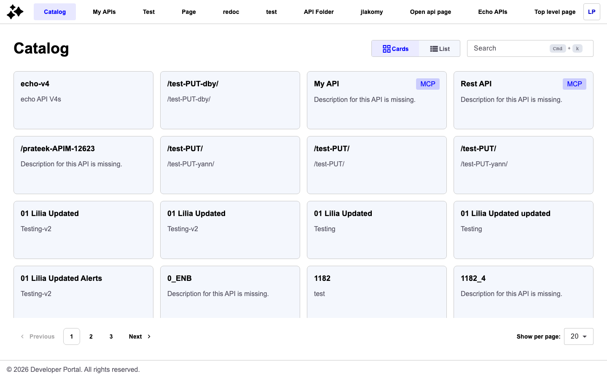
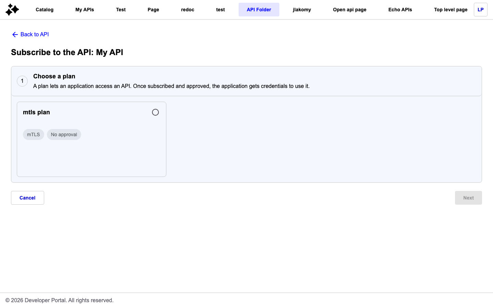
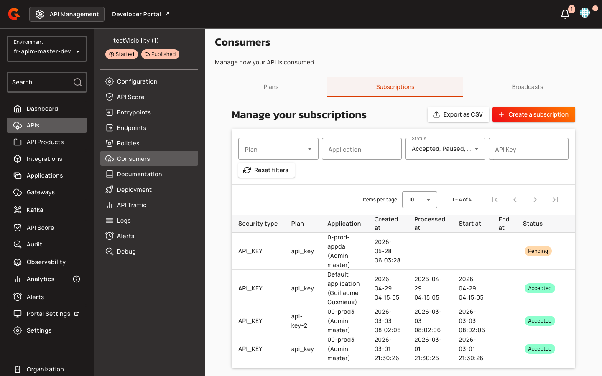

# Federated APIs

## Overview

Federated APIs join proxy and message APIs as one of the three main types of v4 Gravitee APIs. Federated APIs are created based on assets discovered by integrations with 3rd-party API gateway or event broker providers.


**Federated API feature limitations**

The data plane of a federated API is managed by the underlying 3rd-party provider. This means that Federated APIs don't include some of the features available on other API types, such as:

* Backend services, policies, proxy settings are unavailable
* Cannot be started, stopped, or deployed to the Gravitee API Gateway


## Create federated APIs

Gravitee Federated APIs cannot be created manually, they can only be discovered and ingested by the [Discovery](discovery.md) process.

After running Discovery, you'll end up with a number of new federated APIs in Gravitee.

If you open one, you'll be able to view that API's details, add additional documentation and metadata, and publish that API to your Gravitee Developer portal, just like you can for a native Gravitee Gateway API.


When Gravitee APIs are created from integrations, 3rd-party provider API attributes are mapped into Gravitee API attributes. Which attributes are available and how they are imported depends on the provider. See the [provider documentation](3rd-party-providers/) for more information.


## Configure federated APIs

Compared to traditional Gravitee v2 and v4 APIs, the configuration options available to federated APIs are limited. However, the APIM Console offers a subset of identical configuration pages and capabilities regardless of API type.

To access federated API configuration options:

1. Log in to your APIM Console
2. Select **APIs** from the left nav
3. Click on the federated API you're interested in
4. Select a configuration category from the inner left nav: **Configuration**, **Consumers**, or **Documentation**

Follow the links below to visit the documentation for each configuration page.

| Configuration category | Configuration page                                                                                                                                                                                                                                                                                     | Comments                                         |
| ---------------------- | ------------------------------------------------------------------------------------------------------------------------------------------------------------------------------------------------------------------------------------------------------------------------------------------------------ | ------------------------------------------------ |
| Configuration          | 
<a href="../../create-and-configure-apis/configure-v4-apis/general-settings.md">General</a> <a href="../../create-and-configure-apis/configure-v4-apis/user-permissions.md">User Permissions</a> <a href="../../create-and-configure-apis/configure-v4-apis/audit-logs.md">Audit Logs</a>
 |                                                  |
| Consumers              | 
<a href="../../secure-and-expose-apis/plans/">Plans</a> <a href="../../secure-and-expose-apis/subscriptions/">Subscriptions</a> <a href="../../create-and-configure-apis/configure-v4-apis/documentation.md#send-messages">Broadcasts</a>
                                                 | Plans cannot be manually added to federated APIs |
| Documentation          | 
<a href="../../create-and-configure-apis/configure-v4-apis/documentation.md">Pages</a> <a href="../../create-and-configure-apis/configure-v4-apis/documentation.md#add-metadata">Metadata</a>
                                                                                                |                                                  |

## Federated API plans, applications, and subscriptions

Plans for federated APIs are based on API products, usage plans, and similar concepts already defined and automatically imported from 3rd-party providers. A plan only exists to the extent that a matching concept exists in the 3rd-party provider.

When Gravitee API plans are ingested from a 3rd-party provider, they enable subscriptions to the 3rd-party APIs be managed directly from within Gravitee.
Under the hood, the federation agent integrates with the third party's management API to create the required objects that enable the requested subscription. This may result in an API key being returned to the user in Gravitee APIM or in the Gravitee Developer portal. In other cases, it creates the right permissions on the third party, while access control is done using a 3rd-party OAuth server for instance.

To manage your federated API's plans and their subscriptions, go to the **Consumers** tab for your federated API.

Under the **Plans** tab, you'll see all of the plans for your API that are either in staging, published, deprecated or closed. You will only be able to alter your federated API plans as it pertains to:

* Deprecation, publishing, closing your plans (deprecating or closing the plan will not alter the state of the usage plan in the third party provider, but will only stop the correlate Gravitee plan)
* Defining general plan information, such as name, description, characteristics, and general conditions
* **Subscription options**: either allowing auto-validation of all subscription requests, or, enforcing API consumers to submit a request for manual approval by the API Publisher
* Defining certain groups that can or cannot subscribe to your API via Gravitee groups


By default, the plan state is set to published and the subscription validation policy is set to manual (subscription auto-validation is not enabled).


Before publishing your federated API to the Developer Portal, make sure that your plan is published. Otherwise, there will be no way for API consumers to subscribe to your federated API.

## Federated API documentation

Federation enables a centralized location where API consumers can discover unified API documentation for diverse API gateways and event brokers. While an integration is syncing, available assets (e.g., OAS/AsyncAPI definitions or Markdown files) are automatically imported from the 3rd-party provider to form the basis of the API's documentation published to the Developer Portal. New documentation pages and assets can also be created directly within Gravitee.

To view or add documentation to an existing federated API:

1. Log in to your APIM Console
2. Select **APIs** from the left nav
3. Click on the federated API you're interested in
4. Select **Documentation** from the inner left nav

    <figure><figcaption></figcaption></figure>


By default, the page is published with private visibility.


Refer to the Developer Portal documentation for information on how to create and manage API documentation.

## Publish federated APIs to the Developer Portal

APIs federated from multiple vendors can be published in a single Gravitee Developer Portal. This acts as a centralized location from which API consumers can access documentation and subscriptions. By default, federated APIs imported from an integration are not published to the portal.

To publish an existing federated API:

1. Log in to your APIM Console
2. Select **APIs** from the left nav
3. Click on the API you want to publish
4. Select **Configuration** from the inner left nav
5. In the **Danger Zone**, click **Publish the API**

    <figure><figcaption></figcaption></figure>

### View your API in the Developer Portal


Before the API appears in the Developer Portal catalog, you must publish at least one documentation page. Go to your API's **Documentation** page, select the page from the navigation settings, and publish it.


To view the API that you published, select **Developer Portal.** This opens your Gravitee Developer Portal in a new window. From here, you can view your API, its documentation, and its subscription plan options.

<figure><figcaption></figcaption></figure>

## (For API consumers) Discover and subscribe to federated APIs in the Gravitee Developer Portal

API consumers can access their Gravitee Developer Portal and search for the federated APIs that API Publishers have published. Access the URL of the Developer Portal and either search for the specific API or browse the larger catalog of APIs published from the Gravitee API Gateway. From here, consumers can:

* View API documentation
* Interface directly with the API Publisher
* Self-service subscribe
* View tickets
* And more

### Subscribe to APIs

1.  When you've found the API that you want to subscribe to, click the **SUBSCRIBE** button

    <figure><figcaption></figcaption></figure>
2.  Select the plan you want to subscribe to, then click **Next**

    <figure><figcaption></figcaption></figure>

    <figure><figcaption></figcaption></figure>

3.  Use the **Choose an application** drop-down menu to select an application to use for the subscription, then click **Next.** If you do not yet have an application, please refer to the [Applications](../../developer-portal/classic-developer-portal/create-an-application.md) documentation to create a Gravitee Application.

    <figure><figcaption></figcaption></figure>

Depending on the subscription configuration, the application will either auto-validate or require approval.

<figure><figcaption></figcaption></figure>


* For more information on how to create and manage applications in APIM, see [Applications](../../developer-portal/classic-developer-portal/create-an-application.md).
* For more information on how to create and manage subscriptions in APIM, see [Subscriptions](../../secure-and-expose-apis/subscriptions/).


### View API access information

After subscription approval, the Developer Portal displays API access information based on the plan's security type and the API's definition version. Because federated APIs are hosted and served by the third-party provider — not proxied through the Gravitee gateway — there are no Gravitee-managed endpoints to display. The portal adapts the API access card accordingly.

The API access card visibility follows specific rules based on API type, plan security, and subscription status:

| Condition | API Access Card Behavior |
|:----------|:------------------------|
| Federated API with `KEY_LESS` plan | Entire card hidden (no Gravitee-managed endpoints or credentials to display) |
| Federated API with `API_KEY` plan | Card shown with provider-provisioned API keys only; base URL and curl sections hidden |
| Federated API with `OAUTH2`, `JWT`, or `API_KEY` plan where provider supplies endpoints | Full card shown with connection details |
| Native API (`V1`, `V2`, or `V4`) | Full card always shown |
| Subscription status ≠ `ACCEPTED` AND plan security ≠ `KEY_LESS` | Card shown with subscription status message |

For federated APIs with API key security, the API keys section displays provider-provisioned keys. Consult the third-party provider's documentation for endpoint URLs and usage instructions.

Native APIs always display the full API access card, as they are proxied through the Gravitee gateway and have Gravitee-managed endpoints.

## Delete federated APIs

Deleting a federated API will close or delete all objects inside of it such as plans, documentation pages, and subscriptions.


**Deletion only applies to Gravitee APIs**

When you delete a federated API in Gravitee, you are not deleting the original API asset on the side of the third party provider. You will only delete the federated API within Gravitee.


To delete a federated API:

1. Access the Federated API that you want to delete either from the **APIs** menu or the **Integrations** tab.
2. Select **Configuration** from the inner left nav
3. Select the **General** header tab
4.  In the **Danger Zone** section, click **Delete**

    <figure><figcaption></figcaption></figure>

To delete all of an integration's federated APIs as a group:

1. Log in to your APIM Console
2. Select **Integrations** from the left nav
3. Click on the integration you're interested in
4. Select **Configuration** from the inner left nav
5.  In the **Danger Zone** section, click **Delete APIs**

    <figure><figcaption></figcaption></figure>


Federated APIs cannot be deleted if they are published. The **Delete APIs** action will delete unpublished APIs but ignore published APIs.

