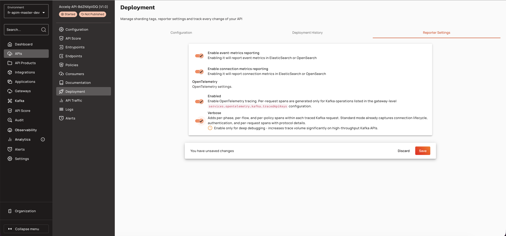

# Configure Global Span Attribute Redaction Rules

## Prerequisites

Before configuring global span attribute redaction rules, ensure the following:

* OpenTelemetry tracing is enabled for the API (v4 HTTP/Proxy or v4 TCP APIs)
* Verbose tracing is enabled to capture span attributes
* Gateway is configured with an OpenTelemetry exporter endpoint

<figure><figcaption></figcaption></figure>

## Gateway Configuration

### Global Redaction Rules

Configure platform-wide redaction rules in `gravitee.yml` under `services.opentelemetry.redaction`. Global rules are automatically merged with API-specific rules at tracer creation time.

| Property | Description | Example |
|:---------|:------------|:--------|
| `services.opentelemetry.redactionDefaultReplacement` | Fallback replacement text for FULL masking rules with no per-rule replacement | `[REDACTED]` |
| `services.opentelemetry.redactionRules[N].attributeNamePattern` | Glob pattern, short name (no dots), or `regex:`-prefixed Java regex matching the span attribute key | `http.request.header.authorization` |
| `services.opentelemetry.redactionRules[N].maskingStrategy.type` | `FULL` or `PARTIAL` | `FULL` |
| `services.opentelemetry.redactionRules[N].maskingStrategy.replacement` | For FULL: replacement text. For PARTIAL: single mask character | `[REDACTED]` (FULL), `*` (PARTIAL) |
| `services.opentelemetry.redactionRules[N].maskingStrategy.prefixLength` | PARTIAL only: number of leading characters to keep visible | `0` |
| `services.opentelemetry.redactionRules[N].maskingStrategy.suffixLength` | PARTIAL only: number of trailing characters to keep visible | `0` |
| `services.opentelemetry.redactionRules[N].valuePattern` | Java regex (partial match); rule only fires when the attribute value matches | `^Bearer ` |

**Example YAML:**

```yaml
services:
  opentelemetry:
    redactionDefaultReplacement: "[HIDDEN]"
    redactionRules:
      - attributeNamePattern: "enduser.id"
        maskingStrategy:
          type: FULL
          replacement: "[REDACTED]"
      - attributeNamePattern: "payment.card"
        maskingStrategy:
          type: PARTIAL
          prefixLength: 0
          suffixLength: 4
          replacement: "*"
        valuePattern: "5[1-5][0-9]{14}"
```

### Docker / Docker Compose

Mount `gravitee.yml` as a read-only volume and set environment variables to override redaction configuration.

```yaml
services:
  gateway:
    image: graviteeio/apim-gateway:4.12.0
    volumes:
      - ./gravitee.yml:/opt/graviteeio-gateway/config/gravitee.yml:ro
    environment:
      gravitee_services_tracing_enabled: true
      gravitee_services_tracing_type: opentelemetry
      gravitee_services_tracing_otel_endpoint: http://otel-collector:4317
      gravitee_services_tracing_otel_redaction_defaultReplacement: "[REDACTED]"
      gravitee_services_tracing_otel_redaction_rules_0_attributeNamePattern: "http.request.header.authorization"
      gravitee_services_tracing_otel_redaction_rules_0_maskingStrategy_type: "FULL"
```

### Helm

Configure redaction rules in `values.yaml` under `gateway.services.tracing.otel.redaction`.

```yaml
gateway:
  services:
    tracing:
      enabled: true
      type: opentelemetry
      otel:
        endpoint: http://otel-collector:4317
        redaction:
          defaultReplacement: "[REDACTED]"
          rules:
            - attributeNamePattern: "http.request.header.authorization"
              maskingStrategy:
                type: FULL
            - attributeNamePattern: "gravitee.consumer.**"
              maskingStrategy:
                type: PARTIAL
                prefixLength: 2
                suffixLength: 2
                replacement: "*"
```
