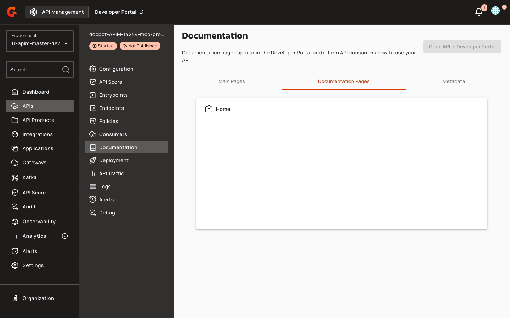

# Creating MCP Proxy Overview Pages

1. In the API Management Console, select your MCP Proxy API from the APIs list.
2. In the left navigation menu, click **Documentation**.
3. Click the **Documentation Pages** tab.

    <figure><figcaption></figcaption></figure>

4. To create default portal pages for the API, send a `POST` request to `/portal-navigation-items/_default-pages` for the API's navigation item.

When you create default portal pages for an API navigation item, the system automatically seeds an unpublished "Overview" child page. For MCP Proxy APIs (`ApiType.MCP_PROXY`), the Overview page is generated from the `api-overview-mcp-proxy-page-content.md` template. For all other API types, the system uses the generic `api-overview-page-content.md` template. Seeding is skipped if the API navigation item already has a child page.

**MCP Proxy Overview Template Structure:**

```markdown

<figure><figcaption></figcaption></figure>

# ${api.name}

Welcome to the documentation for **${api.name}**.

<#if api.description?? && api.description?has_content>
${api.description}

</#if>
## Install this MCP server

<gmd-install-mcp name="${api.name}" transport="http" url="<#if api.entrypoints?? && (api.entrypoints?size > 0)>${api.entrypoints[0]}</#if><#if api.mcp?? && api.mcp.mcpPath??>${api.mcp.mcpPath}</#if>" />
```


