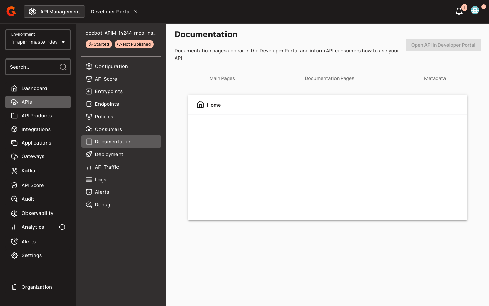

# Embedding the MCP Installation Widget in Portal Pages

## Prerequisites

Before embedding the MCP installation widget in portal pages, ensure the following requirements are met:

* Published API with at least one configured entrypoint
* For MCP Proxy APIs: V4 entrypoint with type `mcp` or `mcp-proxy`
* Portal page editing permissions to add or modify Gravitee Markdown content

## Creating MCP Installation Pages

1. In the API Management console, select your API from the **APIs** menu.
2. Navigate to **Documentation** in the left sidebar.
3. Click the **Documentation Pages** tab.

    <figure><figcaption></figcaption></figure>

4. Create a new documentation page or edit an existing page where you want to embed the MCP installation widget.
5. In the page editor, insert the `<gmd-install-mcp>` component using HTML syntax with the appropriate attributes for your MCP server configuration.

Portal page authors embed the `<gmd-install-mcp>` component in Gravitee Markdown content using HTML syntax. The component renders installer tabs and configuration snippets based on the provided attributes.

**Remote HTTP MCP server example:**

```html
<gmd-install-mcp
  name="my-mcp-server"
  transport="http"
  url="https://api.example.com/mcp"
  headers='{"Authorization": "Bearer token123"}'
  clients="cursor,vscode">
</gmd-install-mcp>
```

**Local stdio MCP server example:**

```html
<gmd-install-mcp
  name="local-mcp-server"
  transport="stdio"
  command="/usr/local/bin/mcp-server"
  args='["--port", "8080"]'
  env='{"API_KEY": "secret"}'
  clients="cursor,claude-desktop">
</gmd-install-mcp>
```

### Component Attributes

| Attribute | Description | Example |
|:----------|:------------|:--------|
| `name` | MCP server name in generated client configurations | `my-mcp-server` |
| `transport` | Protocol: `http`, `sse`, or `stdio` | `http` |
| `url` | Remote endpoint URL (required for `http` and `sse`) | `https://api.example.com/mcp` |
| `headers` | JSON object or string of HTTP headers for remote transports | `{"Authorization": "Bearer token"}` |
| `command` | Executable path for `stdio` transport | `/usr/local/bin/mcp-server` |
| `args` | JSON array or comma-separated string of command-line arguments for `stdio` | `["--port", "8080"]` or `--port,8080` |
| `env` | JSON object or string of environment variables for `stdio` | `{"API_KEY": "secret"}` |
| `clients` | Comma-separated installer IDs to display as tabs | `cursor,vscode,claude-desktop` |

When required inputs are missing (`name` and either `url` or `command`), the component displays the placeholder message: "Provide a server name and URL, or use stdio inputs for a local MCP server." If the `clients` attribute filters out all available installers, the message reads: "No supported installers are available for the selected clients."

The HTML sanitizer preserves `<gmd-install-mcp>` elements and all attributes listed above when portal pages are saved. Other HTML elements and attributes are removed according to standard sanitization rules.

### Theming

Portal administrators can customize the widget appearance using the `@gmd.install-mcp-overrides()` mixin for token customization.
