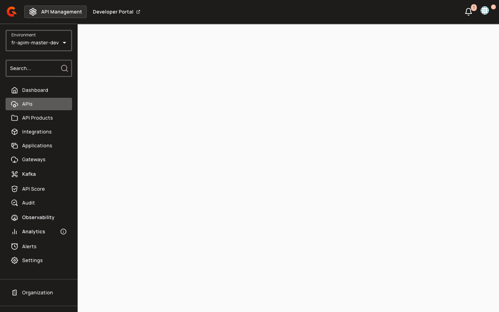
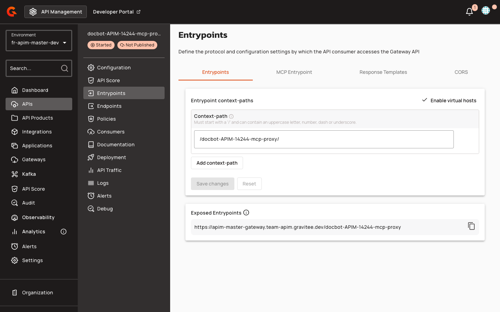

# MCP Proxy API Documentation Overview

## Overview

MCP Proxy APIs enable AI agents to securely access external tools and data sources through the Model Context Protocol (MCP). The portal automatically generates installation instructions for popular AI clients (Cursor, VS Code, Claude Desktop) and provides template variables for custom documentation pages. When you publish an MCP Proxy API, the portal seeds a default Overview page with one-click installer actions and copyable configuration snippets.

<figure><figcaption></figcaption></figure>

## Prerequisites

Before configuring MCP Proxy API documentation, complete the following steps:

1. Navigate to **APIs** in the left sidebar of the API Management console.
2. Select your MCP Proxy API from the list.
3. Click **Entrypoints** in the API navigation menu.
4. Verify that at least one entrypoint is configured with type `mcp` or `mcp-proxy`.
5. Note the exposed entrypoint URL displayed in the **Exposed Entrypoints** section.

    <figure><figcaption></figcaption></figure>

## Key Concepts

### MCP Install Component

The `<gmd-install-mcp>` component renders client-specific installation actions in portal documentation pages. It generates deep links for supported clients (Cursor, VS Code) and JSON configuration snippets for manual installation (Claude Desktop). The component adapts to both remote HTTP/SSE transports and local stdio-based MCP servers. Portal-stored Gravitee Markdown content containing the `<gmd-install-mcp>` tag and its allowlisted attributes is preserved by the HTML sanitizer.

### API Template Variables

Portal page templates expose two FreeMarker variables for MCP Proxy APIs:

* `api.entrypoints`: List of gateway entrypoint URLs
* `api.mcp`: Map containing MCP-specific configuration (e.g., `mcpPath`)

These variables are populated from V4 API entrypoint configuration with type `mcp` or `mcp-proxy`. The variables enable dynamic construction of installation URLs and configuration snippets in custom documentation.

### Default Overview Page Seeding

When you create default portal pages (`POST /portal-navigation-items/_default-pages`), the system seeds an unpublished Overview page for each API navigation item that does not already have a child page. The seeding flow retrieves the API, checks the API type, and applies the MCP-specific template (`api-overview-mcp-proxy-page-content.md`) for `MCP_PROXY` APIs or the generic template (`api-overview-page-content.md`) for other types (`PROXY`, `MESSAGE`, `NATIVE`, `A2A_PROXY`, `LLM_PROXY`). The MCP template embeds the install component with values derived from the API's first entrypoint and `mcpPath` configuration.
