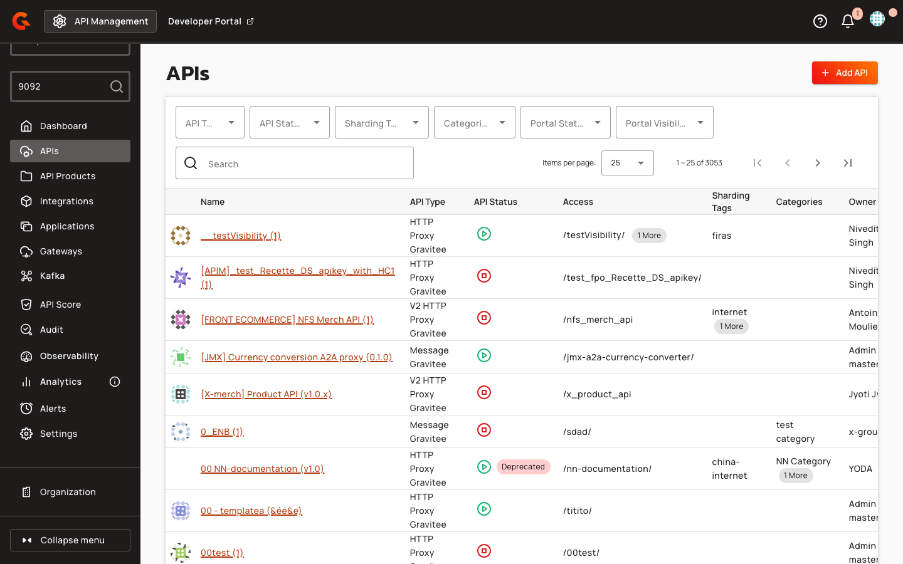
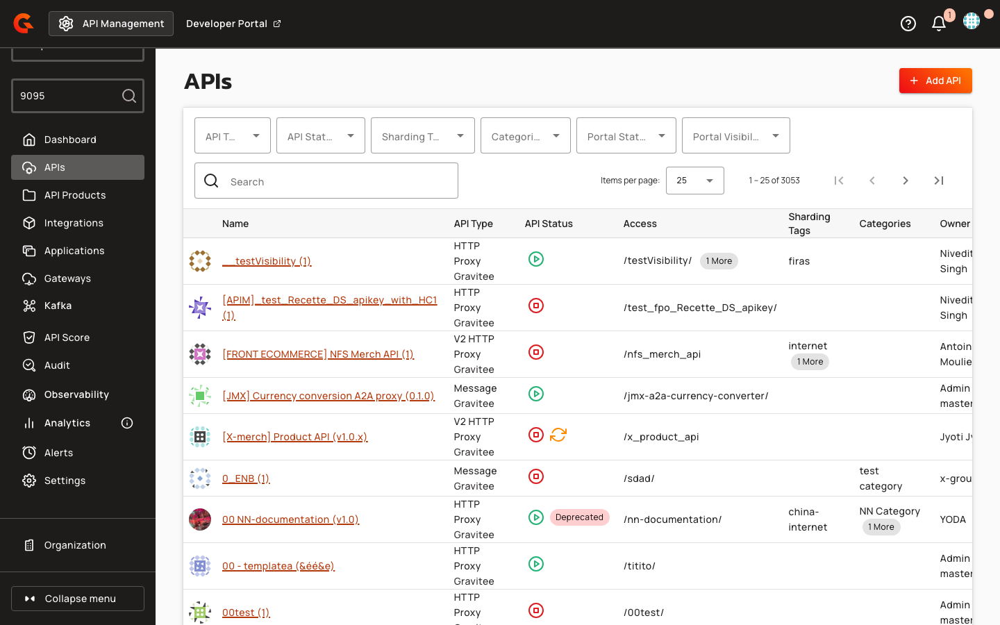

# Kafka Port-Based Routing for Native APIs

## Overview

Kafka port-based routing enables administrators to assign dedicated TCP ports to individual native Kafka API plans, allowing clients to connect to specific plans using distinct bootstrap server addresses. This routing mode complements the default SNI-based (host) routing and is configured at the gateway level. Port-based routing is available only for native Kafka APIs and requires environment-level enablement in the console.

## Key Concepts

### Routing Modes

The gateway supports two mutually exclusive routing strategies for Kafka APIs. Host routing (the default) uses TLS Server Name Indication (SNI) to match client connections to plans, allowing all plans to share a single bootstrap port. Port routing assigns each plan a unique bootstrap port and a range of broker ports, enabling clients to connect without TLS or SNI. The routing mode is set globally via the `kafka.routingMode` configuration property and applies to all APIs on the gateway.

| Mode | Matching Strategy | Client Requirement | Use Case |
|:-----|:------------------|:-------------------|:---------|
| `host` | TLS SNI | TLS-enabled clients with SNI support | Multi-tenant deployments on a single port |
| `port` | Local TCP port | Port-specific bootstrap server address | Non-TLS clients or port-based network policies |

### Port Allocation

Each plan configured for port routing requires three port values: a bootstrap port (the entry point clients connect to), a broker range start, and a broker range end. The broker range defines a contiguous block of ports that the gateway maps to backend Kafka broker nodes. Backend brokers are sorted by node ID and assigned sequential slots starting from the broker range start. For example, a plan with `bootstrapPort=9092`, `brokerRangeStart=9093`, and `brokerRangeEnd=9095` allocates three broker slots (9093, 9094, 9095) for backend nodes 0, 1, and 2.

### Conflict Detection

The console enforces port uniqueness across all plans in an environment. Four conflict conditions are checked when saving a plan: overlapping broker ranges, a new bootstrap port falling within an existing broker range, an existing bootstrap port falling within a new broker range, and duplicate bootstrap ports. Conflicts are detected via the `kafka_port_ranges` repository, which indexes port allocations by environment. Plans in different environments may reuse the same ports.

## Prerequisites

Before configuring Kafka port-based routing, ensure the following requirements are met:

* Gateway version 4.12.0 or later
* Native Kafka API (port routing is not available for proxy or message APIs)
* Environment-level port routing toggle enabled in console settings
* Available TCP ports in the range 1024–65535 on the gateway host

## Gateway Configuration

### Routing Mode

| Property | Description | Example |
|:---------|:------------|:--------|
| `kafka.routingMode` | Routing strategy for Kafka gateway. Valid values: `host` (SNI-based), `port` (port-based). Defaults to `host` when unset or unrecognized. | `port` |

### Console Port Routing Toggle

| Property | Description | Example |
|:---------|:------------|:--------|
| `console.kafka.portRouting.enabled` | Environment-level toggle for Kafka port routing UI. When `false`, port routing fields are hidden in the console even for native APIs. | `true` |

### Metrics Labels

| Property | Description | Example |
|:---------|:------------|:--------|
| `services.metrics.labels` | Vert.x metrics labels to enable globally. | `["local", "remote", "http_method", "http_code"]` |

## Creating a Port-Routed Plan

Navigate to the plan configuration form for a native Kafka API. When the environment has port routing enabled, the **Kafka port routing** section appears in the General step. Configure the following fields in order:

1.  Enter a value in the **Bootstrap port** field (1024–65535). This is the port clients will use in their bootstrap server address.

    <figure><figcaption></figcaption></figure>

2.  Enter a value in the **Broker range start** field (1024–65535). This is the first port in the broker slot range.

    <figure><figcaption></figcaption></figure>

3.  Enter a value in the **Broker range end** field (1024–65535). This is the last port in the broker slot range.

    <figure><figcaption></figcaption></figure>

The console validates that the bootstrap port does not fall within the broker range, that the range start is less than or equal to the range end, and that no conflicts exist with other plans in the environment. If you set a bootstrap port and leave the broker range fields empty, the console auto-fills `brokerRangeStart = bootstrapPort + 1` and `brokerRangeEnd = bootstrapPort + 3` (allocating three broker slots by default). Save the plan and deploy the API to open the configured TCP listeners on the gateway.

| Field | Description |
|:------|:------------|
| **Bootstrap port** | The entry point port for client connections. Min: 1024, Max: 65535. Must not fall within broker range. |
| **Broker range start** | The first port in the broker slot range. Min: 1024, Max: 65535. Must be ≤ broker range end. |
| **Broker range end** | The last port in the broker slot range. Min: 1024, Max: 65535. Must be ≥ broker range start. |

## Updating Port Allocations

To modify port allocations on an existing plan, navigate to the plan's General step and edit the **Bootstrap port**, **Broker range start**, or **Broker range end** fields. When you change the broker range on a deployed API, the console displays a warning banner: "Changing the broker port range will cause a brief reconnection for active consumers. Clients will automatically reconnect on their next metadata refresh — no configuration change required on the client side." Save the plan and redeploy the API to apply the new port assignments. Active client connections will drop and reconnect automatically during the next metadata refresh cycle.
