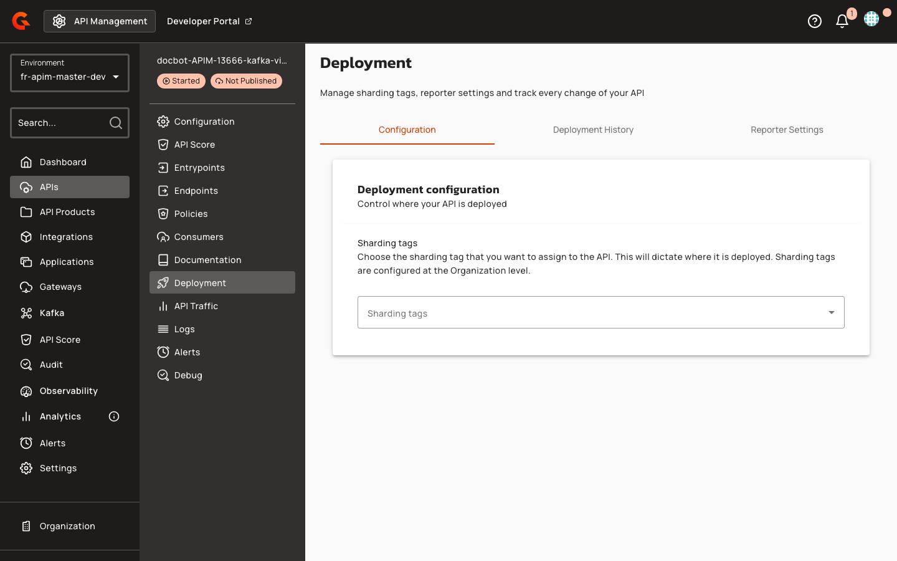

---
description: >-
  Configure SASL delegate-to-broker authentication for Kafka virtual clusters, including credential capture, replay flow, bootstrap authentication, metadata merging, and routing modes.
---

# SASL Delegate-to-Broker Authentication in Kafka Virtual Clusters

## SASL Delegate-to-Broker Authentication

When a backend cluster is configured with the **SASL Mechanism** set to **Delegate To Broker**, the gateway captures the client's SASL credentials during the initial handshake and replays them when opening connections to backend clusters. This mode allows the gateway to authenticate on behalf of the client without storing backend credentials, enabling per-user authorization at the backend level.

In MESH, delegate replay opens a fresh per-RPC backend connection and does not use the shared connection pool.

### Credential Capture Flow

1. Client sends `SASL_HANDSHAKE` with mechanism (e.g., `PLAIN`).
2. Gateway stores the negotiated mechanism.
3. Client sends `SASL_AUTHENTICATE` with `authBytes`.
4. Gateway stores the authentication bytes.
5. If authentication succeeds and mechanism is `PLAIN`, the gateway creates a `DelegateSaslCredentials` object and stores it in the connection context.
6. Credentials remain on the connection context for the lifetime of the client connection.

### Credential Replay Flow

1. Gateway retrieves `DelegateSaslCredentials` from the connection context.
2. Gateway opens a fresh socket to the target backend.
3. Gateway sends `SASL_HANDSHAKE` with the captured mechanism.
4. Backend responds; gateway checks `errorCode == NONE`.
5. Gateway sends `SASL_AUTHENTICATE` with the captured `authBytes`.
6. Backend responds; gateway checks `errorCode == NONE`.
7. If either step fails, the gateway returns an error to the client.
8. On success, the gateway sends the actual request frame and reads the response.

### Virtual Cluster Bootstrap Authentication (Delegate-to-Broker Mode)

When all backend clusters in a virtual cluster are configured with **Delegate To Broker** SASL mechanism:

1. Client connects to the gateway bootstrap SNI.
2. Gateway detects virtual cluster endpoint with delegate-to-broker security.
3. Gateway opens connections to all backend clusters in parallel.
4. Gateway forwards the client's `SASL_HANDSHAKE` frame to all backends and collects responses.
5. Gateway forwards the client's `SASL_AUTHENTICATE` frame to all backends and waits for all responses.
6. If any backend returns `error != NONE`, the gateway forwards the error to the client and fails.
7. Gateway sends an internal METADATA request on each authenticated connection (first client only).
8. Gateway merges responses and caches the result.
9. Gateway responds to the client's METADATA and API_VERSIONS requests from cache.
10. Subsequent clients skip the metadata fetch and authenticate with one cluster only for credential validation.

### Virtual Cluster Bootstrap Authentication (Non-Delegate Mode)

When backend clusters are configured with gateway-owned credentials (PLAIN, SCRAM, OAUTHBEARER):

1. Client connects to the gateway bootstrap SNI.
2. Gateway serves cached metadata without backend connection.
3. Client reconnects to a specific virtual broker SNI (from metadata).
4. Gateway resolves cluster index from virtual broker ID.
5. Gateway authenticates to backend cluster using gateway credentials.
6. Gateway proxies client requests to resolved backend.

    <figure><figcaption></figcaption></figure>

    <figure><figcaption></figcaption></figure>

### Metadata Merging and Topic Routing

The gateway merges metadata from all backend clusters into a single unified response. This process includes:

* **Brokers**: Concatenated with remapped virtual IDs
* **Topics**: Concatenated, excluding:
  * Internal topics with prefix `__`
  * Topics with `errorCode != 0`
* **Partition leaders/replicas/ISR**: Remapped to virtual broker IDs
* **Controller**: Taken from the first cluster and remapped to a virtual ID
* **Cluster ID**: A stable UUID generated from the virtual cluster cross ID

#### Topic Indexing

Topics are indexed by both ID (primary) and name (fallback). The lookup process follows these rules:

1. **Topic ID lookup**: Preferred when present to avoid ambiguity on name reuse
2. **Name collision handling**: On name collision across clusters, the first cluster by configuration order wins for the name index
3. **ID indexing**: All topics are indexed by ID regardless of name collisions


Topic name collisions across backends in a Virtual Cluster mean two different backends with the same topic name will be collapsed to a single topic from the client's perspective. The gateway selects one owner based on configuration order.


### Unsupported Features on MESH

The following Kafka features are not supported when using MESH:

* **Kafka transactions**: Operations such as `INIT_PRODUCER_ID` (with `transactional.id`), `ADD_PARTITIONS_TO_TXN`, `END_TXN`, `TXN_OFFSET_COMMIT`, `ADD_OFFSETS_TO_TXN`, and `WRITE_TXN_MARKERS` are not supported.
* **Share groups**: Share group operations (`SHARE_GROUP_HEARTBEAT`, apiKey 78, KIP-932) are stripped from advertised ApiVersions on MESH.
* **ACL operations**: ACL-related operations (`DESCRIBE_ACLS`, `CREATE_ACLS`, `DELETE_ACLS`) are refused with a `SECURITY_DISABLED` error.

### Prerequisites

Before configuring a Kafka virtual cluster, ensure the following requirements are met:

#### Cluster configuration
- At least two Kafka Cluster entities must be configured in the environment.
  
  Virtual clusters with a single backend provide no value over direct cluster references. A minimum of 2 backends is recommended to exercise the MESH multiplex. The practical ceiling is approximately 5–10 backends, as every consumer-group RPC fans out across all backends.
  
- Each backend cluster must expose fewer than 10,000 brokers. Real broker IDs must be less than 10,000.
- Maximum of 214,748 backend clusters per virtual cluster.

### Timeout Properties

The following table describes the timeout properties available for configuring Kafka gateway behavior:

| Property | Type | Default | Description |
|:---------|:-----|:--------|:------------|
| `BACKEND_FORWARD_TIMEOUT` | Duration | 10 seconds | Per-call timeout when forwarding gateway-internal requests (probe, FindCoordinator) to a backend |
| `BACKEND_CALL_TIMEOUT` | Duration | 5 seconds | Per-call timeout for single backend RPC |
| `SHADOW_HEARTBEAT_TIMEOUT` | Duration | 3 seconds | Per-shadow timeout for cross-cluster ConsumerGroupHeartbeat fan-out |
| `METADATA_FETCH_TIMEOUT` | Duration | 10 seconds | Initial and periodic metadata fetch timeout |
| `RETRY_BACKOFF` | Duration | 300 milliseconds | Backoff between retry attempts |


All duration values can be specified using standard time units (e.g., seconds, milliseconds).


#### Routing mode configuration
For HOST routing mode (default):
- A default Kafka domain must be configured in **Organization → Entrypoints & Sharding Tags → Default Kafka Domain**.
  
  The gateway requires the `gravitee_kafka_routingHostMode_defaultDomain` property to be set so that each API's host prefix maps to `<prefix>.<defaultDomain>:9092`.
  
- A wildcard TLS certificate covering `*.<defaultDomain>` must be available.

#### Permissions
- **CLUSTER** environment-scoped permission (READ + UPDATE) must be granted to users who will manage clusters. Configure this in **Organization → Roles → USER → CLUSTER**.
- For native Kafka API logs and analytics: **NATIVE_LOG** and **NATIVE_ANALYTICS** API-scoped permissions must be granted to relevant roles.
  
  These permissions are automatically backfilled on built-in OWNER and PRIMARY_OWNER roles by the `NativeApiLogPermissionUpgrader`.
  

#### Security plan constraints
- mTLS plans force HOST routing mode. The SNI handshake is required for client certificate validation.
- You cannot mix secure plans (API Key, JWT, OAuth2, mTLS) with Keyless plans on the same API. Attempting to start an API with mixed Keyless and secure plans will result in a `KafkaServerUnsupportedSecureAndUnsecurePlansException` error.

### Routing Mode

The routing mode determines how Gravitee routes incoming Kafka connections to the appropriate backend cluster.

| Property | Values | Default | Description |
|:---------|:-------|:--------|:------------|
| `kafka.routingMode` | `host`, `port` | `host` | **host**: Single bootstrap port (9092) for all APIs; routing by TLS SNI hostname. **port**: Each plan gets a dedicated bootstrap port; routing by local listening port. mTLS plans force HOST mode. |

#### Host Mode

In **host** mode, all APIs share a single bootstrap port (9092). Gravitee routes connections by inspecting the TLS SNI (Server Name Indication) hostname provided by the client.

#### Port Mode

In **port** mode, each plan is assigned a dedicated bootstrap port. Gravitee routes connections based on the local listening port.


mTLS plans automatically use **host** mode regardless of the configured routing mode.

