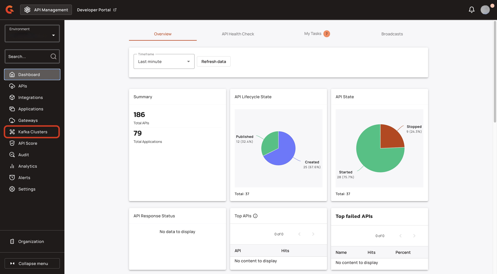
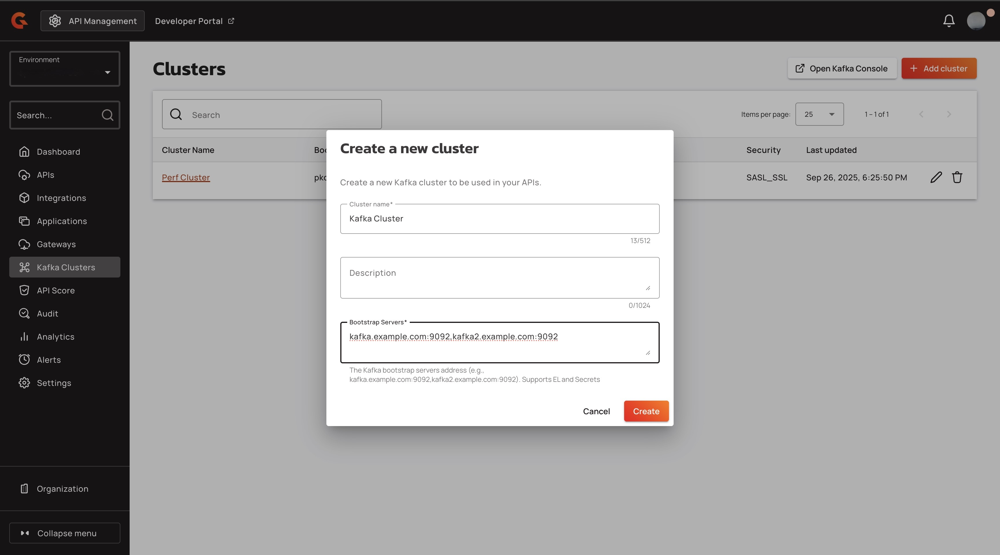
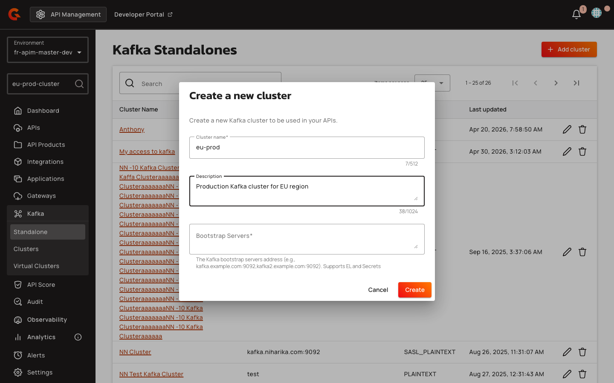
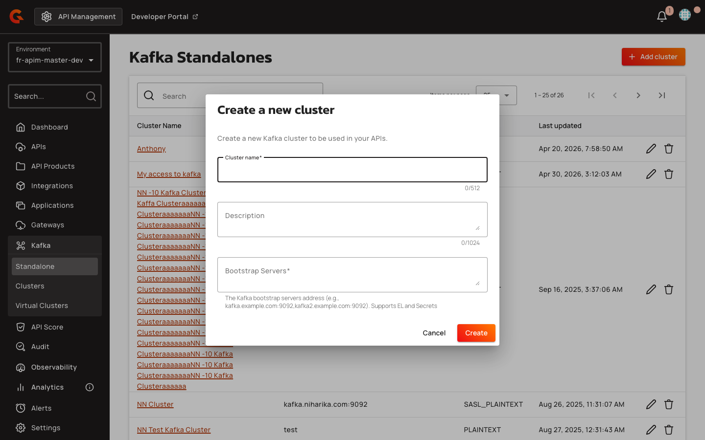
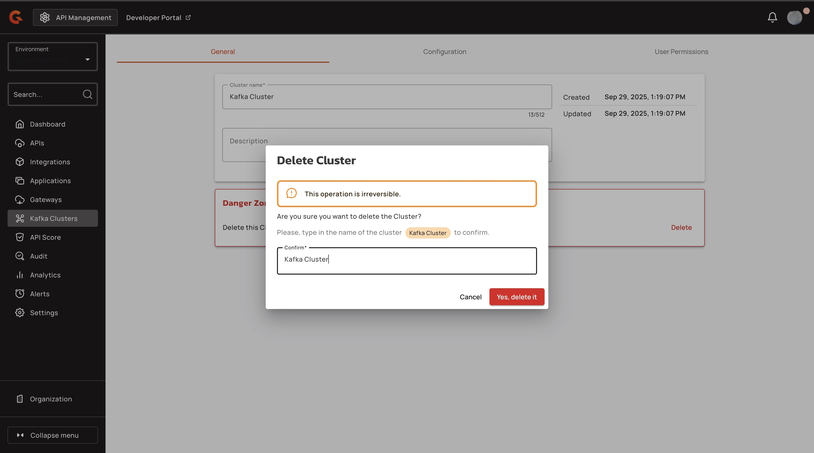
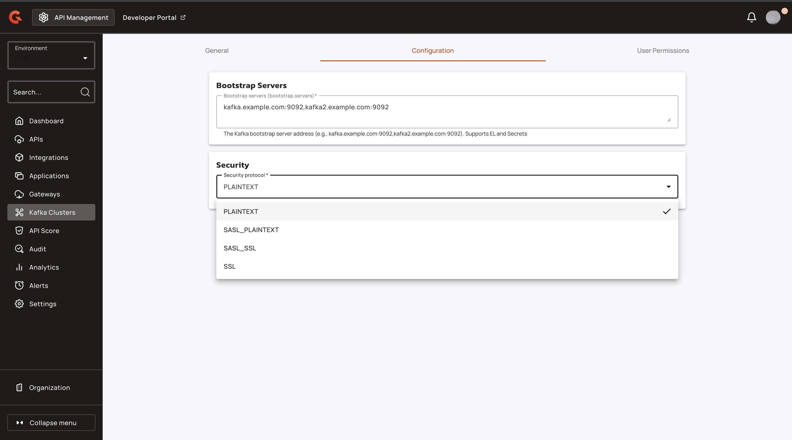

# Create and Configure Kafka Clusters

## Overview

The Kafka UI is accessible from the APIM Console. It is the user interface from which you can create and manage Kafka clusters, configure cluster connection information, and manage user access and permissions.

A Kafka Cluster is a reusable connection profile to a real Kafka backend. Each cluster owns a name and one or more connections, where each connection specifies bootstrap servers and security settings (PLAINTEXT, SSL, SASL_PLAINTEXT, or SASL_SSL). Multiple APIs can reference the same cluster — changes to the cluster propagate to all referencing APIs.

A single cluster can contain multiple connections to model different listeners on the same backend — for example, port 9091 PLAINTEXT for internal clients and port 9095 SASL_SSL for external partners. APIs referencing the cluster can select the appropriate connection without duplicating the cluster entity.

## Prerequisites


Kafka Console is currently only available for self-hosted deployments and not compatible with next-gen cloud.


* You must have an Enterprise License with the apim-cluster feature. For more information about Gravitee Enterprise Edition, see [Enterprise Edition](../introduction/enterprise-edition.md).
* The CLUSTER environment-scoped permission (READ + UPDATE) must be granted to users who will create or modify Kafka cluster configurations. Navigate to **Console → Organization → Roles → USER** and enable the CLUSTER row.
* For APIs using Kafka cluster references, the NATIVE_LOG and NATIVE_ANALYTICS API-scoped permissions must be granted to roles that need to view native Kafka API logs and analytics. The built-in OWNER and PRIMARY_OWNER roles receive these permissions automatically via an upgrader; custom roles require manual grants.

## Create a Kafka Cluster

1.  From the Dashboard, click **Kafka Cluster**.

    <figure><figcaption></figcaption></figure>
2.  Click **+ Add cluster**.

    <figure><figcaption></figcaption></figure>
3. In the **Create a new cluster** pop-up window, complete the following sub-steps:
   1. In the **Cluster name** field, enter a name for your cluster.
   2. (Optional) In the **Description** field, enter a description for your cluster.
   3. In the **Bootstrap Servers** field, enter the bootstrap servers for your cluster in the format `host1:port1,host2:port2,...` (for example, `kafka.example.com:9092`). The field supports EL and Secrets.
   4.  Click **Create**. You are brought to the cluster's configuration screen.

       <figure><figcaption></figcaption></figure>

       <figure><figcaption></figcaption></figure>

       <figure><figcaption></figcaption></figure>

## Configure your Kafka cluster

The configuration for your Kafka cluster is divided into the following sections:

* [#general](create-and-configure-kafka-clusters.md#general "mention")
* [#configuration](create-and-configure-kafka-clusters.md#configuration "mention")
* [#user-permissions](create-and-configure-kafka-clusters.md#user-permissions "mention")

### General

In the **General** tab, you can perform the following actions:

* View or edit the name of the cluster.
* View or edit the description of the cluster.
* View the day and time that the cluster was created.
* View the day and time that the cluster was last updated.

To delete the cluster, complete the following steps:


Once you delete a cluster, this action cannot be undone.


1. Navigate to the **Danger Zone** section, and then click **Delete**.
2. In the **Delete Cluster** pop-up window, enter the name of the Kafka cluster.
3.  Click **Yes, delete it.**

    <figure><figcaption></figcaption></figure>

### Configuration

In the **Configuration** tab, you can configure the following elements of the cluster:

* The Bootstrap Servers.
* Security. By default, the security protocol is set to **PLAINTEXT**. You can choose from the following security protocols for your cluster:
  * SASL_PLAINTEXT
  * SASL_SSL
  * SSL

When the security protocol is SASL_PLAINTEXT or SASL_SSL, SASL configuration fields appear. Select a **SASL Mechanism** from the dropdown: NONE, AWS_MSK_IAM, GSSAPI, OAUTHBEARER, OAUTHBEARER_TOKEN, PLAIN, SCRAM-SHA-256, SCRAM-SHA-512, or DELEGATE_TO_BROKER.

The DELEGATE_TO_BROKER mechanism passes the client's SASL handshake through to the backend broker as-is. The gateway does not interpret or validate the SASL exchange — the backend broker handles authentication directly. This mechanism requires no additional configuration fields: the schema definition sets `additionalProperties: false`, meaning no JAAS config, credentials, or other fields are permitted when this mechanism is selected.

For other SASL mechanisms, provide the required credentials (JAAS config or mechanism-specific fields).

When the security protocol is SASL_SSL or SSL, SSL configuration fields appear. Configure the **Truststore**, **Keystore**, and **Key Password** (JKS path or inline PEM).

The form uses relative JSON path references (`../protocol`) to evaluate conditional display logic. SASL configuration fields appear only when the security protocol is SASL_PLAINTEXT or SASL_SSL. SSL configuration fields appear only when the security protocol is SASL_SSL or SSL.

<figure><figcaption></figcaption></figure>

| Field | Description | Example |
|:------|:------------|:--------|
| **Bootstrap Servers** | Comma-separated list of Kafka broker addresses | `broker1.example.com:9092,broker2.example.com:9092` |
| **Security Protocol** | Transport security mode | SASL_SSL |
| **SASL Mechanism** | Authentication mechanism (visible when protocol is SASL_PLAINTEXT or SASL_SSL) | DELEGATE_TO_BROKER |
| **Truststore** | SSL trust material (visible when protocol is SASL_SSL or SSL) | JKS path or PEM content |
| **Keystore** | SSL client certificate (visible when protocol is SASL_SSL or SSL) | JKS path or PEM content |

### User permissions

In the **User Permissions** tab, you can configure the following elements related to users:

* [#manage-groups](create-and-configure-kafka-clusters.md#manage-groups "mention")
* [#transfer-ownership](create-and-configure-kafka-clusters.md#transfer-ownership "mention")
* [#add-members](create-and-configure-kafka-clusters.md#add-members "mention")

Navigate to the **User Permissions** tab to grant USER role on this cluster to specific subjects. This controls visibility in the Kafka Console UI.

#### Manage groups

To add a group to your Kafka cluster, complete the following steps:

1. From the **User Permissions** tab, click **Manage groups**.
2. In the **Manage groups** pop-up window, click the **Groups** drop-down menu, and then select the group or groups that you want to add to your cluster.
3.  Click **Save**.

    <figure><figcaption></figcaption></figure>

#### Transfer ownership

To transfer ownership of your Kafka cluster to another user, complete the following steps:


Once you transfer ownership of a cluster, this action cannot be undone.


1. From the **User Permissions** tab, click **Transfer ownership**.
2. Under **Choose a new Primary Owner**, click either **Cluster member** or **Other user**.
3. Specify the new primary owner.
   1. If you clicked **Cluster member**, use the drop-down menu to select another member of the cluster as the primary owner.
   2. If you clicked **Other user**, use the search field to find the user you want to set as the primary owner.
4. Use the **New role for current Primary Owner** drop-down menu to select either **User** or **Owner** as the new cluster role for the current primary owner.
5.  Click **Transfer**.

    <figure><figcaption></figcaption></figure>

#### Add members

To add members to your Kafka cluster, complete the following steps:

1. From the **User Permissions** tab, click **+ Add members**.
2. In the **Select users** pop-up window, search for users by name or email. You can add multiple users at a time.
3.  Click **Select**.

    <figure><figcaption></figcaption></figure>
