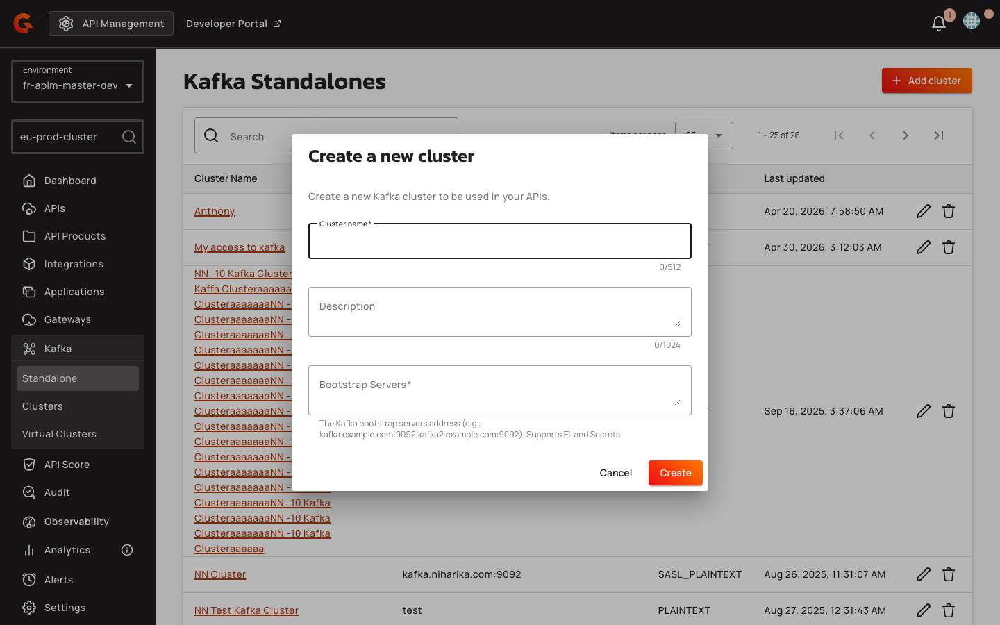

# Managing Kafka Virtual Clusters

## Overview

Kafka Virtual Clusters enable you to fan out client requests across multiple backend Kafka clusters, presenting them as a single virtual cluster. This guide explains how to create, configure, and deploy Kafka Virtual Cluster entities, including backend reference configuration, lifecycle operations, and validation rules.

Virtual clusters are meaningful only when you have two or more Kafka Cluster entities to span.

## Prerequisites

Before creating a Kafka Virtual Cluster, ensure you have:

* At least two Kafka Cluster entities configured in your environment. A Virtual Cluster requires a minimum of two backends to exercise the MESH multiplex capability.
* The CLUSTER environment-scoped permission (READ + UPDATE) granted to your user role. Navigate to **Console → Organization → Roles → USER** and enable the CLUSTER row.

## Creating a Kafka Virtual Cluster

1. Navigate to **Console → Kafka → Standalone → Virtual Clusters**.
2. Click **Add** in the upper right corner.

    <figure><figcaption></figcaption></figure>

3. Enter a **Name** for the virtual cluster.
4. (Optional) Enter a **Cross ID** (external identifier for GKO or config-as-code).
5. (Optional) Enter a **Description**.
6. Click **Save**.

The virtual cluster is created in an UNDEPLOYED state with no backend references configured.

## Adding Backend References

After creating a virtual cluster, configure its backend references to specify which Kafka clusters it spans:

1. Open the virtual cluster and navigate to the **Configuration** tab.
2. Add a backend by selecting a Kafka Cluster from the **Cluster Cross ID** dropdown. This dropdown is filtered to show only entities with `clusterType=KAFKA_CLUSTER`.
3. Select one of that cluster's connections from the **Connection Cross ID** dropdown. This dropdown is populated from the connections defined in the selected Kafka Cluster.
4. Repeat steps 2–3 for each backend you want the virtual cluster to span.

### Backend Reference Fields

| Field | Description | Example |
|:------|:------------|:--------|
| **Cluster Cross ID** | The cross ID of a Kafka Cluster entity | `eu-prod` |
| **Connection Cross ID** | The cross ID of a connection within the selected cluster | `sasl-ssl-connection` |

### Backend Reference Requirements

* **Uniqueness**: Backend references must be unique within a virtual cluster. Each `(clusterCrossId, connectionCrossId)` pair can appear only once. Duplicate backend references return an error.
* **Minimum backends**: A minimum of two backends is required to exercise the MESH multiplex capability.
* **Pragmatic upper bound**: While there is no hard upper limit, a pragmatic ceiling is 5–10 backends. Every consumer-group RPC fans out across all backends, so excessive backend counts may impact performance.

## Deploying a Kafka Virtual Cluster

After configuring backend references, deploy the virtual cluster to activate it:

1. Navigate to the **General** tab.
2. Click **Deploy**.

The virtual cluster state changes to DEPLOYED. The version number increments, and the `deployedAt` timestamp is set to the current time.

## Validation Rules

The following validation rules apply to Kafka Virtual Clusters:

* **Unique backend references**: Each `(clusterCrossId, connectionCrossId)` pair must be unique within the virtual cluster. Duplicate backend references return an error message.
