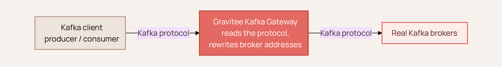
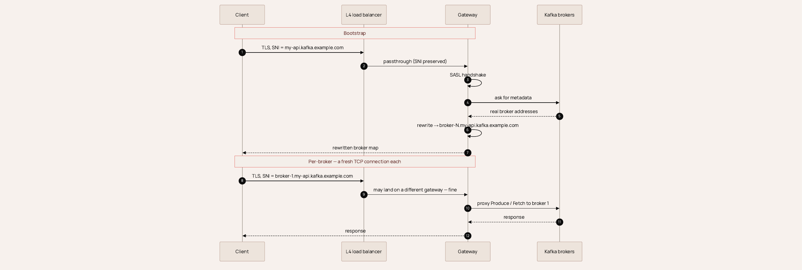
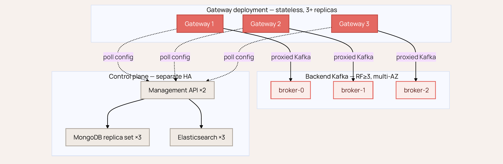

# Deploy the Kafka Gateway for High Availability

## Overview

The Gravitee Kafka Gateway is a protocol-aware proxy. It reads native Kafka frames, and rewrites the broker addresses in `Metadata`, `FindCoordinator`, and `DescribeCluster` responses so that clients always reconnect through the gateway instead of dialing the brokers directly.

<figure><figcaption>
The Kafka gateway reads the Kafka protocol and rewrites broker addresses so clients reconnect through the gateway instead of dialing the brokers directly.
</figcaption></figure>

This page explains why the gateway scales horizontally, how to put a load balancer in front of it, and what else in the path needs to be redundant for the deployment to count as highly available. It builds on the listener and routing configuration described in [Configure the Kafka Client & Gateway](configure-the-kafka-client-and-gateway.md).

## Why the Kafka gateway scales horizontally

A Kafka client doesn't work like an HTTP client. It first connects to a bootstrap address, receives a map of the whole cluster, and then opens a separate, long-lived connection to each broker it needs, such as the leader for a partition or the coordinator for its consumer group. Every broker needs its own stable address.

In a standard single-cluster deployment, a gateway instance holds no state that another instance needs. Everything tied to a connection stays inside the one instance that owns it:

* The SASL handshake and the authenticated principal.
* Request ordering and correlation for that socket.
* The broker address mapping, which each instance rebuilds on its own from the first `Metadata` response it sees.

Because nothing is shared and nothing coordinates between instances, you run as many gateway replicas as you like behind a plain TCP load balancer, and you don't need session affinity for correctness.

<figure><figcaption>
A single client session through the gateway. The gateway rewrites broker addresses during bootstrap, and any instance in the pool serves each per-broker connection.
</figcaption></figure>

## How clients reach a broker: SNI routing

By default, the gateway uses host-based (SNI) routing, set with `kafka.routingMode` (default `host`). It runs one TLS listener, set with `kafka.port` (default `9092`) and shared by every Kafka API. The gateway reads the SNI hostname from the TLS handshake to work out which API and broker the client wants.

Because routing depends on the SNI hostname, TLS is required, and every advertised broker hostname has to resolve to the gateway. In practice, that means wildcard DNS pointing at the load balancer. For the hostname scheme and the bootstrap domain, see [Configure the Kafka Client & Gateway](configure-the-kafka-client-and-gateway.md).

The alternative is port-based routing (`kafka.routingMode=port`), which assigns each plan a dedicated port and uses plain TCP. For that setup, see [Configure Kafka Port Routing](configuring-kafka-port-routing-gateway-and-console.md).

## Put an L4 load balancer in front

Most setups go wrong at the load balancer, so be precise about two things:

* **Use a TCP (Layer 4) load balancer.** An HTTP/Layer 7 proxy mangles the Kafka binary protocol. Don't put one in the path.
* **Pass TLS through. Don't terminate it.** In SNI routing, TLS has to end at the gateway so the SNI hostname survives the trip. If you terminate TLS at the load balancer, the gateway has nothing to route on and routing breaks silently.

Two more settings are worth checking:

* **Skip session affinity.** It isn't needed, and relying on it hides problems. Plain round-robin is fine.
* **Set a generous idle timeout.** Kafka connections stay open a long time. Set the load balancer idle timeout well above the client's `connections.max.idle.ms`. Ten minutes or more is a sensible floor.

<figure><figcaption>
Clients resolve wildcard DNS to one L4 load-balancer address that passes TLS through to the stateless gateway pool.
</figcaption></figure>

## What happens when a gateway fails

A connection is a TCP socket owned by one gateway instance. If that instance goes away, only the clients on it lose their sockets. Every other client carries on untouched. The affected clients reconnect through the load balancer, land on a healthy instance, re-bootstrap, and resume. Standard Kafka clients recover on their own, usually within a sub-second blip and with no manual action.

Run three or more replicas so that losing one instance still leaves headroom for a rolling update.

<figure><figcaption>
When a gateway instance fails, only its clients reconnect through the load balancer and resume on a healthy instance. Every other client is untouched.
</figcaption></figure>

## Gateway deployment recommendations

Apply the following when you deploy the gateway pool:

| Aspect | Recommendation |
| --- | --- |
| Replicas | At least 3, so the pool survives one loss plus a rolling update. |
| Spread | Anti-affinity across nodes and availability zones. |
| Event-loop instances | Leave `kafka.instances` at its default of `0`, which uses the Vert.x default event-loop pool size. Vert.x sizes this at twice the number of available CPU cores. |
| Disruption budget | A `PodDisruptionBudget` of `minAvailable: 2`, so a drain never reduces the pool to one. |
| Request timeout | `kafka.requestTimeout` defaults to `35s`. Raise it only if the brokers are genuinely slow. |
| Rollouts | `maxUnavailable: 0` and `maxSurge: 1` for clean rolling updates. |

Kafka proxying is bound by connections and throughput, not CPU. Give the gateway network headroom, and watch the file-descriptor limits, because every client connection and every broker connection is an open socket. For baseline resource allocations, see [Gateway Resource Sizing](../prepare-a-production-environment/gateway-resource-sizing-guidelines.md).

## Make the whole path redundant

A perfectly redundant gateway still goes down if the rest of the path isn't redundant.

* **Backend Kafka cluster.** Follow Kafka's own high-availability guidance: a replication factor of 3 or more, `min.insync.replicas=2`, and brokers spread across availability zones. See the [Apache Kafka documentation](https://kafka.apache.org/documentation/). Leadership changes need no reconfiguration. When a leader moves, the client re-fetches metadata and the gateway rewrites the new leader's address, so rolling broker restarts are safe as long as the cluster keeps quorum.
* **Control plane.** Gateways keep serving live traffic even if the control plane has a wobble, because each one works from its own local copy of the config. For a genuinely highly available setup, run the control plane redundantly too: two or more Management API instances, a three-node MongoDB replica set for API definitions and plans, and a three-node Elasticsearch or OpenSearch cluster for analytics and logs. If the config poll fails for a while, you lose only the ability to push new config. Traffic that's already flowing keeps flowing.

<figure><figcaption>
Each tier is independently redundant: a stateless gateway pool, a multi-AZ Kafka cluster, and a separately highly available control plane.
</figcaption></figure>

## Virtual cluster (MESH) mode caveat

Everything above holds for the standard single-cluster deployment, where gateways share nothing. Virtual cluster (MESH) mode is different: it keeps shared state in a distributed cache. A multi-pod gateway deployment that uses MESH requires a distributed cache plugin, either Hazelcast or Redis, for correctness, for example to keep idempotent producers consistent across pods. Without it, each pod falls back to a local in-memory cache and loses cross-pod consistency.

If MESH is in use, the affinity-free property doesn't automatically hold. Confirm the distributed cache is configured before you rely on the same horizontal-scaling behavior.

## Deployment checklist

Confirm each of the following before you call the deployment highly available:

* An L4 load balancer with TLS passthrough, the SNI hostname preserved, and a long idle timeout.
* Wildcard DNS that resolves every advertised broker hostname to the load balancer, with a matching wildcard or SAN certificate.
* Three or more stateless gateway replicas, anti-affinity, and a `PodDisruptionBudget` of `minAvailable: 2`.
* A backend Kafka cluster with a replication factor of 3 or more, `min.insync.replicas=2`, and brokers spread across availability zones.
* A redundant control plane: two or more Management API instances, a three-node MongoDB replica set, and a three-node Elasticsearch or OpenSearch cluster.
* Confirmation of whether virtual cluster (MESH) mode is in use, and a distributed cache plugin if it is.
