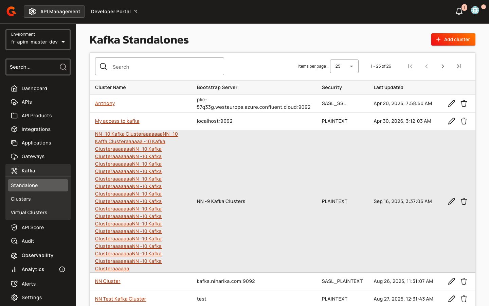

# Kafka Virtual Clusters

## Overview

Kafka Virtual Clusters enable you to present multiple backend Kafka clusters as a single unified cluster to client applications. This MESH (Multi-Endpoint Single Host) capability allows you to scale horizontally across clusters, consolidate infrastructure, and simplify client configuration while maintaining protocol-level compatibility with standard Kafka clients. Virtual clusters are managed as reusable configuration entities that can be referenced by multiple Kafka APIs. A minimum of two backend clusters is required to exercise [multiplex behavior](kafka-virtual-clusters-advanced-routing-and-multiplex-reference.md) — with only one backend, a virtual cluster provides no functional benefit over a direct cluster reference.

## Key Concepts

### Virtual Cluster Entity

A Kafka Virtual Cluster is a persistent configuration entity that aggregates multiple backend Kafka clusters into a single logical cluster. It stores references to existing Kafka Cluster entities (via `clusterCrossId` and `connectionCrossId` pairs) rather than duplicating connection details. When a client connects to an API backed by a virtual cluster, the gateway fans out requests across all configured backends and merges responses transparently. The virtual cluster's `crossId` must be unique within the environment (the same `crossId` can exist across different environments) and is immutable after creation.

### Backend References

Each backend in a virtual cluster is defined by two identifiers: the **Cluster Cross ID** (which Kafka Cluster entity to use) and the **Connection Cross ID** (which connection profile within that cluster). This two-level reference model allows you to select specific authentication profiles (e.g., SASL_SSL for external clients, PLAINTEXT for internal) from multi-connection clusters. Backend references must be unique within a virtual cluster — the same `(clusterCrossId, connectionCrossId)` pair cannot appear twice. Within a Kafka Cluster entity, connection names must be unique, and connection `crossId` values must be unique. If a connection's `crossId` is not provided during creation, it is auto-generated by slugifying the connection name.

### Multiplex Consumer Groups

When a consumer subscribes to topics that span multiple backend clusters, the gateway automatically creates shadow consumer groups on each backend (named `<groupId>__shadow-c<N>`, where N is the cluster index) and synthesizes a single client-facing member ID and generation ID. This multiplexing is transparent to the client: the application sees one group, one rebalance, and one merged partition assignment. Group IDs matching the pattern `.*__shadow-c\d+` are reserved for gateway internals and rejected with `INVALID_GROUP_ID` and the error message: "group id '\<groupId>' uses the reserved gateway suffix '__shadow-c\<N>'". Multiplex membership entries are keyed by a synthetic `clientMemberId` with format `gw-{uuid}` and have a TTL of 30 minutes. For static membership (when the client sets `group.instance.id`), the shadow instance ID format is `{clientInstanceId}__shadow-c{clusterIndex}`.

Cross-cluster subscriptions are rejected with `INVALID_REQUEST` and the error message: "Cross-cluster subscription is not supported in MESH mode (group '{groupId}' subscribes to topics that span clusters {clusters}). Split the subscription into per-cluster groups, mirror the topics, or use single-cluster routing."

### Virtual Broker IDs

The gateway remaps backend broker IDs into non-overlapping virtual ranges to prevent collisions in merged metadata responses. Cluster index 0 uses virtual IDs 10000–19999, cluster index 1 uses 20000–29999, and so on. Backend broker IDs must be below 10,000. The maximum number of clusters supported by this mapping scheme is 214,748. This remapping applies to partition leaders, replicas, ISR lists, offline replicas, and controller IDs in all metadata and admin responses.

### Idempotent Producer Sessions

Idempotent producers receive a virtual producer ID (PID) from the gateway. The gateway maintains a session cache that maps each virtual PID to per-cluster real PIDs and epochs. When a PRODUCE request arrives, the gateway rewrites the batch header with the correct cluster-specific PID before forwarding. If the session cache has no mapping for the target cluster, the gateway short-circuits the request with a `PRODUCER_FENCED` error and logs: "No producer id session for api={} virtualPid={} cluster={}, replying with PRODUCER_FENCED". `PRODUCER_FENCED` is a fatal error — the client application must create a new `KafkaProducer` instance to recover. Non-idempotent producers (`producerId == NO_PRODUCER_ID`) have their PRODUCE requests forwarded unchanged.

### Lifecycle States

Virtual clusters have three lifecycle states: **UNDEPLOYED** (created but not active on the gateway), **DEPLOYED** (active and serving traffic), and **PENDING** (configuration updated but not yet redeployed). Deploying a cluster increments its version number (or sets it to 1 if previously undeployed) and sets the `deployedAt` timestamp. Updating a deployed cluster transitions it to `PENDING` without changing the version. Undeploying a cluster transitions it to `UNDEPLOYED` without changing the version. A cluster must be undeployed before deletion — attempting to delete a cluster in `DEPLOYED` or `PENDING` state fails with the error "Cluster must be undeployed before deletion."

### Permissions and Visibility

The `CLUSTER` environment-scoped permission (mask 4000) governs both Kafka Cluster and Virtual Cluster entities — there is no separate `VIRTUAL_CLUSTER` permission. Users with `CLUSTER` READ permission can view clusters; users with `CLUSTER` UPDATE permission can create, modify, deploy, and undeploy clusters. The **User Permissions** tab on a Kafka Cluster entity allows granting the `USER` role on that cluster to specific subjects, which the Kafka Console UI uses to scope visibility.

For API-level access, the `NATIVE_LOG` and `NATIVE_ANALYTICS` API-scoped permissions let users read native Kafka API logs and analytics. The `NativeApiLogPermissionUpgrader` backfills these permissions on the built-in `OWNER` and `PRIMARY_OWNER` roles automatically during upgrade; custom roles need them granted manually.

### Routing Modes

The gateway runs in one of two routing modes globally, controlled by the `kafka.routingMode` property:

| Mode | How It Works | When to Use | Wildcard Cert Needed? |
|:-----|:-------------|:------------|:----------------------|
| **HOST** (default) | Single bootstrap port for all APIs (9092). Routing relies on TLS SNI — the gateway dispatches on `<apiPrefix>.<defaultDomain>` and `broker-<N>-<apiPrefix>.<defaultDomain>` SNI hostnames. | Most deployments. Lets you host N APIs behind one port. | Yes — a wildcard certificate covering `*.<defaultDomain>` is the simplest setup. |
| **PORT** | Each plan gets a dedicated bootstrap port + broker-port range configured at plan level via `bootstrapPort`. Routing is by local listening port; no SNI dispatch. | Environments where wildcard certs are not acceptable, or where the client cannot do SNI. | No — per-port certs are fine. |

mTLS plans force HOST routing mode because the SNI handshake is required for client-cert validation. Mixed secure plans (API Key, JWT, OAuth2, mTLS) with a Keyless plan on the same API are refused at API start with `KafkaServerUnsupportedSecureAndUnsecurePlansException`.

### Unsupported Features on MESH

Kafka transactions (`INIT_PRODUCER_ID` with `transactional.id`, `ADD_PARTITIONS_TO_TXN`, `END_TXN`, `TXN_OFFSET_COMMIT`, `ADD_OFFSETS_TO_TXN`, `WRITE_TXN_MARKERS`) are not supported on MESH virtual clusters — transactional APIs have no multiplex handler. Share groups (`SHARE_GROUP_HEARTBEAT`, apiKey 78, KIP-932) are stripped from advertised `ApiVersions` on MESH, making share consumers see this API as unavailable. KIP-848 consumer groups (`group.protocol=consumer`) are fully supported on MESH, including static membership (`group.instance.id`).

## Prerequisites

Before creating a virtual cluster, ensure the following requirements are met:

* At least two Kafka Cluster entities configured in the environment (virtual clusters with a single backend provide no functional benefit over direct cluster references)
* Each backend cluster must have broker IDs below 10,000 to avoid virtual ID range conflicts
* The `CLUSTER` environment-scoped permission (READ + UPDATE) must be granted to users who will manage virtual clusters (Console → Organization → Roles → select role → enable CLUSTER row)
* For delegate-to-broker SASL mode: all backend clusters must use `security.sasl.mechanism.type = DELEGATE_TO_BROKER`
* For HOST routing mode (default): a wildcard TLS certificate covering `*.<defaultDomain>` and the `gravitee_kafka_routingHostMode_defaultDomain` property configured (Console → Organization → Entrypoints & Sharding Tags → Default Kafka Domain)

## Gateway Configuration

### Timeout Properties

| Property | Type | Default | Description |
|:---------|:-----|:--------|:------------|
| `BACKEND_FORWARD_TIMEOUT` | Duration | 10 seconds | Per-call timeout when forwarding internal requests (probe, FindCoordinator) to a backend cluster |
| `SHADOW_HEARTBEAT_TIMEOUT` | Duration | 3 seconds | Per-shadow timeout for cross-cluster ConsumerGroupHeartbeat fan-out; must stay below client heartbeat interval |
| `BACKEND_CALL_TIMEOUT` | Duration | 5 seconds | Per-call timeout for admin API fan-out operations |
| `METADATA_FETCH_TIMEOUT` | Duration | 10 seconds | Timeout for metadata fetch from backend clusters during cache refresh |
| `RETRY_BACKOFF` | Duration | 300 milliseconds | Backoff duration between retry attempts |

### Probe Configuration

| Property | Type | Default | Description |
|:---------|:-----|:--------|:------------|
| `PROBE_TIMEOUT_MS` | int | 5000 | Maximum time to wait for Kafka gateway to bind on port during startup probe |
| `PROBE_CONNECT_MS` | int | 500 | Socket connect timeout for individual probe attempts |
| `PROBE_RETRY_INTERVAL_MS` | int | 100 | Interval between probe retry attempts |

## Creating a Virtual Cluster

1. In the Console left sidebar, navigate to **Kafka** → **Standalone** → **Virtual Clusters**.
2. Click **Add cluster** in the top right corner.
3. Enter a **Name** for the virtual cluster (e.g., `global-mesh`).
4. Optionally, enter a **Cross ID** (portable identifier for config-as-code or cross-environment references). If you do not provide a cross ID, the system auto-generates one by slugifying the cluster name. The cross ID must be unique within the environment and is immutable after creation.
5. Enter an optional **Description** to explain the virtual cluster's purpose.
6. Click **Save** to create the virtual cluster in `UNDEPLOYED` state.
7. Open the virtual cluster and navigate to the **Configuration** tab.
8. Click **Add Backend** to add backend cluster references.
9. For each backend, select a **Cluster** from the dropdown (filtered to show only `KAFKA_CLUSTER` type entities).
10. Select a **Connection** from that cluster's available connection profiles.
11. Repeat steps 8–10 for every backend cluster you want the virtual cluster to span. A minimum of two backends is required to exercise multiplex behavior. Each `(clusterCrossId, connectionCrossId)` pair must be unique within the virtual cluster.
12. Click **Save** to persist the backend list.
13. Deploy the virtual cluster by clicking **Deploy** in the cluster details view. This transitions the lifecycle state to `DEPLOYED`, increments the version number (or sets it to 1 if previously undeployed), sets the `deployedAt` timestamp, and makes the virtual cluster available for API endpoint configuration. The gateway will begin serving merged metadata and routing requests across all configured backends.

    <figure><figcaption></figcaption></figure>

| Field | Description | Example |
|:------|:------------|:--------|
| **Name** | Human-readable identifier for the virtual cluster | `global-mesh` |
| **Cross ID** | Portable identifier for cross-environment references (auto-generated if omitted); must be unique within environment and immutable after creation | `prod-mesh-01` |
| **Description** | Optional explanation of the virtual cluster's purpose | `Spans EU and US Kafka clusters` |
| **Cluster** | Reference to an existing Kafka Cluster entity | `eu-prod-cluster` |
| **Connection** | Specific connection profile within the selected cluster | `sasl-ssl-external` |

## Managing Virtual Clusters

### Updating Configuration

To modify a virtual cluster's backend list, open the cluster in the Console and navigate to the **Configuration** tab. Add or remove backend references as needed. Saving the configuration transitions the cluster to `PENDING` state without changing the version number. Click **Deploy** to apply the changes, increment the version number, and update the `deployedAt` timestamp. APIs referencing the virtual cluster will begin using the updated backend topology after the next metadata refresh.

### Undeploying and Deleting

Before deleting a virtual cluster, you must undeploy it. Click **Undeploy** in the cluster details view to transition the lifecycle state to `UNDEPLOYED` without changing the version number. This removes the cluster from the gateway's active configuration. Once undeployed, click **Delete** to permanently remove the cluster entity. Attempting to delete a cluster in `DEPLOYED` or `PENDING` state will fail with the error "Cluster must be undeployed before deletion."

### Deployment API

The Management API provides programmatic deployment control:

**Deploy a cluster**:
```http
POST /clusters/{clusterId}/_deploy
```
Sets lifecycle state to `DEPLOYED` and increments the version number (or sets it to 1 if previously undeployed). Returns the updated cluster entity.

**Undeploy a cluster**:
```http
POST /clusters/{clusterId}/_undeploy
```
Sets lifecycle state to `UNDEPLOYED` without changing the version number. Returns the updated cluster entity.

**List deployed clusters**:
```http
GET /clusters/deployed?type=KAFKA_VIRTUAL_CLUSTER
```
Returns all deployed clusters visible to the gateway, optionally filtered by cluster type. Response includes `crossId`, `name`, `description`, `deployedAt`, `version`, and `connections[]` array.
