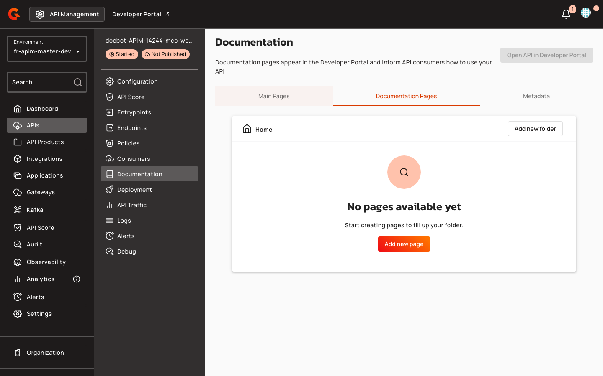

# MCP Proxy API Support in Portal Next

## Overview

Portal Next supports MCP Proxy APIs with dedicated documentation templates and one-click installer widgets. API publishers can embed the `<gmd-install-mcp>` Gravitee Markdown component in portal pages to generate client-specific configuration snippets and deep links for Cursor, VS Code, and Claude Desktop. When an MCP Proxy API is published, the portal automatically seeds an Overview page with pre-configured install instructions derived from the API's entrypoint and MCP path.

## Key Concepts

### MCP Proxy API Type

MCP Proxy is a new API type in Portal Next, alongside existing types (PROXY, MESSAGE, NATIVE). The portal also recognizes `LLM_PROXY` and `A2A_PROXY` types. When an API is created with type `MCP_PROXY`, the portal applies MCP-specific behavior during default page seeding, using the `api-overview-mcp-proxy-page-content.md` template. All other API types (PROXY, MESSAGE, NATIVE, LLM_PROXY, A2A_PROXY) use the generic `api-overview-page-content.md` template.

### Install MCP Component

The `<gmd-install-mcp>` component is part of the Gravitee Markdown system on Portal Next. It renders one-click installer actions and copyable configuration snippets for MCP clients. The component supports three transport protocols: `http`, `sse`, and `stdio`. For remote transports (`http` and `sse`), the component generates JSON configurations with the server URL and optional headers. For `stdio` transport, it generates configurations with the executable command, arguments, and environment variables. The component displays client-specific tabs (Cursor, VS Code, Claude Desktop) and generates deep links for Cursor and VS Code, while Claude Desktop shows a copyable snippet only. When misconfigured (missing `name` and either `url` or `command`), the component displays a placeholder message instead of installer actions.

| Transport | Required Inputs | Generated Config Elements |
|:----------|:----------------|:--------------------------|
| `http` | `name`, `url` | `url`, optional `headers` |
| `sse` | `name`, `url` | `url`, optional `headers` |
| `stdio` | `name`, `command` | `command`, optional `args`, `env` |

### FreeMarker Template Variables

Portal page templates can reference two new API model properties exposed by `ApiTemplateServiceImpl` (v4): `api.entrypoints` (a list of gateway entrypoint URLs) and `api.mcp` (a map of MCP-specific configuration). The `api.mcp` map is extracted from V4 entrypoint configuration for `mcp` or `mcp-proxy` entrypoint types. The `api.mcp.mcpPath` property contains the path segment appended to the entrypoint URL to form the complete MCP endpoint. These variables enable dynamic install URL construction in FreeMarker templates.

## Prerequisites

- API must be published with at least one configured V4 entrypoint of type `mcp` or `mcp-proxy`
- For remote MCP servers (`http` or `sse` transport), the API must expose an MCP-compatible endpoint
- For `stdio` transport, users must have the MCP server executable installed locally
- Portal page authors must use the exact component tag and attribute names allowed by the HTML sanitizer

## Creating MCP Proxy APIs

1. In the API Management console, navigate to **APIs** in the left sidebar.
2. Create a new API with type `MCP_PROXY`.
3. Configure at least one V4 entrypoint of type `mcp` or `mcp-proxy`.
4. Trigger default page seeding by calling `POST /portal-navigation-items/_default-pages`.

    <figure><figcaption></figcaption></figure>

The portal automatically generates an unpublished Overview page using the `api-overview-mcp-proxy-page-content.md` template. This template embeds a pre-configured `<gmd-install-mcp>` component with the API name, HTTP transport, and a URL constructed from the first entrypoint and the `mcpPath` property derived from V4 entrypoint configuration. The seeding process skips APIs that already have a child page. For all other API types (PROXY, MESSAGE, NATIVE, LLM_PROXY, A2A_PROXY), the portal uses the generic `api-overview-page-content.md` template without MCP-specific content.

## Embedding Install Widgets in Portal Pages

1. In the API Management console, navigate to your API and select **Documentation** from the left sidebar.
2. Select the **Documentation Pages** tab.
3. Click **Add new page** to create a new portal page or edit an existing page.
4. In the page editor, add the `<gmd-install-mcp>` component with the required attributes.

    <figure><figcaption></figcaption></figure>

Portal page authors can manually add the `<gmd-install-mcp>` component to any Gravitee Markdown page. The component accepts the following attributes:

| Attribute | Description | Example |
|:----------|:------------|:--------|
| `name` | MCP server name used in generated client configurations | `"weather"` |
| `transport` | MCP transport protocol: `http`, `sse`, or `stdio` (default: `http`) | `"http"` |
| `url` | Remote MCP endpoint URL for `http` and `sse` transports | `"https://api.example.com/mcp"` |
| `headers` | JSON object or string of headers for remote transports | `'{"Authorization":"Bearer token"}'` |
| `command` | Executable used to start a stdio MCP server | `"npx"` |
| `args` | JSON array or comma-separated string of stdio command arguments | `'["-y","@modelcontextprotocol/server-weather"]'` |
| `env` | JSON object or string of environment variables for stdio transports | `'{"API_KEY":"secret"}'` |
| `clients` | Comma-separated list of installer IDs to display | `"cursor,vscode,claude-desktop"` |

**Example (remote HTTP)**:
```html
<gmd-install-mcp 
  name="weather" 
  transport="http" 
  url="https://api.example.com/mcp" 
  headers='{"Authorization":"Bearer token"}' 
/>
```

**Example (local stdio)**:
```html
<gmd-install-mcp 
  name="weather" 
  transport="stdio" 
  command="npx" 
  args='["-y","@modelcontextprotocol/server-weather"]' 
  env='{"API_KEY":"secret"}' 
/>
```

**Example (explicit clients)**:
```html
<gmd-install-mcp 
  name="weather" 
  transport="http" 
  url="https://api.example.com/mcp" 
  clients="cursor,vscode" 
/>
```

If `name` and either `url` (for remote) or `command` (for stdio) are missing, the component displays a placeholder message: "Provide a server name and URL, or use stdio inputs for a local MCP server." The `clients` attribute filters which installer tabs appear; if omitted, all supported clients are shown. The copy button label changes from "Copy" to "Copied" for 2 seconds after clicking.

### Using FreeMarker Variables in Templates

Portal page templates can construct install URLs dynamically using `api.entrypoints` and `api.mcp` variables exposed by `ApiTemplateServiceImpl` (v4):

```html
<gmd-install-mcp 
  name="${api.name}" 
  transport="http" 
  url="<#if api.entrypoints?? && (api.entrypoints?size > 0)>${api.entrypoints[0]}</#if><#if api.mcp?? && api.mcp.mcpPath??>${api.mcp.mcpPath}</#if>" 
/>
```

The `api.entrypoints[0]` expression retrieves the first gateway entrypoint URL, and `api.mcp.mcpPath` appends the MCP-specific path segment extracted from V4 entrypoint configuration. Always include null and size checks in templates to handle APIs without configured entrypoints or MCP paths.

### Customizing Component Appearance

Use the `@gmd.install-mcp-overrides()` SCSS mixin to customize the component's visual tokens:

| Token | Default | Description |
|:------|:--------|:------------|
| `container-color` | `surface-color` | Background color of the component container |
| `container-outline-color` | `outline-color` | Border color of the component container |
| `headline-color` | `text-color` | Color of the main heading text |
| `subdued-text-color` | `text-color` at 70% opacity | Color of secondary text (description, file name) |
| `tab-active-color` | `primary-color` | Background color of the active client tab |
| `tab-active-text-color` | `on-primary-color` | Text color of the active client tab |
| `tab-inactive-color` | `surface-color` | Background color of inactive client tabs |
| `tab-inactive-text-color` | `text-color` | Text color of inactive client tabs |
| `code-background-color` | `outline-color` at 8% mixed with `surface-color` | Background color of the code snippet block |
| `code-text-color` | `text-color` | Text color of the code snippet |

## Restrictions

- The `<gmd-install-mcp>` component does not inject a default Authorization header for remote MCP servers; users must explicitly provide headers via the `headers` attribute if authentication is required
- Deep links are supported only for Cursor and VS Code; Claude Desktop displays a copyable snippet without a deep link
- Default page seeding is skipped if the API navigation item already has a child page
- Only `MCP_PROXY` APIs trigger MCP-specific Overview page seeding; `LLM_PROXY` and `A2A_PROXY` types use the generic template
- The HTML sanitizer permits only the `<gmd-install-mcp>` tag and the following attributes: `name`, `transport`, `url`, `headers`, `command`, `args`, `env`, `clients`
- The `api.mcp` map is populated only from V4 entrypoints with `mcp` or `mcp-proxy` entrypoint types

## Related Changes

- The HTML sanitizer now allows the `<gmd-install-mcp>` custom element and its attributes in stored portal pages, ensuring the component is not stripped during content validation
- The Monaco editor's hover provider safely handles component selectors without suggestion configurations, returning null instead of throwing an error when a component lacks hover documentation
- The API template service (`ApiTemplateServiceImpl` v4) exposes `api.entrypoints` and `api.mcp` variables to FreeMarker templates, enabling dynamic install URL construction
- Default page seeding logic (`SeedDefaultPagesForApiNavigationItemsUseCase`) selects the MCP Overview template (`api-overview-mcp-proxy-page-content.md`) for `MCP_PROXY` APIs and the generic template for all other types
- These features were introduced in APIM-14224 (component, sanitizer, FreeMarker variables, and API type enumeration) and APIM-14225 (default page seeding)
