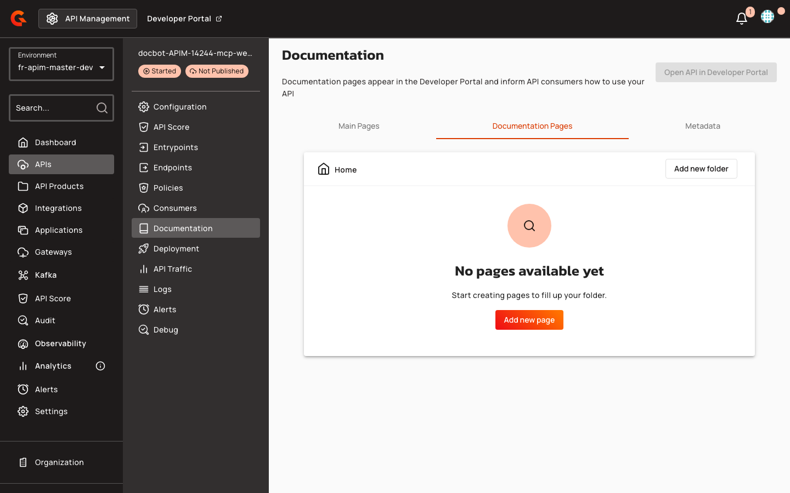
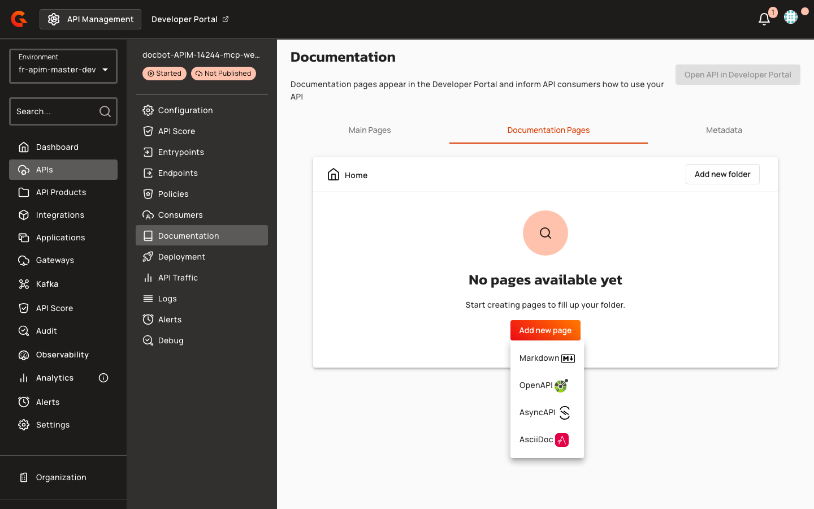
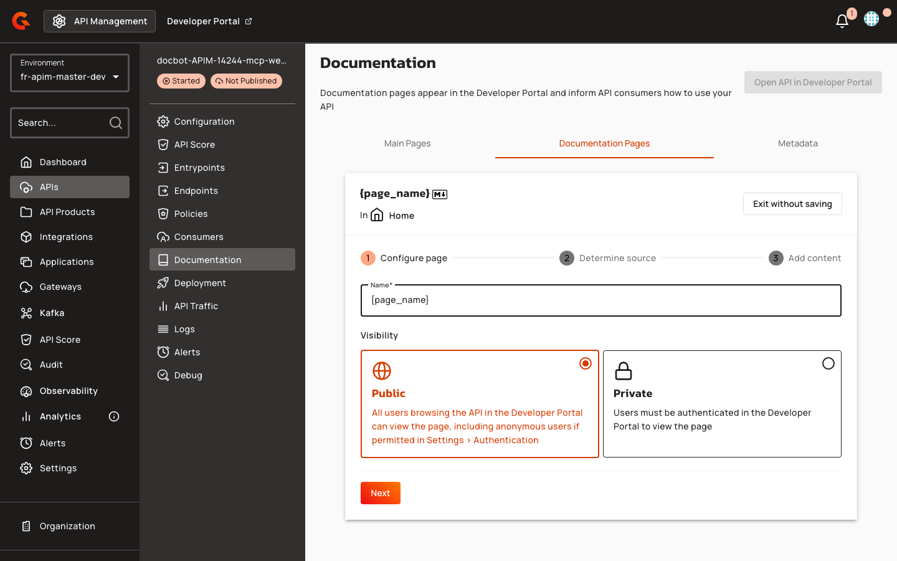
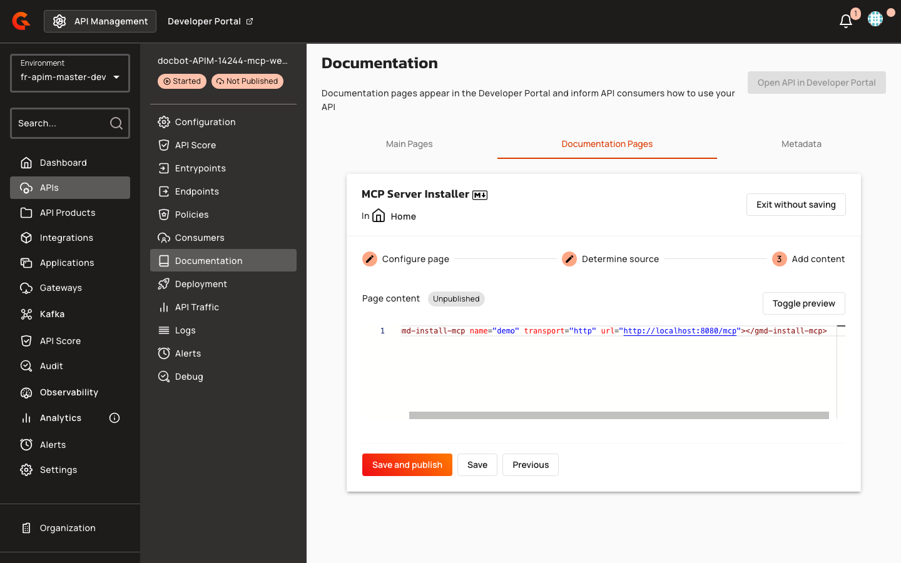

# MCP Server Installation Widget for Portal Pages


This page documents the `<gmd-install-mcp>` widget for embedding MCP client configuration in New Developer Portal pages. If you are looking to interact with Gravitee API Management itself via MCP (using an AI assistant to manage your APIs), see [Expose APIM as an MCP Server](4.9-expose-apim-as-an-mcp-server.md).


## Overview

The `<gmd-install-mcp>` Gravitee Markdown (GMD) component lets API publishers embed one-click installer actions and copyable configuration snippets directly into New Developer Portal pages. When you add an MCP Proxy API to the portal navigation, Gravitee automatically creates an unpublished Overview page pre-configured with this widget.

## Key Concepts

### MCP Installation Widget

The `<gmd-install-mcp>` component renders client-specific installer tabs. Each tab provides either a deep-link button that opens the AI client's MCP install flow (Cursor, VS Code), or a copyable JSON configuration snippet (Claude Desktop). The widget supports remote `http` and `sse` transports (use `sse` when the upstream MCP server exposes Server-Sent Events) and local `stdio`-based MCP servers.

### Supported AI Clients

| Client | Installer | Configuration File |
|:-------|:----------|:-------------------|
| Cursor | Deep-link button (`cursor://anysphere.cursor-deeplink/mcp/install?...`) | `~/.cursor/mcp.json` |
| VS Code | Deep-link button (`vscode:mcp/install?...`) | `mcp.json` |
| Claude Desktop | Copyable snippet only (no deep link) | `claude_desktop_config.json` |

When the `clients` attribute is omitted, all three clients are shown as tabs. Each installer tab also includes a **Copy** button for the manual configuration snippet. When no supported installer matches the configuration, the widget displays a placeholder message instead.

### Portal API Types

The New Developer Portal supports six API types: `NATIVE`, `MESSAGE`, `PROXY`, `A2A_PROXY`, `LLM_PROXY`, and `MCP_PROXY`. Only `MCP_PROXY` APIs trigger automatic seeding of the MCP-specific Overview page template.

### FreeMarker Template Variables

New Developer Portal pages support FreeMarker expressions to inject dynamic API metadata:

| Variable | Description | Example |
|:---------|:------------|:--------|
| `api.name` | API name | `"Weather Service"` |
| `api.description` | API description | `"Real-time weather data"` |
| `api.entrypoints` | List of gateway entrypoint URLs | `["https://api.example.com"]` |
| `api.mcp.mcpPath` | MCP endpoint path from the entrypoint configuration | `"/mcp"` |

The `api.mcp` map is populated from the first listener's first entrypoint of type `mcp` or `mcp-proxy`. If no such entrypoint exists, the map is empty.

## Prerequisites

Before you can add a `<gmd-install-mcp>` component to a portal page, ensure:

- The New Developer Portal is enabled. For more information, see [Enable the New Developer Portal](developer-portal/new-developer-portal/configure-the-new-portal.md).
- You have access to **Portal → Navigation** in the Console.
- For a working install URL: the API has at least one gateway entrypoint configured. For MCP Proxy APIs, an entrypoint of type `mcp` or `mcp-proxy` with `mcpPath` defined is required.

## Authoring MCP Installation Pages

The `<gmd-install-mcp>` component is only supported in **Gravitee Markdown** pages managed under **Portal → Navigation** in the Console. It is not supported in API Documentation pages.

### Manual Page Authoring

1. In the Console, go to **Portal → Navigation**.

2. In the navigation tree, locate the API item where you want to add the page. To add a child page under an API navigation item, click the API item to select it, then click **Add → Add Page**.

   <figure><figcaption></figcaption></figure>

3. In the dialog, select **Markdown** as the page type. This creates a Gravitee Markdown page.

   <figure><figcaption></figcaption></figure>

4. Enter a name in the **Title** field.

5. Set authentication to **Public** or require authentication, then click **Save**.

   <figure><figcaption></figcaption></figure>

6. The new page appears selected in the navigation tree and the Gravitee Markdown editor opens on the right. Embed the `<gmd-install-mcp>` component with the appropriate attributes.

   <figure><figcaption></figcaption></figure>

7. Click **Save**. To make the page visible in the Developer Portal, publish the page or publish the parent navigation item (which cascades to child pages).

### Editing a Seeded Overview Page

To customize the Overview page that Gravitee creates for an MCP Proxy API:

1. Go to **Portal → Navigation**.
2. Select the **Overview** child page under the API navigation item.
3. Edit the Gravitee Markdown content (for example, add authentication guidance or set the `headers` attribute on `<gmd-install-mcp>`).
4. Click **Save**, then publish the page or the parent API navigation item.

### Component Attributes

| Attribute | Description | Example |
|:----------|:------------|:--------|
| `name` | MCP server name used in generated client configurations | `"weather"` |
| `transport` | MCP transport protocol: `http`, `sse`, or `stdio` (default: `http`) | `"http"` |
| `url` | Remote MCP endpoint URL for `http` and `sse` transports | `"https://api.example.com/mcp"` |
| `headers` | JSON object of HTTP headers sent with remote transport requests | `'{"Authorization":"Bearer token"}'` |
| `command` | Executable to start a local stdio MCP server | `"npx"` |
| `args` | JSON array of arguments for the stdio command | `'["-y","@acme/weather-mcp"]'` |
| `env` | JSON object of environment variables for stdio transport | `'{"API_KEY":"secret"}'` |
| `clients` | Comma-separated client IDs to show as tabs; omit to show all supported clients | `"cursor,vscode"` |

**Remote HTTP transport example:**

```html
<gmd-install-mcp name="weather" url="https://api.example.com/mcp" clients="cursor,vscode,claude-desktop" />
```

**Local stdio transport example:**

```html
<gmd-install-mcp name="weather-local" transport="stdio" command="npx" args='["-y","@acme/weather-mcp"]' clients="cursor,vscode,claude-desktop" />
```

If the required inputs (`name` and either `url` or `command`) are missing, the component renders a placeholder: _"Provide a server name and URL, or use stdio inputs for a local MCP server."_

If the `clients` attribute filters out all supported installers, the component displays: _"No supported installers are available for the selected clients."_

The `<gmd-install-mcp>` tag and all attributes listed above are preserved by the HTML sanitizer when portal pages are saved. To customize the component appearance, use the `@gmd.install-mcp-overrides()` SCSS mixin.

### FreeMarker Template Expressions

When authoring portal navigation page templates, use FreeMarker expressions to inject API metadata. The following pattern constructs the MCP endpoint URL from the first gateway entrypoint and the MCP path:

```html
<gmd-install-mcp
  name="${api.name}"
  transport="http"
  url="<#if api.entrypoints?? && (api.entrypoints?size > 0)>${api.entrypoints[0]}</#if><#if api.mcp?? && api.mcp.mcpPath??>${api.mcp.mcpPath}</#if>" />
```

Always include null and size checks for `api.entrypoints` and `api.mcp` to prevent rendering errors when entrypoints are not configured.

## Default Overview Pages for MCP Proxy APIs

When you add APIs to the portal navigation, Gravitee automatically creates an unpublished **Overview** child page for each API navigation item that does not already have a child page. The page template applied depends on the API type:

- **MCP Proxy APIs** (`MCP_PROXY`): An MCP-specific Overview page is created. It includes API metadata, an **Install in your AI client** section with a pre-configured `<gmd-install-mcp>` component (HTTP transport; URL built from the first gateway entrypoint and `api.mcp.mcpPath`), and guidance cards for MCP workflows.
- **All other API types** (`PROXY`, `MESSAGE`, `NATIVE`, `A2A_PROXY`, `LLM_PROXY`): A generic Overview page is created with API metadata and subscription guidance.

Seeding is skipped entirely if the API navigation item already has a child page.

The Overview page is created unpublished. To make it visible in the Developer Portal, publish the page or publish the parent API navigation item.

For more information about Overview page templates, see [API Overview Page Templates](developer-portal/new-developer-portal/api-overview-page-templates.md).

The widget does not inject a default `Authorization` header in remote transport snippets. If your MCP proxy requires OAuth2 or API keys, set the `headers` attribute explicitly or document manual authentication steps. For securing MCP proxies, see [Secure MCP Proxy with OAuth2](ai-agent-management/secure-mcp-proxy-with-oauth2.md).

## Troubleshooting

**Install URL is empty in the generated Overview page**

Check that the MCP Proxy API has at least one gateway entrypoint configured and that the entrypoint of type `mcp` or `mcp-proxy` has an `mcpPath` value. If `api.entrypoints` is empty or `api.mcp.mcpPath` is not set, the URL in the `<gmd-install-mcp>` component will be empty and the widget will display a placeholder.

**Widget renders a placeholder instead of installer tabs**

The component requires `name` and either `url` (for HTTP/SSE) or `command` (for stdio). Check that both attributes are present and non-empty.

**`<gmd-install-mcp>` tag or attributes are stripped when the page is saved**

Only the allowlisted attributes are preserved by the sanitizer: `name`, `transport`, `url`, `headers`, `command`, `args`, `env`, and `clients`. Any other attribute names are removed. Check for typos in attribute names.

**Deep-link "Install" button does not appear for Claude Desktop**

This is expected behavior. Claude Desktop does not support deep-link installation. Its tab shows a copyable JSON snippet only.

**Overview page was not seeded for my MCP Proxy API**

Seeding is skipped when the API navigation item already has a child page. Check whether a child page already exists under the API navigation item in **Portal → Navigation**. Also confirm that the API type is `MCP_PROXY` and not another type such as `LLM_PROXY`.

**Generated snippet does not include authentication headers**

The widget does not add a default `Authorization` header. For OAuth2-protected MCP proxies, configure the `headers` attribute on `<gmd-install-mcp>` or point consumers to [Secure MCP Proxy with OAuth2](ai-agent-management/secure-mcp-proxy-with-oauth2.md).

## Related Documentation

* [API Overview Page Templates](developer-portal/new-developer-portal/api-overview-page-templates.md)
* [Customize the Navigation](developer-portal/new-developer-portal/customize-the-navigation.md)
* [Gravitee Markdown Components](developer-portal/new-developer-portal/gravitee-markdown-components.md)
* [Secure MCP Proxy with OAuth2](ai-agent-management/secure-mcp-proxy-with-oauth2.md)
* [APIM 4.12 release notes](release-information/release-notes/apim-4.12.md)
