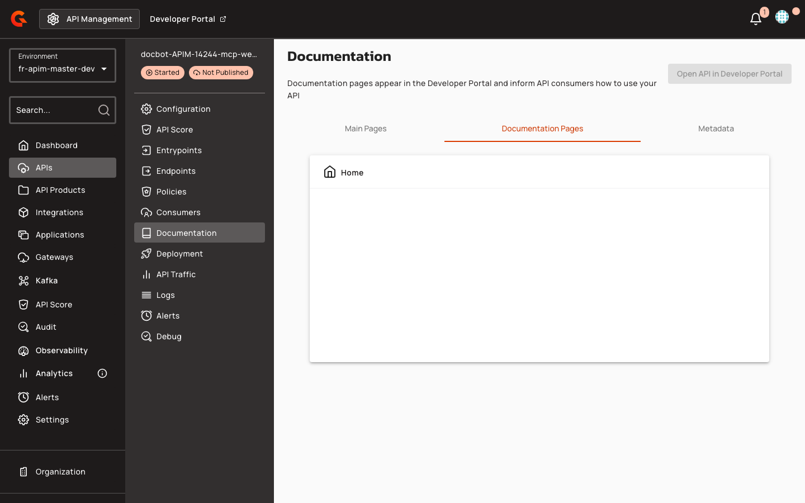

# MCP Server Installation Widget for Portal Pages

## Overview

The MCP (Model Context Protocol) Server Installation component enables API publishers to embed one-click installer actions and copyable configuration snippets directly into portal documentation pages. When users create MCP Proxy APIs, the portal automatically seeds an Overview page with a pre-configured installation widget that generates client-specific configuration for Cursor, VS Code, and Claude Desktop.

## Key Concepts

### MCP Installation Widget

The `<gmd-install-mcp>` component renders installer tabs for supported AI clients. Each tab provides either a deep-link button (Cursor, VS Code) or a copyable JSON configuration snippet (Claude Desktop). The widget adapts to both remote HTTP/SSE transports and local stdio-based MCP servers. The Monaco editor recognizes `<gmd-install-mcp>` as a valid self-closing component and provides autocomplete and hover support for its attributes.

### API Types

The portal recognizes six API types: `NATIVE`, `MESSAGE`, `PROXY`, `A2A_PROXY`, `LLM_PROXY`, and `MCP_PROXY`. Only `MCP_PROXY` APIs trigger automatic seeding of the MCP-specific Overview page template.

### Template Variables

Portal page templates use FreeMarker expressions to inject API metadata:

| Variable | Description | Example |
|:---------|:------------|:--------|
| `api.name` | API name | `"Weather Service"` |
| `api.description` | API description | `"Real-time weather data"` |
| `api.entrypoints` | List of gateway entrypoint URLs (computed from `ApiEntrypointService.getApiEntrypoints()`, includes only the `target` field of each entrypoint) | `["https://api.example.com"]` |
| `api.mcp.mcpPath` | MCP endpoint path from entrypoint configuration | `"/mcp"` |

The `api.mcp` map is populated only from the first listener's first MCP entrypoint (entrypoint type `mcp` or `mcp-proxy`). If no such entrypoint exists, the map is empty.

## Prerequisites

- A published API with at least one configured entrypoint
- For MCP Proxy APIs: an entrypoint of type `mcp` or `mcp-proxy` with `mcpPath` defined
- Portal page editing permissions to add or modify Gravitee Markdown content


## Creating MCP Installation Pages

### Manual Page Authoring

1. Navigate to the **Documentation** section of your API in API Management.

2. Select the **Documentation Pages** tab.

    <figure><figcaption></figcaption></figure>

3. Click **Add new page**.

    <figure><figcaption></figcaption></figure>

4. Select **Markdown** from the page type dropdown menu.

5. Enter a page name in the **Name** field.

6. Choose the page visibility (Public or Private).

    <figure><figcaption></figcaption></figure>

7. Click **Next** to proceed to the content editor.

8. In the Markdown editor, embed the `<gmd-install-mcp>` component with the appropriate attributes.

    <figure><figcaption></figcaption></figure>

The component accepts the following attributes:

| Attribute | Description | Example |
|:----------|:------------|:--------|
| `name` | MCP server name used in generated client configurations | `"weather"` |
| `transport` | MCP transport protocol: `http`, `sse`, or `stdio` (default: `http`) | `"http"` |
| `url` | Remote MCP endpoint URL for `http` and `sse` transports | `"https://api.example.com/mcp"` |
| `headers` | JSON object or JSON string of headers for remote transports | `'{"Authorization":"Bearer token"}'` |
| `command` | Executable used to start a stdio MCP server | `"npx"` |
| `args` | JSON array or comma-separated string of stdio command arguments | `'["-y","@acme/weather-mcp"]'` |
| `env` | JSON object or JSON string of environment variables for stdio transports | `'{"API_KEY":"secret"}'` |
| `clients` | Comma-separated list of installer IDs to display (e.g., `cursor,vscode,claude-desktop`) | `"cursor,vscode"` |

**Remote HTTP transport example**:
```html
<gmd-install-mcp name="weather" url="https://api.example.com/mcp" clients="cursor,vscode,claude-desktop" />
```

**Local stdio transport example**:
```html
<gmd-install-mcp name="weather-local" transport="stdio" command="npx" args='["-y","@acme/weather-mcp"]' clients="cursor,vscode,claude-desktop" />
```

If required inputs (`name` and either `url` or `command`) are missing, the component renders a placeholder message: `"Provide a server name and URL, or use stdio inputs for a local MCP server."` If the `clients` attribute filters out all supported installers, the component displays: `"No supported installers are available for the selected clients."`

The HTML sanitizer preserves `<gmd-install-mcp>` tags and all listed attributes when portal pages are saved. To customize component appearance, use the `@gmd.install-mcp-overrides()` SCSS mixin.

### FreeMarker Template Expressions

When authoring portal navigation page templates, use FreeMarker expressions to inject API metadata into the installation widget. The following pattern constructs the full MCP endpoint URL from the first entrypoint and the MCP path:

```html
<gmd-install-mcp 
  name="${api.name}" 
  transport="http" 
  url="<#if api.entrypoints?? && (api.entrypoints?size > 0)>${api.entrypoints[0]}</#if><#if api.mcp?? && api.mcp.mcpPath??>${api.mcp.mcpPath}</#if>" />
```

Always include null and size checks for `api.entrypoints` and `api.mcp` to prevent template rendering errors when entrypoints are not configured.

## Managing Default Overview Pages

### Automatic Seeding for MCP Proxy APIs

When default portal pages are created via `POST /portal-navigation-items/_default-pages`, the system invokes `SeedDefaultPagesForApiNavigationItemsUseCase`, which iterates through each API navigation item that does not already have a child page. For each item, the use case calls `apiCrudService.findById(apiId)` to retrieve the API type. If the type is `MCP_PROXY`, the system applies the `api-overview-mcp-proxy-page-content.md` template; otherwise, it applies the generic `api-overview-page-content.md` template. The use case then creates Gravitee Markdown content and an unpublished "Overview" child page.

The MCP Proxy template includes:

- API name and description
- An embedded `<gmd-install-mcp>` component pre-configured with `transport="http"` and a URL constructed from `${api.entrypoints[0]}${api.mcp.mcpPath}`

All other API types (`PROXY`, `MESSAGE`, `NATIVE`, `A2A_PROXY`, `LLM_PROXY`) receive the generic template. Seeding is skipped entirely if the API navigation item already has a child page.

### Supported Clients

The installation widget generates configuration snippets for three AI clients:

| Client | Installer Type | Configuration File |
|:-------|:---------------|:-------------------|
| Cursor | Deep-link button (`cursor://anysphere.cursor-deeplink/mcp/install?...`) | `~/.cursor/mcp.json` |
| VS Code | Deep-link button (`vscode:mcp/install?...`) | `mcp.json` |
| Claude Desktop | Copyable snippet only | `claude_desktop_config.json` |

Each installer tab displays a "Copy" button that changes to "Copied" for 2 seconds after the snippet is copied to the clipboard. The widget does not render a default `Authorization` header in remote server snippets and does not provide a web installer fallback button for any client.
