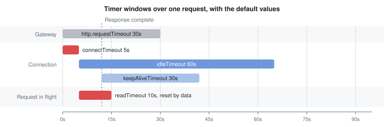
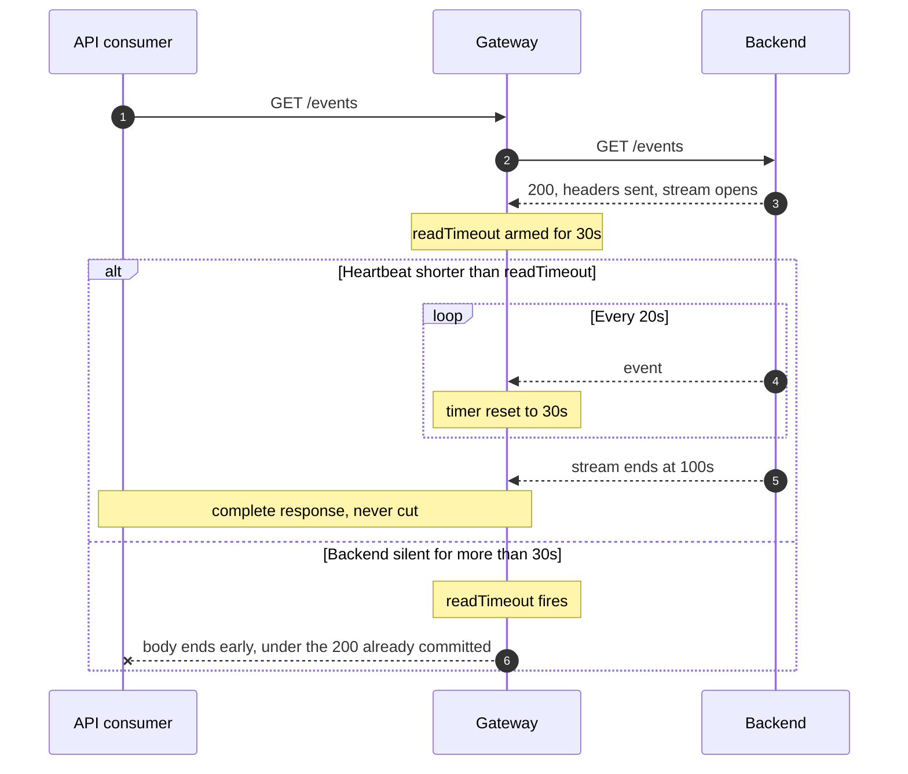

# Timeout management

## Overview

Timeouts apply at two independent scopes, and both run at the same time on every request:

* **Gateway scope.** `http.requestTimeout` bounds the processing of the request, from the moment the Gateway receives it until the response is handed over. It applies to every API deployed on that Gateway. It does **not** bound the transfer of the response body. See [Gateway request timeout](timeout-management.md#gateway-request-timeout).
* **Endpoint scope.** The HTTP client of each endpoint or endpoint group carries its own timeouts towards the backend: `connectTimeout`, `readTimeout`, `idleTimeout`, and `keepAliveTimeout`.

The two scopes don't override each other. Whichever expires first interrupts the request. An endpoint `readTimeout` longer than `http.requestTimeout` never takes effect, and the reverse is also true.

Timeouts can't be configured per plan. To apply different timeout behavior to different consumers, expose the backend through separate APIs with different endpoint configurations.

<table><thead><tr><th width="190">Setting</th><th width="120">Scope</th><th width="110">Default (ms)</th><th>What it bounds</th></tr></thead><tbody><tr><td><code>http.requestTimeout</code></td><td>Gateway</td><td>30000</td><td>The processing of the request, up to the response. Not the transfer of the body.</td></tr><tr><td><code>http.requestTimeoutGraceDelay</code></td><td>Gateway</td><td>30</td><td>The minimum execution window granted to the response phase.</td></tr><tr><td><code>connectTimeout</code></td><td>Endpoint</td><td>5000</td><td>Establishing the TCP connection to the backend.</td></tr><tr><td><code>readTimeout</code></td><td>Endpoint</td><td>10000</td><td>Waiting for the backend response, and connection acquisition from the pool. Disarmed once the response headers arrive.</td></tr><tr><td><code>idleTimeout</code></td><td>Endpoint</td><td>60000</td><td>Inactivity on the connection itself, whether or not a request is in flight.</td></tr><tr><td><code>keepAliveTimeout</code></td><td>Endpoint</td><td>30000</td><td>How long an unused connection stays in the pool. HTTP/1.x only.</td></tr></tbody></table>

You configure every one of these settings in milliseconds, at both scopes.

The following diagram places each timer on the life of a single request, using the default values. The request arrives at second 0, the connection is obtained at second 5, and the response completes at second 12.

<figure><figcaption><p>Each timer over the life of one request, with the default values</p></figcaption></figure>

Two properties of this layout carry the rules that follow. Only `readTimeout` and `idleTimeout` overlap while the request is in flight, so they're the only pair that competes. `keepAliveTimeout` starts when the connection returns to the pool, which is why it never interacts with `readTimeout`.

## How each setting behaves

### Gateway request timeout

`requestTimeout` caps the total time the Gateway spends on a request. The budget covers the backend response and the execution of response policies. When the setting is absent, the Gateway applies `30000` ms and logs a warning at startup. A value of `0` or less disables it.

When it fires, the consumer receives a `504` with the error key `REQUEST_TIMEOUT`. Responses that consistently fail at exactly 30 seconds usually indicate that the default is in effect.

`requestTimeoutGraceDelay` guarantees a minimum window for the response phase. When a request has already consumed most of its budget, the Gateway still grants at least this delay to the platform and response flows. The effective value is `Max(requestTimeoutGraceDelay, requestTimeout - apiElapsedTime)`.


`requestTimeout` stops protecting the request once the response status and headers are committed. A streamed response is therefore bounded by the endpoint timeouts alone. See [Protocol behavior](timeout-management.md#protocol-behavior).


For the configuration syntax, see [Configure your HTTP server](configure-your-http-server.md#request-timeout-behavior).

### Connect timeout

`connectTimeout` bounds the establishment of the TCP connection to the backend, including the TLS handshake. When it fires, the consumer receives a `504` with the error key `GATEWAY_CLIENT_CONNECT_TIMEOUT`, and the message names the target host.


`connectTimeout` doesn't bound the acquisition of a connection **from the pool**. That wait is governed by `readTimeout`. A request queued behind a saturated pool therefore waits up to `readTimeout`, not up to `connectTimeout`. Both cases report `GATEWAY_CLIENT_CONNECT_TIMEOUT`, and the duration in the message tells them apart.


### Read timeout

`readTimeout` bounds the wait for the backend **response**, not the whole request and not the transfer of the body. It expires when the backend has sent nothing for the configured duration, and it is **disarmed as soon as the response headers arrive**.

Past that point, the response is governed by `idleTimeout` alone, which is reset by each chunk. This is why a streaming API is bounded by `idleTimeout` and not by `readTimeout`, however short the latter is.

The same value also governs the acquisition of a connection from the pool, as described above.

When it fires, the consumer receives a `504` with the error key `GATEWAY_CLIENT_READ_TIMEOUT`, and the message names the timeout, the method, and the target.

### Idle timeout

`idleTimeout` is a **connection-level** timer. It closes the connection when no data is received or sent for the configured duration. It has no notion of a request in flight, so it applies whether the connection is idle in the pool or actively carrying a request.

When it closes a connection that carries a request, the failure surfaces as a `502` with the error key `GATEWAY_CLIENT_CONNECTION_CLOSED`. When the response had already started, the key is `GATEWAY_CLIENT_STREAM_ENDED_EARLY`, recorded on the status already sent. A genuine backend disconnection produces the same keys. See [Diagnose a timeout](timeout-management.md#diagnose-a-timeout).


`idleTimeout` is configured in milliseconds but applied in whole seconds. The remainder is discarded: `12200` ms becomes 12 seconds. Any value below `1000` ms becomes `0`, which **disables the timeout** instead of tightening it.


### Keep-alive timeout

`keepAliveTimeout` determines how long a connection stays **unused in the pool** before it's evicted and closed. It never applies to a request in flight, so it doesn't interact with `readTimeout`.

Two properties are worth knowing:

* It applies to **HTTP/1.x only**. HTTP/2 connections are governed by `idleTimeout` alone.
* When the backend returns a `Keep-Alive: timeout=N` header, the Gateway adopts that value for the connection, replacing the configured one. Backends that advertise their keep-alive timeout therefore align the Gateway automatically.

Backends that close idle connections without advertising the header are the case to configure for. Set `keepAliveTimeout` below the backend's own keep-alive window, so that the pool retires connections before the backend drops them.

The next request to borrow a connection the backend has already retired is now retried transparently, when it qualifies — see [Retry on a closed or reset connection](timeout-management.md#retry-on-a-closed-or-reset-connection). Tuning `keepAliveTimeout` is still worth doing: it avoids the wasted round trip the retry costs, and it remains the only protection for a `POST`, a `PATCH`, or any request sent with a body. It's no longer the only thing standing between this race and a client-visible `502`.

Like `idleTimeout`, this value is applied in whole seconds.

### Retry on a closed or reset connection

**Available from 4.12.18.** A pooled connection can be closed or reset by the backend, or by an intermediary such as a load balancer, in the gap between the Gateway taking it from the pool and writing the next request to it — a race no timeout configuration eliminates, since a connection is only discovered to be dead by writing to it. The retry isn't restricted to that race: any connection closed or reset before the response headers arrive triggers it, on a connection just opened as much as on a reused one, and even when the backend had already received the request. That's why it's limited to requests that are safe to send twice.

The Gateway retries such a request once, on a fresh connection, when all of the following hold:

* The Gateway hadn't yet written a body to the backend for this request. The test is the presence of a `Content-Length` or a `Transfer-Encoding` header, so a `GET` that carries `Content-Length: 0` is excluded even though it has no body.
* The request method is idempotent: `GET`, `HEAD`, `OPTIONS`, `TRACE`, `PUT`, or `DELETE`.
* The API consumer reached the Gateway over HTTP/1.1. An HTTP/2 request signals its body with data frames rather than with a header, so the Gateway treats every HTTP/2 request as carrying a body — a `GET` included — and never retries it. The version that decides is the one the consumer used, not the one configured on the endpoint.

A request that fails any of these conditions — a `POST`, a `PATCH`, or any request sent with a body — isn't retried. Whether the request was ineligible for the retry or the retried attempt failed the same way, the failure is reported as `GATEWAY_CLIENT_CONNECTION_CLOSED` or `GATEWAY_CLIENT_CONNECTION_RESET`. See [Backend connection failures](../analyze-and-monitor-apis/gateway-error-key-reference.md#backend-connection-failures).

The retry lives in the HTTP proxy endpoint of a v4 API. Three paths never retry, whatever the request looks like: an API with a v2 definition, which reaches its backend through a different connector; a gRPC endpoint, which always negotiates HTTP/2; and a WebSocket endpoint.

The retry uses a fresh connection and therefore a fresh `readTimeout` window, so the worst case at the endpoint becomes **2 × `readTimeout`**. See [Keep http.requestTimeout above twice readTimeout](timeout-management.md#keep-httprequesttimeout-above-twice-readtimeout).

The retry is logged at `WARN`, naming the endpoint, so it stays observable even when it succeeds and the client never sees a failure.

## Configuration rules

### Keep `readTimeout` shorter than `idleTimeout`

This is the one inequality that governs correctness. Both timers run while the Gateway waits for the response, and the shorter one wins. Past the response headers, only `idleTimeout` remains, so it also has to suit your streaming APIs on its own.

* When `readTimeout` is the shorter, an unresponsive backend produces a `504` with `GATEWAY_CLIENT_READ_TIMEOUT` and a message naming the timeout, the method, and the target.
* When `idleTimeout` is the shorter, it closes the connection first. `readTimeout` can never fire, and the failure is reported as a connection closed by the backend — a disconnection that didn't happen.

The default values satisfy this rule. Inverting them changes the diagnosis rather than the behavior. The request fails at the same point either way, but the reported cause then points at the backend.


For a body-less idempotent request, [the retry on a closed or reset connection](timeout-management.md#retry-on-a-closed-or-reset-connection) can't tell this self-inflicted closure apart from a genuine one by the backend — it only recognizes the Gateway's own explicit cancellations, such as a client abort, not a connection its own `idleTimeout` closed. The retried connection is governed by the same misconfiguration and closes the same way, so the closure is retried once: the caller waits roughly twice as long before the failure surfaces, and depending on `http.requestTimeout`, it can shift from a `502` (`GATEWAY_CLIENT_CONNECTION_CLOSED`) to a `504` (`REQUEST_TIMEOUT`).


### Keep `http.requestTimeout` above twice `readTimeout`

The endpoint timeout produces the more precise diagnosis, so let it fire first. A request eligible for [the retry on a closed or reset connection](timeout-management.md#retry-on-a-closed-or-reset-connection) can consume a fresh `readTimeout` window twice, so `http.requestTimeout` has to clear **2 × `readTimeout`** for a retried request to reach that second window — below that margin it fails as `REQUEST_TIMEOUT` instead. That second window is only consumed when the connection breaks late, once the Gateway has already waited on the backend; the pool reuse race breaks it on the write. Weigh the margin against the fact that `http.requestTimeout` is Gateway-wide, while `readTimeout` is per endpoint: raising it relaxes the backstop of every API on that Gateway. And keep it below whatever the API consumers themselves tolerate.

### Size `readTimeout` from the backend, not from the stream

Because `readTimeout` measures inactivity, it doesn't need to accommodate the total duration of a long response. Set it from the p99 response time of the backend, plus margin. For streaming APIs, the constraint is on the heartbeat interval rather than the stream duration — see [Protocol behavior](timeout-management.md#protocol-behavior).

### Bound the pool wait

`maxConcurrentConnections` caps the pool. Requests that find it full wait for a slot, and that wait is bounded by `readTimeout`. A long `readTimeout` therefore has a second effect: each failing request holds a connection for that duration, which reduces the throughput the pool can sustain.

## Protocol behavior

The timer that actually governs a request depends on the protocol, and on whether the exchange is a single request-response or a long-lived stream.

<table><thead><tr><th width="170">Protocol</th><th width="185">Governing timer</th><th>Notes</th></tr></thead><tbody><tr><td>HTTP/1.1</td><td><code>readTimeout</code> until the response headers, then <code>idleTimeout</code></td><td><code>readTimeout</code> bounds the wait for the response. Once it arrives, <code>idleTimeout</code> governs, reset by each chunk.</td></tr><tr><td>HTTP/2</td><td><code>readTimeout</code> per stream, until its response headers</td><td><code>idleTimeout</code> applies to the shared connection. <code>keepAliveTimeout</code> doesn't apply.</td></tr><tr><td>SSE and chunked streaming</td><td><code>idleTimeout</code></td><td>The stream starts with the response headers, which disarm <code>readTimeout</code>. The heartbeat interval must stay below <code>idleTimeout</code>.</td></tr><tr><td>WebSocket</td><td><code>idleTimeout</code></td><td><code>readTimeout</code> covers the handshake only. Reset by any traffic in either direction.</td></tr><tr><td>gRPC</td><td><code>readTimeout</code></td><td>Runs over HTTP/2. A timeout reaches the client as <code>UNAVAILABLE</code>.</td></tr></tbody></table>

### HTTP/1.1

One connection carries one request at a time. `readTimeout` bounds the wait for the backend response and is disarmed once its headers arrive; `idleTimeout` bounds the connection itself, before and after that point. Once the response ends and the connection returns to the pool, `keepAliveTimeout` governs how long it's retained.

### HTTP/2

An HTTP/2 connection is multiplexed: several streams share it. This changes two things.

* `readTimeout` still applies per request, so each stream carries its own inactivity timer.
* `idleTimeout` applies to the **connection**, which means it's reset by traffic on any of its streams. A connection carrying one active stream stays alive for all the others. Conversely, when it does expire, every stream on that connection is affected.

`keepAliveTimeout` has no effect on HTTP/2 connections.

Two further settings size the connection pool. `http2MultiplexingLimit` caps the concurrent streams per connection, and defaults to `25` streams. `maxConcurrentConnections` caps the connections themselves, and the Gateway applies `100` connections when the setting is absent. The product of the two gives the maximum number of concurrent requests towards the backend, subject to the limit the server advertises in its own settings.


The console can propose a different `maxConcurrentConnections` depending on the endpoint plugin, and the value it proposes is then stored in the API. Check the value your API carries rather than assuming the Gateway default.


### Server-sent events and chunked streaming

A stream isn't bounded by `readTimeout` — only the gaps between its events are. A stream that keeps emitting data runs for as long as the backend keeps producing it, regardless of how short `readTimeout` is.

The requirement is therefore:

> heartbeat interval < `readTimeout`

A short `readTimeout` doesn't break long-lived streams. It breaks streams that go quiet for longer than the timeout.



Before you lower `readTimeout`, confirm the heartbeat interval of each streaming backend. If one exceeds the value you plan to set, either shorten the heartbeat or give that API its own shared configuration with a longer `readTimeout` — still below its `idleTimeout`.


When a stream is cut after the response headers were committed, the status has already been sent. The consumer receives a truncated body under the status that was announced, usually `200`, and the failure appears in the metrics rather than in the status. Consider streamed responses as successful only when the payload is complete.


### WebSocket

`readTimeout` covers the handshake only. Once the session is established, `readTimeout` no longer applies, and the connection is governed by `idleTimeout` alone.

`idleTimeout` is reset by traffic in either direction, so an application-level ping keeps the session open. Set `idleTimeout` above the ping interval of the client or the backend, whichever is longer. A session that goes quiet for longer than `idleTimeout` is closed with a normal close frame.

This is the one protocol where `idleTimeout` is the setting to tune rather than a safety net.

### gRPC

gRPC runs over HTTP/2, which the Gateway selects for these endpoints regardless of the configured version. The multiplexing behavior described in [HTTP/2](timeout-management.md#http-2) applies.

`readTimeout` applies as it does to any HTTP request. When it fires, the `504` is translated by the gRPC layer, and the client observes the `UNAVAILABLE` status code rather than an HTTP status.

## Start from the defaults

The default values already satisfy the rules above. `readTimeout` at `10000` ms sits well below `idleTimeout` at `60000` ms, and the Gateway `requestTimeout` of `30000` ms sits above **2 × `readTimeout`** (`20000` ms). A backend that answers within ten seconds needs no timeout configuration at all.

Change them when the backend is slower than the default `readTimeout`, in this order:

1. Raise `readTimeout` to the p99 response time of the backend, plus margin.
2. Raise `idleTimeout` if the new `readTimeout` comes close to it. Keep a clear gap between the two.
3. Raise `http.requestTimeout` above **2 ×** the new `readTimeout`. The default of `30000` ms no longer clears a `readTimeout` set to `15000` ms or higher.

The following example configures an endpoint whose backend answers in about 25 seconds at the p99.


```json
{
  "http": {
    "connectTimeout": 5000,
    "readTimeout": 30000,
    "keepAliveTimeout": 30000,
    "idleTimeout": 90000,
    "maxConcurrentConnections": 100,
    "keepAlive": true,
    "pipelining": false,
    "followRedirects": false,
    "useCompression": true,
    "version": "HTTP_1_1"
  }
}
```



```yaml
http:
  requestTimeout: 70000
  requestTimeoutGraceDelay: 30
```


`keepAliveTimeout` keeps its default here. It governs connections that sit unused in the pool, so a slow backend gives no reason to change it. Adjust it against the keep-alive window of the backend, as described in [Keep-alive timeout](timeout-management.md#keep-alive-timeout).

The ordering carries the behavior, not the values. `readTimeout` stays the shortest, so it governs and produces the precise diagnosis. `idleTimeout` stays a safety net rather than the effective limit. `requestTimeout` stays above **2 ×** `readTimeout` (`70000` ms above `60000` ms here), giving a retried attempt room to complete before the Gateway budget expires.

## Diagnose a timeout

The error key recorded in the API logs and analytics identifies which timer fired.

<table><thead><tr><th width="330">Error key</th><th width="80">Status</th><th>What fired</th></tr></thead><tbody><tr><td><code>REQUEST_TIMEOUT</code></td><td>504</td><td>The Gateway-level <code>requestTimeout</code>.</td></tr><tr><td><code>GATEWAY_CLIENT_CONNECT_TIMEOUT</code></td><td>504</td><td>No connection was obtained in time: TCP establishment, or a wait on a saturated pool.</td></tr><tr><td><code>GATEWAY_CLIENT_READ_TIMEOUT</code></td><td>504</td><td>The connection was established, and the backend then went silent for longer than <code>readTimeout</code>.</td></tr><tr><td><code>GATEWAY_CLIENT_CONNECTION_CLOSED</code></td><td>502</td><td>The connection closed while a response was still expected. See the note below.</td></tr></tbody></table>

For the complete list of connectivity error keys, see [Execution transparency analytics](../analyze-and-monitor-apis/execution-transparency-analytics.md#connectivity-and-timeout-error-keys).

### Distinguish a backend closure from an idle timeout

A connection closed mid-exchange covers the following two situations, which used to report identically:

* The backend closed the connection while the response was incomplete.
* The Gateway closed it on its own `idleTimeout`.


**From 4.12.16, the Gateway tells you which one it was.** The error message states how long the backend had been silent before the connection closed. When that silence matches the endpoint's `idleTimeout`, the message says that the Gateway is the likely closer, and names the configured values:

```text
The backend ended the response body before it was complete (Connection was closed), after
123062 ms, having received nothing from it for the last 122002 ms. This matches the endpoint
idleTimeout (122000 ms, applied as 122000 ms), so the gateway itself likely closed this
connection. Note that readTimeout (240000 ms) is not shorter than idleTimeout, so it can never
fire: lowering readTimeout below idleTimeout would surface this as a read timeout instead.
```

The last two sentences only appear when the evidence supports them. On a genuine backend failure, the message stops after the durations and makes no claim about your configuration.


On earlier versions, the duration is the only clue. An `idleTimeout` produces the **same duration every time**, within a few milliseconds of the configured value. A genuine backend problem produces scattered durations. If your failures cluster tightly around your `idleTimeout`, and `readTimeout` is longer than it, the Gateway is the one closing the connection.

Compare the **silence**, not the total duration of the exchange. `idleTimeout` restarts on every byte received, so a stream that ran for ten minutes before going quiet is still cut one `idleTimeout` after its last byte.

To resolve the ambiguity whatever the version, set `readTimeout` below `idleTimeout`. The same situation then surfaces as `GATEWAY_CLIENT_READ_TIMEOUT` with a `504` and a message naming the timeout, the method, and the target.


On connection failures, the `ExecutionFailure` carries a key and a cause, but no message. In a response template, use `{#error.cause}` rather than `{#error.message}`, which is empty for these errors.


## Related pages

* [Configure your HTTP server](configure-your-http-server.md) — the Gateway-side settings and their syntax.
* [Endpoints](../create-and-configure-apis/configure-v4-apis/endpoints/README.md) — where the endpoint timeouts are configured in the console.
* [Execution engine](../create-and-configure-apis/gravitee-api-definitions/execution-engine.md#timeout-management) — how the reactive engine applies the Gateway timeout across the request and response phases.
* [Execution transparency analytics](../analyze-and-monitor-apis/execution-transparency-analytics.md#connectivity-and-timeout-error-keys) — the complete error key reference.
