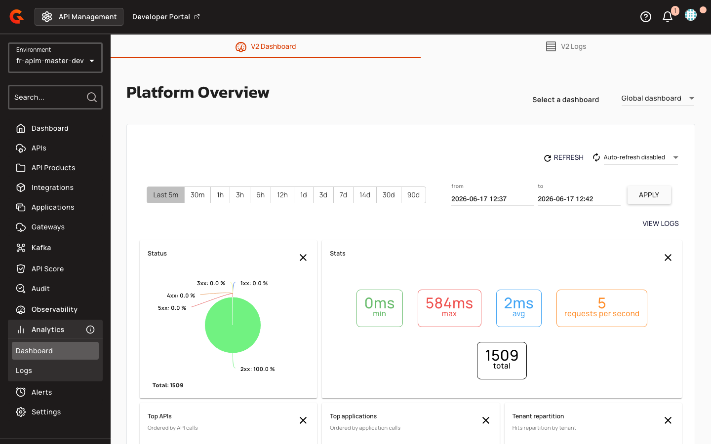
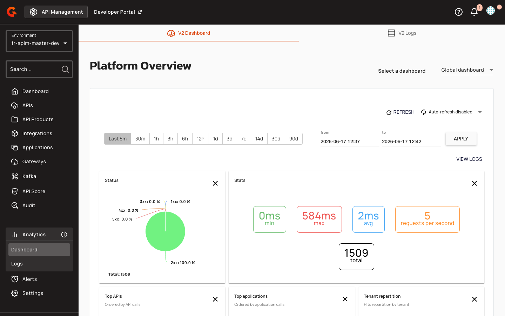

# Preserve V2 Analytics After Migration to V4

## Overview

Starting with this release, migrating an HTTP Proxy API (v2) to v4 no longer causes a loss of historical analytics data. The v4 analytics dashboard now queries both v4 and v2 analytics indices, preserving all historical metrics collected before migration. This capability requires a one-time manual update to existing Elasticsearch or OpenSearch indices.

## Key Concepts

### Field Aliases

Field aliases map v4 canonical field names to their v2 equivalents in the analytics index. When the v4 analytics dashboard queries for `api-id`, Elasticsearch or OpenSearch automatically resolves the query against v2 documents that store the same value under the legacy `api` field name. Nine aliases enable this cross-version compatibility:

| V4 Field Name (Alias) | V2 Field Name (Target) |
|:----------------------|:-----------------------|
| `api-id` | `api` |
| `application-id` | `application` |
| `plan-id` | `plan` |
| `gateway-response-time-ms` | `response-time` |
| `http-method` | `method` |
| `transaction-id` | `transaction` |
| `subscription-id` | `subscription` |
| `gateway-latency-ms` | `proxy-latency` |
| `endpoint-response-time-ms` | `api-response-time` |

### Index Template Updates

The APIM gateway automatically updates the `gravitee-request` index template on startup to include field aliases. However, index templates only apply to newly created indices. Existing `gravitee-request-*` indices retain their original mappings and will not include the aliases until manually updated.

### Analytics Query Behavior

Analytics queries (histogram, group-by, stats, requests count, response time, response status, connection logs) now search both the `gravitee-v4-metrics-*` and `gravitee-request-*` indices. V2 APIs are accepted for analytics operations, and their data is included in dashboard results alongside v4 metrics.

## Prerequisites

- Elasticsearch 7.x, 8.x, 9.x, or OpenSearch cluster
- HTTP client access to the Elasticsearch or OpenSearch REST API (via Kibana Dev Tools, `curl`, or equivalent)
- Knowledge of your Gravitee analytics index prefix (default: `gravitee`; customizable via `reporters.elasticsearch.index` in `gravitee.yml`)

## Creating Field Aliases on Existing Indices

Without field aliases on existing `gravitee-request-*` indices, queries from the v4 analytics dashboard that reference v4 field names will fail to match v2 documents stored in those indices. You will see incomplete or missing analytics for migrated APIs until the aliases are added.

Execute the following request against your Elasticsearch or OpenSearch cluster to add the aliases to all existing `gravitee-request-*` indices in a single call:

```http
PUT /gravitee-request-*/_mapping
{
  "properties": {
    "api-id": {
      "type": "alias",
      "path": "api"
    },
    "application-id": {
      "type": "alias",
      "path": "application"
    },
    "plan-id": {
      "type": "alias",
      "path": "plan"
    },
    "gateway-response-time-ms": {
      "type": "alias",
      "path": "response-time"
    },
    "http-method": {
      "type": "alias",
      "path": "method"
    },
    "transaction-id": {
      "type": "alias",
      "path": "transaction"
    },
    "subscription-id": {
      "type": "alias",
      "path": "subscription"
    },
    "gateway-latency-ms": {
      "type": "alias",
      "path": "proxy-latency"
    },
    "endpoint-response-time-ms": {
      "type": "alias",
      "path": "api-response-time"
    }
  }
}
```

You can execute this via Kibana Dev Tools, `curl`, or any HTTP client:

```bash
curl -X PUT "https://<your-es-host>:9200/gravitee-request-*/_mapping" \
  -H "Content-Type: application/json" \
  -d '{
  "properties": {
    "api-id": { "type": "alias", "path": "api" },
    "application-id": { "type": "alias", "path": "application" },
    "plan-id": { "type": "alias", "path": "plan" },
    "gateway-response-time-ms": { "type": "alias", "path": "response-time" },
    "http-method": { "type": "alias", "path": "method" },
    "transaction-id": { "type": "alias", "path": "transaction" },
    "subscription-id": { "type": "alias", "path": "subscription" },
    "gateway-latency-ms": { "type": "alias", "path": "proxy-latency" },
    "endpoint-response-time-ms": { "type": "alias", "path": "api-response-time" }
  }
}'
```

If your indices use a custom prefix (configured via `reporters.elasticsearch.index` in `gravitee.yml`), replace `gravitee-request-*` with `<your-prefix>-request-*`.

A successful response returns:

```json
{
  "acknowledged": true
}
```

The operation is idempotent. If an alias already exists on an index (from a previous run or because the index was created after the template update), the call succeeds without error.

## Verifying Field Aliases

After applying the mapping update, confirm the aliases are in place by inspecting the mapping of any `gravitee-request-*` index:

```http
GET /gravitee-request-*/_mapping
```

Each index should now list the nine alias fields alongside the original v2 fields. For example:

```json
"api-id": {
  "type": "alias",
  "path": "api"
}
```

## Viewing Combined Analytics in the Console

1. Navigate to **APIs** in the left sidebar.
2. Select a migrated API (one that was originally v2 and has been migrated to v4).
3. Expand the **Analytics** section.

    <figure><figcaption></figcaption></figure>

    The dashboard displays aggregated metrics from both v2 and v4 indices. Response time statistics, request counts, and status distributions reflect the complete history of the API across both versions.

4. Click **Logs** to view connection logs.

    <figure><figcaption></figcaption></figure>

    Connection logs include request records from both the v2 and v4 analytics indices, providing a unified view of all API traffic before and after migration.
