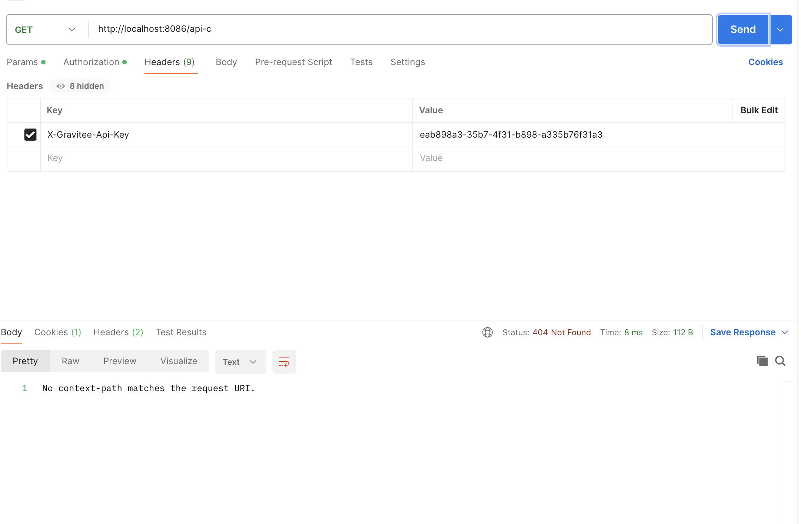

# Configure API Product Deployment with Sharding Tags

## Overview

API Product deployment configuration enables platform administrators to control where API Products and their plans are deployed across gateway instances using sharding tags. By assigning organization-level sharding tags to API Products and their plans, administrators can route traffic to specific gateway clusters (for example, regional gateways, secured environments, or dedicated infrastructure) without modifying individual member APIs.

When sharding tags are applied to an API Product, the product and its plans are deployed only to gateways that match at least one of the assigned tags. This capability extends the existing API-level sharding tag model to the API Product layer, allowing you to manage deployment targets at the product level while maintaining flexibility for individual API configurations.

<figure><figcaption></figcaption></figure>

## Key Concepts

### Sharding Tags

Sharding tags are organization-level identifiers that control which gateway instances serve specific API Products, plans, and APIs. Each tag consists of a key, name, and optional description. Tags may be restricted to specific user groups, limiting which administrators can assign them. Gateway instances declare their supported tags in configuration files; only entities with matching tags are indexed and served by that gateway. Console tag assignment alone is not enough — each target gateway must declare the corresponding tag key in its configuration.

### API Product Tags

API Product tags define the set of gateway instances eligible to serve the product. When an API Product has no tags assigned, it is eligible on all gateways (when deployed). When tags are assigned, the product is indexed only on gateways whose configured tags intersect with the product's tags. API Product tags establish the ceiling for plan tags — no plan can be deployed to a gateway that the product itself does not cover.

### Plan Tags

Plan tags refine deployment placement within the scope of the parent API Product's tags. Plan tags must be a subset of the API Product's tags. A plan with no tags is eligible on all gateways where its parent product is eligible. A plan with tags is indexed only on gateways that match both the product's tags and the plan's tags. Only published or deprecated plans are considered during gateway indexing.

To configure plan sharding tags:

1. Navigate to **API Products** in the left sidebar.
2. Select your API Product and go to **Consumers** > **Plans**.
3. Open the plan you want to configure.
4. Scroll down to the **Deployment** section.
5. In the **Sharding tags** dropdown, select one or more tags from the available options. The available tags are constrained to those defined on the parent API Product.

    <figure><figcaption></figcaption></figure>

### Member API Deployment Eligibility

A member API is deployed to a gateway if **either** its own sharding tags match the gateway **or** it has at least one published or deprecated API Product plan indexed on that gateway. For the product plan path, the product's tags must match the gateway, and the plan's tags must be empty (inheriting product placement) or match the gateway. An API whose own tags don't match can still run on a gateway via the product plan path when the product matches and a qualifying plan is indexed — plan sharding tags are not required. Standalone APIs (not members of any API Product) deploy only when their own tags match the gateway.

## Prerequisites

- Organization-level sharding tags must be defined at **Organization → Entrypoints & Sharding Tags** before they can be assigned to API Products or plans.
- Target gateway instances must declare the corresponding tag keys in their configuration files. Console tag assignment alone does not enable deployment — the gateway must recognize the tag.
- Users assigning tags must have permission to use them. Group-restricted tags can only be assigned by members of the specified groups.
- Users must hold the **API_PRODUCT_DEFINITION:READ** permission to view the Deployment tab.
- Users must hold the **API_PRODUCT_DEFINITION:UPDATE** permission to assign tags to API Products or deploy them.
- Users must hold the **API_PRODUCT_PLAN:CREATE** or **API_PRODUCT_PLAN:UPDATE** permission to assign tags to plans.

## Configuring API Product Deployment

Navigate to **API Product → Deployment** to assign sharding tags to the API Product. The Deployment page displays the header title **Deployment** and the header subtitle **Manage sharding tags and where this API Product is deployed.** The navigation menu item uses the **gio:rocket** icon. The Deployment page requires the **API_PRODUCT_DEFINITION:READ** permission to view. Users with read-only definition access see the selector disabled.

1. Select one or more tags from the **Sharding Tags** dropdown. The field description text reads: **Choose the sharding tags that you want to assign to the API Product. This dictates where it is deployed. Sharding tags are configured at the Organization level.** The dropdown lists all organization-level sharding tags. Only tags the current user is allowed to use appear as selectable options — unrestricted tags are available to all users; group-restricted tags are available only to members of those groups.

    <figure><figcaption></figcaption></figure>

    <figure><figcaption></figcaption></figure>

    <figure><figcaption></figcaption></figure>

2. After selecting tags, the page displays an out-of-sync notification banner at the top: **This API Product is out of sync.** with a **Deploy API Product** button. An out-of-sync status does not mean the product is undeployed on gateways — it indicates that the runtime state does not yet reflect the latest configuration.

    <figure><figcaption></figcaption></figure>

3. Save the configuration. When the form is modified, a save bar appears at the bottom of the page with the message **You have unsaved changes** and **Discard** and **Save** buttons.

    <figure><figcaption></figcaption></figure>

4. Click **Save**. On submit, only the tags the current user is allowed are accepted (unrestricted tags for all users; group-restricted tags only for members of those groups). The updated tags are persisted to the API Product definition via `PUT /api-products/{id}`. A success message confirms the save: `"Configuration successfully saved!"` The form reloads after save.

| Property | Description | Example |
|:---------|:------------|:--------|
| **Sharding Tags** | Organization-level tags that dictate where the API Product is deployed. Gateway instances only index and serve the product when product tags match their configured sharding tags. | `["eu", "secured-edge"]` |

The API Products list table includes a **Sharding Tags** column. If the product has a single tag, the tag name is displayed. If the product has multiple tags, the first tag is shown with a badge indicating the count of additional tags (for example, `"2 more"`). Hovering over the badge displays a tooltip with all tags.

### Validation and Constraints

- Plan tags must be a subset of the API Product's tags. Tags not defined on the product cannot be added to the plan.
- When tags are removed from the API Product, any plan tags that are no longer on the product are automatically stripped from affected plans.
- Expanding product tags does not retroactively add tags to existing plans.
- Clearing all product tags clears all plan tags on that product's plans.
- If a tag has restricted groups, only members of those groups can assign it. Other users receive a validation error on save.
- Deleting an organization tag removes it from all API Products and their plans in all environments.

### Gateway Runtime Behavior

| Gateway Configuration | Behavior |
|:---------------------|:---------|
| No sharding tags configured | Gateway retrieves all API Products, plans, and APIs. |
| One or more sharding tags configured | Gateway only indexes entities whose tags intersect with its configured tags. Within an eligible product, only published or deprecated plans whose plan tags match the gateway are indexed. Tagless plans match any gateway that already matched the product. |


Sharding tag changes to an API Product require explicit re-deployment to take effect on the gateway.



All tag changes on API Products and plans produce audit log entries on the affected resource.

