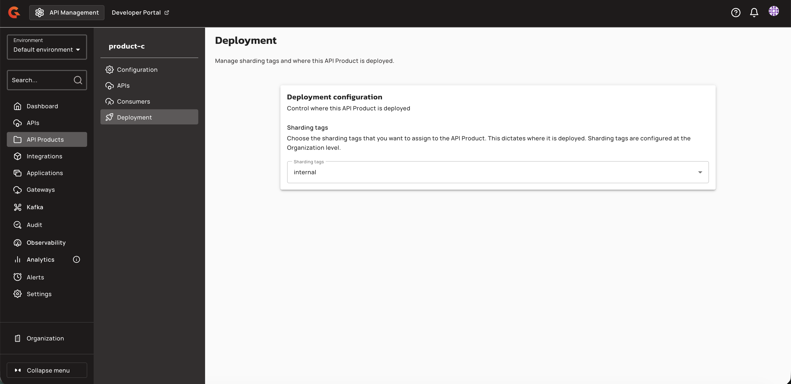
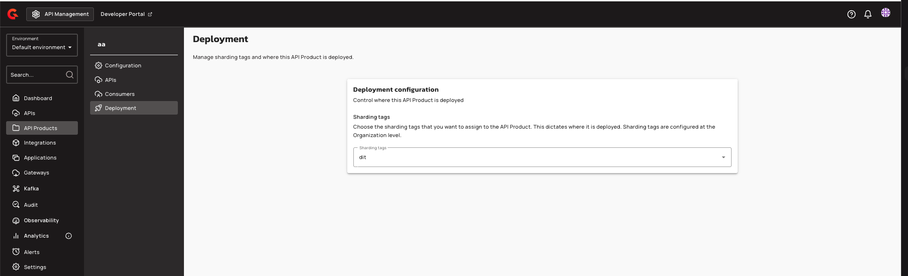
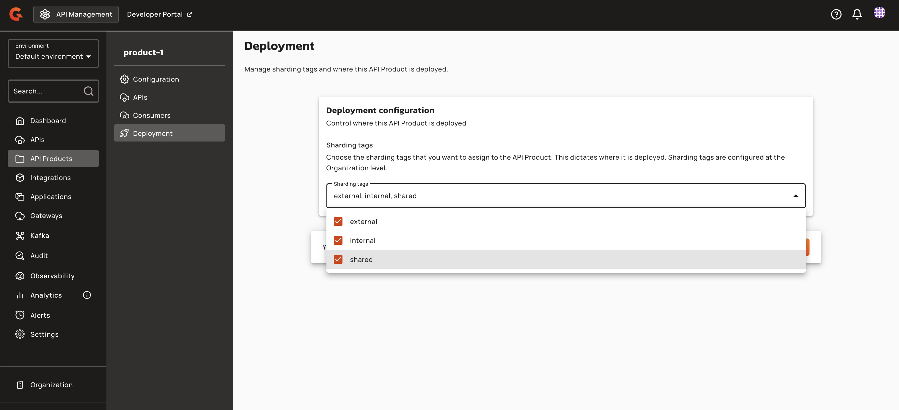

# Configure API Product Deployment

## Creating API Product Deployment Configuration

Navigate to **API Product → Deployment** to assign sharding tags to an API Product. The Deployment tab controls where the product is deployed by selecting one or more organization-level sharding tags.

1. Open the **Sharding Tags** dropdown. The dropdown lists all organization-level sharding tags with their names and optional descriptions.

    <figure><figcaption></figcaption></figure>

2. Select one or more tags from the dropdown. Only tags the current user is allowed to assign appear enabled—unrestricted tags for all users, and group-restricted tags only for members of those groups.

    <figure><figcaption></figcaption></figure>

    <figure><figcaption></figcaption></figure>

    <figure><figcaption></figcaption></figure>

    <figure><figcaption></figcaption></figure>

    <figure><figcaption></figcaption></figure>

    <figure><figcaption></figcaption></figure>

3. If you select a restricted tag that you are not authorized to use, the system displays a validation error at the bottom of the page.

    <figure><figcaption></figcaption></figure>

4. After selecting valid tags, click **Save** to persist the tags on the API Product definition. The system displays an unsaved changes notification until you save.

    <figure><figcaption></figcaption></figure>

5. Once saved, a success message appears confirming the configuration was saved.

    <figure><figcaption></figcaption></figure>

    <figure><figcaption></figcaption></figure>

Saving tags marks the API Product as out of sync until deployed. An orange banner appears at the top of the page indicating "This API Product is out of sync."

<figure><figcaption></figcaption></figure>

<figure><figcaption></figcaption></figure>

6. To synchronize the updated tags and published plans to gateway instances, click **Deploy API Product** in the banner or header. A confirmation dialog appears.

    <figure><figcaption></figcaption></figure>

7. Click **Deploy** to complete the deployment. Gateway instances index and serve the product only when the product's tags match their configured sharding tags.

    <figure><figcaption></figcaption></figure>

    <figure><figcaption></figcaption></figure>

| Field | Description | Example |
|:------|:------------|:--------|
| **Sharding Tags** | Organization-level sharding tags assigned to the API Product. Dictates which gateway instances index and serve the product. | `eu`, `us-west` |

Member APIs linked to the product may become deployable on a gateway even when the API's own tags do not match, as long as the product and at least one published plan are eligible on that gateway.

Users with the `API_PRODUCT_DEFINITION:READ` permission can view the Deployment tab but cannot modify tags. Users without `API_PRODUCT_DEFINITION:UPDATE` permission see the sharding tag selector disabled.
