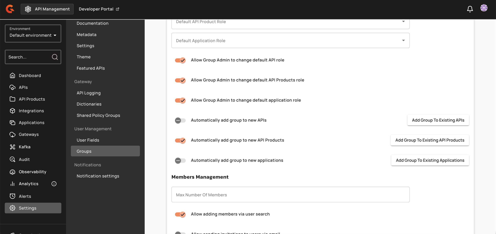

# Configure API Product Primary Owner Mode and Group Defaults

## Configure API Product Primary Owner mode

The **API Product Primary Owner mode** setting determines who can be designated as the Primary Owner when creating a new API Product. This setting is configured per environment and mirrors the existing API Primary Owner mode.

1. From the **Dashboard**, click **Settings**.
2. From the **Settings** menu, navigate to the **Portal** section, and then click **Settings**.
3. Locate the **API Product Primary Owner mode** section, and then select one of the following modes:
   * **USER**:Only individual users can be designated as primary owner. The creator or an explicitly chosen user becomes the primary owner.
   * **GROUP**: Only groups can be designated as primary owner. A group, chosen at creation or defaulted, becomes the primary owner. The role is inherited by group members. The group must contain at least one member with a PRIMARY_OWNER role for API Products.
   * **HYBRID**: The creator may choose either a user or a group as primary owner at creation time.

The selected mode also constrains the **Transfer ownership** action on existing API Products. For example, in **GROUP** mode, ownership can only be transferred to another group.


The Primary Owner mode is read at API Product creation. Changing the mode does not retroactively update the primary owner of existing API Products. Use the **Transfer ownership** action to reassign ownership for existing products.


## Set default API Product role on a group

Each group can declare a default API Product role that is applied when the group is attached to an API Product or when a new member is added to the group. To set the deafult API Product role on a group, complete the following steps:
1. From the **Dashboard**, click **Settings**.
2. From the **Settings** menu, navigate to the **User Management** section, and then click **Groups**.
3. Navigate to the group you want to configure, and then click the **pencil icon**.
4. Navigate to the **Roles & Permissions** section, and then, from the **Default API Product Role**, select one of the following API Product Roles: **USER**, **OWNER**, or a custom role.

The default role is applied in the following scenarios:
* When the group is attached to an API Product, all group members receive this role on that product.
* When a new member is added to the group, the member inherits this role on every API Product the group is currently attached to.


The default role only applies at the time of group attachment or member addition. Changing the default role later does not retroactively update existing members.


## Assign group to all new API Products

When enabled, a group is automatically attached to every API Product created afterward. Members of the group automatically gain the group's default API Product role on each new product. To assign a group to all new API Products, complete the following steps:
1. From the **Dashboard**, click **Settings**.
2. From the **Settings** menu, navigate to the **User Management** section, and then click **Groups**.
3. Navigate to the group you want to configure, and then click the **pencil icon**.
4. Navigate to the **Roles & Permissions** section, and then enable the **Automatically add group to new API Products** toggle.

<figure><figcaption></figcaption></figure>


The auto assign setting is evaluated at API Product creation. Disabling the toggle does not detach the group from API Products that were created while the toggle was enabled.


## Assign group to all existing API Products

This one-shot bulk action attaches a group to every API Product currently in the environment. This is useful when introducing a new "platform" or "viewers" group after API Products already exist.

1. From the **Dashboard**, click **Settings**.
2. From the **Settings** menu, navigate to the **User Management** section, and then click **Groups**.
3. Navigate to the group you want to configure, and then click the **pencil icon**.
4. Navigate to the **Roles & Permissions** section, and then enable the **Automatically add group to new API Products** toggle.

All group members immediately gain the group's default API Product role on every existing API Product in the environment.

## Add members to groups with API Product roles

When adding a member to a group, you can specify the API Product role the member should hold via this group. The role is applied to the member on all API Products the group is currently attached to.

1. From the **Dashboard**, click **Settings**.
2. From the **Settings** menu, navigate to the **User Management** section, and then click **Groups**.
3. Navigate to the group you want to configure, and then click the **pencil icon**.
4. Navigate to the **Members** section, and then click **+ Add Members**
5. In the **Add Members** pop-up menu, complete the following sub-steps:
 a. From the **Default API Product Role** dropdown menu, select a role for the user.
 b. In the **Search Users** field, type the name of user that you want to add to the group.
 c. Click **Add Users**.

Combined with **Assign group to all new API Products** or **Assign group to all existing API Products**, this action provides a single place to grant cross-product access.


All membership, role, and group changes produce audit log entries on the API Product and on the user or group.

