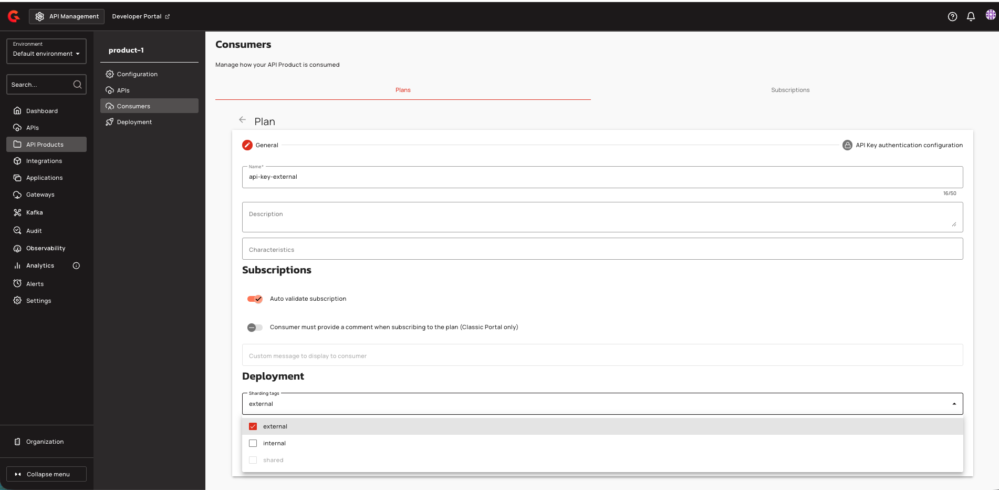
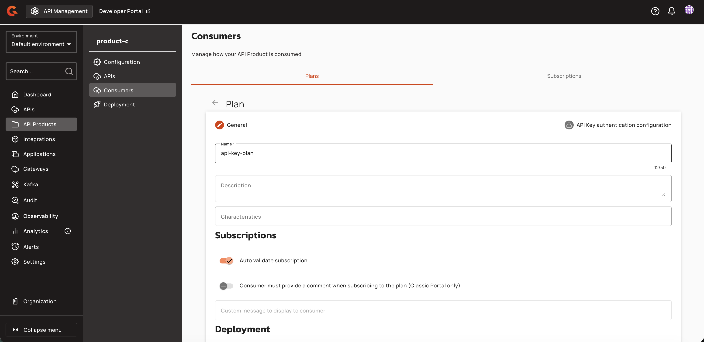
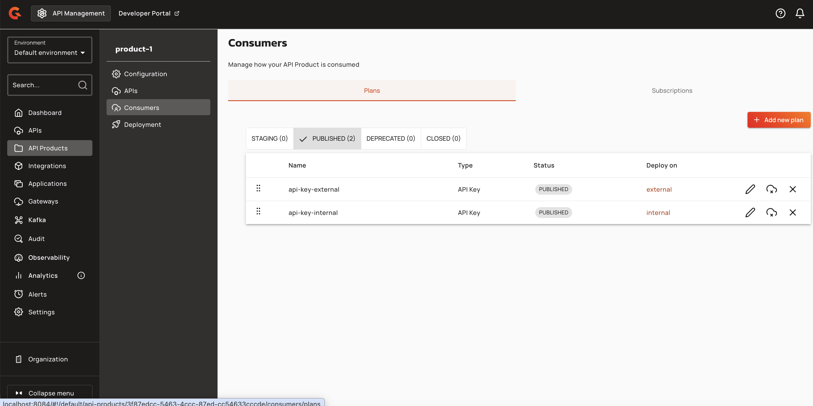
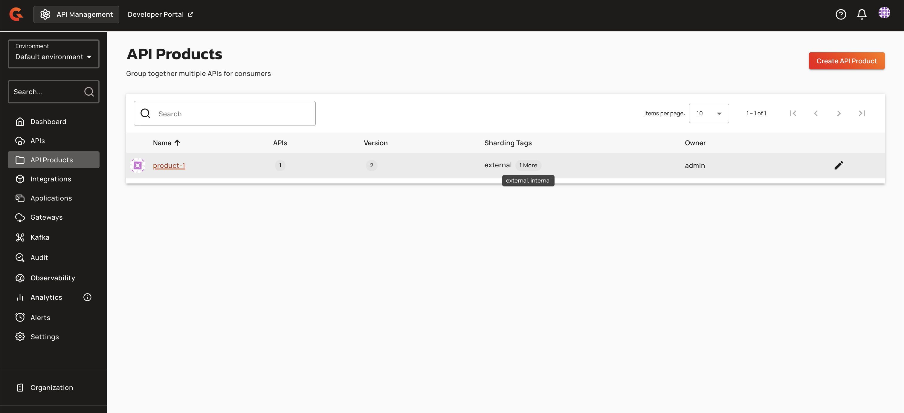
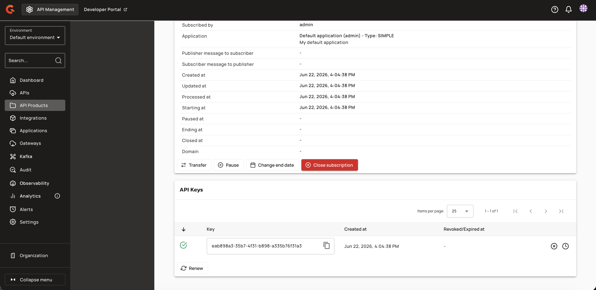
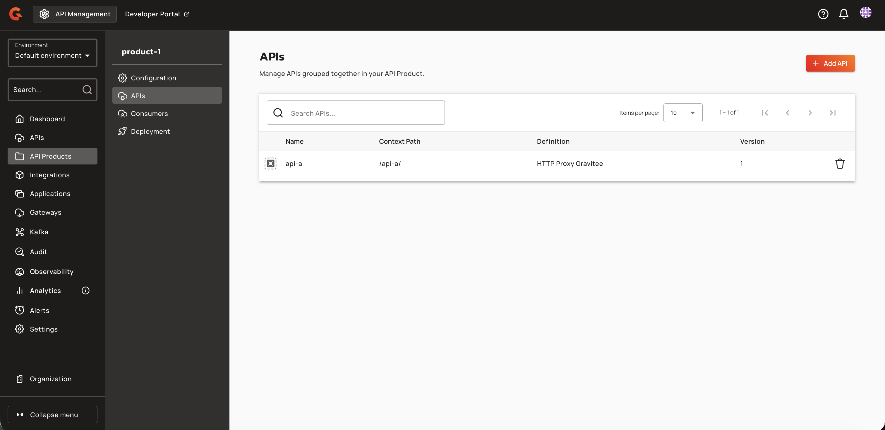
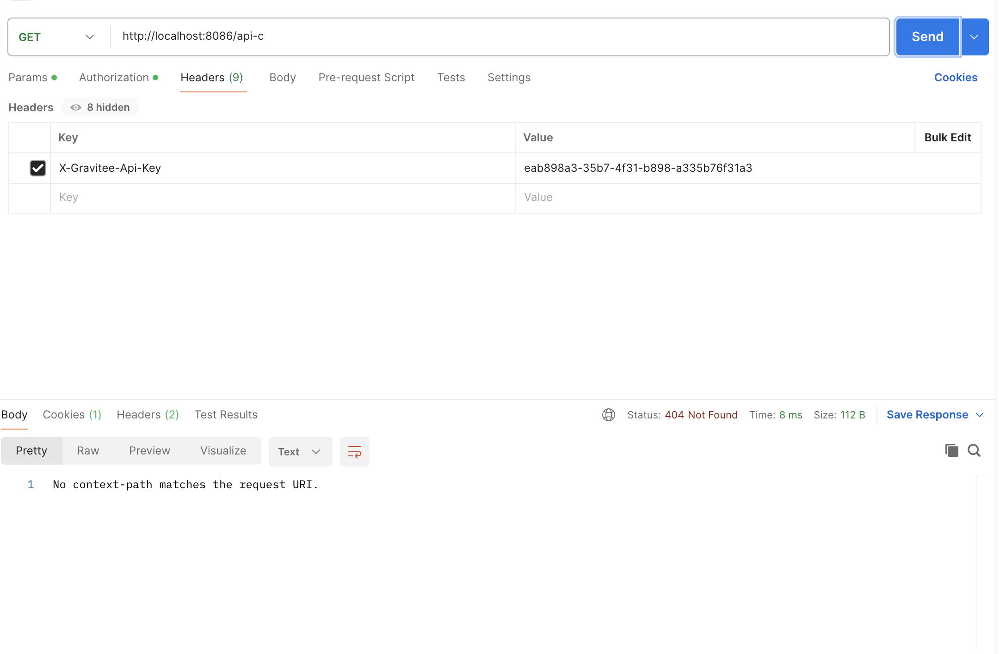

# Configure Plan Deployment with Sharding Tags

## Managing API Product Plans

### Assigning Sharding Tags to Plans

Plan sharding tags refine deployment eligibility within an API Product. Plan tags must be a subset of the product's tags. An empty plan tag set means the plan is eligible on every gateway where the parent product is eligible.


**Prerequisites**

* The API Product must have sharding tags assigned. See [Assigning Sharding Tags to API Products](../../configure-and-manage-the-platform/gravitee-gateway/sharding-tags.md#assigning-sharding-tags-to-api-products).
* You must have `API_PRODUCT_PLAN:CREATE` permission (for new plans) or `API_PRODUCT_PLAN:UPDATE` permission (for existing plans).


1. Navigate to **API Products → [API Product Name] → Consumers → Plans**.
2. Create a new plan or select an existing plan to edit.
3. On the **General** step, scroll down to the **Deployment** section.

    <figure><figcaption></figcaption></figure>

4. Click the **Sharding tags** dropdown to expand the list of available tags. The dropdown is constrained to the parent API Product's tags. Tags not defined on the product cannot be added to the plan.

    <figure><figcaption></figcaption></figure>

5. Select zero or more tags from the dropdown.

    <figure><figcaption></figcaption></figure>

6. Save the plan.

    When tags are removed from the API Product, any plan tags that are no longer on the product are automatically stripped from affected plans. Expanding product tags does not retroactively add tags to existing plans. Clearing all product tags clears all plan tags on that product's plans.

### Viewing Plan Deployment Targets

The **Deploy on** column in the Plans list displays the sharding tags that determine where each plan is deployed.

1. Navigate to **API Products → [API Product Name] → Consumers → Plans**.

    <figure><figcaption></figcaption></figure>

2. Review the **Deploy on** column for each published plan. For example, a plan may display "shared" to indicate it is deployed to gateways tagged with "shared".

    <figure><figcaption></figcaption></figure>

 If your API Product has multiple plans with different deployment targets, each plan will display its respective tags.

 <figure><figcaption></figcaption></figure>

 <figure><figcaption></figcaption></figure>

3. To view which deployment target a subscription uses, select the **Subscriptions** tab and click a subscription. The subscription details page displays the plan information, including the deployment target.

    <figure><figcaption></figcaption></figure>

## Viewing API Product Sharding Tags

When an API Product contains APIs with sharding tags, you can view which APIs are accessible through each product by navigating to the product's **APIs** page. Each product displays only the APIs that match its assigned sharding tags.

For example, if you navigate to a product with the `external` sharding tag, the APIs page shows only APIs tagged as `external`:

<figure><figcaption></figcaption></figure>

Similarly, navigating to a product with the `internal` sharding tag displays only APIs tagged as `internal`:

<figure><figcaption></figcaption></figure>

In the API Products list, the **Sharding Tags** column displays the first tag assigned to each product. When multiple tags are assigned, a badge shows the count of additional tags (e.g., "2 more"). Hovering over the badge displays a tooltip with the comma-separated list of all tags:

<figure><figcaption></figcaption></figure>
