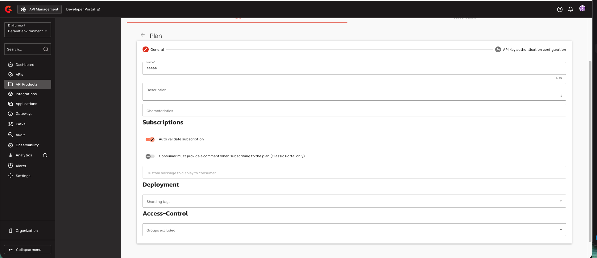
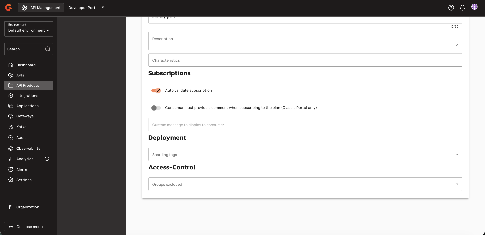
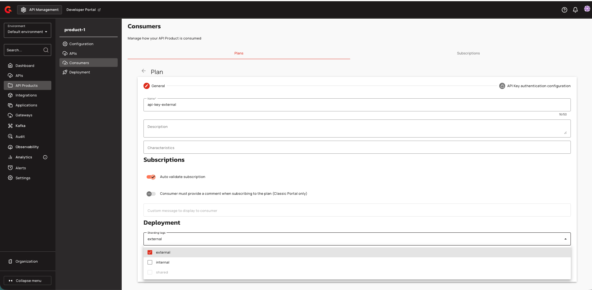

# Configure Plan Deployment

## Managing API Product Plans

### Assigning sharding tags to plans

Navigate to **API Product → Consumers → Plans** and create or edit a plan. On the **General** step, scroll down to the **Deployment** section to assign sharding tags to the plan.

1. Locate the **Deployment** section below the **Subscriptions** section. The **Sharding tags** dropdown is initially empty.

    <figure><figcaption></figcaption></figure>

    <figure><figcaption></figcaption></figure>

2. Click the **Sharding tags** dropdown to expand the list of available tags. Select zero or more tags from the dropdown. The dropdown is constrained to the parent API Product's tags—only tags present in both the product's tag set and the user's allowed tags are enabled for selection.

    <figure><figcaption></figcaption></figure>

3. Complete the remaining plan configuration steps (Name, Description, Characteristics, Subscriptions, and Access-Control) and save the plan.

    <figure><figcaption></figcaption></figure>

| Field | Description | Example |
|:------|:------------|:--------|
| **Sharding Tags** | Sharding tags assigned to the plan. Must be a subset of the API Product's tags. An empty tag set means the plan is eligible on every gateway where the parent product is eligible. | `external` |

When tags are removed from the API Product, any plan tags that are no longer on the product are automatically stripped from affected plans. Expanding product tags does not retroactively add tags to existing plans. Clearing all product tags clears all plan tags on that product's plans.

Users with the `API_PRODUCT_PLAN:CREATE` permission can assign tags when creating plans. Users with the `API_PRODUCT_PLAN:UPDATE` permission can modify tags on existing plans. Users without these permissions cannot access the plan editor or see the Deployment section.

### Viewing Subscriptions

After a plan is created and subscribed to, you can view subscription details by navigating to **API Product → Consumers → Subscriptions**. Select a subscription to view its details page, which displays the plan name, subscription status, consumer status, subscribed user, application information, and timestamps.

<figure><figcaption></figcaption></figure>

The subscription details page is also accessible from the **APIs → Consumers → Subscriptions** view for individual APIs. The page displays the same subscription metadata, including the plan name (e.g., `shared (API_KEY)`), status (`ACCEPTED`), consumer status (`STARTED`), and associated application.

<figure><figcaption></figcaption></figure>

### Viewing Plan Deployment in the API Products List

Navigate to **API Products → Consumers → Plans** to view the deployment tags for each published plan. The **Deploy on** column displays the sharding tag(s) assigned to each plan. This column was previously hidden for API Product plans and is now visible.

<figure><figcaption></figcaption></figure>

If a product has multiple plans with different deployment tags, each plan displays its assigned tag(s) in the **Deploy on** column.

<figure><figcaption></figcaption></figure>

For APIs included in an API Product, navigate to **APIs → [API Name] → Consumers → Plans** to view the deployment tags for that API's plans.

<figure><figcaption></figcaption></figure>

The **API Products** list table includes a **Sharding Tags** column. For each product, the column displays the first tag name. If the product has more than one tag, a badge with the text `"1 More"` (or the appropriate count) appears. Hovering over the badge shows a tooltip with all tag names (comma-separated).

<figure><figcaption></figcaption></figure>

When a subscription is created for a plan with deployment tags, the generated API key can be used to access the API through the gateways matching those tags. View the subscription details and API key in **API Products → Consumers → Subscriptions**.

<figure><figcaption></figcaption></figure>

### Gateway Runtime Behavior

Gateway instances apply the following rules when indexing API Products, plans, and member APIs:

| Gateway Configuration | Behavior |
|:----------------------|:---------|
| No sharding tags configured | Gateway retrieves all API Products, plans, and APIs. |
| One or more sharding tags configured | Gateway indexes only entities whose tags intersect with its configured tags. Within an eligible product, only published or deprecated plans whose plan tags match the gateway are indexed. Tagless plans match any gateway that already matched the product. |

A member API is deployed on a gateway if either its own sharding tags match the gateway, or it has at least one published or deprecated API Product plan indexed on that gateway. For the product plan path, the product's tags must match the gateway, and the plan's tags must be empty (inheriting product placement) or match the gateway (subset of product tags). Standalone APIs (not relying on product eligibility) deploy only when their own tags match the gateway.

When an API Product is undeployed or its tags or plans change such that member APIs are no longer eligible, affected APIs are undeployed on that gateway. Product deploy and update events trigger ordered resync and re-evaluation of member APIs.

To verify that a member API is accessible through its API Product context path, send a GET request to the product entrypoint with the appropriate API key in the `X-Gravitee-Api-Key` header. A successful response with status `200 OK` confirms the API is deployed and the sharding tags are correctly configured.

<figure><figcaption></figcaption></figure>

### Validation and Error Handling

Plan tags are validated against the API Product's tags when creating or updating plans. If a plan includes tags that are not present in the product's tag set, the operation fails with the error message: `"Plan tags mismatch the tags defined by the API Product"`. The error response includes the plan's tags and the product's tags for debugging.

When a user attempts to assign a group-restricted sharding tag without membership in the tag's restricted groups, the save operation fails with a validation error.

Organization-level tag deletion cascades to all API Products and plans in all environments. Deleting a tag removes it from every product and plan that references it. This operation cannot be undone.

When an API Product's sharding tag configuration is modified, the product enters an out-of-sync state. The Consumers page displays a warning banner indicating the product is out of sync, with a **Deploy API Product** button to synchronize the changes.

<figure><figcaption></figcaption></figure>

Until the API Product is redeployed, API requests to endpoints associated with the modified sharding tags will fail. Consumers attempting to access the API receive a 404 Not Found error response.

<figure><figcaption></figcaption></figure>
