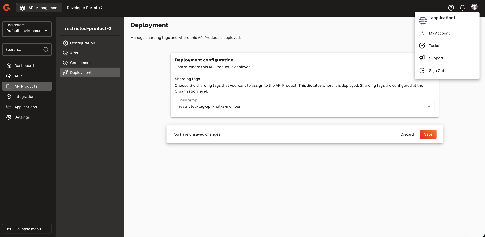

# API Products Console UI reference

## Navigation

An **API Products** navigation item appears in the APIM Console left sidebar. Selecting it opens the API Products list page with the heading "API Products" and the subtitle "Group together multiple APIs for consumers."

<figure><figcaption>
"API Products" navigation item in the APIM Console sidebar
</figcaption></figure>

## API Product detail page

After opening an API Product, the detail page displays a left sidebar with the following menu items:

| Menu item | Description |
|:----------|:------------|
| **Configuration** | Edit the API Product name, version, and description |
| **APIs** | Add or remove APIs from the API Product |
| **Deployment** | Assign sharding tags to control deployment scope |
| **Consumers** | Manage plans and subscriptions (contains **Plans** and **Subscriptions** tabs) |

<figure><figcaption>
API Product detail page with navigation menu
</figcaption></figure>

## Configuration tab

The **Configuration** tab displays editable fields for:

- **Name** — required, unique within the environment
- **Version** — required
- **Description** — optional

A danger zone at the bottom of the page provides options to remove all APIs from the API Product or delete the API Product entirely.

## APIs tab

The **APIs** tab lists all APIs included in the API Product with the following columns: Name, Context Path, Definition, and Version.

- Click **Add API** to open the **Add API** dialog and search for eligible APIs.
- The info banner in the dialog states: "APIs must have API products enabled before they appear in the list."
- To remove an API, click the trash icon with the tooltip "Remove from API Product."

## Deployment tab

The **Deployment** tab displays a **Deployment configuration** panel where you can assign sharding tags to control where the API Product is deployed.

<figure><figcaption></figcaption></figure>

### Sharding Tags

The **Sharding tags** dropdown lists all organization-level sharding tags. Select one or more tags to define the deployment scope for this API Product. You can select multiple tags by clicking the dropdown and checking the desired options. All selected tags appear in the field.

<figure><figcaption></figcaption></figure>

<figure><figcaption></figcaption></figure>

<figure><figcaption></figcaption></figure>

After selecting tags, the system displays an **unsaved changes** notification at the bottom of the page.

<figure><figcaption></figcaption></figure>

Click **Save** to persist the sharding tag configuration. On save, the system validates that selected tags exist in the organization registry and that the current user is authorized to assign them. Unrestricted tags are available to all users. Group-restricted tags are only available to members of those groups.

Saving tags updates the API Product definition but does not immediately push changes to gateway instances. Click **Deploy API Product** in the header notification banner to synchronize the product, its tags, and published plans to gateways.

After deployment, gateway instances only index and serve the API Product when the product's tags intersect with the gateway's configured sharding tags. A product with no tags is eligible on all gateways. Member APIs linked to the product may become deployable on a gateway even when the API's own tags do not match, as long as the product and at least one published plan are eligible on that gateway.


Users with read-only definition access (`API_PRODUCT_DEFINITION:READ` only) see the selector disabled. The **Deploy** action requires `API_PRODUCT_DEFINITION:UPDATE` permission. Verifying deployment requires `API_PRODUCT_DEFINITION:READ`.


## Plans tab

The **Plans** tab (under **Consumers**) lists all plans for the API Product. Available plan types for creation:

- **API Key**
- **JWT**
- **mTLS**

Keyless and OAuth plan types aren't available.

Plan lifecycle actions include **Publish**, **Deprecate**, and **Close**. Plans are reorderable via drag and drop.

## Subscriptions tab

The **Subscriptions** tab (under **Consumers**) lists all subscriptions to the API Product's plans. Each subscription displays:

- Application name
- Plan name
- Security type
- Status badge (Accepted, Closed, Paused, Pending, or Rejected)
- Created date

## Deployment banner

When an API Product has unsaved changes that require redeployment, a warning banner displays: "This API Product is out of sync." with a **Deploy API Product** button. Clicking the button opens the **Deploy your API Product** confirmation dialog.

## Permissions

Access to API Product features is gated by the following permission scopes:

| Permission | Access |
|:-----------|:-------|
| `API_PRODUCT-DEFINITION` READ | View Configuration, APIs, and Deployment tabs |
| `API_PRODUCT-DEFINITION` UPDATE | Edit configuration, assign sharding tags, deploy |
| `API_PRODUCT-PLAN` READ | View Plans tab |
| `API_PRODUCT-PLAN` UPDATE | Create, publish, deprecate, close, reorder plans |
| `API_PRODUCT-SUBSCRIPTION` READ | View Subscriptions tab |
