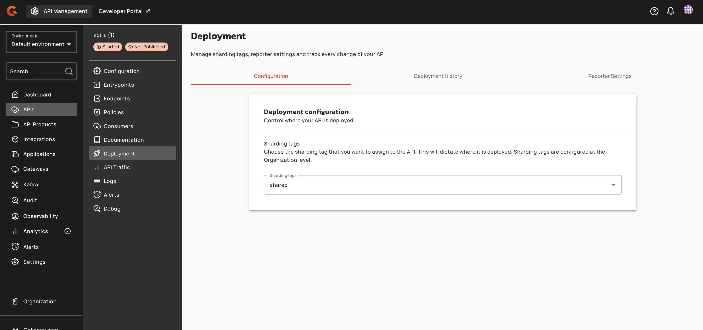
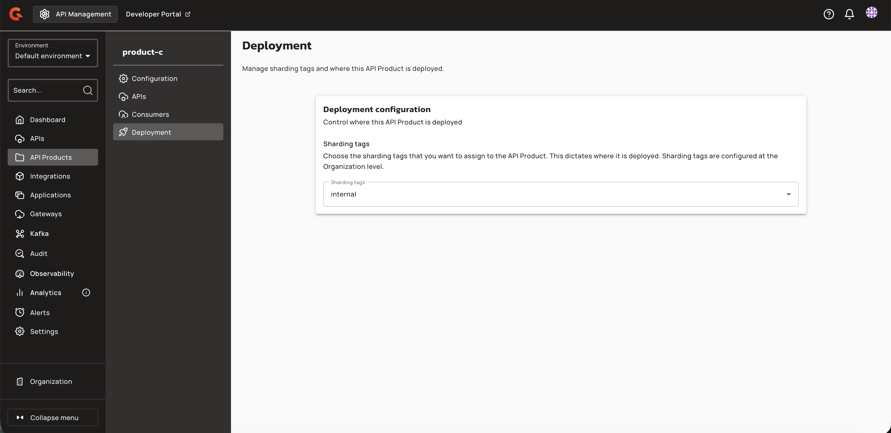

# API Products Console UI reference

## Navigation

An **API Products** navigation item appears in the APIM Console left sidebar. Selecting it opens the API Products list page with the heading "API Products" and the subtitle "Group together multiple APIs for consumers."

<figure><figcaption>
"API Products" navigation item in the APIM Console sidebar
</figcaption></figure>

## API Product detail page

After opening an API Product, the detail page displays a left sidebar with the following menu items:

| Menu item | Description |
|:----------|:------------|
| **Configuration** | Edit the API Product name, version, and description |
| **APIs** | Add or remove APIs from the API Product |
| **Deployment** | Assign sharding tags to control where the API Product is deployed |
| **Consumers** | Manage plans and subscriptions (contains **Plans** and **Subscriptions** tabs) |

<figure><figcaption>
API Product detail page with navigation menu
</figcaption></figure>

## Configuration tab

The **Configuration** tab displays editable fields for:

- **Name** — required, unique within the environment
- **Version** — required
- **Description** — optional

A danger zone at the bottom of the page provides options to remove all APIs from the API Product or delete the API Product entirely.

## APIs tab

The **APIs** tab lists all APIs included in the API Product with the following columns: Name, Context Path, Definition, and Version.

- Click **Add API** to open the **Add API** dialog and search for eligible APIs.
- The info banner in the dialog states: "APIs must have API products enabled before they appear in the list."
- To remove an API, click the trash icon with the tooltip "Remove from API Product."

## Deployment tab

The **Deployment** tab displays the header "Deployment" with the subtitle "Manage sharding tags and where this API Product is deployed." The Deployment navigation item uses the `gio:rocket` icon.

The **Deployment configuration** panel controls where the API Product is deployed by selecting one or more organization sharding tags.

1.  Select one or more tags from the **Sharding tags** dropdown. The dropdown lists all organization sharding tags. Sharding tags are configured at the Organization level.

    <figure><figcaption></figcaption></figure>

    <figure><figcaption></figcaption></figure>

2. Click **Save** to persist the tags on the API Product definition.

Saving tags marks the product as out of sync until deployed. An "out of sync" banner does not mean the product is undeployed on gateways—it indicates that the configuration has changed and requires deployment to synchronize. The save operation validates that the current user is allowed to assign the selected tags (unrestricted tags for all users; group-restricted tags only for members of those groups). Console UI does not validate tag intersection client-side—validation is performed server-side only. If the server rejects the request, users see a generic error snackbar without inline field-level feedback. On successful save, the system displays the snackbar message "Configuration successfully saved!" Users with read-only definition access see the selector disabled. Buttons, tabs, and actions are hidden or disabled for users without the required permission.

| Field | Description | Example |
|:------|:------------|:--------|
| **Sharding tags** | Multi-select dropdown of organization-level tags that dictate where the API Product is deployed. Data test ID: `api_product_sharding_tags`. | `shared`, `internal` |

After saving tags, deploy the API Product to synchronize it (including its tags and published plans) to gateway instances. The **Deploy** button is available to users with the `API_PRODUCT_DEFINITION:UPDATE` permission. Gateway instances only index and serve the product when product tags match their configured sharding tags. Member APIs linked to the product may become deployable on a gateway even when the API's own tags do not match, as long as the product and at least one published plan are eligible on that gateway.


Product tags establish the ceiling for plan tags. Plan tags must be a subset of the API Product's tags. You cannot deploy a plan to a shard that the product itself does not cover.



Product tags must match gateway configuration for indexing. Console tag assignment alone is not enough—each target gateway must declare the corresponding tag key in its configuration.



All tag changes on API Products and plans produce audit log entries on the affected resource.


## Plans tab

The **Plans** tab (under **Consumers**) lists all plans for the API Product. Available plan types for creation:

- **API Key**
- **JWT**
- **mTLS**

Keyless and OAuth plan types aren't available.

Plan lifecycle actions include **Publish**, **Deprecate**, and **Close**. Plans are reorderable via drag and drop.

## Subscriptions tab

The **Subscriptions** tab (under **Consumers**) lists all subscriptions to the API Product's plans. Each subscription displays:

- Application name
- Plan name
- Security type
- Status badge (Accepted, Closed, Paused, Pending, or Rejected)
- Created date

## Deployment banner

When an API Product has unsaved changes that require redeployment, a warning banner displays: "This API Product is out of sync." with a **Deploy API Product** button. Clicking the button opens the **Deploy your API Product** confirmation dialog.

## Permissions

Access to API Product features is gated by the following permission scopes:

| Permission | Access |
|:-----------|:-------|
| `API_PRODUCT-DEFINITION` READ | View Configuration, APIs, and Deployment tabs |
| `API_PRODUCT-DEFINITION` UPDATE | Edit configuration, assign sharding tags, deploy |
| `API_PRODUCT-PLAN` READ | View Plans tab |
| `API_PRODUCT-PLAN` UPDATE | Create, publish, deprecate, close, reorder plans |
| `API_PRODUCT-SUBSCRIPTION` READ | View Subscriptions tab |
