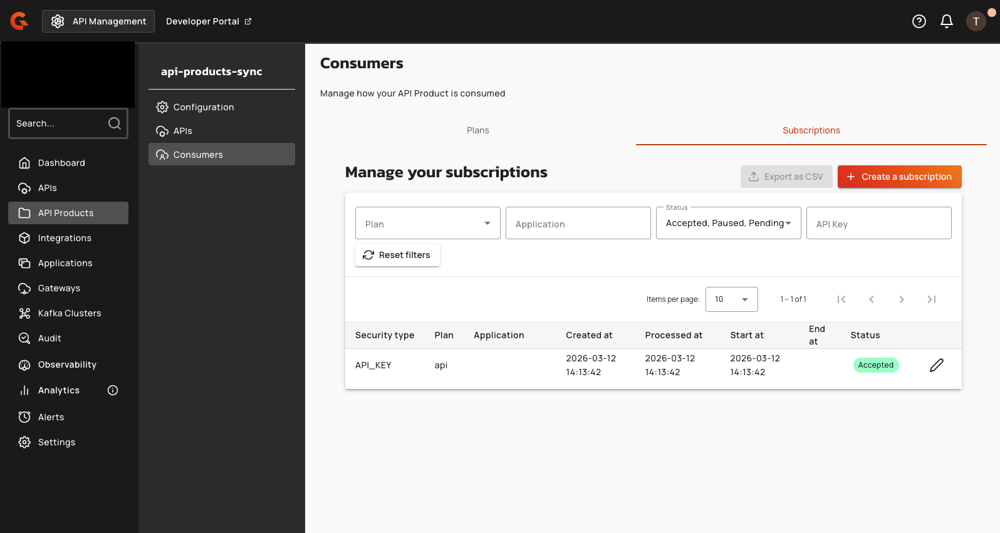

# Consuming APIs via API Products

## Overview

Clients consume APIs within an API Product using the same authentication mechanisms as individual API subscriptions. A single API Product subscription grants access to all APIs contained in the API Product.

## Authentication methods

**API Key plans:**

- Include the key in the `X-Gravitee-Api-Key` header, or
- Pass the key as a query parameter

**JWT plans:**

- Provide the token in the `Authorization: Bearer` header

**mTLS plans:**

- Present the client certificate during the TLS handshake

## Gateway subscription validation order

When a request reaches the gateway, the gateway validates subscriptions in the following priority order:

1. The gateway checks the request against the API Product plan subscription first.
2. If no valid API Product subscription exists, the gateway falls back to validating against the individual API plan.

API Product plans take priority, but access through API-level plans is still possible when no API Product-level subscription applies. APIs within an API Product retain their own plans and subscriptions, so consumers can continue to subscribe to individual API plans independently of the API Product.

## Gateway indexing and deployment eligibility

Gateway instances evaluate API Product tags, plan tags, and member API eligibility when determining which entities to index and serve. A member API (an API included in an API Product) is deployed on a gateway if either its own sharding tags match the gateway, or it has at least one published or deprecated API Product plan indexed on that gateway. For the product plan path, the product's tags must match the gateway, and the plan's tags must be empty (inheriting product placement) or match the gateway. This dual-path eligibility model allows APIs without matching tags to run on gateways via product plan inclusion, while standalone APIs continue to deploy only when their own tags match.

## Gateway context attributes

For API Product subscriptions, the gateway sets the following context attributes on the request execution context. Reference them from Gravitee Expression Language (EL) to write flow conditions that branch on the API Product or plan context:

- `apiProduct`: ID of the API Product that owns the current subscription. Set only when the request is authorized through an API Product subscription.
- `plan`: ID of the plan that authorized the current request. For an API Product subscription, this is the API Product plan ID. For a subscription created directly against an individual API, this is the API plan ID.

Use these attributes in flow conditions to differentiate between API Product and API plan execution contexts:

- Match requests routed through a specific API Product: `{#context.attributes['apiProduct'] == '<api-product-id>'}`
- Match requests authorized by a specific plan (API Product plan or API plan): `{#context.attributes['plan'] == '<plan-id>'}`

## Subscribe to an API Product

1. In the APIM Console, open the API Product and select **Consumers** in the left sidebar, then select the **Subscriptions** tab.
2. Click **Create a subscription**.
3. Select a published plan and an application.
4. Confirm the subscription.

The subscription is created with a status based on the plan's validation setting:

- **AUTO** validation: the subscription is immediately **Accepted**
- **MANUAL** validation: the subscription is set to **Pending** and requires approval

After the subscription is accepted, the client authenticates requests using the method defined by the plan type (API Key header, JWT bearer token, or client certificate).

<figure><figcaption>
API Product subscriptions list
</figcaption></figure>
