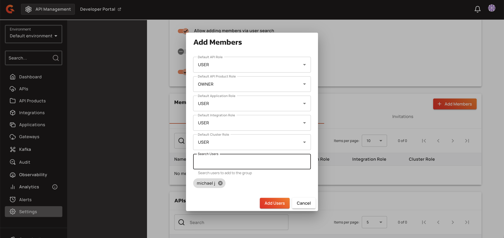

# Managing API Products with the Management API

## Create an API Product

To create an API Product, send a POST request to `/environments/{envId}/api-products` with a JSON body:

```json
{
  "name": "string",          // Required. Unique within environment (case-sensitive)
  "version": "string",       // Required
  "description": "string",   // Optional
  "apiIds": ["string"]       // Optional. List of API IDs
}
```

The system validates that:

- The name is unique within the environment (case-sensitive comparison)
- The name is not empty (leading and trailing whitespace is trimmed)
- All referenced APIs exist
- All referenced APIs have `allowedInApiProducts=true`

To verify name availability before creation, send a POST request to `/environments/{envId}/api-products/_verify` with the name in the request body. The response includes an `ok` boolean and an optional `reason` string if the name is unavailable.

## Update an API Product

Update an API Product by sending a PUT request to `/environments/{envId}/api-products/{id}` with the same JSON structure. The same validation rules apply.

## Deploy an API Product

Deploy an API Product by sending a POST request to `/environments/{envId}/api-products/{id}/deployments`. Deployment requires an active Enterprise Universe tier license.

To verify deployment readiness before deploying, send a GET request to `/environments/{envId}/api-products/{id}/deployments/_verify`. The response includes:

```json
{
  "ok": true,
  "reason": "string"  // Present when ok=false
}
```

## Manage API Product plans

Create a plan for an API Product by sending a POST request to `/environments/{envId}/api-products/{id}/plans` with a JSON body:

```json
{
  "name": "string",
  "description": "string",
  "validation": "MANUAL",
  "security": {
    "type": "API_KEY",
    "configuration": {}
  },
  "flows": []
}
```

Supported values for `security.type`:

- `API_KEY`
- `JWT`
- `MTLS`

Keyless (`KEY_LESS`) plans are rejected with a `400 Bad Request` error. OAuth plans are not supported.

Manage plan lifecycle using these endpoints:

- Publish: POST to `/_publish`
- Deprecate: POST to `/_deprecate`
- Close: POST to `/_close`
- Update: PUT with the full plan definition

## Manage subscriptions

Create a subscription to an API Product plan by sending a POST request to `/environments/{envId}/api-products/{id}/subscriptions`.

Manage subscription lifecycle using these endpoints:

- Accept: POST to `/_accept`
- Reject: POST to `/_reject`
- Close: POST to `/_close`
- Pause: POST to `/_pause`
- Resume: POST to `/_resume`
- Transfer: POST to `/_transfer`

## Manage API Product members

The following endpoints manage API Product members and ownership transfer.

### Retrieve members

Send a GET request to `/environments/{envId}/api-products/{apiProductId}/members` to retrieve the list of members for an API Product.

**Query Parameters:**

| Parameter | Type | Default | Description |
|:----------|:-----|:--------|:------------|
| `page` | integer | `1` | Page number for pagination |
| `perPage` | integer | `10` | Number of members per page |

**Response:**

Returns a `MembersResponse` object with pagination metadata.

### Add a member

Send a POST request to `/environments/{envId}/api-products/{apiProductId}/members` to add a new member to an API Product.

**Request Body:**

`AddMember` object with the following properties:

| Property | Type | Required | Description |
|:---------|:-----|:---------|:------------|
| `userId` | string | Conditional | User's technical identifier. Required if `externalReference` is not provided. |
| `externalReference` | string | Conditional | User reference from an identity provider. Required if `userId` is not provided. |
| `roleName` | string | Yes | Name of the role to assign to the member |

**Response:**

Returns a `Member` object representing the newly added member.

<figure><figcaption></figcaption></figure>

### Update a member's role

Send a PUT request to `/environments/{envId}/api-products/{apiProductId}/members/{memberId}` to update the role of an existing member.

**Request Body:**

```json
{
 "roleName": "string"
}
```

**Response:**

Returns the updated `Member` object.

### Remove a member

Send a DELETE request to `/environments/{envId}/api-products/{apiProductId}/members/{memberId}` to remove a member from an API Product.

**Response:**

Returns `204 No Content` on successful deletion.

### Transfer ownership

Send a POST request to `/environments/{envId}/api-products/{apiProductId}/members/_transfer-ownership` to transfer primary ownership of an API Product to another user or group.

**Request Body:**

`ApiProductTransferOwnership` object with the following properties:

| Property | Type | Required | Description |
|:---------|:-----|:---------|:------------|
| `newPrimaryOwnerId` | string | Conditional | The new primary owner's technical identifier (user or group). Required if `userReference` is not provided. |
| `userReference` | string | Conditional | The new primary owner reference from an identity provider. Required if `newPrimaryOwnerId` is not provided. |
| `userType` | string | Yes | Type of the new primary owner. Valid values: `USER`, `GROUP` |
| `currentPrimaryOwnerNewRole` | string | Yes | Name of the role to assign to the current primary owner after the transfer |

**Validation Rules:**

- Either `newPrimaryOwnerId` or `userReference` must be provided. If both are null or blank, the request fails with `InvalidDataException`.
- The `currentPrimaryOwnerNewRole` cannot be `PRIMARY_OWNER`. Attempting to assign this role throws `TransferOwnershipNotAllowedException`.

**Response:**

Returns `204 No Content` on successful transfer.

## Configure API Product primary owner mode

The API Product primary owner mode setting controls whether API Product primary owners can be users, groups, or both.

| Property | Type | Default | Description |
|:---------|:-----|:--------|:------------|
| `api.product.primary.owner.mode` | String | `HYBRID` | Controls whether API Product primary owner can be USER, GROUP, or HYBRID (both). Valid values: `USER`, `GROUP`, `HYBRID`. Scopes: ENVIRONMENT, ORGANIZATION, SYSTEM. |

## Plan and subscription reference model

Plans and subscriptions use a reference model to distinguish between API-level and API Product-level resources:

- `referenceType`: `API` or `API_PRODUCT`
- `referenceId`: The ID of the parent API or API Product

The legacy `api` field on plans is deprecated as of version 4.11.0. Use `referenceId` and `referenceType` for new integrations.
