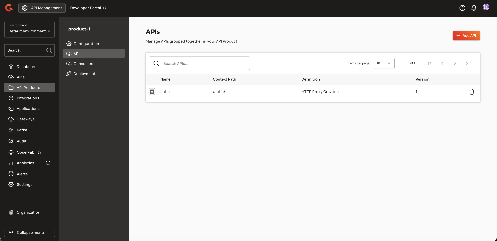

# Manage Plan Deployment with Sharding Tags

## Managing API Product Plans

### Assigning Sharding Tags to Plans

Navigate to **API Product → Consumers → Plans** and edit a plan. On the **General** step, scroll down to the **Deployment** section. The **Sharding Tags** dropdown displays the tags available for assignment.

<figure><figcaption></figcaption></figure>

Click the **Sharding Tags** dropdown to view the available tags. The dropdown is constrained to the intersection of the API Product's tags and the user's allowed tags. Tags outside this intersection are disabled.

<figure><figcaption></figcaption></figure>

Select zero or more sharding tags for the plan. Plan tags must be a subset of the API Product's tags—tags not defined on the product cannot be added to the plan. An empty plan tag set means the plan is eligible on every gateway where the parent product is eligible (the gateway treats tagless plans as matching all gateways that already matched the product).

<figure><figcaption></figcaption></figure>

When tags are removed from the API Product, any plan tags that are no longer on the product are automatically stripped from affected plans. Expanding product tags does not retroactively add tags to existing plans. Clearing all product tags clears all plan tags on that product's plans.

| Field | Description | Example |
|:------|:------------|:--------|
| **Sharding Tags** | Dropdown constrained to the intersection of the API Product's tags and the user's allowed tags. Tags outside this intersection are disabled. | `eu`, `us-east` |

This capability is available to users with `API_PRODUCT_PLAN:CREATE` (when creating a plan) or `API_PRODUCT_PLAN:UPDATE` (when editing a plan) permission.

### Viewing Plan Deployment in the API Products List

Within an API Product, navigate to **Consumers** and select the **Plans** tab. The plan list table displays a **Deploy on** column showing the sharding tags assigned to each plan. For plans with deployment tags configured, the tag names appear in this column (e.g., `shared`).

<figure><figcaption></figcaption></figure>

This column was previously hidden for API Product plans and is now visible, allowing you to verify which sharding tags control where each plan is deployed.

### Gateway Runtime Behavior

Gateway instances apply sharding tag filtering to API Products, plans, and APIs. When no sharding tags are configured on a gateway, it retrieves all API Products, plans, and APIs. When one or more sharding tags are configured, the gateway only indexes entities whose tags intersect with its configured tags. Within an eligible product, only published or deprecated plans whose plan tags match the gateway are indexed. Tagless plans match any gateway that already matched the product.

When an API Product is undeployed or its tags or plans change such that member APIs are no longer eligible, affected APIs are undeployed on that gateway. Product deploy and update events trigger ordered resynchronization and re-evaluation of member APIs.

### Management API

**Create API Product with tags:**

```http
POST /management/v2/organizations/{orgId}/environments/{envId}/api-products
Content-Type: application/json

{
  "name": "My Product",
  "version": "1.0",
  "apiIds": ["api-1"],
  "tags": ["internal", "external"]
}
```

**Update API Product tags:**

```http
PUT /management/v2/organizations/{orgId}/environments/{envId}/api-products/{productId}
Content-Type: application/json

{
  "name": "My Product",
  "version": "1.0",
  "apiIds": ["api-1"],
  "tags": ["internal"]
}
```

**Create or update plan with tags:**

```http
PUT /management/v2/organizations/{orgId}/environments/{envId}/api-products/{productId}/plans/{planId}
Content-Type: application/json

{
  "name": "Premium Plan",
  "tags": ["internal"]
}
```

Plan tags are validated against the API Product's tags. If plan tags are not a subset of product tags, the API returns:

```json
{
  "message": "Plan tags mismatch the tags defined by the API Product",
  "details": {
    "planTags": "internal,external",
    "apiProductTags": "internal"
  }
}
```

**Retrieve API Product with tags:**

```http
GET /management/v2/organizations/{orgId}/environments/{envId}/api-products/{productId}
```

Response includes the `tags` field:

```json
{
  "id": "product-1",
  "name": "My Product",
  "version": "1.0",
  "apiIds": ["api-1"],
  "tags": ["internal", "external"]
}
```

Existing API Products without tags return `tags: null` in API responses.
