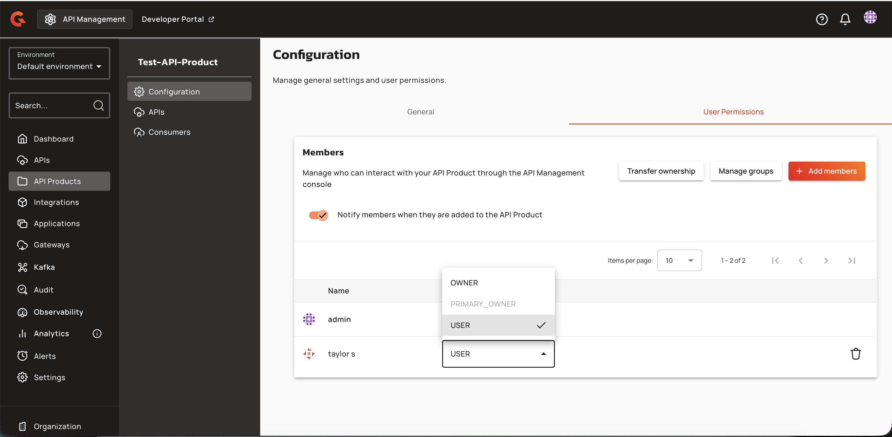
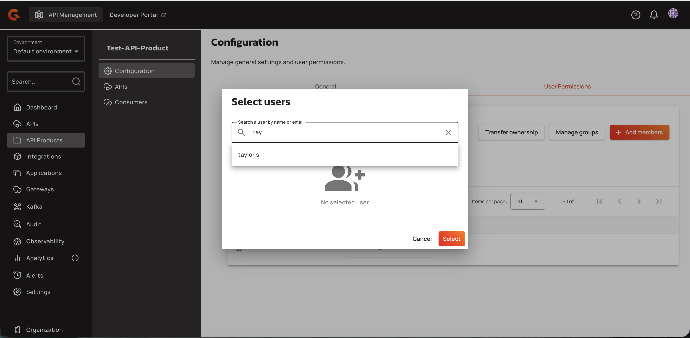
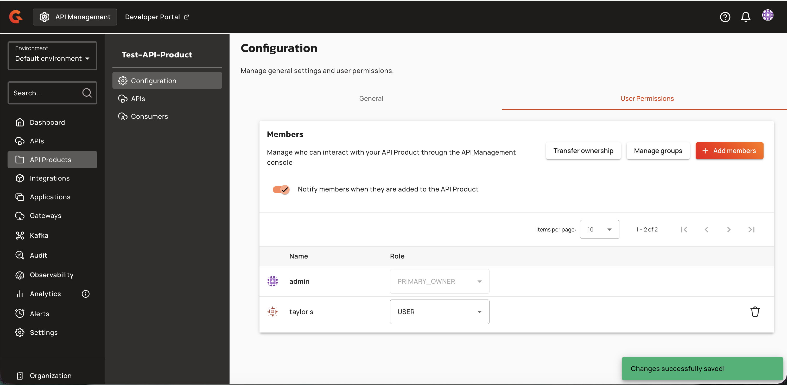
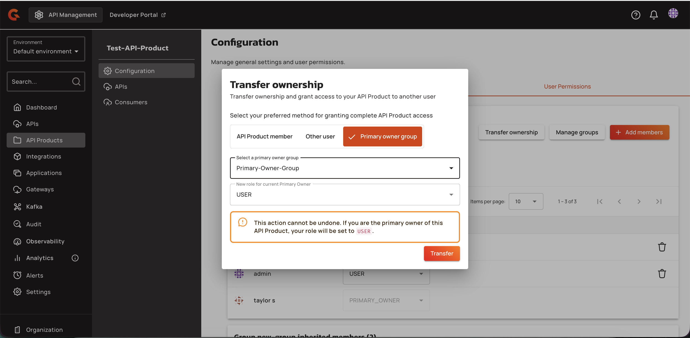
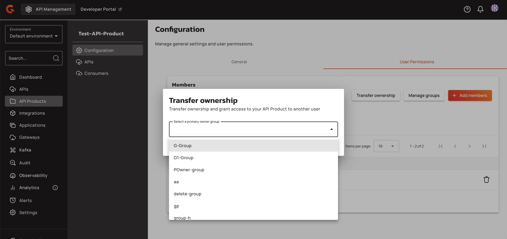
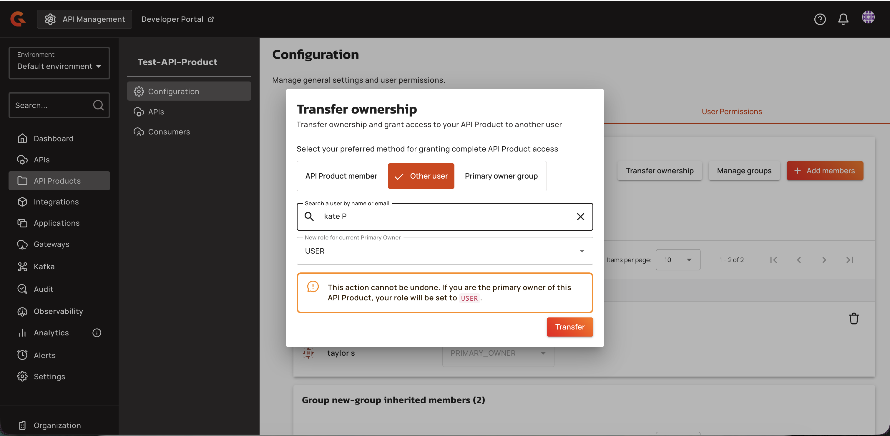
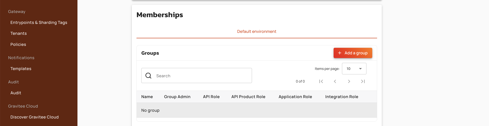

# Managing API Product Members and Ownership (Configuration Page)

## Prerequisites

Before managing API Product members and ownership, ensure you have the required permissions:

* `api_product-member-u` to transfer ownership or manage groups
* `api_product-member-c` to add members
* `api_product-member-d` to delete members
* `environment-group-r` to view inherited group members

When `api.product.primary.owner.mode` is `GROUP`, you must belong to at least one group with a PRIMARY_OWNER member for API_PRODUCT scope. The target group for ownership transfer must have at least one member with PRIMARY_OWNER role for API_PRODUCT scope.

## Gateway Configuration

## Creating API Product Members

To add a direct member:

1. Navigate to the API Product members page.
2. Click **Add members**.

    <figure><figcaption></figcaption></figure>

3. Provide either a user ID (technical identifier) or an external reference (identity provider reference).

    <figure><figcaption></figcaption></figure>

4. Select a role from the available roles. The PRIMARY_OWNER role is excluded from the role selection.

    The member appears in the members table with the assigned role.

    <figure><figcaption></figcaption></figure>

To update a member's role, select a new role from the dropdown in the Role column. The dropdown is disabled for the primary owner and when you lack update permission.

To remove a member, click the delete icon in the member's row. The delete icon is hidden for the primary owner and when you lack delete permission.

Inherited group members appear in read-only cards below the direct members table, with pagination independent per group.

## Transferring Ownership

To transfer ownership:

1. Click **Transfer ownership** on the API Product members page.

    <figure><figcaption></figcaption></figure>

2. Select the transfer mode based on the primary owner mode:
   * If the primary owner mode is `HYBRID`, select **API Product member** (choose from existing non-PRIMARY_OWNER members), **Other user** (search for an organization user), or **Primary owner group** (select a group with a PRIMARY_OWNER member).

        <figure><figcaption></figcaption></figure>

   * If the mode is `USER`, only **API Product member** and **Other user** options are available.

        <figure><figcaption></figcaption></figure>

   * If the mode is `GROUP`, only the group selection is available.
3. Select the new role for the current primary owner from the dropdown. PRIMARY_OWNER is excluded. The first default role is selected by default.

    A warning banner confirms the action is irreversible and displays the role the current primary owner will receive.

    If no eligible groups exist, a banner states: "You can't set a group as primary owner. To set a group as a primary owner, the group must contain a member with a primary owner API Product role."

4. Submit the transfer to reassign ownership.

### Managing Groups

To manage attached groups:

1. Click **Manage groups** on the API Product members page.

    <figure><figcaption></figcaption></figure>

2. If you lack `api_product-member-u` permission, the dialog displays a read-only list of associated groups (or "No groups associated" if none exist).
3. If you have update permission, use the multi-select dropdown to select or deselect groups. The dropdown displays all available groups, excluding groups with the `apiProductPrimaryOwner` field set.
4. Click **Save** to update the API Product's group associations.

Inherited members from the attached groups appear in read-only cards below the direct members table, with pagination independent per group.

## End-User Configuration

