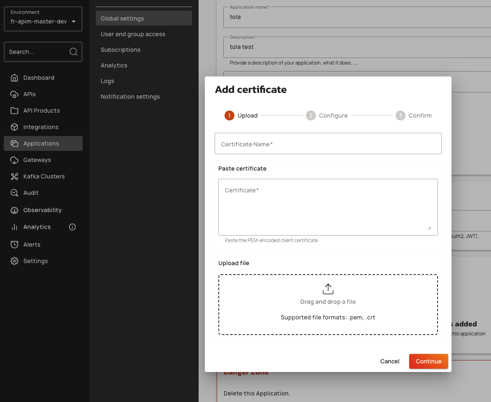

# mTLS

## Overview

The mTLS authentication type enforces the use of a client certificate when connecting to an API. The client certificate is added to an application, after which a subscription is created for that application. At runtime, the Gateway checks for a match between the incoming request's client certificate and a certificate belonging to an application with an active subscription.

You can use mTLS with or without TLS enabled between the client and the Gateway. The Gateway server can require client authentication, which uses the server-level truststore to determine trusted clients. The mTLS plan then evaluates the client certificate with Gateway-level TLS, which exists in either of the following locations:

* The TLS session between the client and the Gateway.
* A pre-specified header in plaintext, base64-encoded format.

Client authentication can occur if a load balancer is placed in front of the Gateway that terminates TLS.

## Limitations

Currently, mTLS plans have the following limitations:

* You can apply mTLS plans to only v4 APIs.
* You can't use mTLS plans in Gravitee Cloud with SaaS-based Gateways.
* The Console shows how many days are left when a certificate's end date is 15 days away or less, and the New Developer Portal shows the days remaining, but APIM doesn't send a notification before a certificate expires.


Starting with APIM 4.11, an application holds several client certificates at once, so you rotate a certificate without downtime. Add the new one, keep the old one active during a grace period, and let APIM revoke it when the grace period ends. Certificates are managed from the Console, the New Developer Portal, the Management API, GKO, and Terraform. For the statuses, the grace period, and the automatic revocation, see [mTLS certificate management for applications](../applications/mtls-certificate-management-for-applications-overview-and-concepts.md).


## Restrictions

* mTLS plans can't coexist with Keyless plans or authentication plans (OAuth2, JWT, API Key) in published state.
* Publishing an mTLS plan automatically closes all published Keyless and authentication plans.
* Publishing a Keyless or authentication plan automatically closes all published mTLS plans.
* Client certificates must be in PEM format for subscription creation.
* Gateway must be configured with `kafka.ssl.clientAuth=required` to enforce client certificate authentication for Kafka native APIs.
* Certificate validation failures result in `MtlsPolicyException` with error keys: `SSL_SESSION_REQUIRED`, `CLIENT_CERTIFICATE_INVALID`, `CLIENT_CERTIFICATE_MISSING`.

## How it works

When using an mTLS plan, you don't need to manually define a Gateway truststore. The Gateway automatically retrieves all certificates from [Applications (that have a TLS Configuration)](mtls.md#how-to-add-a-client-certificate) and loads them into an in-memory truststore.

## Initial Gateway configuration

To use an mTLS plan, you need to [enable HTTPS on your Gateway(s)](../../prepare-a-production-environment/configure-your-http-server.md#enable-https-support).

To enable HTTPS using the `values.yaml` file, use the following configuration to secure Gateway traffic and set the TLS client authentication option. Setting `gateway.ssl.enabled: true` instructs the Helm chart to render `http.secured: true` into the Gateway's `gravitee.yml`.


```yaml
gateway:
  # ... skipped for simplicity
  ssl:
    enabled: true
    clientAuth: request # Supports none, request, required
    keystore:
      # ... skipped for simplicity
```



Don't set `ssl.sendClientCertificateAuthorities` to `true` on a listener that serves mTLS plans. Application certificates are self-signed leaves, so they are never issued by an authority of the configured truststore. A non-empty list of acceptable certificate authorities is a constraint, not a hint: clients whose issuer is absent from it withhold their certificate entirely, and every mTLS subscription on that listener stops working. See [Control which certificate authorities the Gateway advertises.](../../prepare-a-production-environment/configure-your-http-server.md#control-which-certificate-authorities-the-gateway-advertises)

Starting with APIM 4.12.19, the Gateway sends an empty list by default, and never advertises the certificates it loads from subscriptions.


To reject clients whose certificates have been revoked, enable CRL checking on the Gateway. CRL evaluation runs during the TLS handshake, before plan selection, so revoked certificates never reach mTLS plan matching. See [Reject revoked client certificates with a CRL.](../../prepare-a-production-environment/configure-your-http-server.md#reject-revoked-client-certificates-with-a-crl)

## Creating an mTLS plan

To create an mTLS plan for a Kafka native API:

1. Navigate to the API's **Plans** section in the Console.
2. Click **Add new plan**.
3. Select **mTLS** as the security type.
4. Configure the plan details (name, description, rate limits).
5. Click **Publish**.

If Keyless or authentication plans (OAuth2, JWT, API Key) are already published, the Console displays a confirmation dialog listing the plans that will be automatically closed. Click **Publish & Close** to proceed.

The Gateway validates that no conflicting plan types remain in published state. If conflicts are detected, the Gateway throws `NativePlanAuthenticationConflictException`.

## How to add a client certificate

To subscribe to an mTLS plan, the application needs at least one active client certificate. To add a certificate to an application, complete the following steps:

1. In the Console, click **Applications**, and then click the application.
2. In the application menu, click **Global settings**.
3.  Scroll to the **Certificates** section.

    <figure><figcaption><p>Certificates section of the Global settings page</p></figcaption></figure>
4. Click **Add certificate**.
5. On the **Upload** step, enter a name in the **Certificate Name** field.
6.  Provide the PEM-encoded certificate. Either paste it in the **Certificate** field under **Paste certificate**, or drag and drop a `.pem` or `.crt` file under **Upload file**.

    <figure><figcaption><p>Upload step of the Add certificate dialog</p></figcaption></figure>
7. Click **Continue**. APIM validates the certificate. If it isn't a valid client certificate, the dialog shows **Invalid certificate format** and you stay on the **Upload** step.
8. On the **Configure** step, set the **Active until** date. The field is pre-filled with the expiration date of the certificate, and the date can't be later than that expiration or earlier than today.
9. If the application already has an active certificate, set the **Grace Period end for current certificate** date. Both certificates stay active until that date, which can't be later than the expiration date of the current certificate. The field is required.
10. Click **Continue**.
11. On the **Confirm** step, review the **Certificate Summary**, and then click **Add Certificate**.


A client certificate belongs to one application. APIM rejects a certificate whose SHA-256 fingerprint already belongs to a certificate that isn't revoked on an active application of the same environment. Through the Console, this check also rejects a certificate that the same application already holds.


The certificate appears in the **Certificates** section with the status **Active**, and APIM adds it to the mTLS subscriptions of the application. For the statuses, the grace period, and the automatic revocation, see [mTLS certificate management for applications](../applications/mtls-certificate-management-for-applications-overview-and-concepts.md).

## Creating a subscription with mTLS

To subscribe an application to an mTLS plan:

1. Navigate to the application's **Subscriptions** page.
2. Select the mTLS plan.

The application must already hold at least one active certificate. The subscription records every active certificate of the application, and APIM updates the subscription whenever the certificates of the application change. You don't provide a certificate when you subscribe.

When the client connects with a certificate, the Gateway extracts it from the TLS session, computes its SHA-256 fingerprint, and matches it against the certificates registered by the subscriptions to the plan. On a successful match, the Gateway populates the connection context with `planId`, `applicationId`, and `subscriptionId`. Metrics and analytics reflect the resolved subscription instead of ANONYMOUS.

## How to call an API

To call an API with mTLS, use the following command:

* Replace `<client.cer>` with the name of the file containing your client certificate.
* Replace `<client.key>` with the name of the file containing the client key.

```bash
$ curl –-cert  <client.cer> --key <client.key> https://my-gateway.com/mtls-api
```

Both the client certificate and the private key are required to ensure that your client trusts the certificate sent by the Gateway.

## Client configuration

Kafka clients must present the certificate during TLS handshake. Configure the client with the following SSL properties:

| Property                | Description                                        | Example                        |
| ----------------------- | -------------------------------------------------- | ------------------------------ |
| `ssl.keystore.location` | Path to client keystore containing the certificate | `/path/to/client.keystore.jks` |
| `ssl.keystore.type`     | Client keystore type                               | `JKS`                          |
| `ssl.keystore.password` | Client keystore password                           | `gravitee`                     |

## How to terminate TLS


Starting with Gravitee APIM 4.5, client certificates processed by NGINX can only be extracted from headers in plaintext.


You can use an mTLS plan when you run a load balancer like NGINX in front of the Gateway. TLS is terminated at the load balancer, and the load balancer forwards traffic to the Gateway in plaintext.

The following blocks configure the Gateway to use mTLS:




```yaml
http:
  # ...
  ssl:
    clientAuthHeader:
      name: X-Gravitee-Client-Cert
    # ...
```




Add the following variable to the `.env` file loaded by your `docker-compose.yml`, or to the `environment:` block of the Gateway service:

```bash
gravitee_http_ssl_clientAuthHeader_name=X-Gravitee-Client-Cert
```



The APIM Helm chart doesn't expose a dedicated `clientAuthHeader` value. Inject the equivalent environment variable through the `gateway.env` array of your `values.yaml` file:

```yaml
gateway:
  env:
    - name: gravitee_http_ssl_clientAuthHeader_name
      value: X-Gravitee-Client-Cert
```



When executing an mTLS plan, the Gateway checks if TLS is enabled.

* If TLS is enabled, the Gateway uses the certificate from the TLS handshake. The handshake occurs before plan selection.
* If TLS isn't enabled, the Gateway checks for the certificate in the header. If the header contains a valid base64-encoded plaintext certificate matching a certificate for a subscribed application, the request succeed.

Ensure that only trusted parties can set the certificate header. If you are using a load balancer, the load balancer must be solely responsible for setting this header, and the Gateway should only be directly accessible through the load balancer.
