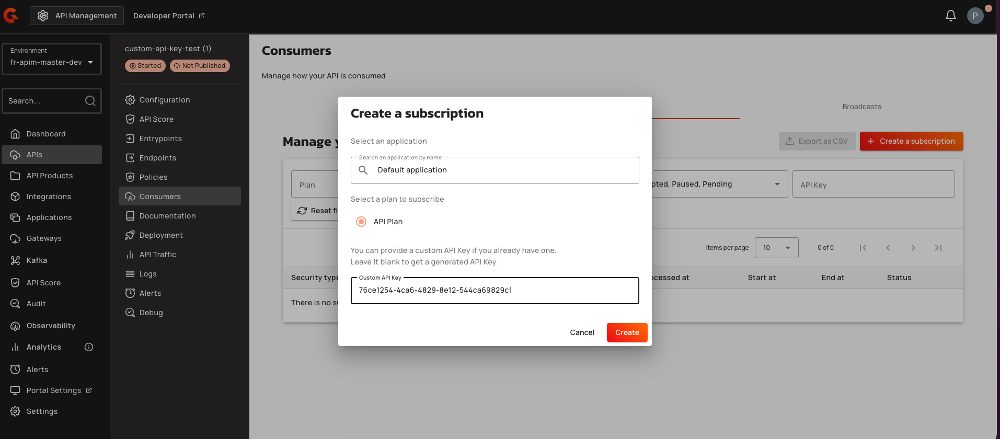
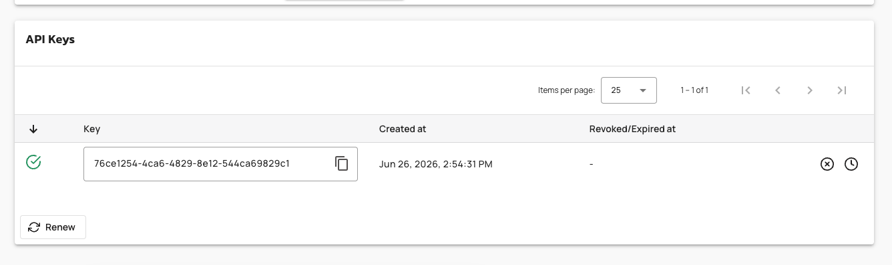
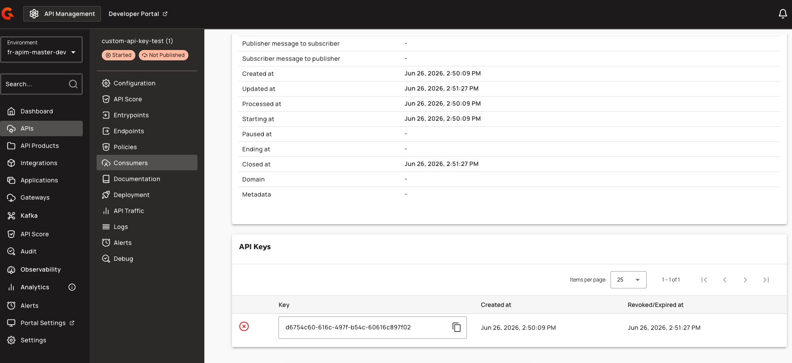

# Reuse Custom API Keys

## Overview

Custom API key reuse allows administrators to enable the reuse of inactive custom API keys for new subscriptions. When enabled, API consumers can reuse a custom API key value that was previously revoked, expired, or associated with a closed subscription. This feature provides flexibility in key management while maintaining security controls.

## Key Concepts

### Custom API Keys

Custom API keys allow API consumers to provide their own key values when subscribing to an API, rather than accepting a system-generated value. This feature must be enabled before custom API key reuse can be configured.

### Inactive API Keys

An API key is considered inactive when it has been revoked or has expired. Inactive keys are eligible for reuse when the custom API key reuse feature is enabled. Paused API keys are not considered inactive because their subscriptions remain active.

### Reuse Eligibility

When custom API key reuse is enabled, an inactive custom API key can be reactivated and associated with a new subscription. The system reactivates the existing key record, adds the new subscription ID to the key's subscription list, and updates the expiration date to match the new subscription's end date. The previous subscription link is retained for audit history.

| Key State | Reuse Allowed |
|:----------|:--------------|
| Revoked | Yes |
| Expired | Yes |
| Paused | No |
| Active | No |


**Security Consideration**: Always assign unique key values. Reusing an API key value across multiple clients or environments increases security risks, as an exposure of that key compromises all endpoints leveraging it.


## Prerequisites

Before you reuse a custom API key, ensure the following settings are enabled:

* API Key plans must be enabled
* [**Allow custom API Key**](../plans/api-key.md#api-key) must be enabled
* [**Allow custom API Key reuse**](../plans/api-key.md#api-key) must be enabled

## Reuse a Custom API Key

1. Navigate to your API and select **Consumers**.
2. Navigate to the **Subscriptions** tab and copy the API Key value from an existing subscription.
3. Close the subscription.
4. Create a new subscription.
5. In the **Custom API key** field, paste the API key value copied from the previous subscription. 

    <figure><figcaption></figcaption></figure>

6. Observe that the same API Key is used for the new subscription. The API Keys table displays the updated timestamp for the reused key. 

    <figure><figcaption></figcaption></figure>

7. The revoked key from the closed subscription is displayed separately in the API Keys table. 

    <figure><figcaption></figcaption></figure>

## Reuse Validation

When a custom API key value is provided during subscription creation, the system applies the following validation logic:

* If no existing key with that value is found for the same reference (API or API Product), a new key is created.
* If an existing key is found:
  * If custom API key reuse is disabled, an error is returned indicating the key already exists.
  * If custom API key reuse is enabled:
    * If the existing key is inactive (revoked or expired), the system reactivates and reuses it.
    * If the existing key is active or paused, an error is returned indicating the key already exists.
  * If the existing key belongs to a different application or API reference, a conflict error is returned.

When an inactive key is successfully reused:

1. The existing API key record is reactivated (`revoked` set to `false`, `revokedAt` set to `null`).
2. The new subscription ID is added to the key's `subscriptions` list.
3. The key's `expireAt` is updated to match the new subscription's `endingAt`.
4. The previous subscription link is retained for audit history.
5. No duplicate `(reference, key)` record is created.

## Limitations

* Custom API key reuse is only supported for non-federated API keys.
* Paused API keys cannot be reused because their subscriptions remain active.
* Reuse is only permitted when the existing key belongs to the same application and same reference (API or API Product).
