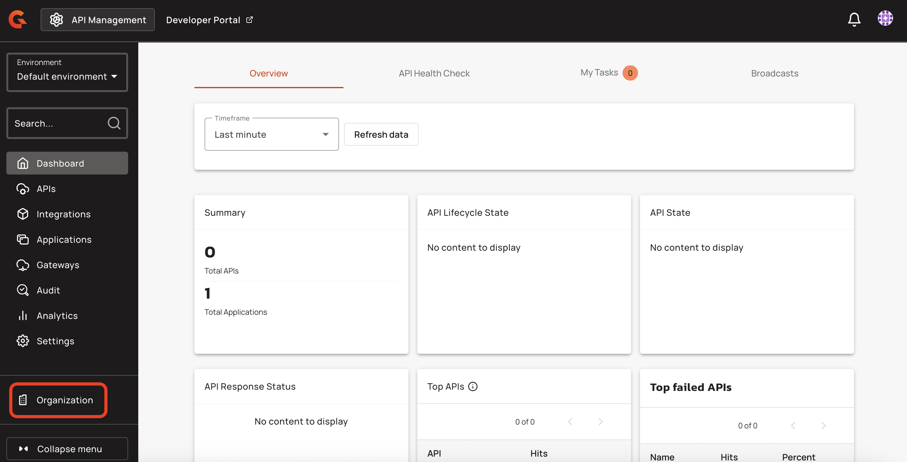

# Define an APIM service account for Terraform

## Overview

For Terraform to use APIM, it needs to authenticate as a user of the APIM instance.

To set Terraform up as an APIM user, you need to create a service account with specific roles on the organization and environment. This provides Terraform with the minimum set of permissions to manage APIs, applications, and other assets in APIM.

This guide explains how to define an APIM service account for Terraform so it can call the Management API (mAPI).

## Create a Terraform service account

To create a Terraform service account, complete the following steps:

1. Log in to your APIM Console.
2.  Select **Organization** from the navigation menu.

    <figure><figcaption></figcaption></figure>
3.  From the Organization navigation menu, select **Users**, and then click **Add user**.

    <figure><figcaption></figcaption></figure>
4. Select **Service Account** as the service type, and then enter a value for **Service Name**. Providing a service account email is optional.
5.  Click **Create**.

    <figure><figcaption></figcaption></figure>
6.  From the **Users** screen, click on your service account.

    <figure><figcaption></figcaption></figure>
7.  Ensure that your service account has the ADMIN role on the organization, and the API\_PUBLISHER role on the desired environment.

    <figure><figcaption></figcaption></figure>

    \
    The following screenshot shows the environment-level permissions that are included in the API\_PUBLISHER role:

    <figure><figcaption></figcaption></figure>
8.  From your newly created service account, scroll to the **Tokens** section, and then click **Generate a personal token**.

    <figure><figcaption></figcaption></figure>
9.  Give your token a name, and then click **Generate**.

    <figure><figcaption></figcaption></figure>
10. Copy your token and store it securely. You won’t be able to see it again.


You can now use this token as credentials in your Terraform provider configuration file.

