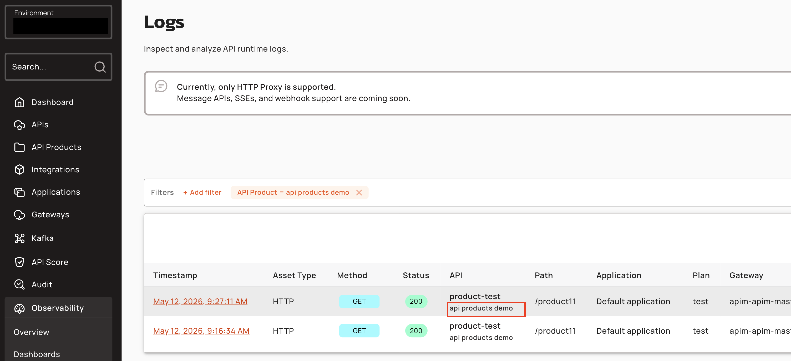
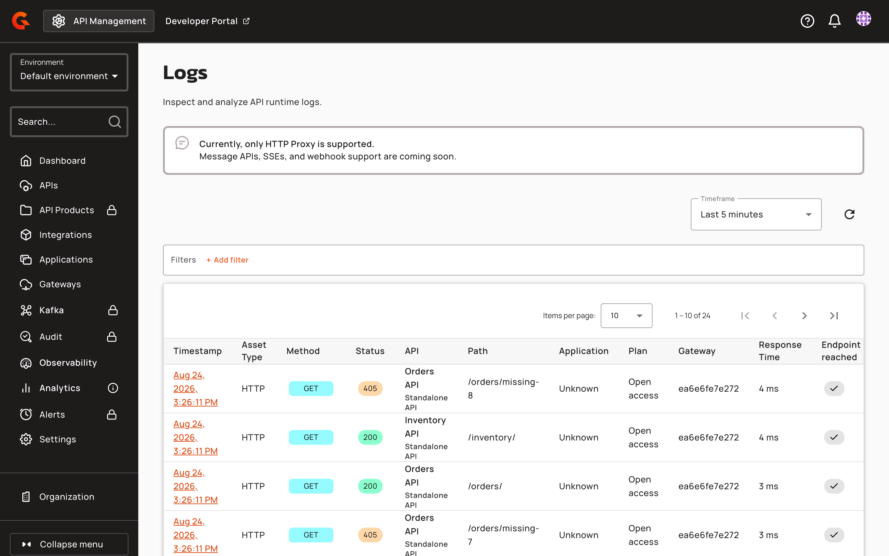
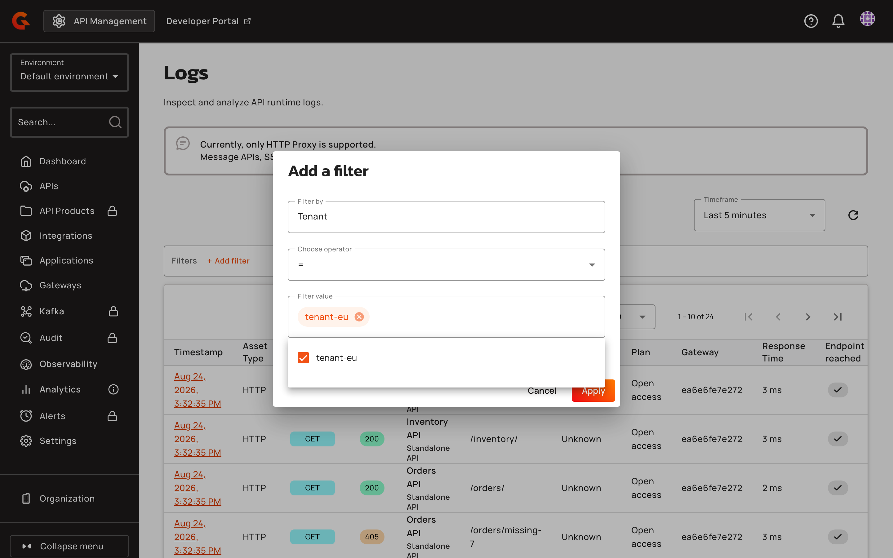
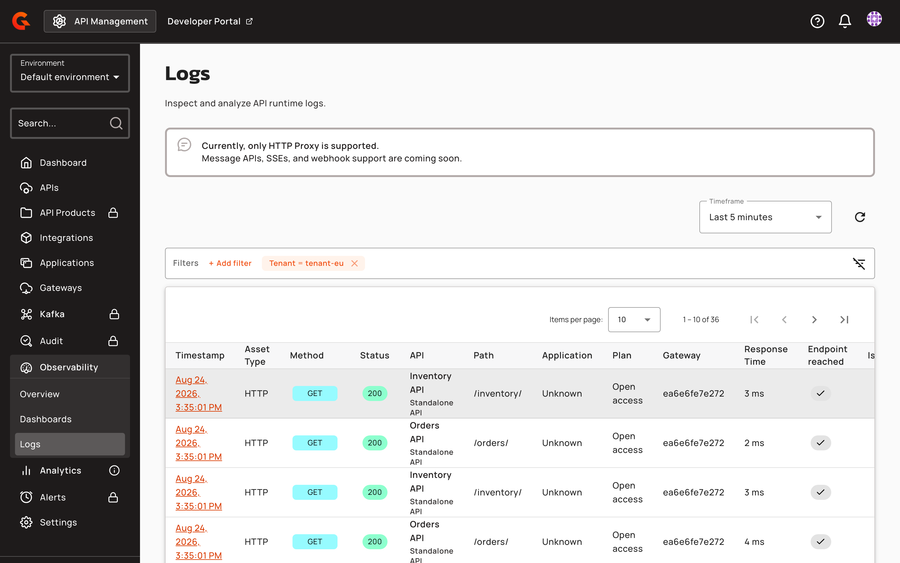
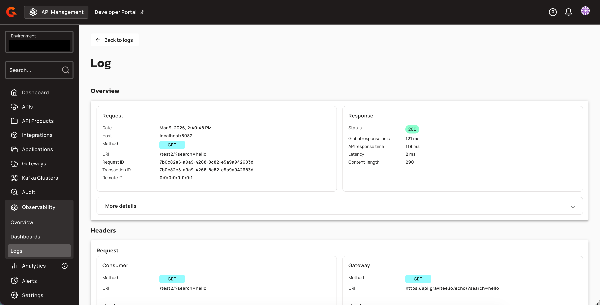
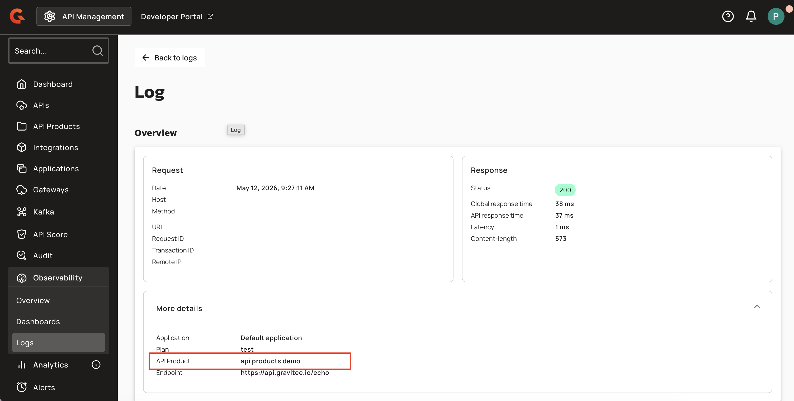

# Configure Environment-level Logs

## Overview

Environment-level logs provide cross-API visibility into the runtime logs for your v4 proxy APIs. You can view request logs across all v4 proxy APIs in a single, centralized page within the APIM Console.

Viewing the environment logs for v4 proxy APIs provides you with the following benefits:

* You can monitor traffic patterns across multiple APIs.
* You can troubleshoot issues that span several APIs.
* You can audit API usage at the environment level.


Environment-level logs are available for v4 proxy APIs only. To view logs for a specific API, including v4 message APIs and webhook logs, see [View API Logs](view-api-logs.md).


## View environment-level logs

To view the logs for your v4 proxy APIs in your environment, complete the following steps:

1. From the **Dashboard**, click **Observability**.
2. From the **Observability** dropdown menu, click **Logs**.

The logs table displays a paginated list of log entries across all v4 proxy APIs in the current environment. Each entry shows the following information:

* **Timestamp:** The date and time of the request.
* **HTTP method:** The HTTP method used in the request.
* **Status:** The HTTP response status code.
* **API:** The name of the API that received the request. When a log entry is associated with an API Product, the product name appears in a lighter font beneath the API name. Logs from standalone APIs display **Standalone API** as the product name.
* **Path:** The request path.
* **Application:** The application that made the request.
* **Plan:** The plan associated with the API call.
* **Gateway:** The Gateway instance that processed the request.
* **Response time:** The time taken to process the request.

<figure><figcaption>
Environment logs filtered by API Product
</figcaption></figure>

<figure><figcaption></figcaption></figure>

## Filter your logs

The **Logs** screen provides a **Timeframe** selector and a **Filters** bar that refine the list of log entries. Select a time range in the **Timeframe** dropdown menu to display only the logs from that window.

To filter the list, click **+ Add filter**. In the **Add a filter** dialog, select a filter in the **Filter by** field and an operator in the **Choose operator** field. Set the value in the **Filter value** field, and then click **Apply**.

You can filter the logs by the following criteria:

* **API:** One or more APIs.
* **Application:** One or more applications.
* **Plan:** One or more plans.
* **Tenant:** One or more of the [tenants](../../configure-and-manage-the-platform/gravitee-gateway/tenants.md) that your Gateways are configured with. The results include only the log entries recorded with a matching tenant.
* **HTTP Method:** One or more HTTP methods.
* **Status Code Group:** One or more response status code groups.
* **Status Code:** The response status code.
* **HTTP Path:** The request path.
* **Gateway Response Time:** The Gateway response time.
* **API Type:** One or more API types.
* **MCP Method:** One or more MCP methods.
* **Error Key:** One or more error keys.
* **Request ID:** One or more request IDs.
* **Transaction ID:** One or more transaction IDs.
* **Payload content:** Text contained in the payload.
* **API Product:** One or more API Products.

<figure><figcaption>
Adding a Tenant filter to the environment logs
</figcaption></figure>

You can combine multiple filters to refine the results. Applied filters appear in the **Filters** bar.

<figure><figcaption>
Environment logs filtered by tenant
</figcaption></figure>

## View the details of your logs

To view the details of any entry in the list of logs, click the entry in the logs table.

<figure><figcaption></figcaption></figure>

The log details page shows the following information:

* The **Overview** section provides general information about the request and response phases, including the timestamp, HTTP method, path, and response status.
* The **More details** dropdown menu shows information about the application, plan, endpoint, Gateway host, and Gateway IP associated with the request.

<figure><figcaption>
Log detail showing the API Product field in More details
</figcaption></figure>
* The **Request** panel shows the HTTP method and URI for the Gateway and consumer, the headers sent in the request phase, and the request body.
* The **Response** panel shows the status of the Gateway and consumer, the headers sent in the response phase, and the body returned in the response.


The level of detail available in each log entry depends on the [API-level logging configuration](configure-api-level-logs.md). To capture request and response headers and payloads, you must configure logging at the API level.

