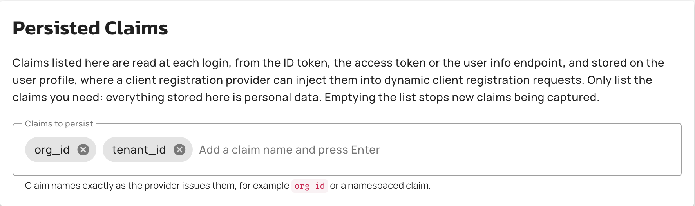
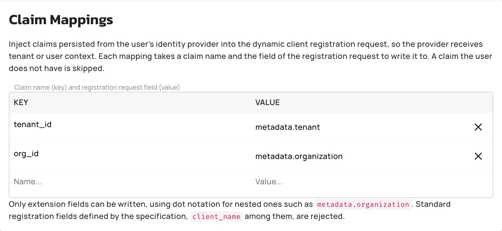

# Inject identity provider claims into DCR requests

## Overview

When a user creates an application through a client registration provider, APIM sends a dynamic client registration (DCR) request to that provider and receives the application's client credentials in return. You can enrich that request with context from the user's identity provider, so that the registration provider knows which tenant, organization, or user the registered client belongs to.

The feature has two halves, configured on two different screens:

* On the identity provider, list the claims to persist. At each login through that provider, APIM reads the listed claims from the tokens and the user info that the provider returns, and stores them on the user.
* On the client registration provider, map each stored claim to a field of the registration request. When the user registers an application, APIM writes the stored values into the request body at those fields.

For example, an identity provider issues an `org_id` claim with the value `org-42`. You list `org_id` on the identity provider and map it to `metadata.organization` on the client registration provider. When a user who carries that claim creates an application, the registration request contains `"metadata": {"organization": "org-42"}` alongside the standard registration fields, and the registration provider associates the new client with that organization.


Every claim you list is stored on the user record, so treat the stored values as personal data and list only the claims you need.

A claim you take off the list is cleared from the user record at that user's next login, and no APIM operation reads or deletes stored claims in the meantime. A user who never logs in again keeps whatever was captured, so taking a claim off the list isn't enough on its own to guarantee that the value is gone.



Client registration providers are an [Enterprise Edition](../../introduction/enterprise-edition.md) capability.


## Prerequisites

Before you configure claim propagation, make sure that you have the following:

* An identity provider of type Gravitee AM, OpenID Connect, Google, or GitHub, configured on the **Authentication** page of the organization settings. For more information, see [Authentication](authentication/README.md).
* Dynamic Client Registration enabled for the environment, with a client registration provider. For more information, see [DCR application configuration](applications.md#dcr-application-configuration).
* Users who authenticate through that identity provider. APIM captures the listed claims at login, so a user has nothing stored until they log in after you save the list.

## Persist claims from the identity provider

To choose the claims that APIM stores on each user at login, complete the following steps:

1. Open **Organization**.
2. Click **Authentication**.
3. Click the **Edit identity provider** icon on the provider's row.
4. Scroll to the **Persisted Claims** section.
5. In the **Claims to persist** field, enter a claim name and press Enter. Repeat for each claim. Enter each name exactly as the provider issues it, for example `org_id`, or a namespaced name such as `https://example.com/org_id`.

    <figure><figcaption><p>The <strong>Persisted Claims</strong> section of an identity provider</p></figcaption></figure>

6. Click **Save**.

The **Persisted Claims** section is available on all four provider types you can create in the Console: Gravitee AM, OpenID Connect, Google, and GitHub.

Saving the list is recorded in the organization audit log.

### How APIM captures claims

APIM applies the claims list at each login through the provider, whether the user logs in to the APIM Console or to the Developer Portal:

* For each listed claim, APIM looks in the ID token first, then in the access token, then in the user info response. The first source that carries the claim wins.
* A claim that none of the three sources carries isn't stored.
* A claim whose value is an array or an object is stored as its JSON text.
* Claim names are matched literally. A namespaced name that contains dots, such as `https://example.com/org_id`, is looked up as a single key, not as a path.
* Each login replaces the stored claims with the values from that login. Removing a claim from the list drops its stored value at the user's next login, and emptying the list removes all of the user's stored claims at their next login.

Stored claims are used only for injection into registration requests. They don't appear in user profile responses.

### Claims list for a provider declared in gravitee.yml

`gravitee.yml` has no key for the claims list, so set it in the APIM Console or through the Management API. A provider declared under `security.providers` keeps the list you saved across restarts.

### Set the claims list through the Management API

The identity provider resources of the Management API carry the list in the `persistedClaimsWhitelist` array. Send it in the body of `PUT /management/organizations/{orgId}/configuration/identities/{identityProviderId}`, alongside the provider's other fields:

```json
{
  "persistedClaimsWhitelist": ["org_id", "tenant_id"]
}
```

* An update that omits `persistedClaimsWhitelist` keeps the stored list. Send an empty array to clear it.
* A blank claim name is rejected with HTTP `400`.
* The same array is accepted by `POST /management/organizations/{orgId}/configuration/identities` when you create a provider, and returned when you read one.

## Map claims to registration request fields

To choose which stored claims APIM injects, and into which fields, complete the following steps:

1. Open **Settings**.
2. Click **Client Registration**.
3. Click the **Edit provider** icon on the provider's row.
4. Scroll to the **Claim Mappings** section.
5. In the **Claim name (key) and registration request field (value)** table, enter the claim name in the **Name...** field of a row and the registration request field in its **Value...** field. A new empty row appears when you start filling the last one.

    <figure><figcaption><p>The <strong>Claim Mappings</strong> section of a client registration provider</p></figcaption></figure>

6. Click **Save**.

Every mapping needs both a claim name and a registration request field, and each claim name can appear only once. The Console flags a mapping that breaks either rule. It doesn't check the field you target, so read [Which fields you can target](#which-fields-you-can-target) first: a mapping that names a standard registration field fails when you save.

Saving the mappings is recorded in the environment audit log.

### Which fields you can target

Write the target as a field name, or as a dot-separated path for a nested field:

* The intermediate objects of a nested path are created for you: `metadata.organization` produces `"metadata": {"organization": "<claim value>"}`.
* Only extension fields are accepted. A path whose first segment is a standard registration field is rejected with HTTP `400`. This keeps a value that the identity provider controls from overriding the settings APIM sends for the application.
* An empty target is rejected with HTTP `400`.

<details>

<summary>Standard registration fields that can't be targeted</summary>

`redirect_uris`, `response_types`, `grant_types`, `application_type`, `contacts`, `client_name`, `logo_uri`, `client_uri`, `policy_uri`, `tos_uri`, `jwks_uri`, `sector_identifier_uri`, `subject_type`, `id_token_signed_response_alg`, `id_token_encrypted_response_alg`, `id_token_encrypted_response_enc`, `userinfo_signed_response_alg`, `userinfo_encrypted_response_alg`, `userinfo_encrypted_response_enc`, `request_object_signing_alg`, `request_object_encryption_alg`, `request_object_encryption_enc`, `token_endpoint_auth_method`, `token_endpoint_auth_signing_alg`, `default_max_age`, `require_auth_time`, `default_acr_values`, `initiate_login_uri`, `request_uris`, `scope`, `software_id`, `software_version`, `software_statement`, and `client_id`.

</details>

### How APIM injects claims

APIM resolves the mappings against the stored claims each time it sends a registration request:

* When a user creates an application that registers through the client registration provider, in the APIM Console or in the Developer Portal, APIM adds each mapped claim that's stored on that user to the registration request before sending it.
* A mapped claim that isn't stored on the user is skipped, and the registration proceeds without it.
* An injected value replaces any value that the request already carries at that field.
* When an application is updated, APIM sends the registration to the provider again, this time with the stored claims of the application's primary owner rather than those of the user making the change. When no primary owner user can be resolved, for example for an application owned by a group, the update is sent without injected claims.
* Mappings apply to the registration requests sent after you save them. An application registered earlier receives the mapped claims the next time it's updated.

### Set claim mappings through the Management API

The client registration provider resources of the Management API carry the mappings in the `claim_mappings` object, keyed by claim name. Send it in the body of `PUT /management/organizations/{orgId}/environments/{envId}/configuration/applications/registration/providers/{providerId}`, alongside the provider's other fields:

```json
{
  "claim_mappings": {
    "org_id": "metadata.organization",
    "tenant_id": "metadata.tenant"
  }
}
```

* An update that omits `claim_mappings` keeps the stored mappings. Send an empty object to clear them.
* The same object is accepted by `POST /management/organizations/{orgId}/environments/{envId}/configuration/applications/registration/providers` when you create the provider, and returned when you read one.

## Verification

To verify that identity provider claims reach the registration provider, follow these steps:

1. Log in to the Developer Portal or to the APIM Console through the identity provider, so that the listed claims are captured.
2. Create an application of a type other than **Simple**, so that it registers through the client registration provider.
3. On the registration provider, open the client that was registered for the application. The mapped fields carry the values of the user's claims.

Optional: set the Management API log level to `DEBUG`. APIM then logs each field it injects as it sends a registration request.

## Troubleshooting

| Symptom | Cause and fix |
| --- | --- |
| The registration request carries none of the mapped claims. | The user hasn't logged in since you saved the claims list, so nothing is stored on them yet. Log out and back in through the identity provider. |
| One mapped claim is missing, the others arrive. | The claim name doesn't match what the provider issues, or the provider didn't issue the claim for that user. Claim names are matched exactly, including any namespace prefix. |
| Saving the mappings fails with HTTP `400`. | The target field is empty, or it's a standard registration field. See [Which fields you can target](#which-fields-you-can-target). |
| An existing application's client has no claims on the registration provider. | Mappings apply to registration requests sent after you save them. Update the application to send it again. |
| An updated application sends no claims, though creating one does. | An update sends the claims of the application's primary owner. An application owned by a group has no primary owner user, so it sends none. |

## Next steps

* [Authentication](authentication/README.md) explains how identity providers are scoped and declared.
* [Applications](applications.md#dcr-application-configuration) explains the client registration provider settings.
* [Configure DCR](../../how-to-guides/use-case-tutorials/configure-dcr.md) walks through a DCR setup with Gravitee Access Management.
