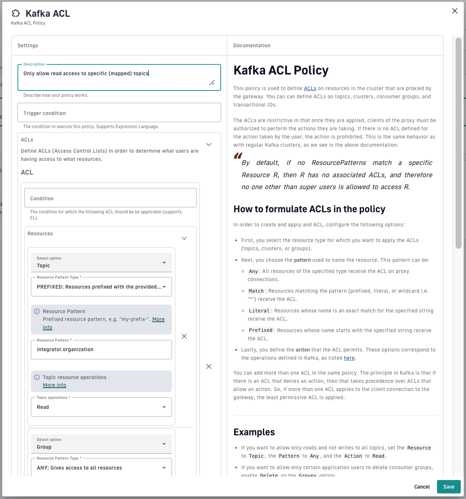

# Kafka ACL

## Overview

The Kafka ACL policy is used to define [ACLs](https://kafka.apache.org/documentation/#security_authz) on cluster resources that are proxied by the Gateway. You can define ACLs on topics, clusters, consumer groups, and transactional IDs.

ACLs are restrictive because once they are applied, proxy clients must be authorized to perform the actions they are taking. If there is no ACL defined for the action taken by the user, the action is prohibited. This is the same behavior as with regular Kafka clusters. For more information about ACLs and authorization, see[ the Kafka documentation](https://kafka.apache.org/24/documentation.html#security_authz).

## How to formulate ACLs in the policy

To create and apply an ACL, complete the following steps. These steps configure options that correspond to the operations defined in Kafka, as listed in the [Confluent documentation](https://docs.confluent.io/platform/current/security/authorization/acls/overview.html#operations).

1. Select the **resource type** for which you want to apply the ACLs (topics, clusters, groups, or transactional IDs).
2. Choose the **pattern** used to name the resource. This pattern can be:
   * `Any`: All resources of the specified type receive the ACL on proxy connections.
   * `Match`: Resources matching the pattern (prefixed, literal, or wildcard "\*") receive the ACL.
   * `Literal`: Resources whose name is an exact match to the specified string receive the ACL.
   * `Prefixed`: Resources whose name starts with the specified string receive the ACL.
   * `Expression`: Resources that match the specified expression receive the ACL. For example, `foo.*.bar.?` matches `foo.42.bar.x`.
     * `*` matches zero or more characters
     * `?` matches exactly one character
3. Define the **action** that the ACL permits.

You can add more than one ACL in the same policy.


ACLs in this policy only grant access. There is no deny rule. An action is allowed when at least one ACL whose condition applies grants it, and any action that no ACL grants is denied. An ACL whose condition fails to evaluate doesn't apply.


<figure><figcaption><p>Kafka ACL Policy UI</p></figcaption></figure>

## Examples

* If you want to allow only reads and not writes to all topics, set the `Resource` to `Topic`, the `Pattern` to `ANY`, and the `Action` to `Read`.
* If you want to allow read-only access to all topic names starting with "integrator," then set the `Resource` to `Topic`, the `Pattern Type` to `PREFIXED`, and the `Pattern` to `integrator`.
* If you want to allow only certain application users to delete consumer groups, enable `Delete` on the `Group` resource option.
* If you want to create a dynamic ACL that can match complicated conditions, you can specify an expression pattern on the `Group`, `Topic`, or `Transactional ID` resources.

## Using expressions in the condition

Gravitee Expression Language (EL) can be used to define conditions on each ACL. This is an easy way to define ACLs for multiple applications, or to define dynamic conditions. For example:

* To set the ACL for a specific application, set the condition to `{#context.attributes['application'] == 'abcd-1234'}`, where `'abcd-1234`' is the application ID. You can obtain this ID in the UI by checking the URL for the application.
* To set the ACL based on a specific subscription for an API Key plan, set the condition to `{#context.attributes['user-id'] == 'abcd-1234'}`, where `'abcd-1234'` is the subscription ID.
* To set the ACL based on the claim in a JWT token, set the condition to, e.g.,`{#context.attributes['jwt.claims']['iss']}`, changing the `iss` to the desired claim.
* To set the ACL based on the claim in an OAuth2 token, set the condition to, e.g., `{#jsonPath(#context.attributes['oauth.payload']['custom_claim'])}`, changing the `custom_claim` to the desired claim.
* To set the ACL to match an expression pattern, you can use wildcards. For example, `auto.?.syncx.*` will match `auto.x.syncx.interop.xyz`, `auto.y.syncx.interop.yzx`, or `auto.z.syncx.interop.zyx`, but it will not match `auto.xx.syncx.interop.xyz`.

## Using resources

### Delegation tokens

The policy has no resource for [delegation tokens](https://docs.confluent.io/platform/current/security/authentication/delegation-tokens/overview.html#kafka-sasl-delegate-auth). When the Kafka ACL policy is applied, every request to create, renew, expire, or describe a delegation token is rejected with the `DELEGATION_TOKEN_AUTH_DISABLED` error, whatever ACLs you define.

### Transactional ID resource

The `Transactional ID` resource is used when producers encounter application restarts, and is necessary for exactly once semantics. For more information, see the [Confluent documentation](https://docs.confluent.io/platform/current/security/authorization/acls/overview.html#resources).

## In combination with the Kafka Topic Mapping policy

When using the Kafka ACL policy together with the [Kafka Topic Mapping](kafka-topic-mapping.md) policy, order is important. If topic mapping occurs before ACL, the ACL policy must use the broker-side name of the topic mapping. Conversely, if ACL occurs before topic mapping, the ACL policy must use the mapped name, which is the client-side name of the topic mapping.


Versions of the Kafka ACL policy earlier than 3.0.1 fail incremental fetch requests when the ACL policy runs before the Kafka Topic Mapping policy. Kafka consumers reuse a fetch session across polls, and in affected versions the topic names that the ACL policy stored for the session were later rewritten by the Kafka Topic Mapping policy, so subsequent polls in the same session failed with `TOPIC_AUTHORIZATION_FAILED` even though the initial fetch succeeded. Version 3.0.1 and later of the Kafka ACL policy keep the session state independent of topic mapping. If consumers fail with `TOPIC_AUTHORIZATION_FAILED` only after the first successful poll, upgrade the Kafka ACL policy to 3.0.1 or later.


The following examples show how you can place the topic mapping and ACL policies in relation to one another to achieve specific results.

### Example 1: Execute the ACL policy after topic mapping

An API Gateway enforces Kafka ACL rules to control access to topics. However, if ACL checks happen before topic mapping, requests may be rejected because the client-side topic name isn't recognized.

To ensure that ACL rules are applied correctly, the ACL policy should be executed after the Topic Mapping policy so that it evaluates the actual broker-side topic.



This shows how to implement the example above using the APIM Console.

Kafka Topic Mapping configuration:

<figure><figcaption><p>Kafka Topic Mapping policy configuration UI</p></figcaption></figure>

Kafka ACL configuration:

<figure><figcaption><p>Kafka ACL policy configuration UI</p></figcaption></figure>

Here is how the policies should be ordered in the policy chain:

<figure><figcaption></figcaption></figure>



This shows how to implement the example above in a v4 API definition:

```json
{
  "api": {
    ...
  },
  "plans": [
    {
      "flows": [
        {
          "interact": [
            {
              "name": "Kafka Topic Mapping",
              "enabled": true,
              "policy": "kafka-topic-mapping",
              "configuration": {
                "mappings": [
                  {
                    "client": "orders",
                    "broker": "internal.orders.processing.12345"
                  }
                ]
              }
            },
            {
              "name": "Kafka ACL Policy",
              "enabled": true,
              "policy": "kafka-acl",
              "configuration": {
                "authorizations": [
                  {
                    "resources": [
                      {
                        "type": "TOPIC",
                        "resourcePatternType": "LITERAL",
                        "resourcePattern": "internal.orders.processing.12345",
                        "operations": ["TOPIC_READ", "TOPIC_DESCRIBE"]
                      }
                    ]
                  }
                ]
              }
            }
          ]
        }
      ]
    }
  ]
}
```



### Example 2: Enforce ACL before topic mapping with wildcard permissions

Suppose a security-first organization requires Kafka ACL rules to be enforced before topic mapping, but some applications need wildcard-based access control to produce or consume messages from any topic that matches a pattern.

In this scenario, the ACL policy must be able to handle wildcard rules for groups of topics. In addition, topics must be mapped after authorization so that consumers don’t need to know internal topic names.

With this configuration:

* The ACL policy runs first, so it checks the client-side topic names. It grants read and write access only to topics whose client-side name matches the `orders*` expression.
* Topic mapping then exposes the `internal.orders.global` broker topic to external consumers as `orders`.



This shows how to implement the example above using the APIM Console.

ACL configuration:

<figure><figcaption></figcaption></figure>

Topic mapping configuration:

<figure><figcaption></figcaption></figure>

Here is how the policies should be ordered in the policy chain:

<figure><figcaption></figcaption></figure>



This shows how to implement the example above in a v4 API definition:

```json
{
  "api": {
    ...
  },
  "plans": [
    {
      "flows": [
        {
          "interact": [
            {
              "name": "Kafka ACL Policy",
              "enabled": true,
              "policy": "kafka-acl",
              "configuration": {
                "authorizations": [
                  {
                    "resources": [
                      {
                        "type": "TOPIC",
                        "resourcePatternType": "EXPRESSION",
                        "resourcePattern": "orders*",
                        "operations": ["TOPIC_READ", "TOPIC_WRITE", "TOPIC_DESCRIBE"]
                      }
                    ]
                  }
                ]
              }
            },
            {
              "name": "Kafka Topic Mapping",
              "enabled": true,
              "policy": "kafka-topic-mapping",
              "configuration": {
                "mappings": [
                  {
                    "client": "orders",
                    "broker": "internal.orders.global"
                  }
                ]
              }
            }
          ]
        }
      ]
    }
  ]
}
```


