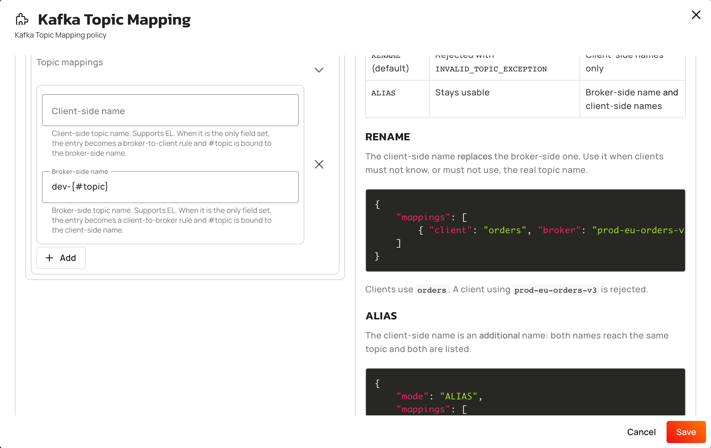
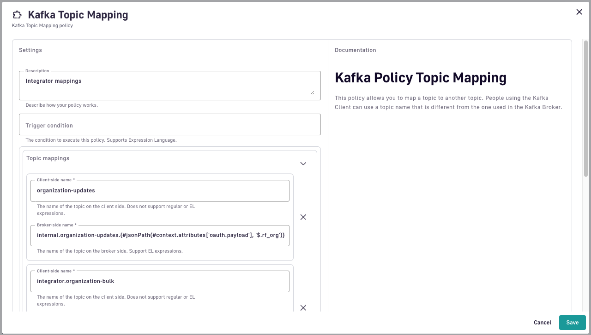

# Kafka Topic Mapping

## Overview <a href="#user-content-description" id="user-content-description"></a>

The Kafka Topic Mapping policy lets you map one topic to another so that the Kafka client can use a topic name that is different from the topic name used in the Kafka broker.

## Configuration <a href="#user-content-configuration" id="user-content-configuration"></a>

You can configure the policy with the following options:

<table>
    <thead>
        <tr>
            <th width="183">Property</th>
            <th>Required</th>
            <th>Description</th>
            <th>Type</th>
            <th>Default</th>
        </tr>
    </thead>
    <tbody>
        <tr>
            <td><code>mode</code></td>
            <td>No</td>
            <td><code>RENAME</code>: the client-side name replaces the broker-side one, which becomes unusable and disappears from the topic listing. <code>ALIAS</code>: the client-side name is an additional name, and the broker-side one stays usable and listed.</td>
            <td>String</td>
            <td><code>RENAME</code></td>
        </tr>
        <tr>
            <td><code>mappings</code></td>
            <td>No</td>
            <td>A list of mapping entries between client-side and broker-side topic names.</td>
            <td>Array</td>
            <td></td>
        </tr>
        <tr>
            <td><code>mappings.client</code></td>
            <td>No</td>
            <td>Client-side topic name. Supports EL expressions. Leave it out to turn the entry into a client-to-broker rule.</td>
            <td>String</td>
            <td></td>
        </tr>
        <tr>
            <td><code>mappings.broker</code></td>
            <td>No</td>
            <td>Broker-side topic name. Supports EL expressions. Leave it out to turn the entry into a broker-to-client rule.</td>
            <td>String</td>
            <td></td>
        </tr>
    </tbody>
</table>

An entry must set at least one of `client` and `broker`. A field left out, or set to a blank string, counts as absent.

## Mapping entry kinds

From APIM 4.13, how many fields an entry sets decides what it does. An entry that sets both is the exact pair the policy has always supported. An entry that sets one becomes a rule that applies to any topic, with the `#topic` expression variable bound to the name the rule is resolving.

<table>
    <thead>
        <tr>
            <th width="210">Entry</th>
            <th width="230">What it does</th>
            <th><code>#topic</code> is bound to</th>
        </tr>
    </thead>
    <tbody>
        <tr>
            <td><code>client</code> and <code>broker</code></td>
            <td>Exact pair, mapped in both directions.</td>
            <td>Not bound, unless one field references it.</td>
        </tr>
        <tr>
            <td><code>broker</code> only</td>
            <td>Client-to-broker rule. Applies to any topic the client names.</td>
            <td>The client-side name.</td>
        </tr>
        <tr>
            <td><code>client</code> only</td>
            <td>Broker-to-client rule. Applies to broker-originated topics in an all-topics listing.</td>
            <td>The broker-side name.</td>
        </tr>
    </tbody>
</table>

A rule opts out of a topic by resolving to nothing. When the expression returns null or a blank string, the policy moves on to the next entry. A topic that every entry declines reaches the broker under its own name.

An exact pair may also reference `#topic` in one of its two fields. The other field is evaluated first and bound as `#topic`. No entry can reference `#topic` in both fields.

In `ALIAS` mode, rules resolve exactly as they do in `RENAME` mode. What changes is the listing. A topic renamed by a broker-to-client rule is listed under both names, each with its own topic ID, and the broker-side name stays addressable.

### Which entry wins

The policy resolves a topic name in this order:

1. Exact pairs, in the order they're declared.
2. The result already resolved for that topic on this connection.
3. Rules, in the order they're declared.

The first entry that claims the topic wins, so an exact pair always beats a rule. A result is resolved once per topic per connection and stays the same for the life of that connection, including the decision that every rule declined a topic.

A connection also evaluates the whole configuration once, when it opens. Redeploying the API doesn't change what an already-connected client sees, so a client picks up a corrected mapping only when it opens a new connection.

### Prefix every topic a client names

One client-to-broker rule rewrites every topic the client asks for, with no entry per topic:

```json
"mappings": [
  {
    "broker": "dev-{#topic}"
  }
]
```

An expression is recognized only when `#`, `T`, or `(` follows the opening brace directly. Write `dev-{#topic}`, not `{'dev-' + #topic}`: the second form isn't read as an expression at all, so it's used as the literal text you typed, braces included. Braces aren't legal in a Kafka topic name, so every request fails with `INVALID_TOPIC_EXCEPTION`.

A client asking for `orders` and `invoices` reaches `dev-orders` and `dev-invoices` on the broker.

A rule rewrites administrative requests as well as reads and writes, so under this rule a client that asks to delete `orders` deletes `dev-orders`. The same applies to creating topics, altering configurations, managing ACLs, electing leaders, and reassigning partitions.


This policy maps topic names and nothing else. Consumer group IDs and transactional IDs are untouched, so a prefix applied here doesn't separate two tenants: they share a consumer group if they use the same group ID, and their transactional producers collide. The topic names give no sign of it. Prefixing topics, consumer group IDs, and transactional IDs together is what the Kafka Namespace policy does, so use that policy when you're separating tenants.


<figure><figcaption><p>A client-to-broker rule, with the client-side name left empty</p></figcaption></figure>

### Strip a prefix from a topic listing

One broker-to-client rule labels broker topics back, and declines the topics it doesn't match:

```json
"mappings": [
  {
    "client": "{#topic matches 'dev-.*' ? #topic.substring(4) : null}"
  }
]
```

In an all-topics listing, a broker topic called `dev-orders` is listed as `orders`. A broker topic called `audit-log` is listed under its own name, because the expression returns null for it and the rule opts out.


A broker-to-client rule runs only while an all-topics listing is being answered. A client that names `orders` without having listed all topics first on that connection reaches no such topic, so subscribing to it, assigning it, or describing it fails with `UNKNOWN_TOPIC_OR_PARTITION`. Once a listing has named the topic, the pair is held for the rest of that connection and the name works. Pair the rule with a client-to-broker rule when clients address topics by name.


A rule output that isn't a legal Kafka topic name fails the request rather than being skipped.

### Map a topic in both directions

Round-tripping a topic takes one rule per direction. The two rules above, declared together, rewrite `orders` to `dev-orders` on the way out and list `dev-orders` as `orders` on the way back:

```json
"mappings": [
  {
    "broker": "dev-{#topic}"
  },
  {
    "client": "{#topic matches 'dev-.*' ? #topic.substring(4) : null}"
  }
]
```

## Examples <a href="#user-content-supported-kafka-apikeys" id="user-content-supported-kafka-apikeys"></a>

The following examples demonstrate how to expose a broker-side (internal) topic name with a consumer-friendly client-side (external) topic name.

### Simple mapping

The simplest use case is a straightforward mapping between broker-side and client-side topic names.

#### Example 1: I want to map an internal topic name to something else (externally)

If you have a broker-side topic called `internal.orders.processed` and you want to expose that as a consumer-friendly name, then configure the Kafka Topic Mapping policy as follows:

* Client-side name: `processed-orders`
* Broker-side name: `internal.orders.processed`

Kafka clients will now be able to specify the mapped topic name (`processed-orders`) in their connection configuration. For example: `kafka-console-consumer.sh --bootstrap-server foo.kafka.local:9092 --consumer.config config/client.properties --topic processed-orders`



This shows how to implement the example above using the APIM Console:

<figure><figcaption><p>Kafka Topic Mapping policy configuration UI</p></figcaption></figure>



This code snippet of a v4 API definition shows how to implement the example above:

```json
{
  "api": {
    ...
  },
  "plans: [    
    {
      "flows": [
        {
          "interact": [
            {
              "name": "Kafka Topic Mapping",
              "enabled": true,
              "policy": "kafka-topic-mapping",
              "configuration": {
                "mappings": [
                  {
                    "broker": "internal.orders.processed",
                    "client": "processed-orders"
                  }
                ]
              }
              ...
            }
          ]
        }
      ]
    }
  }
}
```



### Dynamic mapping

The following examples are more complex and use Gravitee Expression Language.

#### Example 2: I want to simplify internal-only topic names as an external-friendly topic name (with support from an OAuth2 provider)

In this scenario, each customer of a company has their own dedicated topic in the Kafka cluster. Each customer also has their own unique `organizationId`, so the topic naming schema is `internal.organization-updates.{organizationId}`.

The customer may not know their own `organizationId`, but it has been included in their access token in a field named `rf_org`. After the user has authenticated with the identity provider, Gravitee can extract this payload data from their access token, as shown below:


```json
{
  "sub": "1234567890",
  "name": "John Doe",
  "iat": 1516239022,
  "rf_org": "12345"
}
```


Using the above payload data, the broker-side topic should be: `internal.organization-updates.12345`.

This company wants to simplify customer requirements so customers can specify a generic client-side topic, such as `organization-updates`, and Gravitee will dynamically map that to the relevant broker-side topic in Kafka using the details obtained from each OAuth2 access token payload.

You can use the Kafka Topic Mapping policy to create a new topic mapping with a client-side name of `organization-updates` and a broker-side name of `integrator.organization-updates.{#jsonPath(#context.attributes['oauth.payload'], '$.rf_org')}`. This broker-side name includes the use of Gravitee Expression Language to dynamically inject the `rf_org` value from the OAuth2 payload.



This shows how to implement the example above using the APIM Console:

<figure><figcaption><p>Kafka Topic Mapping policy configuration UI</p></figcaption></figure>



This shows how to implement the example above in a v4 API definition:

```json
{
  "api": {
    ...
  },
  "plans: [
    {
      "flows": [
        {
          ...
          "interact": [
            {
              "name": "Kafka Topic Mapping",
              "enabled": true,
              "policy": "kafka-topic-mapping",
              "configuration": {
                "mappings": [
                  {
                    "client": "organization-updates",
                    "broker": "integrator.organization-updates.{#jsonPath(#context.attributes['oauth.payload'], '$.rf_org')}"
                   }
                ]
              }
            }
          ]
        }
      ]
    }
  ]
}
```



#### Example 3: I want dynamic topic mapping based on user identity and permissions (with support from an OAuth2 provider)

Suppose an enterprise system dynamically maps topics based on user roles. Admins need to access the full `internal.system.logs` topic, but other users should only see a filtered version that is mapped to `internal.user.logs`.

Topics can be be mapped based on user roles retrieved from an OAuth2 provider, with the correct permissions applied based on user identity. First, the user's role is extracted from the OAuth2 access token supplied by the identity server. OAuth2 roles are automatically added to `context.attributes` by Gravitee. Next, topics are dynamically mapped based on user role.

With this configuration, admin users see logs mapped to `internal.system.logs` and other users see logs mapped to `internal.user.logs`.



This shows how to implement the example above using the APIM Console:

<figure><figcaption><p>Kafka Topic Mapping policy configuration UI</p></figcaption></figure>



This shows how to implement the example above in a v4 API definition:

```json
{
  "api": {
    ...
  },
  "plans: [
    {
      "flows": [
        {
          "interact": [
            {
              "name": "Kafka Topic Mapping",
              "enabled": true,
              "policy": "kafka-topic-mapping",
              "configuration": {
                "mappings": [
                  {
                    "client": "logs",
                    "broker": "{#context.attributes['user.role'] == 'admin' ? 'internal.system.logs' : 'internal.user.logs'}"
                  }
                ]
              }
            }
          ]
        }
      ]
    }
  }
} 
```



### In combination with the Kafka ACL policy

When using topic mapping together with the [Kafka ACL policy](kafka-acl.md), order is important. If topic mapping occurs before ACL, the ACL policy must use the broker-side name of the topic mapping. Conversely, if ACL occurs before topic mapping, the ACL policy must use the mapped name, which is the client-side name of the topic mapping.

The following examples show how you can place the topic mapping and ACL policies in relation to one another to achieve specific results.

#### Example 4: I want to execute the ACL policy after topic mapping

An API Gateway enforces Kafka ACL rules to control access to topics. However, if ACL checks happen before topic mapping, requests may be rejected because the client-side topic name isn't recognized.

To ensure that ACL rules are applied correctly, the ACL policy should be executed after the Topic Mapping policy so that it evaluates the actual broker-side topic.



This shows how to implement the example above using the APIM Console.

Kafka Topic Mapping configuration:

<figure><figcaption><p>Kafka Topic Mapping policy configuration UI</p></figcaption></figure>

Kafka ACL configuration:

<figure><figcaption><p>Kafka ACL policy configuration UI</p></figcaption></figure>

Here is how the policies should be ordered in the policy chain:

<figure><figcaption></figcaption></figure>



This shows how to implement the example above in a v4 API definition:

```json
{
  "api": {
    ...
  },
  "plans: [    
    {
      "flows": [
        {
          "interact": [
            {
              "name": "Kafka Topic Mapping",
              "enabled": true,
              "policy": "kafka-topic-mapping",
              "configuration": {
                "mappings": [
                  {
                    "client": "orders",
                    "broker": "internal.orders.processing.12345"
                  }
                ]
              }
            },
            {
              "name": "Kafka ACL Policy",
              "enabled": true,
              "policy": "kafka-acl",
              "configuration": {
                "authorizedTopics": [
                  "internal.orders.processing.12345"
                ],
                "authorizationType": "READ"
              }
            }
          ]
        }
      ]
    }
  }
}
```



#### Example 5: I want to enforce ACL before topic mapping with wildcard permissions

Suppose a security-first organization requires Kafka ACL rules to be enforced before topic mapping, but some applications need wildcard-based access control to produce or consume messages from any topic that matches a pattern.

In this scenario, the ACL policy must be able to handle wildcard rules for groups of topics. In addition, topics must be mapped after authorization so that consumers don’t need to know internal topic names.

With this configuration:

* ACL ensures users can access only `internal.orders.*` topics.
* Topic mapping exposes the `internal.orders.global` broker topic to external consumers as `orders`.



This shows how to implement the example above using the APIM Console.

ACL configuration:

<figure><figcaption></figcaption></figure>

Topic mapping configuration:

<figure><figcaption></figcaption></figure>

Here is how the policies should be ordered in the policy chain:

<figure><figcaption></figcaption></figure>



This shows how to implement the example above in a v4 API definition:

```json
{
  "api": {
    ...
  },
  "plans: [    
    {
      "flows": [
        {
          "interact": [
            {
              "name": "Kafka ACL Policy",
              "enabled": true,
              "policy": "kafka-acl",
              "configuration": {
                "authorizedTopics": [
                  "internal.orders.*"
                ],
                "authorizationType": "READ_WRITE"
              }
            },
            {
              "name": "Kafka Topic Mapping",
              "enabled": true,
              "policy": "kafka-topic-mapping",
              "configuration": {
                "mappings": [
                  {
                    "client": "orders",
                    "broker": "internal.orders.global"
                  }
                ]
              }
            }
          ]
        }
      ]
    }
  }
}
```



## What the policy rejects

The policy checks a mapping entry when the API is deployed, and checks what an expression produces when it runs. Each message names the entry by its position in the list, counting from zero.

The following configurations are rejected when the policy is created:

<table>
    <thead>
        <tr>
            <th width="330">Configuration</th>
            <th>Result</th>
        </tr>
    </thead>
    <tbody>
        <tr>
            <td>An entry that sets neither <code>client</code> nor <code>broker</code></td>
            <td><code>Topic mapping [0]: a topic mapping must define at least 'client' or 'broker'</code></td>
        </tr>
        <tr>
            <td>An entry that references <code>#topic</code> in both fields</td>
            <td><code>Topic mapping [0]: #topic can be referenced in 'client' or 'broker', not both</code></td>
        </tr>
        <tr>
            <td>A field written as a plain name that Kafka wouldn't accept as a topic name</td>
            <td>The entry, the field, and the value are named, with the rule Kafka applies: at most 249 characters of <code>[a-zA-Z0-9._-]</code>. A name must also be non-empty and must not be <code>.</code> or <code>..</code></td>
        </tr>
        <tr>
            <td>Two entries whose plain names collide on the same side</td>
            <td>The second entry is named, along with the position of the first one that used the value</td>
        </tr>
    </tbody>
</table>

A rule that never references `#topic` is accepted and logs a warning, because every topic it claims collapses onto one name.

At runtime, an expression that resolves to something unusable is answered on the Kafka protocol:

<table>
    <thead>
        <tr>
            <th width="330">Condition</th>
            <th>Result</th>
        </tr>
    </thead>
    <tbody>
        <tr>
            <td>A rule resolves to null or a blank string</td>
            <td>The rule opts out of that topic and the next entry is tried</td>
        </tr>
        <tr>
            <td>A rule resolves to a name Kafka wouldn't accept</td>
            <td>The request fails with <code>INVALID_TOPIC_EXCEPTION</code></td>
        </tr>
        <tr>
            <td>A broker-to-client rule's expression fails while a listing is being labeled</td>
            <td>The rule opts out of that topic. The failure is logged once per rule per direction for the connection</td>
        </tr>
        <tr>
            <td>A client-to-broker rule's expression fails</td>
            <td>The request fails</td>
        </tr>
        <tr>
            <td>An exact pair's expression resolves either side to nothing</td>
            <td>The request fails with <code>INVALID_CONFIG</code></td>
        </tr>
        <tr>
            <td>An exact pair's expression resolves either side to a name Kafka wouldn't accept</td>
            <td>The request fails with <code>INVALID_CONFIG</code></td>
        </tr>
        <tr>
            <td>In <code>RENAME</code> mode, a client names a broker-side topic directly</td>
            <td>The request fails with <code>INVALID_TOPIC_EXCEPTION</code> and the message <code>Unauthorized topic. The topic [name] is a broker topic. It is not addressable by clients.</code></td>
        </tr>
        <tr>
            <td>In <code>RENAME</code> mode, a client names a broker-side topic that a rule of the same policy has already produced on that connection</td>
            <td>The request fails with <code>INVALID_TOPIC_EXCEPTION</code> and the message <code>Unauthorized topic. The topic [name] is a broker topic. The client must use the mapped client topic instead [mapped name]</code></td>
        </tr>
        <tr>
            <td>In <code>ALIAS</code> mode, a client names a broker-side topic</td>
            <td>The request is served, because the broker-side name stays addressable in this mode</td>
        </tr>
    </tbody>
</table>

## Limitations

Mapping resolves fail-open by design. A topic that no entry claims reaches the broker under the name the client used, and a rule declines a topic whenever its expression returns null, which is exactly what the conditional idiom above does. Topic mapping is therefore a naming convenience, not an isolation boundary. Use broker-side ACLs to decide what a client may actually reach.

The policy doesn't prevent the following, so check for them when you write a rule:

* **Two entries can resolve to the same name.** Plain names that collide are rejected when the policy is created, but the check covers plain names only. Two expressions that happen to produce the same name for different topics aren't detected, and one client's records then reach another client's topic.
* **A single rule can collide with itself.** The strip rule above lists a broker topic called `dev-orders` as `orders`. If the broker also hosts a topic already called `orders`, the listing names two different topics `orders`.
* **A broker-side name a rule hasn't produced yet isn't protected.** In `RENAME` mode the policy refuses a client that names a broker-side topic directly, but for a rule it can only recognize the names that rule has already produced on that connection. A name the rule could produce, and hasn't yet, is addressable. The names are tracked per policy instance, so when the same connection passes through two instances of this policy, such as an API-level flow and a plan-level flow, neither instance recognizes the other's names.
* **Consolidating several topics onto one isn't supported.** A rule that ignores `#topic` maps every topic it claims onto a single name. The policy logs a warning and continues.
