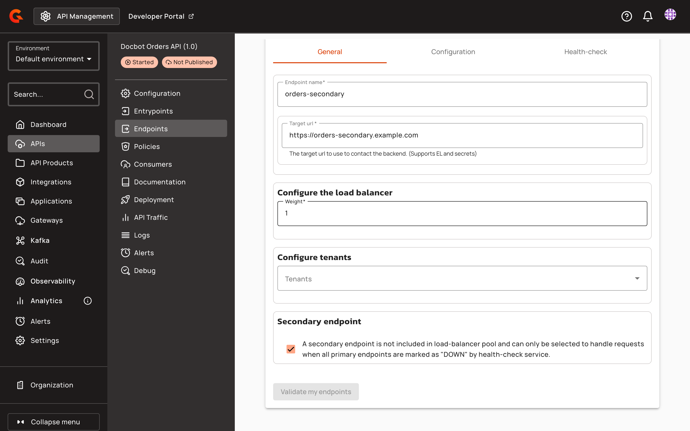
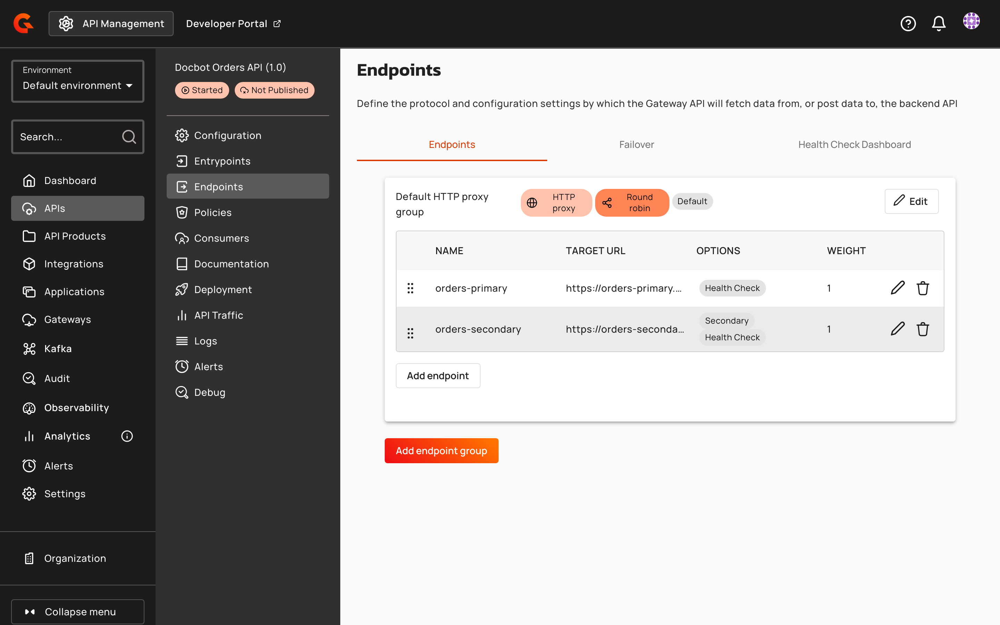

# Load balancing and failover

## Overview

For v4 HTTP proxy APIs, the Gateway distributes requests across the endpoints of an endpoint group using a load balancing algorithm, and a failover circuit breaker protects the API when backend endpoints become slow or unavailable.


Health checks are configured separately from load balancing and failover. For endpoint availability monitoring, see Health-checks.


## Load balancing

An endpoint group is a logical grouping of endpoints that share a load balancing algorithm. Each request to the API is routed to one endpoint of the group according to the algorithm configured on the group.

### v4 APIs support four load balancing algorithms:

<table><thead><tr><th width="240">Algorithm</th><th>Behavior</th></tr></thead><tbody><tr><td>Round robin</td><td>Distributes requests across the endpoints of the group in sequential order, returning to the first endpoint after the last.</td></tr><tr><td>Random</td><td>Selects an endpoint at random for each request.</td></tr><tr><td>Weighted round robin</td><td>Distributes requests sequentially across the endpoints in proportion to each endpoint's configured weight.</td></tr><tr><td>Weighted random</td><td>Selects an endpoint at random for each request, in proportion to each endpoint's configured weight.</td></tr></tbody></table>

The two weighted algorithms use the weight configured on each endpoint. A higher weight sends a larger share of requests to that endpoint.

To configure load balancing:

1. Log in to your APIM Management Console.
2. Select **APIs** from the left nav.
3. Select your API from the list.
4. Select **Endpoints** from the inner left nav.
5. Open the endpoint group to edit.
6. Select the load balancing algorithm for the endpoint group.
7. Optional: Set the weight of each endpoint when using a weighted algorithm.
8. Save and redeploy the API.

### Secondary endpoints

A secondary endpoint is held in reserve. Load balancing skips it while at least one primary endpoint of its endpoint group is available. An endpoint that isn't marked as secondary is a primary endpoint.

When health checks have marked every primary endpoint of the group as down, requests go to the secondary endpoints, spread across them by the group's load balancing algorithm. When a primary endpoint is back up, new requests go to the primary endpoints again.


Primary endpoints leave load balancing when a health check marks them as down. Without a health check on the primary endpoints, load balancing doesn't send requests to a secondary endpoint while its group has a primary endpoint. To configure health checks, see [Health-checks](health-checks.md).


To mark an endpoint as secondary:

1. Log in to your APIM Management Console.
2. Select **APIs** from the left nav.
3. Select your API from the list.
4. Select **Endpoints** from the inner left nav.
5. Click the pencil icon of the endpoint you want to mark. To add an endpoint instead, click **Add endpoint** in its endpoint group.
6. On the **General** tab, select the checkbox in the **Secondary endpoint** section.

    <figure><figcaption>
The Secondary endpoint checkbox on the General tab of an endpoint
</figcaption></figure>
7. Save the endpoint and redeploy the API.

## Failover

Failover protects a v4 HTTP proxy API when its backend endpoints become slow or unavailable. v4 failover uses a circuit breaker: when the number of slow calls or connection failures reaches the configured threshold, the circuit breaker enters the open state and stops sending requests to the backend. While the circuit breaker is open, the API responds with `502 Bad Gateway`. Failover is configured at the API level.


Failover isn't supported for Kafka endpoints. Enabling it has no effect for Kafka endpoints. For Kafka, use the native Kafka failover by providing multiple bootstrap servers.


To configure failover:

1. Log in to your APIM Management Console.
2. Select **APIs** from the left nav.
3. Select your API from the list.
4. Select **Failover** from the inner left nav.
5. Toggle **Enable Failover** to ON.
6. Configure the failover settings.
7. Save and redeploy the API.

### The failover settings are:

<table><thead><tr><th width="250">Setting</th><th width="110">Default</th><th>Description</th></tr></thead><tbody><tr><td>Enable Failover</td><td><code>false</code></td><td>Enables the failover circuit breaker for the API.</td></tr><tr><td>Force next endpoint on failure</td><td><code>false</code></td><td>Forces the use of the next endpoint instead of relying on the load balancer.</td></tr><tr><td>Max retries</td><td><code>2</code></td><td>The number of retry attempts before an error is recorded. Each attempt selects an endpoint using the load balancing algorithm.</td></tr><tr><td>Failure condition</td><td>-</td><td>An Expression Language expression evaluated against the response to determine whether it's a failure, for example <code>{#response.status >= 500}</code>.</td></tr><tr><td>Slow call duration (ms)</td><td><code>2000</code></td><td>The threshold, in milliseconds, above which a response is recorded as slow. Configure endpoint timeouts greater than this value.</td></tr><tr><td>Open state duration (ms)</td><td><code>10000</code></td><td>The duration, in milliseconds, for which the circuit breaker stays open before moving to the half-open state.</td></tr><tr><td>Maximum failures</td><td><code>5</code></td><td>The number of failures before the circuit breaker switches to the open state.</td></tr><tr><td>Per subscription</td><td><code>true</code></td><td>When ON, a dedicated circuit breaker is used for each subscriber. When OFF, a single circuit breaker is used for the whole API, so one subscriber's slow requests open the circuit breaker for all consumers.</td></tr></tbody></table>

## Health checks

Health checks for v4 HTTP proxy APIs are configured separately. For endpoint availability monitoring, see Health-checks.

## Verification

To verify load balancing and failover are working as expected, follow these steps:

1. Redeploy the API after saving the configuration.
2. Send requests to the API and confirm responses are distributed across the endpoints of the endpoint group according to the selected algorithm.
3. To verify failover, make the backend endpoints slow or unavailable, then send requests until the failure threshold is reached.
4. Confirm the API responds with `502 Bad Gateway` while the circuit breaker is open.
5. To verify a secondary endpoint, confirm that the endpoint list of its group shows **Secondary** in the **Options** column.

    <figure><figcaption>
A secondary endpoint in the endpoint list
</figcaption></figure>
6. Make every primary endpoint of the group unavailable. Once health checks mark them as down, send requests to the API and confirm the secondary endpoint handles them.
