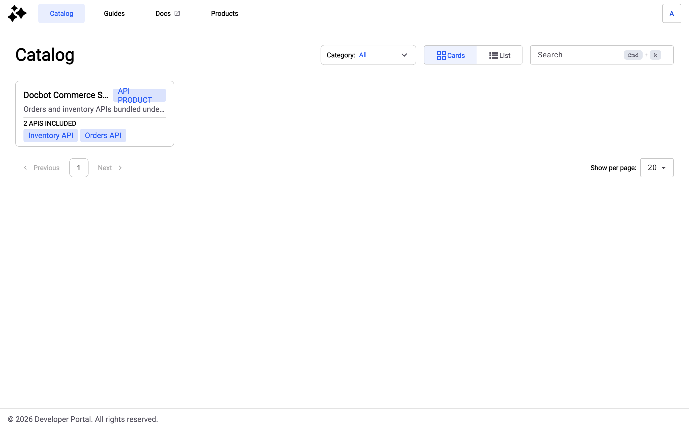

# Catalog

## Overview

Catalog allows consumers to discover the APIs and API Products published in the New Developer Portal.

The catalog is part of the New Developer Portal itself, not the APIM Console. Consumers reach it from the **Catalog** button in the portal navigation bar, which serves the `/catalog` path of your portal URL. On a mobile screen, **Catalog** sits in the panel that opens from the menu button.

To reach the catalog from the APIM Console, click **Open Website**, and then click **Catalog**. For more information about that button, see [configure-the-new-portal.md](configure-the-new-portal.md "mention").

## Prerequisites

* Enable the New Developer Portal. For more information about enabling the New Developer Portal, see [configure-the-new-portal.md](configure-the-new-portal.md "mention").
* Publish APIs. For more information about how to publish APIs in the New Developer Portal, see [#customizing-your-navigation](customize-the-navigation/#customizing-your-navigation "mention").
* Publish API Products. For more information about how to publish API Products in the New Developer Portal, see [#api-product](customize-the-navigation.md#api-product "mention").

## Display APIs in the Catalog

The catalog allows you to see the APIs in two view modes:

1. Card view

<figure><figcaption></figcaption></figure>

2. List view

<figure><figcaption></figcaption></figure>

You can also use the search bar to narrow your selection by your query.

Here are the criteria that are taken into account in the search:

* API name
* Labels
* Owner
* API Type
* Sharding Tags
* Description

For an API Product, the search matches the API Product name. When typo-tolerant search is enabled for the environment, it applies to API Product names too. For more information, see [typo-tolerant-api-search.md](../typo-tolerant-api-search.md "mention").

In list view, a **Category** column shows the categories each API and API Product belongs to. The column is hidden on mobile screens.

## Display API Products in the catalog

An API Product appears in the catalog once its navigation item is published. For more information about publishing an API Product, see [#api-product](customize-the-navigation.md#api-product "mention").

In card view, an API Product card carries the **API PRODUCT** badge, the description of the API Product, and the number of APIs it includes, followed by the names of those APIs. When the API Product has no description, the card reads **Description for this API Product is missing.** In list view, the **API PRODUCT** badge sits next to the name, and the **Details** column shows **Included APIs** with the count and the names.

<figure><figcaption>
API Product card in the catalog
</figcaption></figure>

The card lists only the APIs of the API Product that the consumer can see in the portal. An API nested under an API Product in the navigation doesn't get a catalog entry of its own. An API that's also listed in another folder of the navigation keeps its own entry.

Click the card, or the row in list view, to open the documentation of the API Product. For more information about subscribing to an API Product, see [#subscribe-to-an-api-product](manage-subscriptions.md#subscribe-to-an-api-product "mention").

## Filter the catalog by category

The catalog header carries a **Category** dropdown, alongside the card and list view toggle and the search bar. It filters the catalog to a single category, and it lists only the categories you made visible. Until a consumer picks a category, the dropdown reads `Category: All`. The open dropdown also carries a search field for narrowing a long category list, and a **Clear Selection** button that returns the consumer to the full catalog.

<!-- TODO: add a screenshot of the catalog header with the Category dropdown open, captioned "Category dropdown in the catalog header". The figure is omitted rather than pointed at a missing asset, which would publish as a broken image. -->

When a consumer selects a category, the catalog narrows to the APIs and API Products assigned to it and the search bar clears.

For more information about creating categories and assigning APIs and API Products to them, see [manage-new-developer-portal-categories.md](manage-new-developer-portal-categories.md "mention").

### Share a filtered catalog view

The selected category is carried in the `category` query parameter of the catalog URL, so a consumer shares or bookmarks that exact view by copying the address. A link whose `category` value doesn't match a visible category shows the catalog error state instead of results.
