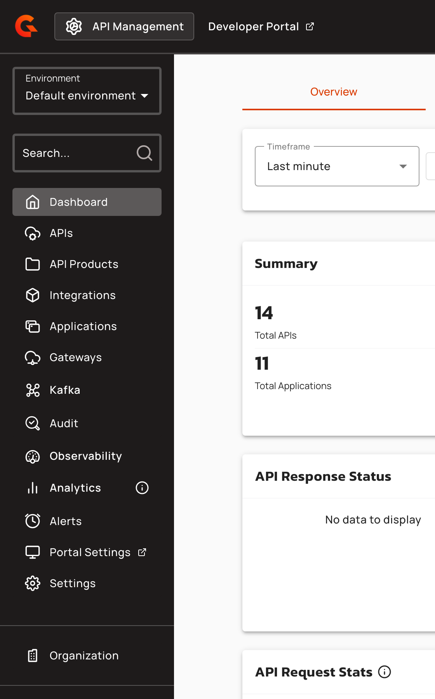
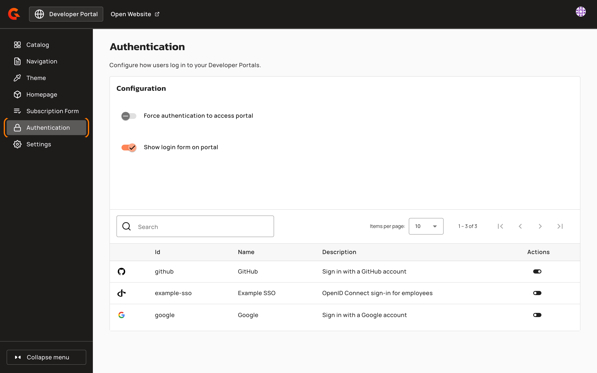
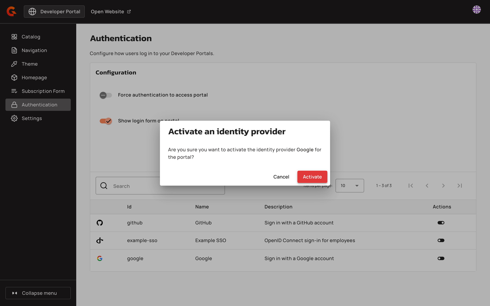
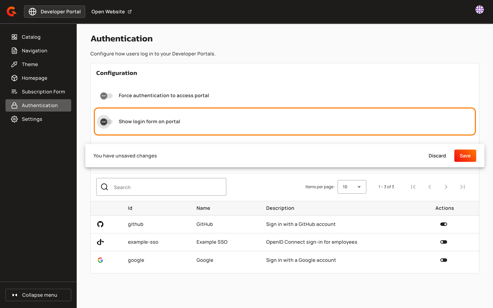
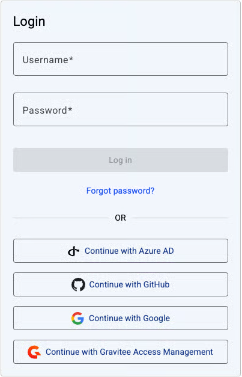

# Configure authentication with SSO

## Overview&#x20;

You can configure authentication for the New Developer Portal, where users must use a SSO login to access your New Developer Portal. This limits access to only authenticated users increases the security of your New Developer Portal.

## Prerequisites&#x20;

* Install Self-Hosted Installation of Gravitee APIM or a Hybrid Installation of Gravitee APIM. For more information about installating Gravitee APIM, see [self-hosted-installation-guides](../../../self-hosted-installation-guides/ "mention") or [hybrid-installation-and-configuration-guides](../../../hybrid-installation-and-configuration-guides/ "mention").&#x20;
* Ensure that your installation of Gravitee APIM  is version 4.10 or later. For more information about upgrading Gravitee APIM, see [upgrade-guides](../../../upgrade-guides/ "mention").
* Complete the steps in [configure-the-new-portal.md](../configure-the-new-portal.md "mention").
* Configure one or more of the following identity providers:
  * [gravitee-access-management.md](../../../configure-and-manage-the-platform/manage-organizations-and-environments/authentication/gravitee-access-management.md "mention")
  * [social-providers.md](../../../configure-and-manage-the-platform/manage-organizations-and-environments/authentication/social-providers.md "mention")
  * [microsoft-entra-id.md](../../../configure-and-manage-the-platform/manage-organizations-and-environments/authentication/microsoft-entra-id.md "mention")
  * [openid-connect.md](../../../configure-and-manage-the-platform/manage-organizations-and-environments/authentication/openid-connect.md "mention")

## Configure authentication with SSO

To configure authentication with SSO, complete the following steps:

* [#activate-an-identity-provider-in-your-configuration-file](configure-authentication-with-sso.md#activate-an-identity-provider-in-your-configuration-file "mention")
* [#activate-an-identity-provider-in-the-apim-console](configure-authentication-with-sso.md#activate-an-identity-provider-in-the-apim-console "mention")

### Activate an identity provider in your configuration file

You can activate identity providers for a specific environment so that they're available in your New Developer Portal. That's the environment activation. The provider must also have **Allow portal authentication to use this identity provider** on, which every APIM API restart forces on for a provider declared in `gravitee.yml`. A value of `"<ORGANIZATION_ID>"` with no environment activates the Console login page only, and doesn't show the provider on the Developer Portal. See [How identity providers are scoped](../../../configure-and-manage-the-platform/manage-organizations-and-environments/authentication/README.md#how-identity-providers-are-scoped).

Follow the steps relevant to your installation method:



1. In your `gravitee.yaml` file, navigate to the `security` section, and then add the following configuration:

```yaml
security:
  providers:
    - type: google
      activations:
        - "<ORGANIZATION_ID>:<ENVIRONMENT_ID>"
```

* Replace `<ORGANIZATION_ID>` with the id for your organization. The default value is `DEFAULT`.
* Replace `<ENVIRONMENT_ID>` with the id for your environment. The default value is `DEFAULT`.
* To activate the same provider for the Console as well, add a second list entry, `- "<ORGANIZATION_ID>"`.

2. (Optional) Set SSO only log in. To set SSO log in only, navigate to the navigate to the `portal` section, and then add the following configuration:

```yaml
portal:
  authentication:
    localLogin:
      enabled: false
```

3. Deploy your installation your installation with the new configuration using the following command:

```
docker compose down 
docker compose up 
```



1. In your `values.yaml` file, navigate to the `security` section, and then add the following configuration

```yaml
security:
  providers:
    - type: google
      activations:
        - "ORGANIZATION_ID:ENVIRONMENT_ID"
```

* Replace `<ORGANIZATION_ID>` with the id for your organization. The default value is `DEFAULT`.
* Replace `<ENVIRONMENT_ID>` with the id for your environment. The default value is `DEFAULT`.
* To activate the same provider for the Console as well, add a second list entry, `- "<ORGANIZATION_ID>"`.

2. (Optional) Set SSO only log in. To set SSO log in only, navigate to the `api` section, and then add the following configuration:

```yaml
api:
  env:
    - name: gravitee_portal_authentication_locallogin_enabled
      value: "true"
```

3. Deploy your installation with your new configuration using the following command:

```
helm upgrade gravitee-apim gravitee/apim \
  --namespace gravitee-apim \
  -f ./values.yaml \
  --set 'portal.ingress.annotations.nginx\.ingress\.kubernetes\.io/rewrite-target=null' \
  --wait \
  --timeout 5m
```



### Activate an identity provider in the APIM Console&#x20;

The provider must already exist on the **Authentication** page of the organization settings, with **Allow portal authentication to use this identity provider** on. The organization activation controls the Console login page only. The steps below control the Developer Portal.

1.  In the Console sidebar, click **Portal Settings**. The Portal Settings open in a new browser tab.

    <figure><figcaption></figcaption></figure>
2.  Click **Authentication**.

    <figure><figcaption></figcaption></figure>
3.  In the **Actions** column, click the switch of the identity provider that you want to activate, and then click **Activate**.

    <figure><figcaption></figcaption></figure>
4.  (Optional) To allow SSO login only, turn off **Show login form on portal**, and then click **Save**. You can turn it off only when at least one activated identity provider is allowed for portal authentication.

    <figure><figcaption></figcaption></figure>

### Verification

The Login screen for your New Developer Portal shows only SSO login.

<figure><figcaption></figcaption></figure>

## Next steps

* [enforce-user-authentication.md](enforce-user-authentication.md "mention")
* [Keep identity provider tokens out of the browser](../../../configure-and-manage-the-platform/manage-organizations-and-environments/authentication/README.md#keep-identity-provider-tokens-out-of-the-browser)
